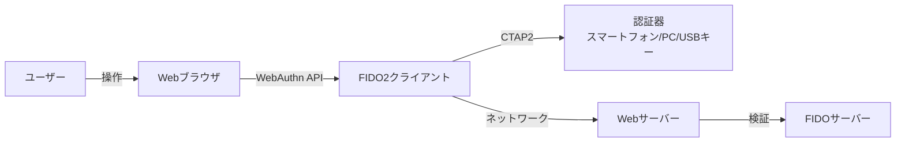
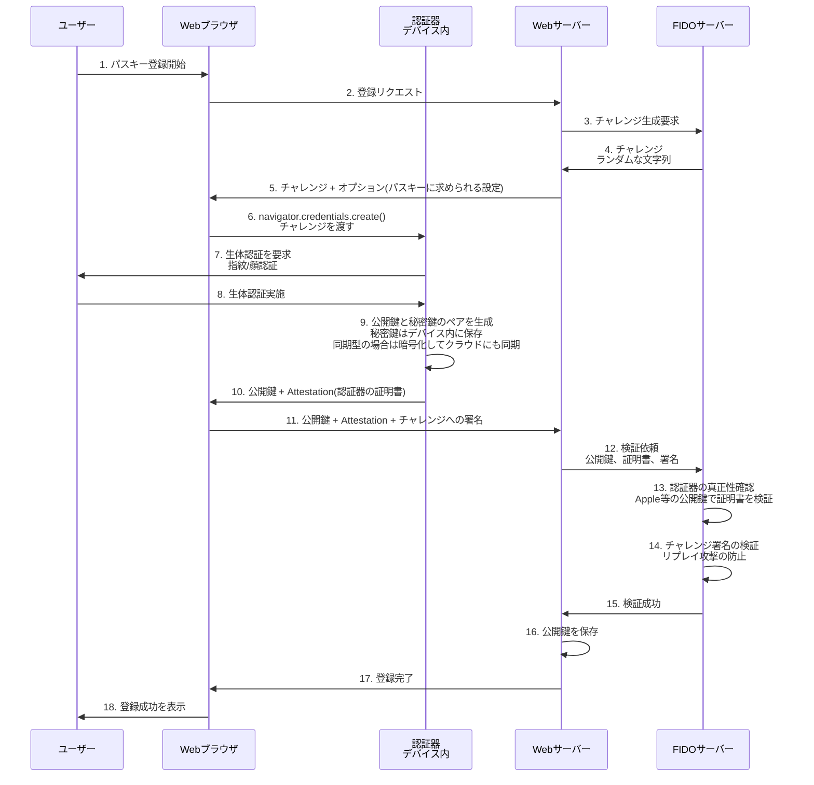
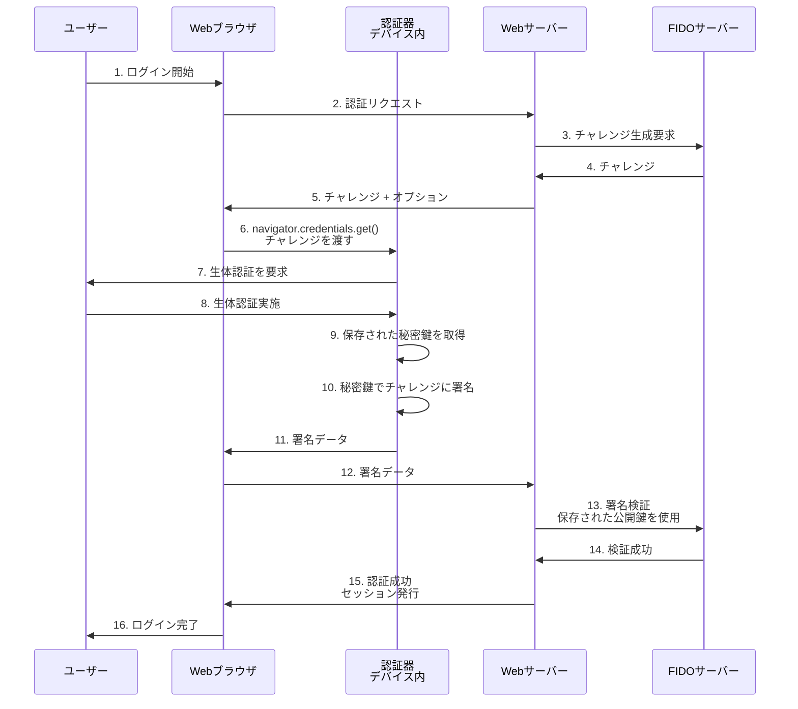

# Zenn問答とは

「Zenn問答」とは、開発していて「なんとなく使ってるけど、ちゃんと理解してるかな？」という技術について、改めて時間をとって深掘りしてみようという企画です🧘🧘🧘

## はじめに

最近、「パスキー」という言葉を急速に見る機会が増えました。なんとなく「生体認証を使う仕組み」くらいの認識でしたが、実際のところパスキーとは何なのか、どのような仕組みで動いているのかをきちんと理解できていませんでした。
ということで今回はパスキーについて改めて深掘りしてみたいと思います。

## パスキーとは何か

パスキーは、ざっくり言うとパスワードが不要な次世代の認証技術です。パスワードを使わずに本人確認を行うための新しい認証情報で、FIDO2標準の一部として策定されています。

従来のパスワード認証では「ユーザーが覚えた文字列」を使って本人確認を行っていましたが、パスキーでは公開鍵と生体認証を組み合わせることで、より安全で利便性の高い認証を実現しています。なんかこう聞くと概要はイメージよりそんなに難しくなさそうですね。

# パスキー誕生の背景

### パスワード認証の歴史と課題

パスワードがコンピュータの世界に登場したのは1960年代で、マサチューセッツ工科大学（MIT）のフェルナンド・コルバト氏がCompatible Time-Sharing System（CTSS）というOSにて導入したのが始まりと言われています。

それから60年以上が経過した今でも、パスワード認証は広く使われ続けています。ビル・ゲイツが2004年に"The password is dead"と宣言してから20年が経ちましたが、依然としてパスワードは使用され続けているのが現状です。

ただし、パスワード認証には以下のような根本的な問題があります

- **パスワードリスト攻撃** - 漏洩したパスワードを使った不正ログイン
- **フィッシング攻撃** - 偽サイトでパスワードを盗まれる
- **パスワードの使い回し** - 複数サービスで同じパスワードを使用
- **記憶の負担** - 複雑なパスワードを覚えられない
- **サーバー側のリスク** - パスワードデータベースの漏洩

これらの問題は、パスワードが「共有秘密」であることに起因しています。ユーザーが知っている情報をサーバー側も保持する必要があるため、サーバーが攻撃を受けた際に大量のパスワードが漏洩するリスクがあります。

### FIDO認証の誕生

パスワードへの過度の依存を減らすことを目的に、2012年に非営利団体「FIDOアライアンス」が設立されました。FIDOは「Fast IDentity Online」の略で、オンライン認証の安全性と利便性を向上させることを目指しています。

FIDOアライアンスは、公開鍵暗号方式を用いた新しい認証規格を策定しました。2018年にはWebブラウザでFIDO認証を行うためのWebAuthn規格が公開され、2020年頃までに主要なブラウザでサポートされました。

### パスキーの本格的な普及へ

2022年、Apple、Google、Microsoftがパスキーの利用拡大に合意し、それぞれのサービスやOSで取り入れられ始めました。これにより、パスキーは一気に普及のフェーズに入りました。

また、スマートフォンの普及率が上がり、パスキーを保持できるスマートフォンを消費者の多くが持つようになったことも、パスキー普及の追い風となっています。

# パスキーの仕組み

それでは、パスキーが実際にどのように動作するのか、技術的な仕組みを見ていきましょう。

FIDO2という規格は、WebAuthnとCTAP2という2つの仕様を組み合わせた認証フレームワークの総称で、それがより使いやすく発展したのがパスキーになっているようです。

**WebAuthn（Web Authentication）**
WebブラウザからJavaScriptでFIDO認証器を呼び出し、認証サーバーとのやり取りでFIDO認証を可能にするWeb APIです。World Wide Web Consortium（W3C）がFIDOアライアンスと提携して開発し、2019年に正式なW3C Web標準になりました。

**CTAP2（Client-to-Authenticator Protocol 2）**
Web認証APIを呼び出すブラウザが動作するデバイスと外部認証器をBluetooth/NFC/USBを通じて安全に通信するための仕様です。CTAP2を使用することで、外部オーセンティケーターを認証の第1と第2の両方の要素として使用でき、パスワードへの依存を排除できます。

まあ、なんか難しい言葉が出てきましたが、以下のフローを見るのが手っ取り早いと思います。

## パスキーの登録フロー

パスキーを使い始めるには、まず登録が必要です

重要なのは、認証器の証明をFIDOサーバーに送り、デバイスの妥当性をAppleなどの公開鍵によって確認しています。
上記確認がとれた公開鍵をWebサーバーにおいておくことで認証時に確認ができるというわけですね。

## パスキーの認証フロー

登録が完了したら、次回以降のログイン時にパスキーを使って認証できます

### セキュリティのポイント

この仕組みには、いくつかの重要なセキュリティポイントがあります

#### チャレンジ・レスポンス方式

毎回異なるランダムなチャレンジを使用することで、リプレイ攻撃（過去の通信を再送する攻撃）を防ぎます。過去の署名データを盗聴しても、次回のログインには使えません。

#### 秘密鍵の安全な管理

**デバイス固定型の場合**
秘密鍵は生体情報と同様にデバイスの安全な領域に保管され、ブラウザにさえ渡りません。ネットワーク上に流出することはありません。

**同期型の場合（Apple、Google、Microsoftが推奨）**
秘密鍵は暗号化された状態でクラウド（iCloudキーチェーン、Googleパスワードマネージャーなど）に保存され、複数のデバイス間で同期されます。暗号化されているため、通信経路やクラウドストレージ上で第三者に内容を読み取られることはありませんが、クラウドアカウントにログインした正規ユーザー（または攻撃者）には復号化されます。

#### ドメイン検証

WebAuthnは、パスキーを作成したドメインと現在アクセスしているドメインを比較します。ドメインが一致しない場合、認証器は動作しません。これにより、フィッシングサイトでパスキーを使うことができません。

#### 生体情報はローカルのみ

指紋や顔などの生体情報は、デバイス内でのみ使用され、サーバーに送信されることはありません。生体情報は秘密鍵にアクセスするための「鍵」として使われるだけです。

# パスキーのメリット

### セキュリティの向上

パスワードがなんかしらの文字列などの共有の秘密だったのに対し、パスキーは共通鍵であるため、サーバー側からの秘密鍵流出の恐れが無いのが大きなメリットだと思います。

例としていろんな攻撃に対する耐性をあげてみます。

#### フィッシング攻撃への耐性

パスキーの大きなメリットのひとつに、フィッシング攻撃に対する強力な耐性があります。パスキーにはサイトのドメイン情報がメタデータとして保存されており、WebAuthnはドメインを確認した上で認証情報を渡す仕様になっています。
これは既存の「パスワード + SMS認証コード」や「パスワード + アプリの確認コード」などでは防げない大きなメリットとなっています。

#### パスワードリスト攻撃への耐性

パスワードリスト攻撃とは、過去に漏洩したパスワードのリストを使って様々なサービスへの不正ログインを試みる攻撃手法です。パスキーではパスワードそのものを使用しないため、この種の攻撃は成立しません。
これもめちゃくちゃ大きなメリットだと思います。

### ユーザビリティの向上

#### パスワード管理の負担解消

複雑なパスワードを覚える必要がなく、生体認証やPINで端末を解錠するだけで利用可能です。パスワードを記憶・入力する手間が不要になります。

#### ログイン速度の向上

Googleは、パスキーを導入することでログイン成功率が4倍になり、ログイン時間が半減したという実績を報告しています。ユーザーはパスワードを思い出す必要がなく、スムーズにログインできるようになります。

# パスキーの課題

パスキーは多くのメリットを持つ一方で、いくつかの課題も存在します

### クラウドアカウント乗っ取りのリスク

パスキーには「デバイス固定型」と「同期型」の2種類があります。Apple、Google、Microsoftが推奨しているのは、利便性の高い「同期型」です。

**同期型パスキーの仕組み**

同期型では、秘密鍵が暗号化されてクラウド（iCloudキーチェーン、Googleパスワードマネージャーなど）に保存され、複数のデバイス間で同期されます。これにより、デバイスを紛失しても新しいデバイスで即座にパスキーが復元できる利便性があります。

**クラウドアカウント乗っ取りの危険性**

しかし、この便利さには代償があります。もしクラウドアカウント（AppleIDやGoogleアカウント）がフィッシング詐欺やパスワードリスト型攻撃で乗っ取られると、以下のような事態が発生します。

- 1. 攻撃者がクラウドアカウントにログイン
- 2. 攻撃者のデバイスに秘密鍵が同期される
- 3. 攻撃者が自分のデバイスで生体認証を通す(本人だと認識されてしまう)
- 4. 攻撃者がすべてのサービスにログイン可能に

暗号化されていても、正規のログインで入ってくる攻撃者には復号化されてしまうため、クラウドアカウントが「すべての鍵の保管庫」として単一障害点（Single Point of Failure）になってしまいます。

**対策の重要性**

クラウドアカウントのセキュリティが、すべてのパスキーのセキュリティの基盤となります。そのため、以下の対策が必須です。

- 強力なパスワードの使用
- 2要素認証（2FA）の有効化（できればハードウェアキー）
- フィッシング対策（公式アプリからのみログイン）
- 不審なデバイスが追加されていないか定期確認

パスキーで「パスワードレス」を実現しても、皮肉なことにクラウドアカウントの「最強のパスワード1つ」を守る責任が生じるというパラドックスがあります。

#### 対応サイトの少なさ

2025年時点では、パスキーに対応しているサービスは増えてきているものの、まだすべてのサイトで利用できるわけではありません。普及が進むまでは、パスワード認証と併用する必要があります。

#### デバイス間の互換性

異なるエコシステム間でパスキーを共有することはできません。例えば、Microsoftアカウントに保存されたパスキーは、AndroidデバイスのGoogleアカウントでは利用できません。

また、機種変更時に適切にパスキーを移行しないと、再設定が必要になる場合があります。

# まとめ

今回は、パスキーについて深掘りしてみました。

パスキーは、60年以上続いてきたパスワード認証の課題を解決するために生まれた、公開鍵暗号方式と生体認証を組み合わせた次世代の認証技術です。フィッシング攻撃やパスワードリスト攻撃に対する強力な耐性を持ちながら、ユーザビリティも大幅に向上させています。

調べてみると思ったより難しくなく、結構単純な仕組みだなという印象です。今まではよくわかってなかったですが、パスキーへの移行もこれできちんと判断できそうです。一方、AppleIDやMicrosoftアカウントの管理には背筋が伸びる思いになりました。クラウド系のアカウントもパスワードではなく何か別の認証の仕組みになればいいのになぁ・・・

また、実装する側を考えると正直パスワードのが簡単だと思うので、しばらくはパスワードは生き残り続けそうだなというのも感じました。

最後まで読んでいただき、ありがとうございました🙏
