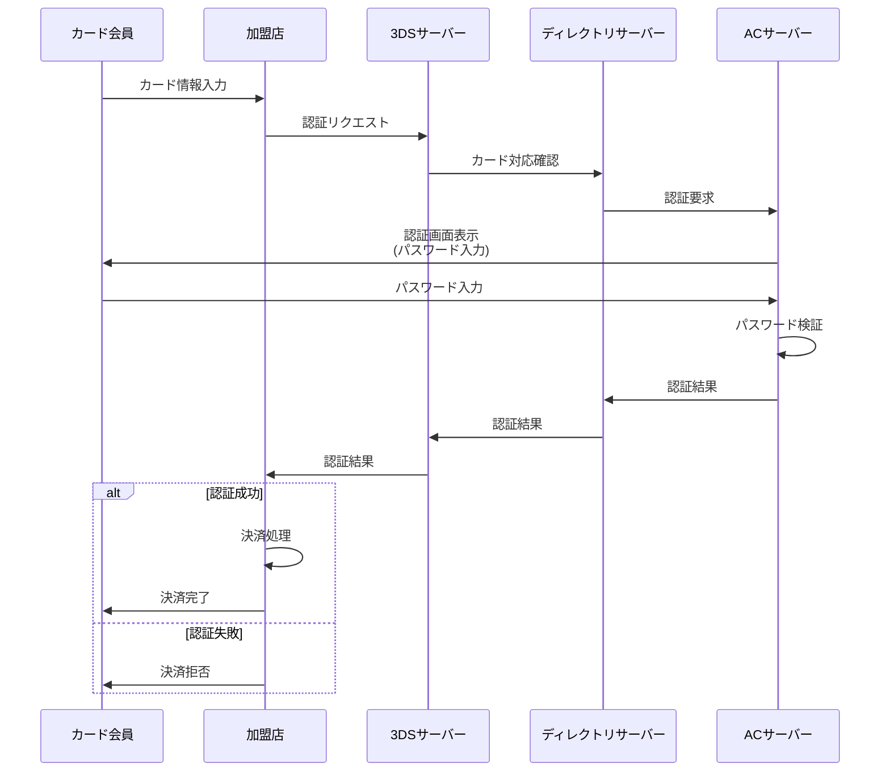
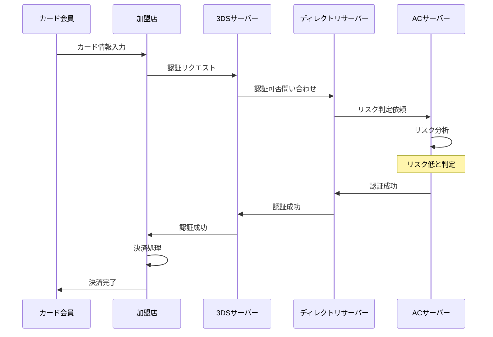
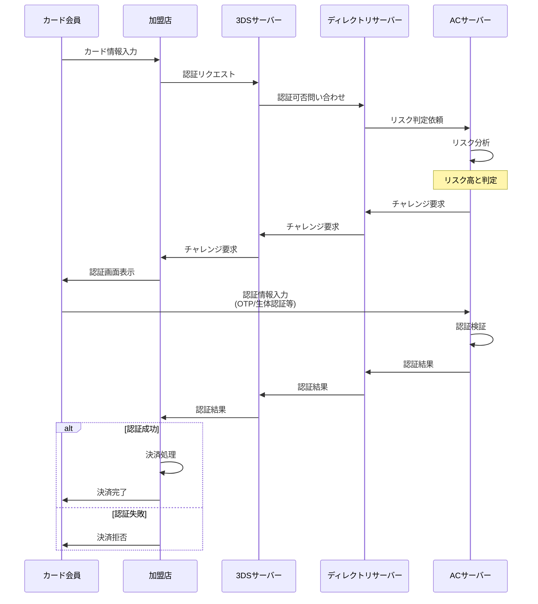

# Zenn問答とは

「Zenn問答」とは、開発していて「なんとなく使ってるけど、ちゃんと理解してるかな？」という技術について、改めて時間をとって深掘りしてみようという企画です🧘🧘🧘

# はじめに

オンラインでクレジットカード決済を実装していると、「3DS認証」や「3Dセキュア」という言葉をよく目にするようになりました。ただ、なんのことか全然知らなかったので、そもそも3DS認証って何なのか、なぜ最近よく登場するようになったのか、どういう仕組みで動いているのか、などなど調べてみようと思います。

# 3DS認証とは

3DS認証（3Dセキュア）は、オンラインでクレジットカードを使用する際の本人認証サービスです。「3D」は「Three Domain」の略で、カード発行会社、加盟店、国際ブランドという3つのドメインが連携して認証を行うことに由来しています。

各国際ブランドでは以下のような名称で提供されています。

| ブランド | サービス名 |
|---------|-----------|
| Visa | Visa Secure |
| Mastercard | Mastercard ID Check |
| JCB | J/Secure™ |
| American Express | American Express SafeKey® |
| Diners Club | ProtectBuy® |

## 3Dセキュアのバージョン

3Dセキュアには、これまでに主に2つのバージョンがあります。

### 3Dセキュア1.0

1999年にVISAが開発した最初のバージョンです。長年にわたってオンライン決済のセキュリティを支えてきましたが、ユーザー体験の課題から2022年に各カードブランドが段階的に廃止を進めました。

すべての決済が本人認証の対象だったため、以下のような課題がありました。

- 毎回の認証操作が必要で、ユーザーの利便性が低い
- 認証画面での離脱（カゴ落ち）が発生しやすい
- 決済処理時間が長い
- スマートフォンのアプリ内決済に非対応

### 3Dセキュア2.0（EMV 3-Dセキュア）

2016年にリリースされた現行バージョンです。1.0のユーザーとしては煩雑だった課題を大幅に改善しています。2026年現在、これが最新バージョンとして広く利用されています。

主な改善点は以下になります。

- リスクベース認証により、不正利用のリスクが低い取引では、追加の認証操作なしで決済が完了
- パスワード以外の認証方法の多様化(ワンタイムパスワード、生体認証、プッシュ)
- スマートフォンやタブレットのアプリ内決済にも対応

なお、3Dセキュア3.0などの次世代バージョンは現時点では発表されておらず、2.0が標準として定着しています。

# 3Dセキュア2.0への移行が最近よく出てくる理由

3DS2.0に移行しなければならないという話題がちょくちょく聞こえてきますが、実はこれにも理由があります。

## 日本クレジット協会のガイドライン

クレジットカード・セキュリティガイドライン【6.0版】では、2025年4月以降、原則としてすべてのEC加盟店に3Dセキュア2.0（EMV 3-Dセキュア）の導入が求められています。これにより、EC事業者にとって3DS認証への対応が必須となりました。

## チャージバック補償の終了

チャージバックとは、不正利用が発生した際にカード発行会社が加盟店に対して売上代金の返還を求める仕組みです。2022年10月に複数の国際ブランドが3Dセキュア1.0のチャージバック補償を終了しました。

これは大きな転換点となりました。1.0を使い続けている場合、不正利用による売上損失はすべて加盟店が負担しなければなりません。つまり、商品を送ったのに代金も回収できず、さらにチャージバック手数料まで取られるという事態が発生します。このため、EC事業者は2.0への移行を急速に進めています。

# 3Dセキュアの仕組み

3Dセキュアは、以下の3つのドメインで構成されています。

- **アクワイアラードメイン** （加盟店側）
   - 3DSサーバー（MPI: Merchant Plug-In）
   - 具体例: Amazon、楽天市場などのEC事業者、Stripeなどの決済代行会社

- **相互運用ドメイン** （国際ブランド側）
   - ディレクトリサーバー（DS: Directory Server）
   - 具体例: Visa、Mastercard、JCBなど

- **イシュアードメイン** （カード発行会社側）
   - アクセスコントロールサーバー（ACS: Access Control Server）
   - 具体例: 三井住友カード、楽天カード、エポスカード（マルイ）など

それぞれの役割を見ていきます。

### 3DSサーバー（MPI）

Merchant Plug-Inの略で、加盟店側に設置されます。カード会員から受け取った決済情報を3Dセキュアのプロトコルに変換し、ディレクトリサーバーに送信します。通常は決済代行会社が提供する仕組みの一部として実装されています。

### ディレクトリサーバー（DS）

国際ブランドが運営するサーバーで、どのカードがどのACSで管理されているかを把握しています。3DSサーバーからのリクエストを適切なACSにルーティングする役割を担います。

### アクセスコントロールサーバー（ACS）

カード発行会社が運営する最も重要なコンポーネントです。

**主な役割**

- EC加盟店からの認証リクエストをDSから受信
- 取引のリスク度合いをリアルタイムに判定
- 追加の本人認証が必要な場合は、カード会員に認証を要求
- 本人認証結果をDS経由でEC加盟店に連携

**リスク判定の仕組み**

ACSのリスク判定には、カード発行会社が蓄積した膨大な取引データが活用されます。例えば以下のような要素が総合的に分析されます。

- 過去の取引パターンとの一致度（いつもと違う時間帯、金額、地域など）
- デバイスフィンガープリント（ブラウザやOSの情報）
- IPアドレスの地理的位置とカード会員の居住地の整合性
- 過去の不正利用データベースとの照合

多くのカード発行会社では機械学習モデルを導入しており、不正利用のパターンを学習することで精度の高い判定が可能になっています。

## 認証フロー

### 3Dセキュア1.0の認証フロー

3Dセキュア1.0では、すべての取引で必ず追加認証が求められました。

1.0の特徴は、リスクの高低に関わらず、すべての取引で認証画面が表示される点です。これが利便性を損ない、カゴ落ちの原因となっていました。

### 3Dセキュア2.0の認証フロー

3Dセキュア2.0には、主に2つの認証フローがあります。

#### フリクションレスフロー（追加認証なし）

リスクが低いと判断された場合の流れです。

この場合、カード会員は追加の操作を行うことなく、シームレスに決済が完了します。

#### チャレンジフロー（追加認証あり）

リスクが高いと判断された場合の流れです。

この場合、カード会員はワンタイムパスワードの入力や生体認証などの追加認証を求められます。

# まとめ

3DS認証について改めて調べてみました。なんか名前が難しいですが、ただのクレジットカードの認証の仕組みで、2.0になって変わることはリスクベース認証とか認証方法の追加とかいう単純な話題だなという印象でした。

とはいえ、この仕組みは単純ながら知っておいて損はないかなと思います。特にACサーバーにリスクベースの判断が委ねられていたりするのは少し意外な発見でした。最後まで読んでいただき、ありがとうございました🙏
