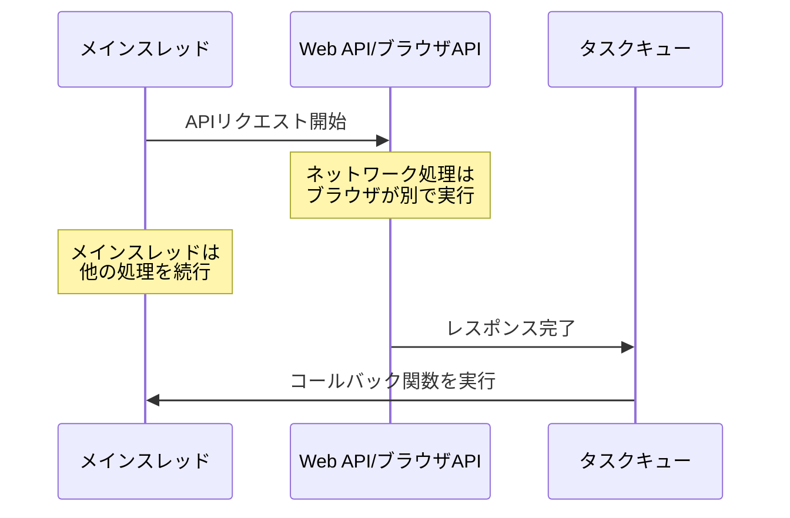
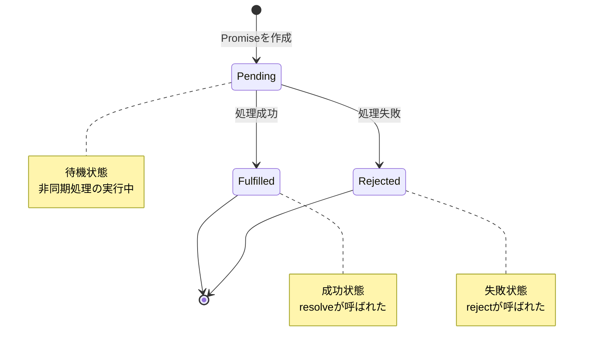
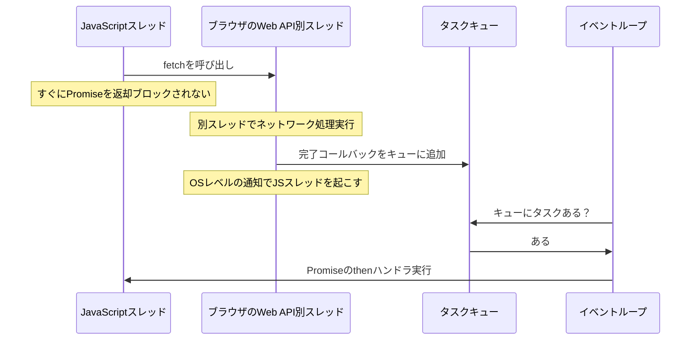
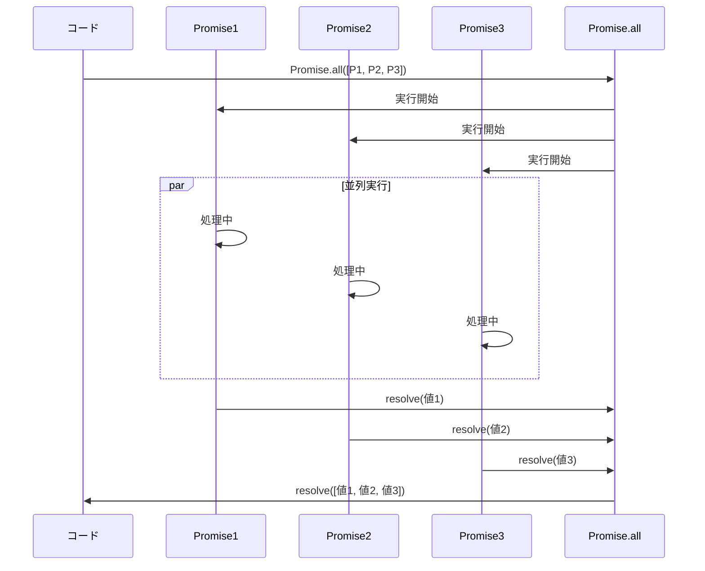
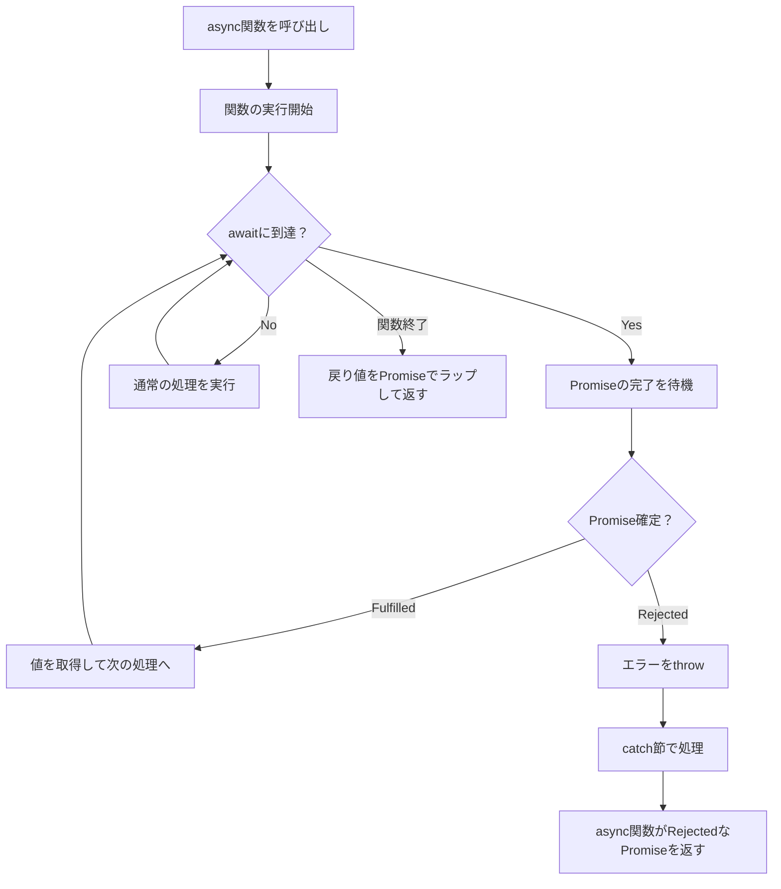

# Zenn問答とは

「Zenn問答」とは、開発していて「なんとなく使ってるけど、ちゃんと理解してるかな？」という技術について、改めて時間をとって深掘りしてみようという企画です🧘🧘🧘

# はじめに

Web開発をしていると、非同期処理は避けて通れない概念です。自分はバックエンドを触ることが多いのですが、恥ずかしながらPromiseは見たことある程度で正直よく理解できていないです。
async/awaitも正直なんとなくの理解しかできていなかったので、これを機に深掘っていこうと思います。

## 非同期処理とは何か

まず、非同期処理がなぜ必要なのかを整理します。

JavaScriptは**シングルスレッド**で動作します。つまり、一度に1つの処理しか実行できません。もし、APIからデータを取得する処理を同期的に実行すると、その間ブラウザは完全に停止してしまいます。

非同期処理では、時間のかかる処理（ネットワークリクエストなど）を**ブラウザのWeb API**に任せることで、JavaScriptのメインスレッドがブロックされずに他の処理を続行できます。

ただ、非同期で実行すると値がすぐに返却されないため、以下のようなコードを書くと期待通りに動きません。

```javascript
// ❌ これは動作しない（同期的に書けない）
const user = getUser(userId); // 非同期処理なので、すぐには値が返らない
const profile = getProfile(user.id); // userがundefinedなのでエラー
```



## コールバック地獄の問題

Promise登場前は、非同期処理の結果を受け取るために**コールバック関数**を使っていました。

```javascript
// Promise登場前に使われていたXMLHttpRequest
function getUser(userId, onSuccess, onError) {
  const xhr = new XMLHttpRequest();
  xhr.open('GET', `/api/users/${userId}`);

  xhr.onload = function() {
    if (xhr.status === 200) {
      const user = JSON.parse(xhr.responseText);
      onSuccess(user); // 成功時にコールバック関数を呼び出す
    } else {
      onError(new Error('ユーザーが見つかりません'));
    }
  };

  xhr.onerror = function() {
    onError(new Error('ネットワークエラー'));
  };

  xhr.send();
}

// 使用例
console.log('開始');
getUser(
  123,
  function(user) {
    console.log('成功:', user);
  },
  function(error) {
    console.error('失敗:', error);
  }
);
console.log('終了');

// 実際の出力順序
// "開始"
// "終了"  ← getUserの処理を待たずに実行される
// "成功: { ... }"  ← APIレスポンスが返ってきた後に実行
```

この方法は、単一の非同期処理なら問題ありませんが、**複数の非同期処理を順番に実行したい場合**に問題が発生します。

```javascript
// ❌ コールバック地獄の例
getUser(userId, function(user) {
  // ユーザー取得後、プロフィールを取得
  getProfile(user.id, function(profile) {
    // プロフィール取得後、設定を取得
    getSettings(profile.id, function(settings) {
      // 設定取得後、UIを更新
      updateUI(settings, function() {
        // さらにネストが続く...
      });
    });
  });
});
```

前の処理の結果を次の処理で使うために、コールバック関数の中にさらにコールバック関数を書く必要があり、ネストが深くなっていきます。これが「コールバック地獄」と呼ばれる問題です。

# Promiseとは

Promiseは、**非同期処理の結果を表すオブジェクト**です。「将来的に値が得られる約束（Promise）」を表現する概念で、この問題を解決するために導入されました。
なるほど、命名もこう聞くと納得ですね。

### Promiseの基本的な使い方

```javascript
// Promiseを返すgetUser関数
function getUser(userId) {
  return new Promise((resolve, reject) => {
    const xhr = new XMLHttpRequest();
    xhr.open('GET', `/api/users/${userId}`);

    xhr.onload = function() {
      if (xhr.status === 200) {
        const user = JSON.parse(xhr.responseText);
        resolve(user); // 成功したらresolveを呼ぶ
      } else {
        reject(new Error('ユーザーが見つかりません')); // 失敗したらrejectを呼ぶ
      }
    };

    xhr.onerror = function() {
      reject(new Error('ネットワークエラー'));
    };

    xhr.send();
  });
}

// 使用例
const promise = getUser(123); // Promise { <pending> } が返る

promise
  .then(user => {
    console.log('成功:', user);
  })
  .catch(error => {
    console.error('失敗:', error);
  });
```

`XMLHttpRequest`の代わりに`fetch()`に置き換えられるようになりました。`fetch()`はPromiseを返却するAPIです。
使い方をよくみると、コールバック関数は関数を引数として渡しているのに対し、Promiseの場合はPromiseオブジェクトが返却されるという大きな違いがあります。

この特徴により、**チェーン（鎖）のように繋げて書ける**のがPromiseの強力な点です。

```javascript
// ❌ コールバック地獄（ネストが深い）
getUser(userId, function(user) {
  getProfile(user.id, function(profile) {
    getSettings(profile.id, function(settings) {
      updateUI(settings, function() {
        console.log('完了');
      });
    });
  });
});

// ✅ Promise（フラットに書ける）
getUser(userId)
  .then(user => getProfile(user.id))
  .then(profile => getSettings(profile.id))
  .then(settings => updateUI(settings))
  .then(() => console.log('完了'))
  .catch(error => console.error(error));
```

## Promiseの3つの状態

Promiseは常に以下の3つの状態のいずれかにあります。



- **Pending（待機状態）**: 初期状態。非同期処理がまだ完了していない
- **Fulfilled（成功状態）**: 非同期処理が正常に完了した
- **Rejected（失敗状態）**: 非同期処理が失敗した

重要な点として、**PromiseはPendingから一度FulfilledまたはRejectedになると、二度と状態が変わりません**。これを「settled（確定）」状態と呼びます。

## Promiseのイベント駆動の仕組み

「Promiseはどうやって状態変化を検知しているの？」という疑問が浮かぶかもしれません。マイクロタスクキューを使用したイベント駆動で動いているようです。



難しいですが、なんとなく理解した気になりました。

## エラーハンドリング

Promiseのエラーハンドリングには2つの方法があります。catchではエラーを補足できるため、エラーを補足して何か処理を行いたい場合はcatch一択になります。

### 1. catchメソッド

```javascript
promise
  .then(result => processData(result))
  .then(data => saveData(data))
  .catch(error => {
    // どこかでエラーが発生した場合
    console.error('エラー', error);
  });
```

### 2. thenの第二引数

```javascript
promise.then(
  result => {
    // 成功時の処理
    console.log(result);
  },
  error => {
    // 失敗時の処理
    console.error(error);
  }
);
```

## Promiseの色々なメソッド

複数のPromiseを扱う便利なメソッドがあります。

### Promise.all

すべてのPromiseが成功するまで待機します。

```javascript
const promise1 = fetch('/api/user');
const promise2 = fetch('/api/settings');
const promise3 = fetch('/api/notifications');

Promise.all([promise1, promise2, promise3])
  .then(([user, settings, notifications]) => {
    console.log('すべてのデータ取得完了');
    // 3つすべてのレスポンスを使って処理
  })
  .catch(error => {
    console.error('いずれかの取得に失敗', error);
    // どれか1つでも失敗したらここに来る
  });
```



その他、以下のようなものもあるようです。

- Promise.race
  - 最初に完了したPromiseの結果を返します。
- Promise.allSettled
  - すべてのPromiseの結果（成功・失敗問わず）を取得
- Promise.any
  - 最初に成功したPromiseの結果を返す

# async/awaitとの関係

async/awaitは、Promiseをより読みやすく書くための**シンタックスシュガー**です。内部的にはPromiseを使っています。

### 基本的な変換

```javascript
// Promiseを使った書き方
function getUser(id) {
  return fetch(`/api/user/${id}`)
    .then(response => response.json())
    .then(user => {
      console.log(user);
      return user;
    })
    .catch(error => {
      console.error(error);
      throw error;
    });
}

// async/awaitを使った書き方（全く同じ動作）
async function getUser(id) {
  try {
    const response = await fetch(`/api/user/${id}`);
    const user = await response.json();
    console.log(user);
    return user;
  } catch (error) {
    console.error(error);
    throw error;
  }
}
```

### asyncとawaitの仕組み



1. `async`関数は常にPromiseを返す
2. `await`はPromiseの完了を待つ
3. `await`で取得する値は、Promiseのresolveされた値
4. エラーは`try-catch`で捕捉できる

## なぜawaitを使うにはasyncが必要なのか

「`await`を使うだけなのに、なぜわざわざ`async`をつけないといけないの？」と疑問に思っていました。
Fulfilledになるまで待ってから値を返却するawaitを使えばasync functionにしてわざわざPromiseでラップする必要はないと疑問に思ってしまいます。

### 後方互換性を維持するため

`async/await`が導入される前、`await`は予約語ではありませんでした。つまり、変数名として使えました。

```javascript
// async/await導入前は、これが有効なコード
function oldCode() {
  var await = 10;  // awaitは普通の変数名
  console.log(await);  // 10
}
```

もし「どこでも`await`が使える」ようにすると、既存のコードが壊れてしまいます。

```javascript
// もし全ての場所でawaitが予約語になったら...
function oldCode() {
  var await = 10;  // ❌ 突然エラーになる！
  console.log(await);
}
```

**`async`をつけた関数の中でだけ`await`を予約語にする**ことで、既存コードを壊さずに新機能を追加できました。
つまり、`async`は「この関数の中では`await`を予約語として扱いますよ」というマーカーになっているということです、なるほどこういう歴史的経緯を聞くと納得できますね。

### async関数がPromiseを返す理由

では、「なぜ`async`をつけるとPromiseを返さなきゃいけないの？」という疑問も出てきます。

これは`await`を使えるようにするために`async`が必要で、`async`をつけたら一貫性のためにPromiseを返すというルールにしただけです。

```javascript
// awaitを使いたい → asyncが必要（後方互換性のため）
async function getUser(id) {
  const user = await fetchUser(id);
  return user;
}

// asyncをつけたら → 必ずPromiseを返す（一貫性のため）
// 戻り値: Promise<User>
```

これは納得できて、Promise<User>が返却されたりUserが返却されたりしたら難しいですよね。
「async関数によってはPromiseを返したり返さなかったり」という複雑なルールにするより、**「async関数は必ずPromiseを返す」というシンプルなルール**にした方が、言語設計として一貫性があります。

なので、戻り値を使わない場合は不要なPromiseが作られます。

# 他言語での実装と実践的なパターン

## JavaScriptだけではないPromise

Promiseの概念は、実はJavaScript特有のものではありません。多くのプログラミング言語で同様のパターンが実装されています。

| 言語 | 名称 | 説明 |
|------|------|------|
| Java | `Future` / `CompletableFuture` | 非同期計算の結果を表す |
| C# | `Task` / `Task<T>` | 非同期操作を表すオブジェクト |
| Python | `asyncio.Future` / `concurrent.futures.Future` | 非同期処理の結果 |
| Rust | `Future` trait | 非同期計算の抽象化 |
| Scala | `Future` | 非同期計算の結果を表す |
| Swift | `Promise` (サードパーティ) | JavaScriptのPromiseと同様 |

C#の`async/await`はJavaScriptよりも先に導入されており、JavaScriptのasync/awaitはC#の影響を受けているようです。

# まとめ

Promiseについて、基本的な概念から実装まで深掘りしてみました。

調べてみたらたいしたことないというか、怖がっていたほど難しい概念でもなくてほっとしています。
Promiseもasync/awaitも言語の発展とともにでてきた仕組みなんだなというのはよくよく理解できました。やはり歴史的経緯まで知らないとなかなか納得できない・・・

awaitを使う場合になぜasync functionになるのかもこれまで疑問に思ったままでしたが、ついでに解消できてよかったです。
今回の記事で、Promiseへの理解が深まり、自信を持って非同期処理を扱えるようになれば幸いです。最後まで読んでいただき、ありがとうございました🙏
