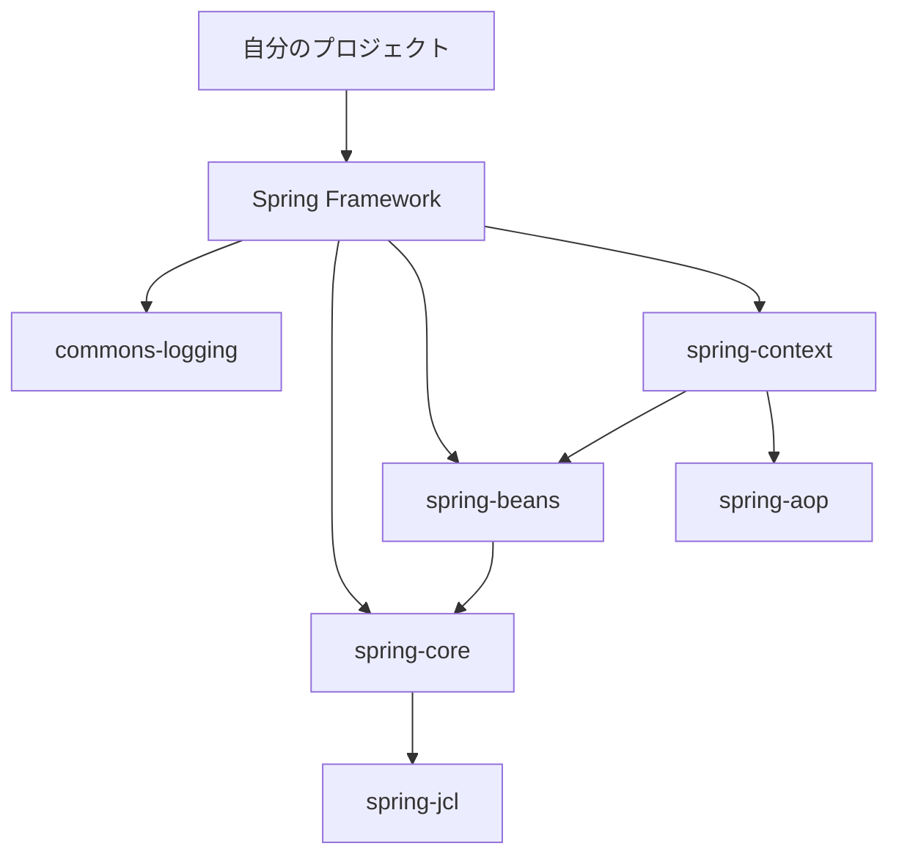
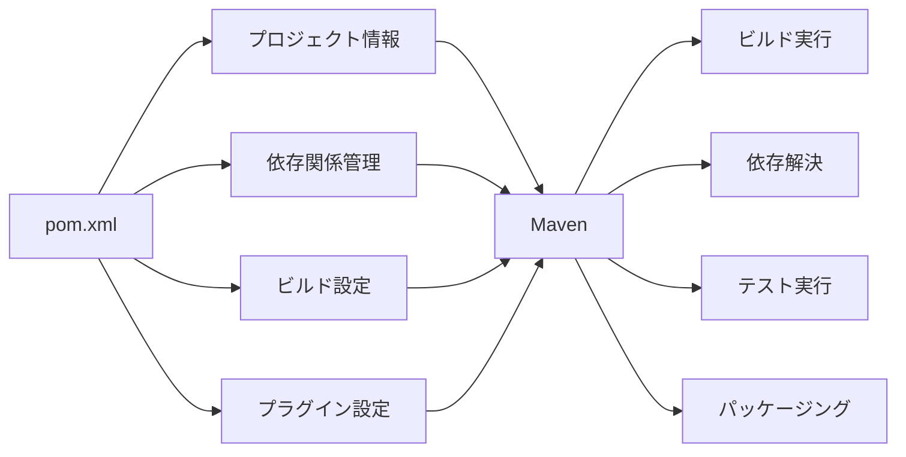
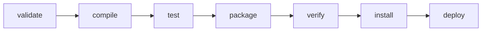
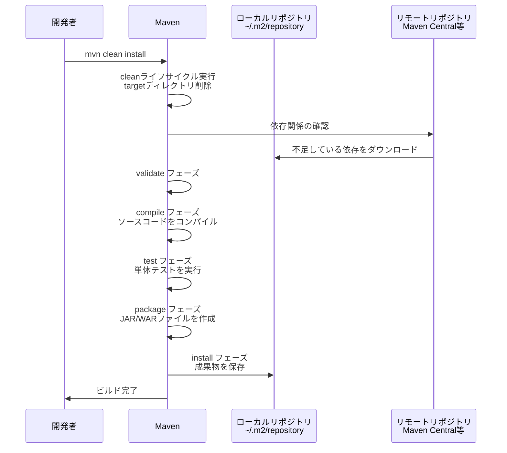
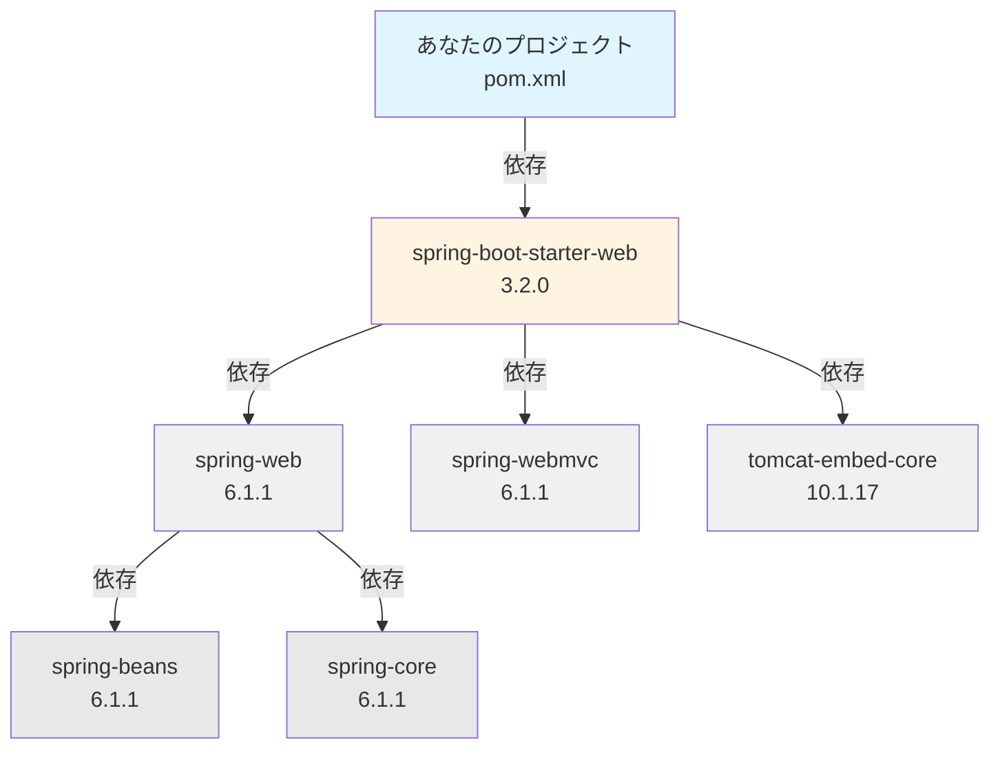
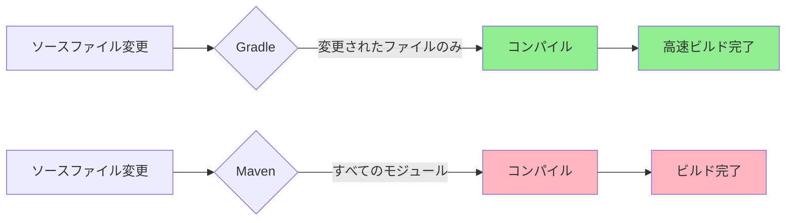

# Zenn問答とは

「Zenn問答」とは、開発していて「なんとなく使ってるけど、ちゃんと理解してるかな？」という技術について、改めて時間をとって深掘りしてみようという企画です🧘🧘🧘

# はじめに

Java開発をしていると、`pom.xml`を見かけることがちょくちょくあります。依存関係を追加したいときにこのファイルを編集することは知っていますが、正直詳しく仕組みを理解せずに使っていました。

最近ではGradleを使うプロジェクトも増えていますが、レガシーなプロジェクトではまだまだMavenが現役です。今回は、pom.xmlとMavenについて改めて深掘りしてみます。

## そもそもビルドツールってなんで必要なの？

ソフトウェア開発では、言語を問わず以下のような作業が必要です。

- ソースコードのコンパイル（必要な場合）
- テストの実行
- 外部ライブラリの管理
- 成果物のパッケージング
- デプロイ

これらを手作業で行うのは非常に大変です。特に、**外部ライブラリの管理**は複雑です。

例えば、JavaならJARファイル、JavaScriptならnpmパッケージ、PythonならPyPIパッケージなど、どの言語でもライブラリの依存関係管理は避けて通れません。そのため、各言語には専用のビルドツールが存在します。

| 言語 | 主なビルドツール |
|------|-----------------|
| Java | Maven、Gradle、Ant |
| JavaScript/TypeScript | npm、yarn、pnpm |
| Python | pip、Poetry |
| Ruby | Bundler、RubyGems |
| Rust | Cargo |
| Go | go build（標準ツール） |
| C/C++ | Make、CMake |

Mavenは**Java向けのビルドツール**として登場しましたが、その背後にある課題はどの言語でも共通しています。

### ライブラリ管理の課題

例えば、プロジェクトでSpring Frameworkを使いたい場合を考えてみましょう。



Spring Framework自体が他の多くのライブラリに依存しており、それらのライブラリもさらに別のライブラリに依存しています。これを手動で管理するのは現実的ではありません。

### Antの時代

Mavenの前には、Apache Antというビルドツールがありました。Antは**ビルドタスクの自動化**を行うツールで、`build.xml`にビルドの手順を記述することで、コンパイル、テスト実行、JAR作成などを自動化できました。

```xml
<!-- Antの例 -->
<project name="MyProject" default="dist" basedir=".">
  <!-- コンパイルタスク -->
  <target name="compile">
    <javac srcdir="src" destdir="build/classes"/>
  </target>

  <!-- テスト実行タスク -->
  <target name="test" depends="compile">
    <junit printsummary="on" fork="true">
      <classpath>
        <pathelement location="build/classes"/>
        <pathelement location="lib/junit.jar"/>
      </classpath>
      <batchtest>
        <fileset dir="test"/>
      </batchtest>
    </junit>
  </target>

  <!-- JAR作成タスク -->
  <target name="jar" depends="compile">
    <jar destfile="dist/myapp.jar" basedir="build/classes"/>
  </target>
</project>
```

つまり、Antは**ビルド手順の自動化はできる**のですが、以下のような大きな問題がありました。

- **依存関係を手動で管理する必要がある** - 必要なJARファイル（例：junit.jar）を自分で探してきて`lib/`ディレクトリに配置し、classpathに手動で追加する必要がある
- **ビルドスクリプトが長くなりがち** - すべての手順（どのJARを使うか、どのディレクトリにあるか）を明示的に書く必要がある
- **プロジェクトごとに構成が異なる** - 標準的な構成がないため、プロジェクトごとにディレクトリ構造やタスクの書き方がバラバラ

特に問題なのは、依存関係の管理です。例えばSpring Frameworkを使いたい場合、Springが依存している他のライブラリ（commons-logging、spring-coreなど）も全て手動でダウンロードして配置する必要がありました。しかも、それらのライブラリが更にどのライブラリに依存しているかを自分で調べないといけませんでした。

これらの課題を解決するために、Mavenが誕生しました。

## Mavenの概要

Mavenは、Apache Jakartaプロジェクトの一部として開発され、2004年に最初のバージョンがリリースされました。
Mavenは「Convention over Configuration（設定より規約）」という思想に基づいています。

**標準的なディレクトリ構成**

```
my-project/
├── pom.xml
├── src/
│   ├── main/
│   │   ├── java/       # Javaソースコード
│   │   └── resources/  # 設定ファイルなど
│   └── test/
│       ├── java/       # テストコード
│       └── resources/  # テスト用リソース
└── target/             # ビルド成果物
```

この構成に従うことで、ビルドツールがどこに何があるかを自動的に理解できます。

### Project Object Model (POM)

MavenはProject Object Model（POM）という考え方に基づいています。プロジェクトに関するすべての情報を`pom.xml`というXMLファイルに集約し、その情報に基づいてプロジェクト全体を管理します。



## Mavenのビルドライフサイクル

Mavenには明確に定義されたビルドライフサイクルがあります。主に3つのライフサイクルが存在します。

### 3つのライフサイクル

1. **clean** - ビルドの成果物を削除
2. **default** - プロジェクトのビルドとデプロイ
3. **site** - プロジェクトのドキュメントを生成

最もよく使われるのは**default**ライフサイクルです。

### defaultライフサイクルの主要フェーズ(一部抜粋)



各フェーズの役割はこのような感じです。

| フェーズ | 説明 |
|---------|------|
| `validate` | プロジェクトが正しく、必要な情報がすべて揃っているか検証 |
| `compile` | プロジェクトのソースコードをコンパイル |
| `test` | 単体テストを実行（コンパイル済みのコードが期待通りに動作するか確認） |
| `package` | コンパイルされたコードをJARやWARなどの配布可能な形式にパッケージ化 |
| `verify` | 統合テストの結果を検証し、品質基準を満たしているか確認 |
| `install` | パッケージをローカルリポジトリにインストール（他のプロジェクトから依存関係として使用可能に） |
| `deploy` | 最終的なパッケージをリモートリポジトリにコピー（他の開発者やプロジェクトと共有） |

重要な点として、**あるフェーズを実行すると、それより前のすべてのフェーズも自動的に実行されます**。

例えば、`mvn package`を実行すると、実際には以下の順序で実行されます。

```
validate → compile → test → package
```

`install`なんかは`npm`とちょっと違くて紛らわしいかもしれませんね。

### よく使うコマンド

```bash
# クリーン後にパッケージング（最もよく使う）
mvn clean package

# クリーン後にローカルリポジトリへインストール
mvn clean install

# テストをスキップしてビルド（開発中によく使う）
mvn clean install -DskipTests

# 依存関係をツリー形式で表示
mvn dependency:tree

# 利用可能なプラグインの更新を確認
mvn versions:display-plugin-updates

# 依存関係の更新を確認
mvn versions:display-dependency-updates
```

バージョン更新もできるの知らなかったです。あまり更新ができていないプロジェクトでプラグインの更新を確認するとすごいことになりそうですね。

### コマンドの実行の流れ

`mvn clean install`を実行したときの流れを図で見てみましょう。



## pom.xmlのそれぞれのタグの説明

`pom.xml`の主要なタグを見ていきましょう。

### 基本構造

```xml
<?xml version="1.0" encoding="UTF-8"?>
<project xmlns="http://maven.apache.org/POM/4.0.0"
         xmlns:xsi="http://www.w3.org/2001/XMLSchema-instance"
         xsi:schemaLocation="http://maven.apache.org/POM/4.0.0
         http://maven.apache.org/xsd/maven-4.0.0.xsd">
    <modelVersion>4.0.0</modelVersion>

    <!-- プロジェクトの基本情報 -->
    <groupId>com.example</groupId>
    <artifactId>my-app</artifactId>
    <version>1.0-SNAPSHOT</version>
    <packaging>jar</packaging>

    <name>My Application</name>
    <description>サンプルアプリケーション</description>

    <!-- プロパティ -->
    <properties>
        <maven.compiler.source>21</maven.compiler.source>
        <maven.compiler.target>21</maven.compiler.target>
        <project.build.sourceEncoding>UTF-8</project.build.sourceEncoding>
    </properties>

    <!-- 依存関係 -->
    <dependencies>
        <!-- 依存するライブラリをここに記述 -->
    </dependencies>

    <!-- ビルド設定 -->
    <build>
        <plugins>
            <!-- プラグインをここに記述 -->
        </plugins>
    </build>
</project>
```

### 主要タグの詳細

#### modelVersion

```xml
<modelVersion>4.0.0</modelVersion>
```

POMモデルのバージョンを指定します。現在は`4.0.0`が標準です。

#### groupId、artifactId、version

これら3つの要素は、Mavenの座標系（Maven Coordinates）と呼ばれ、プロジェクトを一意に識別します。

```xml
<groupId>com.example</groupId>
<artifactId>my-app</artifactId>
<version>1.0-SNAPSHOT</version>
```

- **groupId** - プロジェクトグループのID（通常は組織のドメインを逆にしたもの）
- **artifactId** - プロジェクトのID（成果物の名前）
- **version** - プロジェクトのバージョン

これらを組み合わせると、`com.example:my-app:1.0-SNAPSHOT`という一意な識別子になります。

#### packaging

```xml
<packaging>jar</packaging>
```

ビルドの成果物の形式を指定します。

- `jar` - Javaアーカイブ（デフォルト）
- `war` - Webアプリケーションアーカイブ
- `pom` - 依存関係のみを管理するプロジェクト
- `maven-plugin` - Mavenプラグイン
- `ear` - エンタープライズアプリケーションアーカイブ

#### properties

```xml
<properties>
    <maven.compiler.source>21</maven.compiler.source>
    <maven.compiler.target>21</maven.compiler.target>
    <spring.version>3.2.0</spring.version>
</properties>
```

プロジェクト全体で使用する変数を定義します。他の場所で`${spring.version}`のように参照できます。

#### dependencies

依存関係を定義する最も重要なセクションです。

```xml
<dependencies>
    <dependency>
        <groupId>org.springframework.boot</groupId>
        <artifactId>spring-boot-starter-web</artifactId>
        <version>3.2.0</version>
    </dependency>

    <dependency>
        <groupId>org.junit.jupiter</groupId>
        <artifactId>junit-jupiter</artifactId>
        <version>5.10.0</version>
        <scope>test</scope>
    </dependency>
</dependencies>
```

**scope属性**

依存関係のスコープを指定できます。

| スコープ | 説明 |
|---------|------|
| `compile` | デフォルト。**コンパイル、テスト、実行すべてで利用可能** |
| `provided` | コンパイルとテストで必要だが、実行時は提供される（例：Servlet API） |
| `runtime` | 実行時のみ必要（例：JDBCドライバ） |
| `test` | テスト時のみ必要（例：JUnit） |
| `system` | providedと似ているが、JARの場所を明示的に指定 |
| `import` | dependencyManagementセクションでのみ使用 |

#### 依存関係の推移的解決

Mavenの強力な機能の1つが、推移的な依存関係の自動解決です。



あなたが`spring-boot-starter-web`だけを依存関係に追加すると、Mavenは自動的に**そのライブラリが依存している他のすべてのライブラリ**もダウンロードしてくれます。

これが、Antと比べて圧倒的に楽になった部分です。

#### build セクション

ビルドプロセスをカスタマイズする設定を記述します。

```xml
<build>
    <plugins>
        <plugin>
            <groupId>org.apache.maven.plugins</groupId>
            <artifactId>maven-compiler-plugin</artifactId>
            <version>3.11.0</version>
            <configuration>
                <source>21</source>
                <target>21</target>
            </configuration>
        </plugin>

        <plugin>
            <groupId>org.springframework.boot</groupId>
            <artifactId>spring-boot-maven-plugin</artifactId>
        </plugin>
    </plugins>
</build>
```

プラグインを追加することで、ビルドプロセスを拡張できます。

#### dependencyManagement

親POMや複数モジュールプロジェクトで、依存関係のバージョンを一元管理するために使います。

```xml
<dependencyManagement>
    <dependencies>
        <dependency>
            <groupId>org.springframework.boot</groupId>
            <artifactId>spring-boot-dependencies</artifactId>
            <version>3.2.0</version>
            <type>pom</type>
            <scope>import</scope>
        </dependency>
    </dependencies>
</dependencyManagement>
```

これにより、子POMでは`<version>`タグを省略できます。

```xml
<!-- 子POMでは -->
<dependencies>
    <dependency>
        <groupId>org.springframework.boot</groupId>
        <artifactId>spring-boot-starter-web</artifactId>
        <!-- versionの記述が不要 -->
    </dependency>
</dependencies>
```

なるほど、mavenを使うことで依存モジュールの依存モジュールについては意識しなくてもよくなったということですね。

## なぜGradleが一般的になったのか

最近の新規プロジェクトでは、Mavenよりも**Gradle**を採用するケースが増えています。なぜでしょうか。

### Gradleの登場

Gradleは2012年に登場した、MavenやAntの後継として設計されたビルドツールです。

### MavenとGradleの比較

| 観点 | Maven | Gradle |
|------|-------|--------|
| 設定ファイル | XML（pom.xml） | Groovy/Kotlin DSL（build.gradle） |
| 記述量 | 冗長になりがち | 簡潔 |
| ビルド速度 | 遅い（すべてのモジュールを再ビルド） | 速い（インクリメンタルビルド、ビルドキャッシュ） |
| 柔軟性 | 標準的なタスクは簡単だが、カスタマイズは難しい | 高い（Groovy/Kotlinでロジックを記述可能） |
| 依存関係管理 | 優れている | 優れている |
| 学習コスト | 低い（XML、規約がシンプル） | 高い（Groovy/Kotlinの知識が必要） |
| 採用実績 | 豊富（特にレガシープロジェクト） | 増加中（特にAndroid、新規プロジェクト） |

### 設定ファイルの比較

同じ依存関係を記述する場合を比較してみましょう。

**Maven (pom.xml)**
```xml
<dependencies>
    <dependency>
        <groupId>org.springframework.boot</groupId>
        <artifactId>spring-boot-starter-web</artifactId>
        <version>3.2.0</version>
    </dependency>
    <dependency>
        <groupId>org.junit.jupiter</groupId>
        <artifactId>junit-jupiter</artifactId>
        <version>5.10.0</version>
        <scope>test</scope>
    </dependency>
</dependencies>
```

**Gradle (build.gradle)**
```groovy
dependencies {
    implementation 'org.springframework.boot:spring-boot-starter-web:3.2.0'
    testImplementation 'org.junit.jupiter:junit-jupiter:5.10.0'
}
```

Gradleの方が簡潔で読みやすいのがわかります。

### パフォーマンスの違い

Gradleが速い理由は、主に以下の機能によります。

**1. インクリメンタルビルド**

変更された部分だけを再ビルドします。



**2. ビルドキャッシュ**

過去のビルド結果を再利用します。同じコードを何度もビルドする必要がありません。

**3. 並列実行**

複数のモジュールを並列でビルドできます。

### 柔軟性の違い

Gradleは、Groovy（またはKotlin）でビルドスクリプトを記述できるため、複雑なビルドロジックも実装できます。

```groovy
// Gradleでは条件分岐やループも書ける
task customTask {
    doLast {
        if (project.hasProperty('production')) {
            println 'Production build'
        } else {
            println 'Development build'
        }
    }
}
```

Mavenでこのような柔軟性を実現するには、プラグインを使ったり、開発する必要があります。

というわけで、現段階では手が加わるプロダクトであればGradleに移行した方がよさそうですね。
まあ、書き換えてCICD含めすべて変更となるとだいぶ大掛かりにはなってしまいそうですが・・・

## まとめ

pom.xmlとMavenについて、その誕生の背景から実際の使い方、そして現代におけるGradleとの関係まで深掘りしてみました。

ビルドツールの歴史を見ると、常に「開発者の負担を減らす」という方向で進化してきたことがわかります。Antでの手動管理から、Mavenでの自動化、そしてGradleでのさらなる効率化へと移り変わってきました。

Gradleに慣れてしまっていましたが、Mavenが誕生した時は画期的な仕組みだったんだなと理解できました。ただ、移行コストは結構高いので今後もちょくちょく見る機会はありそうだなと思っています。新人の頃から今まで大して理解できていなかったですが、これを機に調べられてよかったです。

最後まで読んでいただき、ありがとうございました🙏
