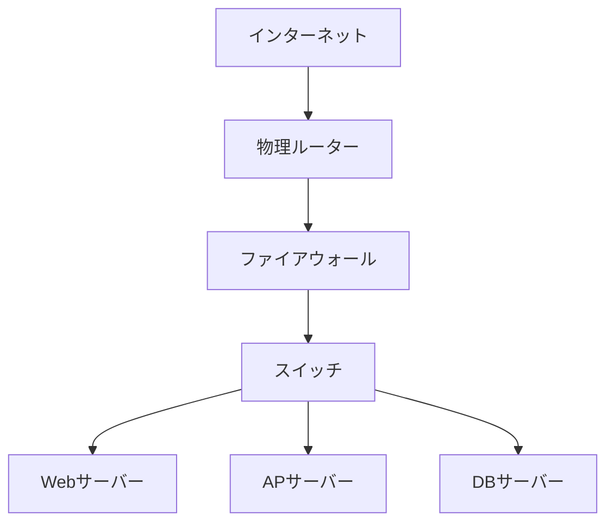
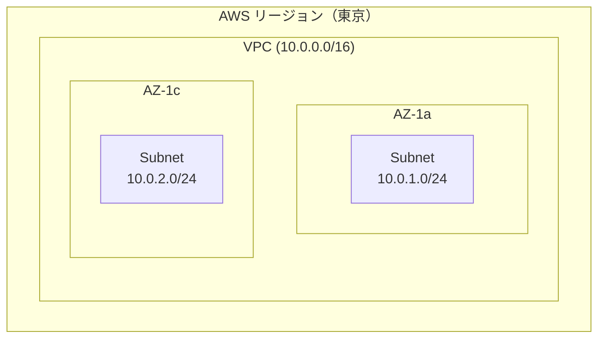
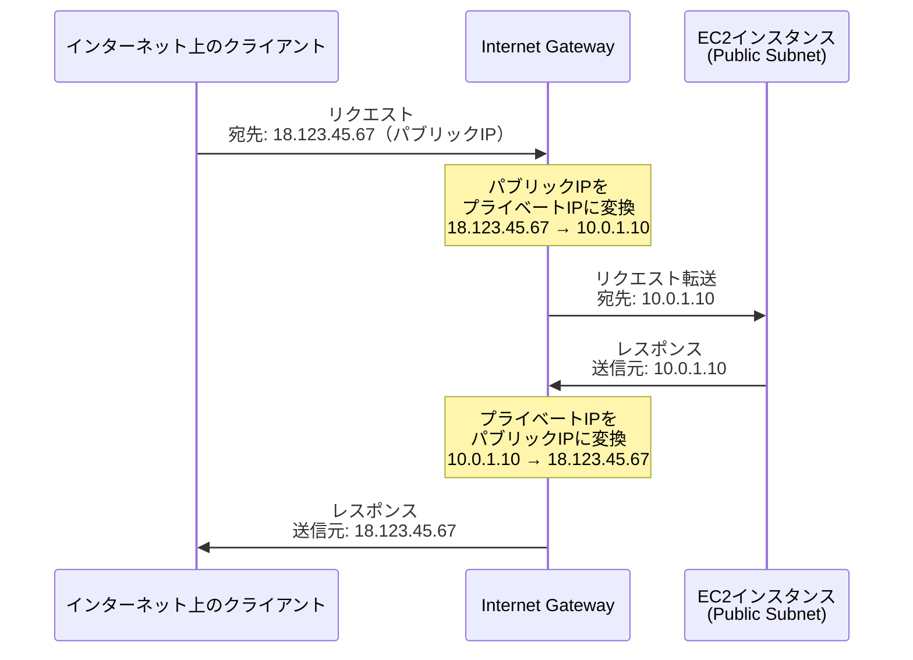
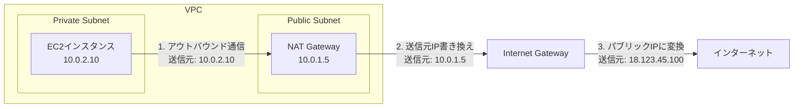
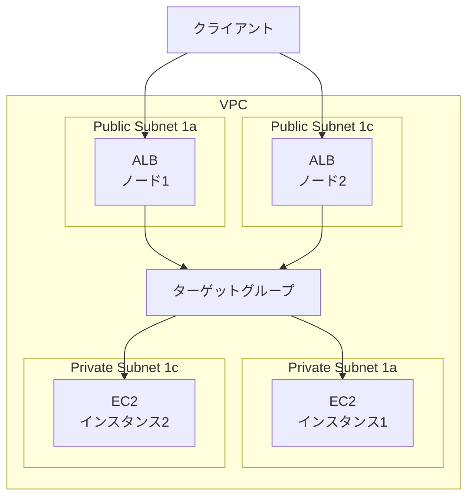
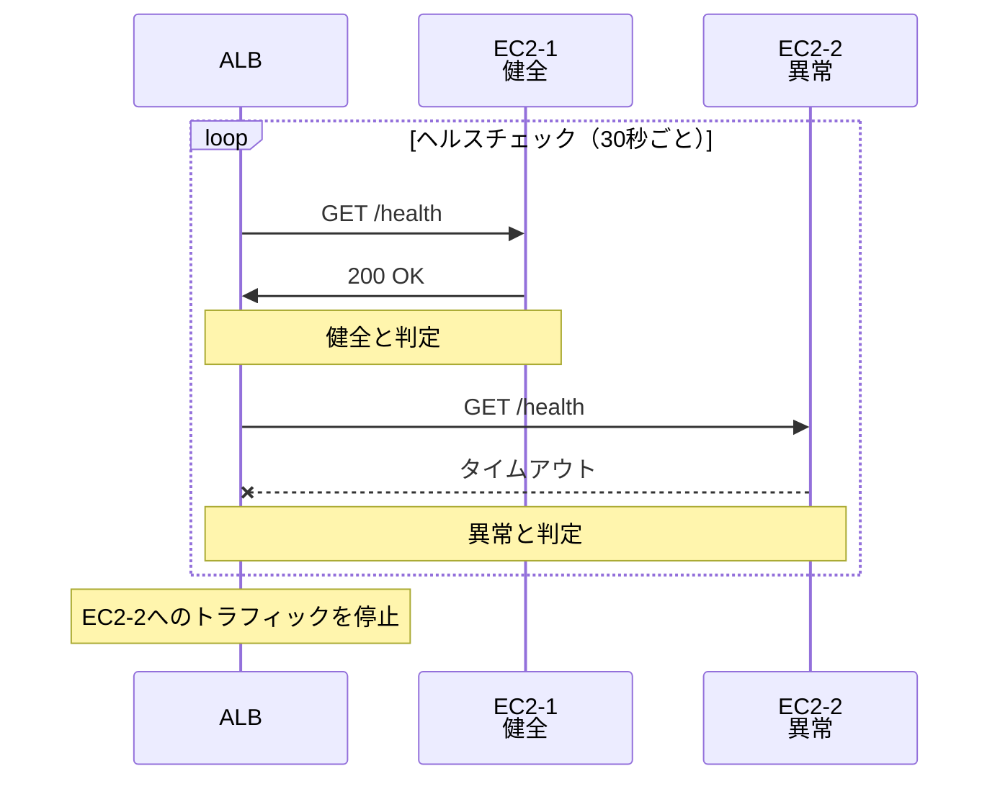
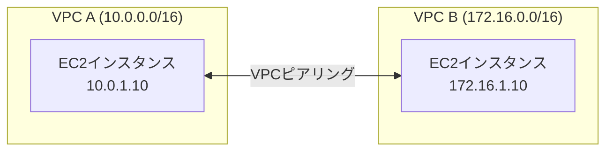
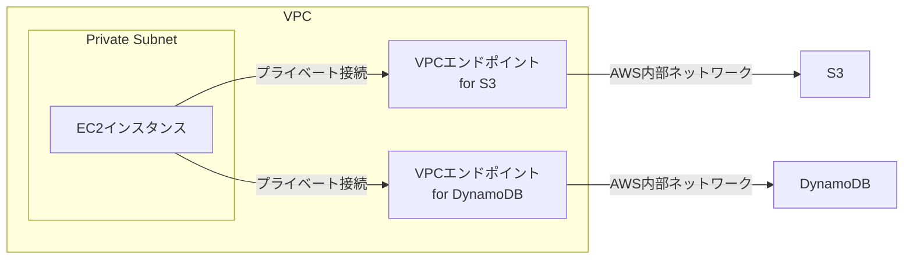

# Zenn問答とは

「Zenn問答」とは、開発していて「なんとなく使ってるけど、ちゃんと理解してるかな？」という技術について、改めて時間をとって深掘りしてみようという企画です🧘🧘🧘

# はじめに

AWSを使った開発をしていると、必ずと言っていいほど「VPC」が必要になります。運用を実施しているときはセキュリティグループの設定やALBのルーティングなどはさわりますが、正直全体像を把握できているかといわれると怪しいところです。というかよくわかってません。。

最近VPCまわりの理解がきちんとできていないことで大変悔しい思いをしたのでこれを機に、基礎からしっかり理解していきたいと思います。

## そもそもなぜVPCが必要なのか

まず、VPCという概念がなぜ生まれたのかを理解しておきましょう。

クラウド登場前のオンプレミス環境では、物理的なネットワーク機器（ルーター、スイッチ、ファイアウォール）を使ってネットワークを構築していました。



それぞれの機器には明確な役割があります

| 機器 | 役割 | なぜ必要か |
|------|------|-----------|
| 物理ルーター | 異なるネットワーク間の通信を中継 | インターネットと社内ネットワークを接続するため |
| ファイアウォール | 不正なアクセスを遮断 | セキュリティを確保し、許可された通信のみを通過させるため |
| スイッチ | 同じネットワーク内の機器同士を接続 | サーバー間の通信を効率的に行うため |

クラウド環境でも同様のネットワーク分離とセキュリティが必要です。しかし、物理機器はクラウドでは意識したくありません。そこで登場したのが**VPC**（Virtual Private Cloud）です。

# AWSのVPCまわりのサービス紹介

AWSのVPCに関連するサービスを紹介しながら自分が思っていた疑問を解消していきます。

## VPC

VPCは、AWS上に**論理的に分離された仮想ネットワーク空間**を作る仕組みです。これにより、オンプレミスと同じようなネットワーク設計をクラウド上で実現できます。

- **完全に分離されたネットワーク空間** - 他のVPCや他のAWSアカウントとは論理的に分離
- **IPアドレス範囲（CIDRブロック）を指定** - 例: `10.0.0.0/16`（65,536個のIPアドレス）
- **リージョンに紐づく** - 1つのVPCは1つのリージョン内に存在
- **複数のアベイラビリティゾーン（AZ）にまたがれる** - 高可用性の実現



### CIDRブロックとは

CIDR（Classless Inter-Domain Routing）は、IPアドレスの範囲を表記する方法です。表記法を見ればピンとくる方も多い気がします。

- `10.0.0.0/16` - 最後の16ビット（2バイト）が可変 → 65,536個のIPアドレス
- `10.0.1.0/24` - 最後の8ビット（1バイト）が可変 → 256個のIPアドレス

VPCを作成する際、プライベートIPアドレス範囲から選択します。

インターネット上で使われるIPアドレスは「グローバルIPアドレス」と呼ばれ、世界中で一意である必要があります。しかし、組織内のネットワークで使うIPアドレスまでグローバルに一意にする必要はありません。

実は、RFC 1918という規格で「プライベートIPアドレス」として予約された範囲があります。これらの範囲はインターネット上では使用されないため、どの組織でも自由に使うことができます。

**RFC 1918で定義されたプライベートIPアドレス範囲（全3種類）**

| CIDR | IPアドレス範囲 | アドレス数 | 用途の目安 |
|------|--------------|----------|-----------|
| `10.0.0.0/8` | 10.0.0.0 〜 10.255.255.255 | 16,777,216 | 大規模な企業ネットワーク、クラウド環境 |
| `172.16.0.0/12` | 172.16.0.0 〜 172.31.255.255 | 1,048,576 | 中規模な企業ネットワーク |
| `192.168.0.0/16` | 192.168.0.0 〜 192.168.255.255 | 65,536 | 家庭や小規模オフィスのルーター |

なんとなくみたことあるIP群が並んでいると思います。規格として定まっているのでこれ以外のアドレスはプライベートアドレスとして使わないという決まりになっているんですね。

AWSのVPCでは、一般的に`10.0.0.0/16`のように、将来の拡張を考慮して大きめのレンジを確保します。`10.x.x.x`の範囲は非常に広いため、複数のVPCを作成しても枯渇する心配がありません。

VPCを作成すると、その中にリソースを配置できるようになりますが、直接EC2などを配置するわけではありません。次に説明する「サブネット」という単位で区切って配置していきます。

## Subnet（サブネット）

サブネットは、VPC内を細かく分割したネットワーク領域です。

- **VPC内のIPアドレス範囲を分割** - VPCが`10.0.0.0/16`なら、`10.0.1.0/24`、`10.0.2.0/24`のように分割
- **必ず1つのアベイラビリティゾーン（AZ）に配置** - AZをまたぐことはできない
- **ルートテーブルを持つ** - 通信の経路を決定

### Public SubnetとPrivate Subnetの違い

よく「Public Subnet」「Private Subnet」という言葉を聞きますが、サブネット自体にPublic/Privateという属性があるわけではありません。**ルートテーブルの設定**によって、結果的にPublic/Privateが決まります。

**Public Subnet**
- ルートテーブルに**Internet Gatewayへのルート**（`0.0.0.0/0` → IGW）がある
- 用途: ALB、NATゲートウェイ、踏み台サーバーなど

**Private Subnet**
- ルートテーブルにInternet Gatewayへのルートがない
- 用途: アプリケーションサーバー、データベースなど

## Internet Gateway（インターネットゲートウェイ）

Internet Gateway（IGW）は、VPCとインターネットをつなぐ**出入口**です。

IGWは**NAT（Network Address Translation）機能**を持っています。重要なポイントは、**EC2インスタンス自身はパブリックIPアドレスを認識していない**ということです。



EC2で`ip addr`を実行しても、プライベートIPしか表示されません。パブリックIPは、**AWS側でインスタンスに紐づけられている**だけです。

IGWはこの紐づけ情報を使って、以下の変換を行います

- **アウトバウンド**（VPC → インターネット） - プライベートIP → 紐づいているパブリックIP
- **インバウンド**（インターネット → VPC） - パブリックIP → 紐づいているプライベートIP

例えば以下のような操作を行うことでインターネットへの通信が可能となります。

1. **VPCにアタッチ** - 1つのVPCに1つのIGWをアタッチ
2. **ルートテーブルに追加** - `0.0.0.0/0`（すべての宛先）→ IGW のルートを追加

```
宛先: 0.0.0.0/0
ターゲット: igw-xxxxxxxxx
```

このルート設定により、「どこにも該当しない宛先（= インターネット）」への通信がIGWに送られます。

また、パブリックIPが設定されていないEC2はインターネットへの接続ができないので、それもインターネットに接続するためには必須の設定となります。

### パブリックIPの取得方法

EC2インスタンスにパブリックIPを割り当てる方法は2つあります

**1. 自動割り当てパブリックIP**

- EC2起動時に自動的に割り当てられる（サブネットまたはEC2起動時の設定による）
- インスタンスを停止/起動すると**IPアドレスが変わる**（動的IP）
- 停止するとIPが解放される

**2. Elastic IP（EIP）**

- 明示的に確保して、インスタンスに紐づける
- IPアドレスが**固定**される（静的IP）
- インスタンスを停止してもIPは保持される

パブリックIPには **$0.005/時間**（月約$3.6）が課金されます。さらに、Elastic IPを確保したまま使わない場合も課金されます。これは、IPv4アドレスの枯渇問題に対応し、使わないIPの放置を防ぐための仕組みです。

## NAT Gateway

ここまでの説明で、Public SubnetのEC2がIGW経由でインターネットと通信できることがわかりました。では、Private SubnetにあるEC2が、外部のAPIを呼び出したり、パッケージを更新したりする必要がある場合はどうすればいいのでしょうか、

Private SubnetのEC2インスタンスがインターネットにアクセスしたい場合、**NAT Gateway**を使います。

Private SubnetのEC2は、以下の理由でIGW経由でのインターネット通信ができません

- **Route TableにIGWへのルートがない** - Private Subnetの定義そのもの
- **パブリックIPが紐づけられていない** - セキュリティのため、通常は紐づけない

仮にPrivate SubnetのEC2にElastic IPを紐づけても、Route TableにIGWへのルートがないため、パケットがIGWに到達できません。また、Route TableにIGWへのルートを追加すると、そのサブネットは実質的にPublic Subnetになってしまいます。

### NAT Gatewayの動作

NAT Gatewayは、**Public Subnetに配置**され、以下のように動作します

1. Private SubnetのEC2（例: `10.0.2.10`）からリクエストを受け取る
2. 送信元IPを**NAT Gateway自身のプライベートIP**（例: `10.0.1.5`）に書き換え
3. IGWがNAT GatewayのプライベートIP（`10.0.1.5`）を、NAT Gatewayに紐づくパブリックIP（例: `18.123.45.100`）に変換
4. インターネットに送信
5. レスポンスを逆順で転送



NAT Gatewayは、Private Subnetのインスタンスからのアウトバウンド通信を可能にしますが、**インバウンド（インターネットから内部へ）の通信は許可しません**。これによりセキュリティが保たれます。

また、NAT Gatewayには自動的にパブリックIPが割り当てられます(利用料金に含まれる)。Elastic IPを紐づけることも可能です。IPを固定して通信してほしいという通信要件がある場合にはEIPを紐づけるとよさそうです。

別にpublic subnetにEC2などをたてることでも可能ですが、NAT Gatewayを採用するには以下のメリットがあります。

- **自動スケール** - トラフィック量に応じて自動的にスケール（最大45Gbps）
- **高可用性** - AWSが冗長化を管理、単一障害点なし
- **管理不要** - マネージドサービス、パッチ適用不要
- **構築が楽** - 数クリックで作成、IP forwardingなどの設定不要

NAT Instanceという仕組みでEC2の一種として構築することもできるようです(昔はそっちしかなかったみたいです)。

## Route Table（ルートテーブル）

だいぶ横道にそれてしまいましたが、ルートテーブルです。ルートテーブルは**ネットワークトラフィックの経路を決定するルール**の集合で、各サブネットには必ず1つのルートテーブルが関連付けられています。

### 基本的なルートテーブル例

**Public Subnetのルートテーブル例**

| 宛先 | ターゲット | 説明 |
|------|----------|------|
| `10.0.0.0/16` | local | VPC内部の通信 |
| `0.0.0.0/0` | igw-xxxxxx | インターネット向けの通信 |

**Private Subnetのルートテーブル例**

| 宛先 | ターゲット | 説明 |
|------|----------|------|
| `10.0.0.0/16` | local | VPC内部の通信 |
| `0.0.0.0/0` | nat-xxxxxx | インターネット向けの通信（NAT Gateway経由） |

### ルーティングの優先順位

複数のルートが存在する場合、**最も具体的な（プレフィックスが長い）ルート**が優先されます。これを「longest prefix match」と呼びます。なので、上記の例でも`0.0.0.0/0`と設定するとどれにも該当しないものがルーティングされるという仕組みになります。
ちなみに、**同じプレフィックス長のルートは設定できません**（AWSがエラーを返します）。

### ルートテーブルのターゲット一覧

ルートテーブルのターゲットは、Internet GatewayやNAT Gatewayだけではありません。実際には多くの種類があります

| ターゲット | 説明 | 用途例 |
|-----------|------|--------|
| **local** | VPC内部の通信 | 自動的に作成される |
| **igw-xxx** | Internet Gateway | インターネット接続 |
| **nat-xxx** | NAT Gateway | Private Subnetのインターネットアクセス |
| **eni-xxx** | Elastic Network Interface | 特定のEC2インスタンスへルーティング |
| **i-xxx** | EC2インスタンスID | NAT Instance など |
| **vgw-xxx** | Virtual Private Gateway | VPN接続（オンプレミスとの接続） |
| **tgw-xxx** | Transit Gateway | 複数VPC間の接続 |
| **pcx-xxx** | VPC Peering Connection | VPC間の直接接続 |
| **vpce-xxx** | VPC Endpoint | PrivateLinkなど |

**ルートテーブルの例**

VPN接続がある場合

| 宛先 | ターゲット | 説明 |
|------|----------|------|
| `10.0.0.0/16` | local | VPC内部 |
| `192.168.0.0/16` | vgw-xxxxxx | オンプレミス拠点 |
| `0.0.0.0/0` | nat-xxxxxx | インターネット |

Transit Gateway使用時

| 宛先 | ターゲット | 説明 |
|------|----------|------|
| `10.0.0.0/16` | local | VPC内部 |
| `10.1.0.0/16` | tgw-xxxxxx | 別のVPC |
| `10.2.0.0/16` | tgw-xxxxxx | さらに別のVPC |
| `0.0.0.0/0` | nat-xxxxxx | インターネット |

### ルートテーブルの制限

ルートテーブルには以下の制限があります

- **ルート数の上限**: デフォルトで**50ルート/ルートテーブル**（上限緩和リクエストで最大1000まで増やせる）
- **ルートテーブル数の上限**: デフォルトで**200個/VPC**

通常の用途ではこれで十分ですが、多数のVPN接続やVPC Peeringを持つ場合は注意が必要です。

## セキュリティグループ

セキュリティグループは、よく見聞きすることも多い印象で、個人的にも苦手意識ないのですが触れておきます。一言で言うと**インスタンスレベルのファイアウォール**です。

### セキュリティグループの特徴

- **ステートフル** - インバウンドで許可した通信のレスポンスは、アウトバウンドルールに関係なく自動的に許可される
- **ホワイトリスト方式** - 明示的に許可したトラフィックのみ通過
- **複数のインスタンスに適用可能** - 1つのセキュリティグループを複数のEC2インスタンスに適用できる

### セキュリティグループの設定例

実際のWebサーバーを例に、インバウンドとアウトバウンドの両方を見てみましょう。

**インバウンドルール（入ってくる通信を制限）**

| タイプ | プロトコル | ポート | ソース | 説明 |
|--------|----------|--------|--------|------|
| SSH | TCP | 22 | 203.0.113.0/24 | 特定IP範囲からのSSHアクセスのみ許可 |
| カスタムTCP | TCP | 8080 | sg-app | アプリケーションサーバーからのアクセス許可 |

**アウトバウンドルール（出ていく通信は全て許可）**

| タイプ | プロトコル | ポート範囲 | 送信先 | 説明 |
|--------|----------|----------|--------|------|
| すべてのトラフィック | すべて | すべて | 0.0.0.0/0 | すべての送信を許可 |

インバウンドは必要な通信のみ絞って許可し、アウトバウンドは基本的に全て許可するのが一般的です。これは、外部への通信（パッケージのダウンロード、外部APIへのアクセスなど）を柔軟に行えるようにするためです。

注目すべきは、**ソースに別のセキュリティグループID（sg-xxx）を指定できる**点です。これにより、「特定のセキュリティグループが付いているインスタンスからのアクセスのみ許可」といった柔軟な制御ができます。

### ネットワークACLとの違い

セキュリティグループと混同しやすいのが、**ネットワークACL**（Access Control List）です。

| 特徴 | セキュリティグループ | ネットワークACL |
|------|---------------------|----------------|
| 適用範囲 | インスタンスレベル | サブネットレベル |
| ルール | 許可のみ（ホワイトリスト） | 許可と拒否の両方 |
| ステート | ステートフル | ステートレス |
| ルール評価 | すべてのルールを評価 | 番号順に評価（最初にマッチしたルールを適用） |

セキュリティグループで十分なことも多そうですが、ネットワークACLは、サブネット全体に対する追加のセキュリティ層として使われることがあるみたいです。

## ALB（Application Load Balancer）とターゲットグループ

ALBは、HTTP/HTTPSトラフィックを複数のターゲット（EC2インスタンスなど）に分散する**ロードバランサー**です。
EC2のセキュリティグループにALBのセキュリティグループを紐づけることにより、**EC2はALB経由でのみアクセス可能**になります。



ちなみに、パブリックIPの観点から見てもALBを使うメリットがあります

1. **IPアドレスの節約** - 100台のEC2に個別にパブリックIPを割り当てる代わりに、ALB 1つでまかなえる
2. **IPアドレスの管理不要** - EC2を増減してもDNSエンドポイントは変わらない
3. **コスト削減** - EC2をPrivate Subnetに配置すれば、パブリックIP課金が発生しない

### ターゲットグループ

ターゲットグループは、**ALBがトラフィックを振り分ける先のインスタンスの集合**です。ターゲットグループの設定項目は以下のようなものがあります。

#### ターゲットタイプ

ターゲットグループには3種類のターゲットタイプがあります

| タイプ | 説明 | 使用例 |
|--------|------|--------|
| **instance** | EC2インスタンスIDで指定 | 通常のEC2ベースのアプリケーション |
| **ip** | IPアドレスで指定（VPC内外のプライベートIP） | ECSタスク、オンプレミスサーバー、他VPCのインスタンス |
| **lambda** | Lambda関数 | サーバーレス処理、APIゲートウェイの代替 |

**instanceタイプ**は最もシンプルで、EC2インスタンスを直接登録します。Auto Scalingと連携しやすい点がメリットです。

**ipタイプ**は柔軟性が高く、以下のような場合に使います

- **ECS（Fargate/EC2起動タイプ）** - コンテナのIPアドレスを直接登録
- **オンプレミスサーバー** - VPN接続したオンプレミス環境のサーバー（VPC内のプライベートIPである必要がある）
- **VPC Peering先のインスタンス** - 別VPCのリソース

**lambdaタイプ**は、HTTPリクエストをLambda関数で処理できます。サーバーレスアーキテクチャでALBの柔軟なルーティング機能を使いたい場合に便利です。

#### プロトコルとポート

ターゲットグループが待ち受けるプロトコルとポートを指定します

**ALB（Application Load Balancer）の場合**

| プロトコル | 用途 | ポート例 |
|-----------|------|---------|
| **HTTP** | 通常のWebアプリケーション | 80, 8080, 3000 など |
| **HTTPS** | SSL/TLS終端をターゲット側で行う場合 | 443, 8443 など |

ALBでは**L7（アプリケーション層）のプロトコルのみ**対応しています。TCPやUDPは使えません（それらはNLBの領域です）。

一般的なパターンとしては以下があります

- **ALBでSSL終端する場合** - ALBはHTTPS（443）でリッスン、ターゲットグループはHTTP（8080など）
- **エンドツーエンド暗号化する場合** - ALBはHTTPS（443）でリッスン、ターゲットグループもHTTPS（443など）

#### その他の重要な設定

- **ヘルスチェック** - ターゲットの健全性を確認する設定（次のセクションで詳しく説明）
- **Stickyセッション** - 同じクライアントからのリクエストを同じターゲットに振り分ける
- **登録解除の遅延** - ターゲット削除時に既存の接続を完了させるまでの待機時間（デフォルト300秒）

### ヘルスチェックの仕組み

ALBは定期的にターゲットの健全性をチェックします。



異常と判定されたターゲットには、トラフィックが振り分けられなくなります。

### リスナーとルーティングルール

ALBがどのターゲットグループにリクエストを振り分けるかは、**リスナールール**で制御します。
リスナーは、ALBがクライアントからの接続を受け付ける設定です。

- **プロトコルとポート** - HTTP:80、HTTPS:443など
- **デフォルトアクション** - どのルールにも該当しない場合のデフォルトのターゲットグループ
- **ルール** - パスやヘッダーに基づいて振り分け先を変更

リスナールールを使って、URLパスやHTTPヘッダーに基づいて異なるターゲットグループに振り分けられます。

#### ルールの評価順序と優先度

ルールには**優先度**（数値）が設定されており、**小さい数値ほど優先度が高い**です。

| 優先度(例) | 条件 | アクション |
|--------|------|----------|
| 1 | パス = `/api/*` | api-servers に転送 |
| 10 | パス = `/admin/*` | admin-servers に転送 |
| 100 | ホストヘッダー = `blog.example.com` | blog-servers に転送 |
| デフォルト | 上記以外 | web-servers に転送 |

ALBは上から順にルールを評価し、**最初にマッチしたルール**のアクションを実行します。どのルールにもマッチしない場合は、デフォルトアクションが実行されます。

#### ルールの条件タイプ

ルールには様々な条件タイプがあります

| 条件タイプ | 説明 | 例 |
|-----------|------|-----|
| **パスパターン** | URLパスでマッチ | `/api/*`、`/images/*.jpg` |
| **ホストヘッダー** | Hostヘッダーでマッチ | `www.example.com`、`*.example.com` |
| **HTTPヘッダー** | 特定のHTTPヘッダーの値でマッチ | `User-Agent: Mobile*` |
| **HTTPメソッド** | GET、POST、PUTなど | `GET`、`POST` |
| **クエリストリング** | クエリパラメータでマッチ | `?version=v2` |
| **送信元IP** | クライアントのIPアドレス | `192.0.2.0/24` |

## VPC peering

複数のVPCを運用している場合、VPC間で通信したいケースがあります。例えば、社内の別サービスへ通信したいときなどです。

この場合、**VPCピアリング**という機能を使います。VPCピアリングを設定すると、2つのVPC間でプライベートIPアドレスを使った通信が可能になります。



## VPC Endpoint

Private SubnetからS3やDynamoDBなどのAWSサービスにアクセスする場合、通常はNAT Gateway経由でインターネットを通じてアクセスします。しかし、これではNAT Gatewayのコストがかかり、セキュリティ的にも外部ネットワークを経由するのは望ましくありません。

この問題を解決するのが**VPCエンドポイント**です。VPCエンドポイントを使うと、VPCから直接AWSサービスにプライベート接続できます。



これにより、インターネットを経由せずに、AWSのプライベートネットワーク内でS3などにアクセスできます。
VPCエンドポイントは**サービスごとに作成**する必要があります。

### VPCエンドポイントの種類

VPCエンドポイントには2つのタイプがあります

| タイプ | 説明 | 対応サービス例 | 課金 |
|--------|------|---------------|------|
| **Gateway型** | Route Tableにルートを追加して利用 | S3、DynamoDB | 無料 |
| **Interface型** | ENI（Elastic Network Interface）を配置 | ECR、Secrets Manager、その他多数のAWSサービス | 有料（時間課金 + データ転送料金） |

**Gateway型**は、Route Tableに以下のようなルートを追加します

```
宛先: pl-xxxxx (S3のPrefix List)
ターゲット: vpce-xxxxx (VPCエンドポイント)
```

**Interface型**は、指定したサブネットにENI（仮想ネットワークカード）を作成し、プライベートIPアドレスを持ちます。セキュリティグループで通信を制御できます。

### VPCエンドポイントの制限

VPCエンドポイントには以下の制限があります

- **Gateway型エンドポイント** - 同じサービスに対して1つのVPCに1つまで（S3用1つ、DynamoDB用1つ）
- **Interface型エンドポイント** - サービスごとに複数作成可能（ただしコストに注意）
- **VPCあたりの上限** - デフォルトで255個（上限緩和リクエスト可能）

実際の運用では、コストを考慮してGateway型を優先的に使い、Gateway型が対応していないサービスでInterface型を使うのが一般的です。

# まとめ

AWSのVPC周りについて、基礎的な内容をまとめ直してみました。
正直、ここらへんをよく触っているSREチームなどからすれば基礎中の基礎だと思いますが、クラウドでの構築経験も少なく、運用でしか使っていないので整理できてよかったです。

もともとは物理機器を購入して、、とやっていたと思うと今のシステム開発はだいぶ楽になっている気がしますね。デプロイなんかもぽちっとできる時代になっていたり、クラウド基盤が発達してここらへんをラップしてくれているんだなと改めて実感しました。

最後まで読んでいただき、ありがとうございました🙏
