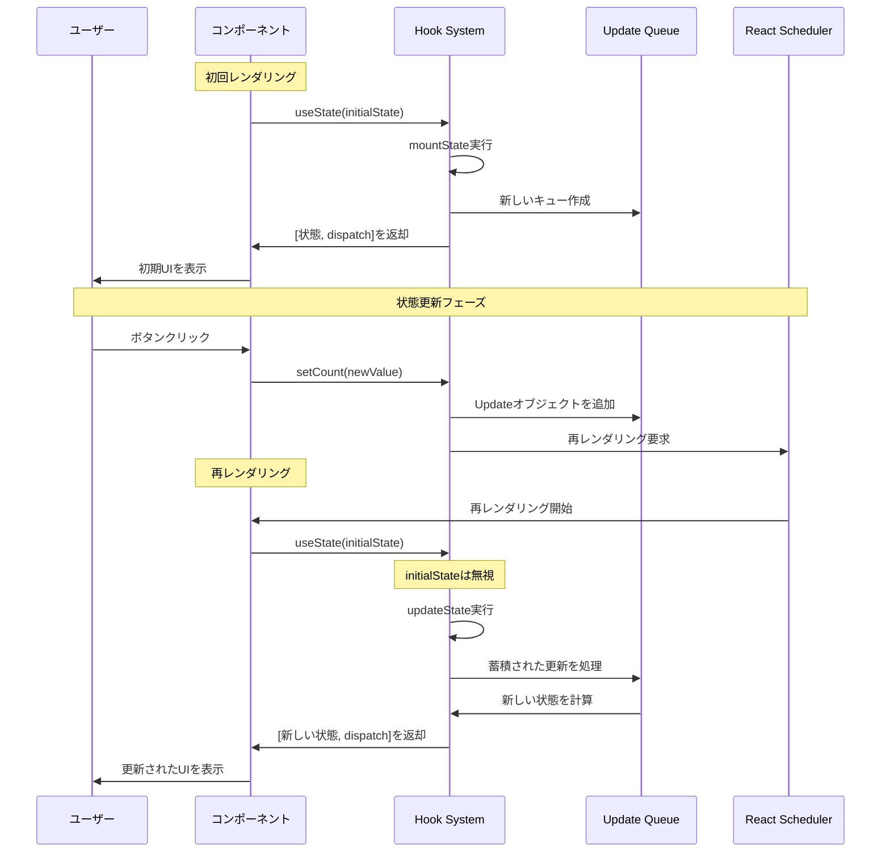
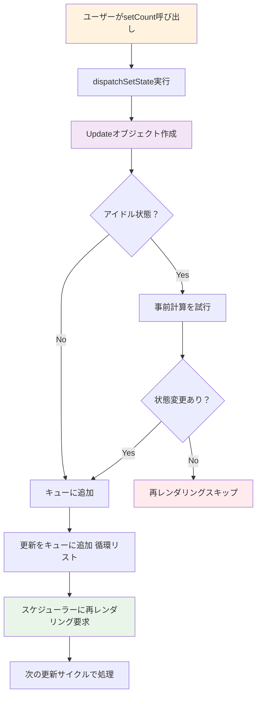

# Zenn問答とは

「Zenn問答」とは、開発していて「なんとなく使ってるけど、ちゃんと理解してるかな？」という技術について、改めて時間をとって深掘りしてみようという企画です🧘🧘🧘

# はじめに

Reactの開発において、`useState`は最も頻繁に使うHookの一つかと思います。自分も最近入門書を読んで学習しなおしたのですが序盤も序盤に登場しました。とりあえずなんとなく使い方は理解しましたが、きちんと理解できていなかったので今回深掘りしてみたいと思います。

# useStateの概要と引数の型

`useState`の型定義は以下のようになっています。

```typescript
function useState<S>(initialState: S | (() => S)): [S, Dispatch<SetStateAction<S>>];
```

`S`型か`(() => S)`型を引数にとり、`S`型と`Dispatch<SetStateAction<S>>`型のタプルを返却します。引数は初期値で、戻り値は現在の状態とそれを変更する関数です。

```typescript
const [count, setCount] = useState(init);
```

みたいなのは入門書とかでよく見る構成かと思います。自分もたくさん写経しました。

## 引数の型 `S | (() => S)`

引数には`S`型か`(() => S)`型をとることができます。調べてみたら、関数を渡すパターンは大まかに計算コストが高い初期化などを避けたい場合に使うみたいです。

```typescript
// ❌ 悪い例：毎回の再レンダリングで重い処理が実行される
const [data, setData] = useState(
  heavyProcess() // 再レンダリング時にも毎回実行
);

// ✅ 良い例：初回のみ実行される
const [expensiveData, setExpensiveData] = useState(() => {
  return heavyProcess(); // 初回の1回だけ実行
});
```

なぜ下の場合には初回のみ実行されるのでしょうか？
詳しくはこの記事の後半でソースリーディングしたのですが、Reactの再レンダリング時に初期描画と2回目以降で処理が分岐します。直接値を渡すと初期描画と2回目以降描画の判断の前に関数が評価されてしまうためにこのようなことが発生します。

もう少しイメージを掴むために実際に簡単なコードを書いて検証してみます。

```typescript
var isInitialized = false;

function hoge(init: void | (() => void)){
    if (!isInitialized) {
        console.log("Initialize")
        if (typeof init === 'function'){
            init()
        }
        isInitialized = true
        return
    }
    console.log("Already Initialized")
}

const fuga = () => {
    console.log("fuga")
}

hoge(fuga());
// [LOG]: "fuga" 
// [LOG]: "Initialize" 
hoge(fuga());
// [LOG]: "fuga" 
// [LOG]: "Already Initialized" 

isInitialized = false;

hoge(fuga)
// [LOG]: "Initialize" 
// [LOG]: "fuga" 

hoge(fuga)
// [LOG]: "Already Initialized"
```

以下の`TS Playground`でも実行できます。

https://www.typescriptlang.org/play/?ssl=17&ssc=2&pln=3&pc=1#code/G4QwTgBAlgzgkgOygFyiANlAXgUwCYQC8EAZhjDgNwBQ1JArggMaoD2CEAFqwOY4AUUJMgBcEYKygEAPhH78AlEQB84yXgUKA3tQh7oJOQEJYiFGky4NEHfrsQm7GK3Q4AdOl78ARGdQZsHG8FXXs9KEN+ZABPAAccVkMhFCJCYgByBmY2BHTtULC7ZORFAvsAXzKi+GELQIJiZDB6HCr9MBxkejAEMsq7RwRnVw8vbwBBdA6QPGiIPzqrYOpK6kGYZFJ6HhAiOSVCVVt9dZd3Tx4fBh3l1e4+fmuQRQUae4Enl5pqU1qAqz2ZHQFG+70e2xAITBTxCQA

なるほど、`S`型か`(() => S)`型の違いがわかりました。
こうなると、`() => S`型だけでもいいような気がしてきます。これは推測になりますが、初期値が0で決まっているような計算コストがほぼ無いようなものについてシンプルに書けるような親切心だと思います。

```typescript
useState(0)
useState(() => 0)
```

これをみた時に上で書いた方が簡単じゃね？というくらいだと思います。個人的には`() => S`型で統一した方がわかりやすい気もしますが・・・どうなんでしょうか

# 内部実装を簡単に読んでみる

`v19.1.1`のタグで読んでいきます。

https://github.com/facebook/react/blob/v19.1.1/packages/react/src/ReactHooks.js#L72

```typescript
export function useState<S>(
  initialState: (() => S) | S,
): [S, Dispatch<BasicStateAction<S>>] {
  const dispatcher = resolveDispatcher();
  return dispatcher.useState(initialState);
}
```

`dispatcher`とやらを取得して、その中の`useState`に引数を渡しています。

https://github.com/facebook/react/blob/v19.1.1/packages/react/src/ReactHooks.js#L30

```typescript
function resolveDispatcher() {
  const dispatcher = ReactSharedInternals.H;
  // (中略)
  return ((dispatcher: any): Dispatcher);
}
```

`dispatcher`は何かというと、`ReactSharedInternals.H`のことらしい。
実際に`ReactSharedInternals.H`に値をいれている部分を探すと、以下が見つかりました。

https://github.com/facebook/react/blob/v19.1.1/packages/react-reconciler/src/ReactFiberHooks.js#L551

大事なところだけ抽出すると、以下になります。

```js
    ReactSharedInternals.H =
      current === null || current.memoizedState === null
        ? HooksDispatcherOnMount
        : HooksDispatcherOnUpdate;
```

初回描画時は`HooksDispatcherOnMount`、二回目以降は`HooksDispatcherOnUpdate`が`ReactSharedInternals.H`の実態みたいですね。
このふたつで何が違うのかというのが気になりますね。`HooksDispatcherOnMount`と`HooksDispatcherOnUpdate`を宣言している`updateSwipeTransition`の関数の中を見てみると、`useState`に渡している関数が前者は`mountState`、二回目以降は`updateState`になっています。この2つの関数を読めば初回実行時と二回目以降実行時の挙動の違いが分かりそうです。

## 初回描画時のmountState

https://github.com/facebook/react/blob/v19.1.1/packages/react-reconciler/src/ReactFiberHooks.js#L1940

```typescript
function mountState<S>(
  initialState: (() => S) | S,
): [S, Dispatch<BasicStateAction<S>>] {
  const hook = mountStateImpl(initialState);
  const queue = hook.queue;
  const dispatch: Dispatch<BasicStateAction<S>> = (dispatchSetState.bind(
    null,
    currentlyRenderingFiber,
    queue,
  ): any);
  queue.dispatch = dispatch;
  return [hook.memoizedState, dispatch];
}
```

`mountStateImpl`に`initialState`を渡して初期化処理を行って、その後なんやかんやしてからStateの値とState更新用の関数が返却されます。

結局`hook`の中身を見ないとなんともいえないので、中身を見てみます。

https://github.com/facebook/react/blob/v19.1.1/packages/react-reconciler/src/ReactFiberHooks.js#L1912

```typescript
function mountStateImpl<S>(initialState: (() => S) | S): Hook {
  const hook = mountWorkInProgressHook();
  if (typeof initialState === 'function') {
    const initialStateInitializer = initialState;
    // $FlowFixMe[incompatible-use]: Flow doesn't like mixed types
    initialState = initialStateInitializer();
    if (shouldDoubleInvokeUserFnsInHooksDEV) {
      setIsStrictModeForDevtools(true);
      try {
        // $FlowFixMe[incompatible-use]: Flow doesn't like mixed types
        initialStateInitializer();
      } finally {
        setIsStrictModeForDevtools(false);
      }
    }
  }
  hook.memoizedState = hook.baseState = initialState;
  const queue: UpdateQueue<S, BasicStateAction<S>> = {
    pending: null,
    lanes: NoLanes,
    dispatch: null,
    lastRenderedReducer: basicStateReducer,
    lastRenderedState: (initialState: any),
  };
  hook.queue = queue;
  return hook;
}
```

`if (typeof initialState === 'function')`のブロックについては引数の`initialState`が関数型なら実行しているだけですね。
その後`hook`の`memoizedState`と`baseState`に初期値を代入しています。
その後`UpdateQueue`を新規で作成し、`hook`の`queue`に代入しています。そして、呼び出し元で`dispatch`を新たに宣言して`queue`の`dispatch`に代入、返却しています。

### hookのqueueとdispatchとは

`hook.queue`は**状態更新を管理するキューシステム**のようです。複数の状態更新が同時に発生した場合や、非同期更新を効率的に処理するために使われます。
`state`の更新が3つがあるが、描画が1回でよい場合など、キューにためた更新を一気に処理するというイメージで捉えています。

型とその概要はこのようになっています。

```typescript
// UpdateQueue の構造
export type UpdateQueue<S, A> = {
  pending: Update<S, A> | null,        // 待機中の更新リスト（循環リンクリスト）
  lanes: Lanes,                        // 優先度レーン（緊急度を表す）
  dispatch: (A => mixed) | null,       // setState関数（ユーザーが呼び出す関数）
  lastRenderedReducer: ((S, A) => S) | null,  // 最後に使用されたリデューサー関数
  lastRenderedState: S | null,         // 最後にレンダリングされた状態値
};

// Update の構造
export type Update<S, A> = {
  lane: Lane,                          // この更新の優先度レーン
  revertLane: Lane,                    // リバート時の優先度レーン
  action: A,                           // 実行する更新内容（値 or 関数）
  hasEagerState: boolean,              // 事前計算された状態があるかどうか
  eagerState: S | null,                // 事前計算された次の状態値
  next: Update<S, A>,                  // 次の更新への参照（循環リスト）
};
```

もう少し深追いしてもいいですが、`setState`の概要理解から離れている気もするのでなんとなくこのようなものというところで今回は止めておきます。続いて`queue`の`dispatch`についてみていきます。
もう一度振り返ると、`dispatch`は`setCount`や`setName`などの名前で呼び出される、**状態を更新するための関数**として返却されるものでした。

少し前に見た`mountState`関数をみると、dispatch関数の実体は`dispatchSetState`のようです。早速みていきます。

https://github.com/facebook/react/blob/v19.1.1/packages/react-reconciler/src/ReactFiberHooks.js#L3735

```typescript
function dispatchSetState<S, A>(
  fiber: Fiber,
  queue: UpdateQueue<S, A>,
  action: A,
): void {
  if (__DEV__) {
    // (中略)
  }
  const lane = requestUpdateLane(fiber);
  const didScheduleUpdate = dispatchSetStateInternal(
    fiber,
    queue,
    action,
    lane,
  );
  if (didScheduleUpdate) {
    startUpdateTimerByLane(lane);
  }
  markUpdateInDevTools(fiber, lane, action);
}
```

本体は`dispatchSetStateInternal`みたいです。

https://github.com/facebook/react/blob/v19.1.1/packages/react-reconciler/src/ReactFiberHooks.js#L3765

```typescript
function dispatchSetStateInternal<S, A>(
  fiber: Fiber,
  queue: UpdateQueue<S, A>,
  action: A,
  lane: Lane,
): boolean {
  const update: Update<S, A> = {
    lane,
    revertLane: NoLane,
    action,  // 更新内容（5 や (c) => c + 1）
    hasEagerState: false,
    eagerState: null,
    next: (null: any),
  };

  // レンダリング中はどうやら違う処理らしい
  if (isRenderPhaseUpdate(fiber)) {
    enqueueRenderPhaseUpdate(queue, update);
  } else {
    const alternate = fiber.alternate;
    if (
      fiber.lanes === NoLanes &&
      (alternate === null || alternate.lanes === NoLanes)
    ) {
      // キューが空の場合にはいちいちレンダリングせずに事前に計算する
      const lastRenderedReducer = queue.lastRenderedReducer;
      if (lastRenderedReducer !== null) {
        let prevDispatcher = null;
        if (__DEV__) {
          prevDispatcher = ReactSharedInternals.H;
          ReactSharedInternals.H = InvalidNestedHooksDispatcherOnUpdateInDEV;
        }
        try {
          const currentState: S = (queue.lastRenderedState: any);
          const eagerState = lastRenderedReducer(currentState, action);

          update.hasEagerState = true;
          update.eagerState = eagerState;
          if (is(eagerState, currentState)) {
            // 状態が変わらない場合は再レンダリングをスキップする
            enqueueConcurrentHookUpdateAndEagerlyBailout(fiber, queue, update);
            return false;
          }
        } catch (error) {
          // Suppress the error. It will throw again in the render phase.
        } finally {
          if (__DEV__) {
            ReactSharedInternals.H = prevDispatcher;
          }
        }
      }
    }

    // 更新をキューに追加する
    const root = enqueueConcurrentHookUpdate(fiber, queue, update, lane);
    if (root !== null) {
      // スケジューラーに再レンダリングを要求
      scheduleUpdateOnFiber(root, fiber, lane);
      entangleTransitionUpdate(root, queue, lane);
      return true;
    }
  }
  return false;
}
```

というわけで、ざっくりですが以下のようになっていそうです。

- ソースコードで`setCount(5)`とかを呼び出し
- `Update`型を作成して、キューに詰める
- 更新のバッチ処理をする
  - ここで更新がなければ再レンダリングはスキップする
- スケジューラーに再レンダリング要求

なんやかんや書きましたが、`dispatch`を使うことでスケジューラーへの再レンダリング要求が発生するので`state`の値が更新されたときに再描画が発生することがわかりました。

## 二回目以降描画時のupdateState

https://github.com/facebook/react/blob/v19.1.1/packages/react-reconciler/src/ReactFiberHooks.js#L1954

```typescript
function updateState<S>(
  initialState: (() => S) | S,
): [S, Dispatch<BasicStateAction<S>>] {
  return updateReducer(basicStateReducer, initialState);
}
```

実際の処理は`updateReducer`に委譲されています。これは`useState`が内部的には`useReducer`の特殊なケースとして実装されているためです。

https://github.com/facebook/react/blob/v19.1.1/packages/react-reconciler/src/ReactFiberHooks.js#L1342

```typescript
function updateReducer<S, I, A>(
  reducer: (S, A) => S,
  initialArg: I,
  init?: I => S,
): [S, Dispatch<A>] {
  const hook = updateWorkInProgressHook();
  return updateReducerImpl(hook, ((currentHook: any): Hook), reducer);
}
```

実際の処理は`updateReducerImpl`に書かれていそうですが、ここで初期値が渡っていないことがわかります。二回目以降の場合はこのタイミングで初期値や初期値をセットする関数が捨てられることになります。

https://github.com/facebook/react/blob/v19.1.1/packages/react-reconciler/src/ReactFiberHooks.js#L1351

さて、`updateReducerImpl`を読むか・・・となりましたが、なんと250行くらいあって心が折れてしまいました。
まあ、大体同じだと思うのでAIが作ってくれた簡単な比較表をおいておしまいにします。

### **mountState と updateState の違い**

| 項目 | mountState（初回） | updateState（再レンダリング） |
|------|-------------------|----------------------------|
| **Hook作成** | 新しいHookを作成 | 既存Hookを再利用 |
| **初期値処理** | initialStateを評価・設定 | initialStateは無視 |
| **キュー処理** | 空のキューを作成 | 蓄積された更新を処理 |
| **状態計算** | 初期値をそのまま設定 | 複数更新を順次適用 |
| **dispatch作成** | 新しいdispatch関数を作成 | 既存dispatch関数を再利用 |

というわけで`useState`を使うとなんで再描画されるかがなんとなく理解できました。`useState`の戻り値は`hook`の`queue`の`dispatch`の`action`として保存され、`dispatch`の中でいい感じに再描画がキックされるようでした。

# 概要図

## useState全体のライフサイクル



## 状態更新（dispatch呼び出し）の流れ



# おまけ：useStateって直感的じゃなくない？

個人的には、以下の宣言の仕方がわかりにくいなぁと感じました。

```typescript
const [count, setCount] = useState(init)
```

わかりにくいなぁと思った原因を整理してみたら以下のようなものがありそうでした。

- 戻り値のタプルの1つ目と2つ目が知らないと何なのか理解できない
- 関数名が抽象的で、使うことしか分からない
- useStateの引数が初期値なのも知らないと分からない(型も`S | () => S`で違いが何なのか？という疑問が知らないと生まれてしまう)

例えばですが、こんな感じで宣言できたらいいのになぁと思いました。

```typescript
const countState = State.of(init)
const count = countState.value()
countState.update((c) => c + 1)
```

# まとめ

今回は`useState`について、型定義から再描画の仕組みまで調べてみました。
引数の型が`S | () => S`型である理由や、戻り値を使うことで`State`が更新され、その後再描画される理由などが概要レベルですが理解できてすっきりしました。

また、`React`って結構イケイケなソースコードのイメージだったのですが、ソースコードもめっちゃ整理されているということはなく、メンテもなかなか大変そうだなぁという印象を持ちました。

最後まで読んでいただき、ありがとうございました！🙏
