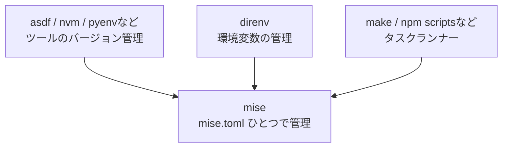
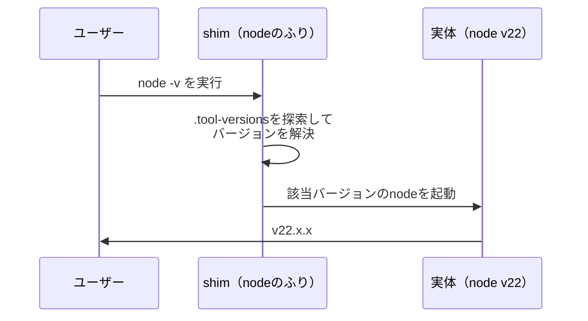
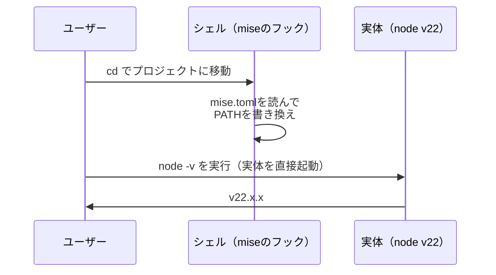
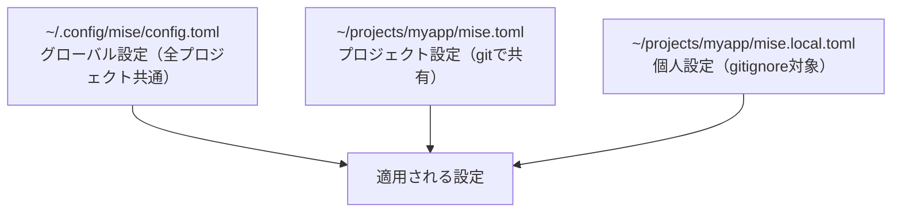

# Zenn問答とは

「Zenn問答」とは、開発していて「なんとなく使ってるけど、ちゃんと理解してるかな？」という技術について、改めて時間をとって深掘りしてみようという企画です🧘🧘🧘

# はじめに

最近、いろんなリポジトリのセットアップ手順で「miseをインストールしてください」と書かれているのを見かけるようになりました。いわゆるバージョンマネージャーだということは知っているのですが、「asdf等と何が違うの？」「なんでみんなmiseに乗り換えているの？」と聞かれると、自信を持って答えられません。

今回はmiseについて改めて深掘りし、そもそもどんな課題を解決するために生まれたのか、競合ツールと比べて何が優れているのか、そして実際にどう使うのかを整理していきます。

# そもそもなぜバージョンマネージャーが必要なのか

miseの話に入る前に、まず「バージョンマネージャーというジャンルのツールがなぜ存在するのか」から整理してみます。

## システムに直接インストールする場合の課題

HomebrewやaptなどのOSのパッケージマネージャーで言語をインストールすると、基本的にシステム全体で1つのバージョンしか使えません。しかし実際の開発では、こんな状況が日常的に発生します。

- プロジェクトAはNode 18で動いているが、プロジェクトBはNode 22が必要
- 本番環境はPython 3.11なのに、手元には3.13が入っていて挙動が微妙に違う
- チームメンバーごとに入っているバージョンがバラバラで「自分の環境では動くんだけど」が頻発する

この「プロジェクトごとに必要なバージョンが違う」「チームでバージョンを揃えたい」という課題を解決するのがバージョンマネージャーです。プロジェクトのディレクトリに入ると、そのプロジェクト用のバージョンに自動で切り替わる、というのが基本的な体験になります。

## 言語ごとのツールが乱立していた時代

この課題に対して、まず言語ごとに専用のバージョンマネージャーが生まれました。Nodeにはnvm、Rubyにはrbenv、Pythonにはpyenv、JVM系にはSDKMAN!といった具合です。まあたしかにここらへんめちゃくちゃいれていました。

これらのツールは十分に役割を果たしてくれましたが、複数の言語を扱うようになると、今度は別の課題が見えてきます。

- ツールごとにコマンド体系が全く違う（`nvm use` と `pyenv local` と `rbenv local` を覚え分ける必要がある）
- バージョン指定ファイルもバラバラ（`.nvmrc`、`.python-version`、`.ruby-version`...）
- シェルの起動時にそれぞれの初期化スクリプトが走り、ターミナルを開くのが遅くなる
- 新しい言語を使うたびに、新しいツールのインストールと設定が必要になる

## 統合型バージョンマネージャーの登場

そこで「1つのツールであらゆる言語のバージョンを管理しよう」という発想で2015年頃に登場したのが **asdf** です。プラグイン機構によって任意の言語やツールに対応でき、`.tool-versions` という1つのファイルにプロジェクトで使うツールのバージョンをまとめて書けるようになりました。

```
# .tool-versions
nodejs 22.11.0
python 3.13.1
terraform 1.10.3
```

asdfは広く普及しましたが、これにも課題がありました。長らくシェルスクリプトで実装されていたため動作が遅いこと、そして後述する **shims（シム）** という仕組みに起因する分かりにくさです。

miseは、このasdfの思想を受け継ぎつつ、課題を解決する形で登場したツールです。

# miseとは

mise（ミーズと読みます）は、jdx氏が開発しているRust製の開発環境セットアップツールです。2023年に **rtx** という名前で登場し、NVIDIAのGPU（RTXシリーズ）と紛らわしいこともあって、2024年に現在の名前に改名されました。名前の由来はフランス語の料理用語 **mise-en-place（ミザンプラス）** で、「調理を始める前の下ごしらえ・配置」を意味します。開発を始める前の環境の下ごしらえをしてくれるツール、というわけです。

miseはミーズと読みますが、mise en placeはミーザンプラスみたいな感じで発音するんですね。
miseの特徴は、単なるバージョンマネージャーにとどまらず、3つの役割を1つのツールでカバーしている点です。



- **バージョン管理** - asdfやnvmのように、プロジェクトごとにツールのバージョンを切り替える
- **環境変数管理** - direnvのように、ディレクトリに入ると環境変数が自動で設定される
- **タスクランナー** - makeやnpm scriptsのように、プロジェクトのタスクを定義して実行する

これらすべてを `mise.toml` という1つの設定ファイルで管理できます。

# miseを入れるメリット

そもそも、nvmとかrbenvとかjenvの類がひとつにまとまるのでそれだけでもいいじゃん！となりますが、asdfなどのツールでもそれは実現できます。今回はmiseのメリットを整理してみます。

## shimsを使わない仕組み

miseとasdfの最も本質的な違いは、バージョンを切り替える方式です。

asdfは **shims方式** を採用しています。shimsとは「実体のふりをする小さな仲介スクリプト」のことです。asdfをセットアップすると、PATHの先頭に `~/.asdf/shims` が追加され、`node` を実行すると実はこのshimスクリプトが起動します。shimはその場で `.tool-versions` を探してバージョンを解決し、該当するバージョンの実体を起動します。



この方式は「どのディレクトリから実行しても正しいバージョンが選ばれる」という利点がある一方、いくつかの問題を抱えています。

- コマンドを実行するたびにバージョン解決の処理が挟まり、オーバーヘッドが発生する
- `which node` がshimのパスを返すため、実体の場所が分かりにくい
- IDEやエディタがnodeの実体を見つけられず、追加の設定が必要になることがある
- 新しいコマンドをインストールした直後は `asdf reshim` を実行しないと認識されないことがある

一方miseは、デフォルトでshimsを使いません。シェルのフック機能を利用して、ディレクトリを移動したタイミングで **PATHそのものを書き換える** 方式を採用しています。



PATHの書き換えは移動時の1回だけで、コマンド実行時には実体が直接起動されます。そのため実行時のオーバーヘッドがなく、`which node` も実体のパスを返します。IDEとの相性問題も起きにくくなります。

なお、シェルのフックが使えない環境（IDEからの直接実行やCIなど）のために、miseにもshimsモードが用意されています。デフォルトはPATH書き換え方式で、必要な場面でshimsも選べる、という設計です。

## とにかく速い

miseはRust製で、動作が高速です。シェル起動時の初期化も、ディレクトリ移動時のフック処理も高速なので、導入してもターミナルの体感速度がほぼ変わりません。nvmの初期化でシェルの起動が遅くなった経験のある方には、これだけでも乗り換える価値があります。

なお、asdfも2025年のv0.16でシェルスクリプトからGoに書き直され、大幅に高速化されました。ただしshims方式であることは変わっていないため、コマンド実行時のオーバーヘッドという構造的な差は残っています。

## 設定がmise.tomlひとつにまとまる

前述の通り、miseはバージョン管理・環境変数・タスクを1つの `mise.toml` で管理できます。これまで `.tool-versions` と `.envrc` と `Makefile` に分散していた「このプロジェクトの開発環境の定義」が1箇所に集約されるので、新しくプロジェクトに入った人が見るべきファイルが明確になります。

さらに互換性も手厚く、asdfの `.tool-versions` はそのまま読み込めますし、`.nvmrc` や `.ruby-version` といった言語固有のバージョンファイルも読み取れます（バージョンによっては設定でのオプトインが必要です）。既存プロジェクトの設定ファイルを書き換えずに、自分だけ先にmiseへ移行するということも可能です。

## 言語以外のCLIツールも管理できる

miseが管理できるのは言語のランタイムだけではありません。**バックエンド** という仕組みによって、さまざまな入手元からツールをインストールできます。

| バックエンド | 説明 |
|------------|------|
| core | node、python、go、java、rubyなど主要言語はmise本体に組み込み |
| aqua | CLIツールのレジストリ。チェックサム検証などセキュリティ機構が充実 |
| ubi | GitHub Releasesからバイナリを直接取得 |
| asdf | 既存のasdfプラグインをそのまま利用 |
| cargo / npm / pipx | 各言語のパッケージマネージャー経由でインストール |

これにより、terraform、kubectl、jq、ripgrepといったCLIツールも `mise use terraform` のように一元管理できます。「開発に必要なツールとそのバージョンをすべてmise.tomlに書いておき、新メンバーは `mise install` を1回叩けば環境が揃う」という状態を作れるのが強力です。

セキュリティ面でも進歩があります。asdfのプラグインは任意のシェルスクリプトを実行する仕組みのため、悪意あるプラグインのリスクが指摘されていました。miseはよく使われるツールをasdfプラグインではなくaquaやubiバックエンド経由で取得するようになっており、チェックサム検証などの恩恵を受けられます。

# 競合ツールとの比較

メリットを整理したところで、主要な競合ツールと比較してみます。

| ツール | 対象 | 実装 | メリット | デメリット |
|-------|------|------|---------|-----------|
| mise | あらゆる言語・ツール | Rust | 高速。環境変数・タスクまで1つに統合できる。asdfの資産を引き継げる | 歴史が浅く、活発な開発ゆえに仕様変更も比較的多い。機能が多いぶん学習範囲が広い |
| asdf | あらゆる言語・ツール | Go（旧bash） | 長年の実績とプラグイン資産。検索して出てくる情報量が多い | shims由来の分かりにくさ（`reshim` など）。バージョン管理以外はできない。Windows非対応 |
| nvm / pyenv / rbenvなど | 単一言語 | 主にシェルスクリプト | 枯れていて情報が最も多い。その言語コミュニティでは事実上の標準 | 言語ごとに導入・学習が必要。シェル起動が遅くなりがち |
| Volta | JavaScript系のみ | Rust | JSツールチェーンに特化した使い勝手。package.jsonでバージョンを固定できる | JavaScript以外には使えない |
| proto | あらゆる言語・ツール | Rust | 高速。同じ開発元のmoonと連携できmonorepoに強い | エコシステムが小さく情報が少ない |
| direnv | （バージョン管理なし） | Go | 環境変数管理として実績十分。シンプルで安定している | バージョン管理はできない。`.envrc` はシェルスクリプトなので書き方の自由度が高すぎる面も |

# mise.tomlの構成

実際の設定ファイルを見ていきましょう。`mise.toml` は大きく分けて `[tools]`、`[env]`、`[tasks]` の3つのセクションで構成されます。

```toml
[tools]
node = "22"
python = "3.13"
terraform = "1.10"

[env]
NODE_ENV = "development"
DATABASE_URL = "postgres://localhost:5432/myapp"
_.file = ".env"                # .envファイルを読み込む
_.path = "./node_modules/.bin" # PATHに追加する

[tasks.dev]
description = "開発サーバーを起動"
run = "npm run dev"

[tasks.test]
description = "テストを実行"
depends = ["build"]
run = "npm test"

[tasks.build]
description = "ビルド"
run = "npm run build"
```

## [tools] セクション

プロジェクトで使うツールとバージョンを定義します。バージョン指定は柔軟で、`"22"` と書けば22系の最新、`"22.11.0"` と書けば完全固定、`"latest"` と書けば常に最新を使えます。

## [env] セクション

このディレクトリに入ったときに設定される環境変数を定義します。direnvの置き換えに相当する機能です。

`_.` で始まるキーは特別な意味を持ちます。`_.file` で `.env` ファイルを読み込んだり、`_.path` でPATHにディレクトリを追加したりできます。`node_modules/.bin` をPATHに追加しておくと、`npx` なしでプロジェクトローカルのコマンドを直接実行できるので便利です。

## [tasks] セクション

プロジェクトのタスクを定義します。`mise run dev` のように実行でき、`depends` でタスク間の依存関係も表現できます。上の例では `mise run test` を実行すると、先に `build` タスクが実行されます。

タスク定義には、変更されたときだけ再実行するための `sources` / `outputs` の指定や、ファイルとしてタスクスクリプトを置く方式（file tasks）もあり、簡易的なmakeの置き換えとして十分な機能があります。

## 設定ファイルの階層

miseの設定ファイルは階層的に読み込まれます。カレントディレクトリからルートに向かって探索され、グローバル設定の上にプロジェクト設定が重なるイメージです。



同じ設定が複数のファイルにある場合は、カレントディレクトリに近いファイル、そして `mise.local.toml` のようなローカル設定が優先されます。

| ファイル | 用途 |
|---------|------|
| `~/.config/mise/config.toml` | マシン全体のデフォルト（普段使いのツールバージョンなど） |
| `mise.toml` | プロジェクトの共有設定。gitにコミットする |
| `mise.local.toml` | 個人ごとの上書き設定。gitignoreに入れる |
| `mise.{env}.toml` | 環境別設定。環境変数 `MISE_ENV` で切り替える |

「チームで共有する設定」と「自分だけの設定」を綺麗に分離できるのが実用的です。

## mise trust（セキュリティ）

`mise.toml` には環境変数の定義やタスクが書けるため、悪意ある設定ファイルを含むリポジトリをcloneして中に入るだけで危険な動作をする恐れがあります。これを防ぐため、miseは新しく見つけた設定ファイルをすぐには読み込まず、`mise trust` で明示的に信頼するまで待つ仕組みになっています。

初めてのプロジェクトで「設定ファイルが信頼されていません」という警告が出たら、内容を確認したうえで `mise trust` を実行しましょう。

# 主なコマンド

日常的に使うコマンドを整理します。

| コマンド | 説明 |
|---------|------|
| `mise use node@22` | ツールをインストールしてmise.tomlに記録 |
| `mise use -g node@22` | グローバル設定に記録（マシン共通のデフォルト） |
| `mise install` | mise.tomlに書かれたツールを一括インストール |
| `mise ls` | インストール済みツールと使用中バージョンの一覧 |
| `mise ls-remote node` | インストール可能なバージョンの一覧 |
| `mise exec node@20 -- node app.js` | 一時的に別バージョンでコマンド実行 |
| `mise run dev` | タスクの実行（`mise r dev` と省略可） |
| `mise outdated` | 更新があるツールの確認 |
| `mise upgrade` | ツールのバージョン更新 |
| `mise prune` | 使われていないバージョンの削除 |
| `mise doctor` | セットアップの診断 |
| `mise env` | miseが設定する環境変数の表示 |

## 典型的な使い方の流れ

ゼロからのセットアップはこんな流れになります。

```bash
# miseのインストール（Homebrewの場合）
brew install mise

# シェルへの組み込み（zshの場合、.zshrcに追記）
echo 'eval "$(mise activate zsh)"' >> ~/.zshrc

# プロジェクトで使うツールを宣言（インストールも同時に行われる）
cd ~/projects/myapp
mise use node@22 python@3.13

# 動作確認
node -v  # => v22.x.x
```

`mise use` を実行すると `mise.toml` が自動で作成・更新されるので、これをgitにコミットすれば、他のメンバーは `mise install` だけで同じ環境を再現できます。

既にasdfを使っているプロジェクトであれば、`.tool-versions` がそのまま読み込まれるので、`mise install` を実行するだけで移行できます。

# 導入時の注意点

便利なmiseですが、導入するときに気をつけたいポイントもいくつかあります。

## バージョン指定の粒度

`node = "22"` のような指定は「22系の最新」を意味するため、メンバーがインストールしたタイミングによってパッチバージョンがずれる可能性があります。チームで厳密にバージョンを揃えたい場合は、`"22.11.0"` のようにフルバージョンで指定しておくのが安全です。

## シェルのフックが効かない環境

miseのPATH書き換えはシェルのフックに依存しているため、シェルを経由しない実行環境ではバージョンが切り替わりません。代表的なのはGUIから起動したエディタやCI、cronなどです。こうした環境では、shimsのディレクトリをPATHに追加するか、`mise exec` 経由でコマンドを実行する必要があるみたいです。

## 既存のバージョンマネージャーとの併用

nvmやpyenvなど既存のツールを残したままmiseを入れると、どちらの設定が効いているのか分からなくなりがちです。移行するときは、既存ツールのシェル初期化設定を無効にしてから切り替えるのがおすすめです。`mise doctor` を実行すると、セットアップの問題を診断してくれます。

# まとめ

miseについて改めて深掘りしてみました。

「なんか便利なやつ」くらいの理解だったのですが、調べてみると、バージョン管理・環境変数・タスクランナーを1つの設定ファイルに統合できる点や、shimsを使わないPATH書き換え方式という設計上の違いなどがわかりました。既存ツールの改良版としてもよさそうだし、思っていたよりも多くの機能をそろえていてとてもよさそうです。

miseもデファクトになりつつあると思うので、自分の環境も徐々にmiseに置き換えて一元管理できるようにしようと思います・・・！

最後まで読んでいただき、ありがとうございました🙏
