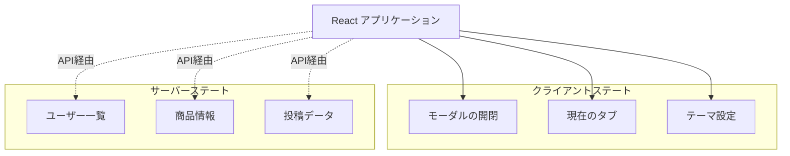
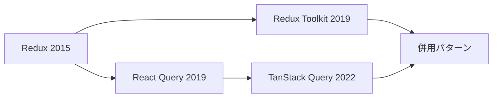
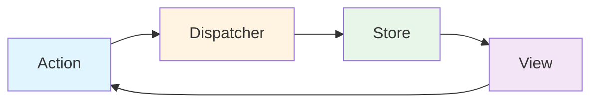
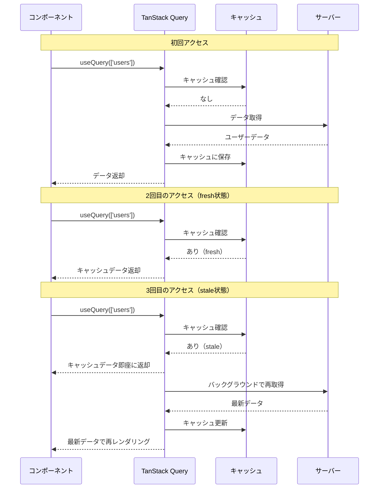

# Zenn問答とは

「Zenn問答」とは、開発していて「なんとなく使ってるけど、ちゃんと理解してるかな？」という技術について、改めて時間をとって深掘りしてみようという企画です🧘🧘🧘

# はじめに

React開発をしていると、「TanStack Query」という名前を耳にすることがあります。以前は「React Query」という名前でした。

「サーバーステート管理に便利」「Reduxより簡単」などと言われていますが、実際にReduxとどう違ってどういうメリットがあるのでしょうか。きちんと理解していないので今回は、TanStack Queryについて調べてみます。

読み返してみたら、今回の内容はあんまり深掘りとは言えないので入門とつけています。

公式ページはこちら

https://tanstack.com/query/latest

# 状態管理の基礎知識

TanStack Queryを理解する前に、まず「状態」の種類について整理してみます。React アプリケーションで扱う「状態」は、大きくクライアントとサーバーのステートの2つに分類できます。



## クライアントステート（Client State）

アプリケーション内に完全に存在する状態です。

```javascript
// クライアントステートの例
const [isModalOpen, setIsModalOpen] = useState(false);  // モーダルの開閉状態
const [currentTab, setCurrentTab] = useState('profile'); // 現在のタブ
const [theme, setTheme] = useState('dark');              // テーマ設定
const [formInput, setFormInput] = useState('');          // フォーム入力値
```

**特徴**
- アプリケーション内で完結している
- 同期的にアクセス可能
- 予測可能な更新パターン
- 他のユーザーの影響を受けない

ちなみに、useStateについては昔同じくZenn問答で調べたのでリンクをのせます。

https://zenn.dev/okaponta/articles/3744881e4cbe07

## サーバーステート（Server State）

サーバーに存在し、クライアントが参照しているだけの状態です。

```javascript
// サーバーステートの例（従来の方法）
const [users, setUsers] = useState([]);
const [loading, setLoading] = useState(false);
const [error, setError] = useState(null);

useEffect(() => {
  setLoading(true);
  fetch('/api/users')
    .then(res => res.json())
    .then(data => {
      setUsers(data);
      setLoading(false);
    })
    .catch(err => {
      setError(err);
      setLoading(false);
    });
}, []);
```

**特徴**
- サーバーに存在する
- 非同期APIでアクセスが必要
- 他のユーザーによって変更される可能性がある
- キャッシュや再取得の管理が必要

# 状態管理ツールの歴史



## Reduxの登場

2015年、Reduxが登場しました。Facebook が提唱した Flux アーキテクチャに基づいた予測可能な状態管理を提供し、React コミュニティで広く採用されました。

### Flux アーキテクチャとは

Flux は、Facebook が開発した**単方向データフロー**のアーキテクチャパターンです。

従来のMVC（Model-View-Controller）パターンでは、複数のモデルと複数のビューが双方向に影響し合い、データフローが複雑になりがちでした。特に大規模なアプリケーションでは、「どこで状態が変更されたのか」を追跡することが困難でした。

Flux はこの問題を解決するため、**一方向のデータフロー**を強制します。



**Fluxの4つの要素**

1. **Action** - 何が起きたかを表すオブジェクト
2. **Dispatcher** - ActionをすべてのStoreに配信する中央ハブ
3. **Store** - アプリケーションの状態とロジックを保持
4. **View** - UIを表示し、ユーザーの操作をActionとして発行

**Reduxは Flux の改良版**

Redux は Flux の概念を簡素化し、以下のように進化させました。

- **単一のStore** - Fluxは複数のStoreを持つが、Reduxは1つだけ
- **Dispatcherの削除** - Storeが直接Actionを受け取る
- **純粋関数のReducer** - 状態の変更方法を予測可能にする

この設計により、「状態がどのように変化したか」を時系列で追跡できる**Time Travel Debugging**などの強力な機能が実現できるようになりました。

```javascript
// Redux でのサーバーステート管理（従来の方法）
// 1. Action Types
const FETCH_USERS_REQUEST = 'FETCH_USERS_REQUEST';
const FETCH_USERS_SUCCESS = 'FETCH_USERS_SUCCESS';
const FETCH_USERS_FAILURE = 'FETCH_USERS_FAILURE';

// 2. Action Creators
const fetchUsersRequest = () => ({ type: FETCH_USERS_REQUEST });
const fetchUsersSuccess = (users) => ({ type: FETCH_USERS_SUCCESS, payload: users });
const fetchUsersFailure = (error) => ({ type: FETCH_USERS_FAILURE, payload: error });

// 3. Thunk
const fetchUsers = () => async (dispatch) => {
  dispatch(fetchUsersRequest());
  try {
    const response = await fetch('/api/users');
    const data = await response.json();
    dispatch(fetchUsersSuccess(data));
  } catch (error) {
    dispatch(fetchUsersFailure(error));
  }
};

// 4. Reducer
const usersReducer = (state = initialState, action) => {
  switch (action.type) {
    case FETCH_USERS_REQUEST:
      return { ...state, loading: true, error: null };
    case FETCH_USERS_SUCCESS:
      return { ...state, loading: false, users: action.payload };
    case FETCH_USERS_FAILURE:
      return { ...state, loading: false, error: action.payload };
    default:
      return state;
  }
};

// 5. Component
function UserList() {
  const dispatch = useDispatch();
  const { users, loading, error } = useSelector(state => state.users);

  useEffect(() => {
    dispatch(fetchUsers());
  }, [dispatch]);

  // ...
}
```

ただし、このようにReduxでサーバーステートを管理しようとすると、このように大量のコードが必要になります。さらに、キャッシュ管理やバックグラウンド更新などの機能は含まれておらず、すべて手動で実装する必要がありました。

たしかになんか見覚えあります。当時の自分はそもそもうまく動かすので精一杯だった気がします笑

## Redux Toolkit の改善

2019年、Redux Toolkitが登場し、Reduxのボイラープレートを大幅に削減しました。

### Redux Toolkitのアプローチ

Redux Toolkitは、従来のReduxの課題を以下のアプローチで解決しました。

1. **createAsyncThunk** - 非同期処理を簡潔に記述
2. **createSlice** - Action TypesとAction Creatorsを自動生成
3. **Immerの統合** - イミュータブルな更新を直感的に記述

```javascript
// Redux Toolkit での改善版
import { createSlice, createAsyncThunk } from '@reduxjs/toolkit';

// 1. createAsyncThunk で非同期処理を定義
//    pending/fulfilled/rejected のアクションが自動生成される
export const fetchUsers = createAsyncThunk(
  'users/fetchUsers',
  async () => {
    const response = await fetch('/api/users');
    return response.json();
  }
);

// 2. createSlice でreducerとactionを一箇所で定義
const usersSlice = createSlice({
  name: 'users',
  initialState: { users: [], loading: false, error: null },
  // 3. extraReducers で非同期アクションに対応
  extraReducers: (builder) => {
    builder
      .addCase(fetchUsers.pending, (state) => {
        state.loading = true;  // Immerのおかげで直接書き換えられる
      })
      .addCase(fetchUsers.fulfilled, (state, action) => {
        state.loading = false;
        state.users = action.payload;
      })
      .addCase(fetchUsers.rejected, (state, action) => {
        state.loading = false;
        state.error = action.error.message;
      });
  },
});
```

### 何が楽になったのか

従来のReduxと比較すると、以下のように改善されました。

| 項目 | 従来のRedux | Redux Toolkit |
|------|------------|---------------|
| Action Types | 手動で定数定義が必要 | 自動生成 |
| Action Creators | 手動で関数定義が必要 | 自動生成 |
| 非同期処理 | redux-thunkを別途設定 | createAsyncThunkで完結 |
| Reducer | switch文で分岐 | builderパターンで型安全 |
| イミュータブル更新 | スプレッド構文で手動 | Immerで直接書き換え可能 |
| コード量 | 100行以上 | 30〜40行程度 |

特に、`FETCH_USERS_REQUEST`、`FETCH_USERS_SUCCESS`、`FETCH_USERS_FAILURE`といった定数を手動で定義する必要がなくなり、`createAsyncThunk`が自動的に`pending`、`fulfilled`、`rejected`のアクションを生成してくれるようになったのは大きな改善です。

また、Immerの統合により、`return { ...state, loading: true }`のようなスプレッド構文ではなく、`state.loading = true`と直接書き換えられるようになったことで、コードがより直感的になりました。

### それでも残る課題

Redux Toolkitでボイラープレートは減りましたが、依然としてサーバーステート特有の機能は手動実装が必要でした。

- キャッシュ管理
- データの自動再取得
- バックグラウンド更新
- 重複リクエストの防止
- 楽観的更新

これらの機能を実装しようとすると、結局また複雑なコードが必要になってしまいます。

## React Query (TanStack Query) の誕生

2019年、Tanner Linsley氏によってReact Queryが開発されました。これは**サーバーステート管理に特化**した全く新しいアプローチでした。

2022年、React以外のフレームワーク（Vue、Solid、Svelteなど）にも対応するため、「TanStack Query」にリブランディングされました。「TanStack」という名前は、作者のTanner Linsley氏の名前（Tan）と、彼が開発する一連のライブラリ群（Stack）を組み合わせたものです。

# TanStack Query とは

TanStack Queryは、サーバーステート管理に特化したライブラリです。「データ取得ライブラリ」とも呼ばれますが、その本質は**サーバーステートのライフサイクル管理**にあります。

## 基本的な使い方

同じユーザー一覧取得を、TanStack Queryで実装すると以下のようになります。

```javascript
import { useQuery } from '@tanstack/react-query';

function UserList() {
  const { data, isLoading, error, refetch } = useQuery({
    queryKey: ['users'],
    queryFn: async () => {
      const response = await fetch('/api/users');
      return response.json();
    },
  });

  if (isLoading) return <div>読み込み中...</div>;
  if (error) return <div>エラー: {error.message}</div>;

  return (
    <div>
      {data.map(user => (
        <div key={user.id}>{user.name}</div>
      ))}
      <button onClick={() => refetch()}>再読み込み</button>
    </div>
  );
}
```

**わずか5行で実現できること**
- 自動キャッシュ
- ローディング状態管理
- エラーハンドリング
- 再取得機能
- バックグラウンド更新

## Redux との比較

| 観点 | Redux | TanStack Query |
|------|-------|----------------|
| 主な用途 | クライアントステート管理 | サーバーステート管理 |
| ボイラープレート | 多い（100行以上） | 少ない（5行程度） |
| キャッシュ機能 | 手動実装が必要 | 自動 |
| バックグラウンド更新 | 手動実装が必要 | 自動 |
| 適用範囲 | グローバルな状態全般 | API データ取得 |

## データ更新（Mutation）

データの作成・更新・削除にはuseMutationを使用します。

```javascript
import { useMutation, useQueryClient } from '@tanstack/react-query';

function CreateUser() {
  const queryClient = useQueryClient();

  const mutation = useMutation({
    mutationFn: async (newUser) => {
      const response = await fetch('/api/users', {
        method: 'POST',
        headers: { 'Content-Type': 'application/json' },
        body: JSON.stringify(newUser),
      });
      return response.json();
    },
    onSuccess: () => {
      // ユーザー一覧のキャッシュを無効化して再取得
      queryClient.invalidateQueries({ queryKey: ['users'] });
    },
  });

  const handleSubmit = (e) => {
    e.preventDefault();
    mutation.mutate({ name: 'New User' });
  };

  return (
    <form onSubmit={handleSubmit}>
      <button type="submit" disabled={mutation.isPending}>
        {mutation.isPending ? '作成中...' : 'ユーザー作成'}
      </button>
      {mutation.isError && <div>エラー: {mutation.error.message}</div>}
      {mutation.isSuccess && <div>作成成功!</div>}
    </form>
  );
}
```

# TanStack Query の仕組み

TanStack Queryは、**Stale-While-Revalidate (SWR)** というキャッシュ戦略をもとに設計されているみたいです。

## Stale-While-Revalidate パターン



# useQueryの主要パラメータ一覧

TanStack Queryを効果的に使うために、useQueryの主要なパラメータを理解しておきます。

## 必須パラメータ

### queryKey

キャッシュを識別するための一意なキーです。

```javascript
// 文字列の配列
queryKey: ['users']

// IDを含む
queryKey: ['user', userId]

// オブジェクトを含む（自動的にシリアライズされる）
queryKey: ['users', { status: 'active', page: 1 }]
```

**重要な特性**
- queryKeyが変わると、新しいクエリとして扱われ自動的に再取得される
- 配列の要素が1つでも異なれば、別のクエリとして認識される
- オブジェクトは深い比較が行われる

### queryFn

データを取得する非同期関数です。

```javascript
// シンプルな例
queryFn: () => fetch('/api/users').then(res => res.json())

// 引数を使う例
queryFn: async ({ queryKey }) => {
  const [_key, userId] = queryKey;
  const response = await fetch(`/api/users/${userId}`);
  return response.json();
}
```

## キャッシュ制御パラメータ

### staleTime (デフォルト: 0)

データが「新鮮」とみなされる時間（ミリ秒）

```javascript
staleTime: 5 * 60 * 1000  // 5分間は再取得しない
staleTime: Infinity       // 永遠に新鮮（手動更新まで再取得しない）
```

### gcTime (デフォルト: 5分)

使われなくなったキャッシュを保持する時間（ミリ秒）

```javascript
gcTime: 10 * 60 * 1000  // 10分間キャッシュを保持
gcTime: Infinity        // 永遠にキャッシュを保持
```

## 自動再取得パラメータ

### refetchOnWindowFocus (デフォルト: true)

ウィンドウがフォーカスされた時に再取得するかどうか

```javascript
refetchOnWindowFocus: true   // タブに戻った時に最新データを取得
refetchOnWindowFocus: false  // フォーカス時は再取得しない
```

### refetchOnMount (デフォルト: true)

コンポーネントがマウントされた時に再取得するかどうか

```javascript
refetchOnMount: true      // マウント時に常に再取得
refetchOnMount: false     // マウント時は再取得しない
refetchOnMount: 'always'  // staleかどうかに関わらず常に再取得
```

### refetchOnReconnect (デフォルト: true)

ネットワークが再接続された時に再取得するかどうか

```javascript
refetchOnReconnect: true  // 再接続時に最新データを取得
```

### refetchInterval

定期的にデータを再取得する間隔（ミリ秒）

```javascript
refetchInterval: 10000  // 10秒ごとに再取得（ポーリング）
refetchInterval: false  // ポーリングしない（デフォルト）
```

## 条件付き実行パラメータ

### enabled

クエリを実行するかどうかの条件

```javascript
// ユーザーIDが存在する場合のみ実行
enabled: !!userId

// 複数の条件
enabled: isLoggedIn && hasPermission
```

**使用例**

```javascript
function UserProfile({ userId }) {
  const { data } = useQuery({
    queryKey: ['user', userId],
    queryFn: () => fetchUser(userId),
    enabled: !!userId,  // userIdがある時だけ実行
  });
}
```

## リトライパラメータ

### retry (デフォルト: 3)

失敗時のリトライ回数

```javascript
retry: 3           // 3回までリトライ
retry: false       // リトライしない
retry: (failureCount, error) => {
  // カスタムロジック
  return failureCount < 5 && error.status !== 404;
}
```

### retryDelay

リトライまでの待機時間を計算する関数

```javascript
retryDelay: attemptIndex => Math.min(1000 * 2 ** attemptIndex, 30000)
// 1秒 → 2秒 → 4秒 → 8秒 → ... 最大30秒
```

## その他の便利なパラメータ

### placeholderData

データが取得されるまでの間に表示する仮データ

```javascript
placeholderData: {
  users: [],
  total: 0,
}
```

### keepPreviousData

新しいデータを取得中も前のデータを保持する（ページネーションに便利）

```javascript
keepPreviousData: true
```

### select

取得したデータを変換する

```javascript
select: (data) => data.users.map(user => user.name)
```

## パラメータの組み合わせ例

### リアルタイムダッシュボード

```javascript
useQuery({
  queryKey: ['dashboard'],
  queryFn: fetchDashboard,
  staleTime: 0,                    // 常にstale扱い
  refetchInterval: 5000,           // 5秒ごとに更新
  refetchOnWindowFocus: true,      // フォーカス時も更新
  refetchOnReconnect: true,        // 再接続時も更新
});
```

### ほとんど変わらないマスターデータ

```javascript
useQuery({
  queryKey: ['countries'],
  queryFn: fetchCountries,
  staleTime: Infinity,             // 永遠に新鮮
  gcTime: Infinity,                // 永遠にキャッシュ
  refetchOnWindowFocus: false,     // フォーカスでは更新しない
  refetchOnMount: false,           // マウントでは更新しない
});
```

### 条件付きで実行するクエリ

```javascript
useQuery({
  queryKey: ['userPosts', userId],
  queryFn: () => fetchUserPosts(userId),
  enabled: !!userId,               // userIdがある時だけ実行
  retry: 2,                        // 2回までリトライ
  staleTime: 60 * 1000,           // 1分間は新鮮
});
```

# まとめ

今回はTanStack Queryについて調べてみました。調べたとはいえまだ実践で使えていないので、また解像度が上がってからきちんとしたZenn問答ができるかなと思っています。今回は本当にさわりだけ・・・

TanStackはサーバーステートに的を絞ることで記法が一気に簡潔にできたのかなという印象を受けました。よく広まるライブラリはやはりシンプルなインターフェースが大事なんだなと改めて思いました。

最後まで読んでいただき、ありがとうございました🙏
