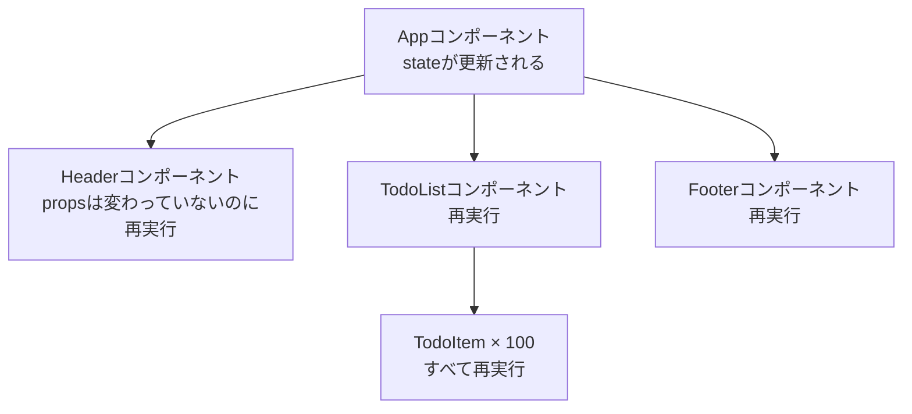
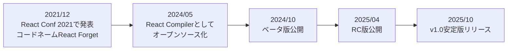

# Zenn問答とは

「Zenn問答」とは、開発していて「なんとなく使ってるけど、ちゃんと理解してるかな？」という技術について、改めて時間をとって深掘りしてみようという企画です🧘🧘🧘

# はじめに

最近Reactまわりの記事を眺めていると、「React Compilerを入れたら `useMemo` と `useCallback` を全部消せた」という話をよく見かけます。自分は「なんか便利なやつがあるらしい」くらいの認識で、React Compilerというライブラリがあって、入れるとなんか便利らしい、という程度の理解で止まっていました。

そもそもコンパイラーって何をコンパイルしているんだ・・・？
React Compilerは2025年10月にv1.0が公開され、すでに「様子見」の段階を過ぎつつあります。今回はいい機会なので、誕生した背景の課題感から、内部で実際に何をしているのか、そして導入方法まで改めて深掘りしてみます。

# そもそもなぜReactにメモ化が必要だったのか

React Compilerが何を解決するツールなのかを理解するには、まずReactの再レンダリングの仕組みから簡単に理解する必要があります。

## Reactの再レンダリングは子に伝播する

Reactの基本的なモデルはとてもシンプルで、「stateが変わったら、そのコンポーネントの関数をもう一度実行して、返ってきたJSXを前回と比べて差分だけDOMに反映する」というものです。

問題は、コンポーネント関数を再実行すると、その中で呼んでいる子コンポーネントも軒並み再実行されるという点です。



Headerのpropsが1つも変わっていなくても、親が再レンダリングされれば道連れで再実行されます。多くの場合これは十分に高速なので問題になりませんが、リストが数百件あったり、1つのコンポーネントが重い計算をしていたりすると、目に見えて遅くなります。

## 手動メモ化

この問題に対して以下3つの仕組みで対応していました。

| 仕組み | 何をキャッシュするか |
|---|---|
| `useMemo` | 計算結果の値 |
| `useCallback` | 関数（の同一性） |
| `React.memo` | コンポーネントのレンダリング結果 |

これらはいずれも「前回と入力が同じなら、前回の結果を使い回す」という仕組みです。`React.memo` でラップされたコンポーネントは、propsが前回と同じ参照であれば再レンダリングをスキップしてくれます。

ここで厄介なのがオブジェクトや関数です。レンダリングのたびに新しく作られるオブジェクトや関数は、中身が同じでもメモリ上の番地が違うので別物と判定されてしまいます。そのため `React.memo` を効かせるには、渡す側で `useMemo` や `useCallback` を使って参照を固定してあげる必要があります。

## 手動メモ化のつらいところ

理屈は分かりましたが、これを正しくやり続けるのはかなり大変みたいです。

### 依存配列を書き間違える

`useMemo(() => f(a, b), [a])` のように依存配列に入れ忘れると、bが変わっても古い値を返し続けるバグになります。ESLintのルールがある程度は助けてくれますが、完全ではありません。
まあ、こんくらい気づけよという気持ちにはなりますが・・・

### 1箇所崩れると連鎖的に無駄になる

公式ドキュメントでも紹介されている、ありがちな例です。

```jsx
const ExpensiveComponent = memo(function ExpensiveComponent({ data, onClick }) {
  const processedData = useMemo(() => expensiveProcessing(data), [data]);
  const handleClick = useCallback((item) => onClick(item.id), [onClick]);

  return (
    <div>
      {processedData.map((item) => (
        // ここでアロー関数を作っているので、useCallbackの効果が台無しになる
        <Item key={item.id} onClick={() => handleClick(item)} />
      ))}
    </div>
  );
});
```

JSXの中で `() => handleClick(item)` という新しい関数を毎回作っているため、`Item` が `React.memo` でラップされていてもメモ化は効きません。`Item` に `item` ごと渡して、ハンドラーを `Item` の内部で組み立てるようにすれば正しくメモ化されます。

### そもそも書く場所が制限されている

フックのルール上、`useMemo` は条件分岐や早期リターンより後には書けません。

```jsx
function Component({ items }) {
  if (items == null) {
    return null;
  }
  // ここで useMemo を呼ぶとフックのルール違反になる
  const filtered = items.filter((item) => item.active);
  return <List items={filtered} />;
}
```

「メモ化したいけどフックのルール的に書けない」というケースが構造的に存在するわけです。

つまり手動メモ化は、正しく書くのが難しく、書けても壊れやすく、書けない場所もある、という問題を抱えていました。それを解消するために誕生したのが、React Compilerです。

# React Compilerとは

React Compilerは、Reactコンポーネントとフックをビルド時に解析して、自動でメモ化を挿入するコンパイラーです。ソースコードの書き方は変えず、ビルドの過程だけを差し替えることで、手動メモ化と同等かそれ以上の最適化を得られるようにするツールになります。

## 書き方はどう変わるのか

先ほどのコンポーネントがどうなるかを見てみます。

```jsx
function ExpensiveComponent({ data, onClick }) {
  const processedData = expensiveProcessing(data);
  const handleClick = (item) => onClick(item.id);

  return (
    <div>
      {processedData.map((item) => (
        <Item key={item.id} onClick={() => handleClick(item)} />
      ))}
    </div>
  );
}
```

`memo` も `useMemo` も `useCallback` も消えて、ただのJavaScriptの関数に戻りました。しかもコンパイル後は、先ほど「アロー関数のせいでメモ化が壊れている」と指摘した箇所まで含めて、コンパイラーが適切にメモ化してくれます。

結構衝撃なのですが、まあ時代の流れなんでしょうね・・・こういう系は自分で制御しなければいけないでしょ派閥だったのですがそうも言っていられないのかもしれませんね。

とはいえ調べてみると、`useMemo` や `useCallback` が使えなくなるわけではありませんでした。公式も「精密な制御が必要なときのエスケープハッチとして使い続けてよい」としていて、コンパイルされると困るコンポーネントは `"use no memo"` を先頭に書けば個別に除外できます。

## React Forgetからv1.0までの道のり

このプロジェクトは案外長い時間をかけて作られています。



2021年のReact Confで、Metaのエンジニアが「React without memo」というタイトルで発表したのが最初のお披露目でした。当時のコードネームは **React Forget** で、「メモ化のことを忘れていい」という意味が込められています。そこから約4年かけて、2025年10月7日にv1.0が安定版としてリリースされました。

MetaのQuest Storeでの実測では、初回ロードとページ間遷移が最大12%改善し、特定のインタラクションは2.5倍高速になったうえ、メモリ使用量は中立だったと報告されています。

## 何をするツールで、何をしないツールなのか

公式のデザインゴールを読むと、React Compilerがかなり明確に「やらないこと」を定めているのが分かります。

**やること**

- 親の再レンダリングが子に連鎖するのを止める
- レンダリング中の重い計算をキャッシュする
- `useMemo` / `useCallback` / `React.memo` を人間が書かなくてよい状態にする

**やらないこと**

- 「無駄な再計算ゼロ」の完璧な最適化を目指すこと（追跡コストのほうが高くつくため）
- Reactのルールに違反したコードを動かすこと
- クラスコンポーネントのサポート
- コンポーネントやフックの外にある、ただのJavaScript関数のメモ化
- コンポーネントをまたいだキャッシュの共有

特に大事なのが1つ目です。理論上の最適解ではなく「メモ化の管理コストを払わずに、実用上十分に速い状態」を狙っている、という割り切りがあります。

2つ目も地味に重要で、React Compilerは「レンダリングは純粋である」「フックはルールに従って呼ばれる」というReactのルールを守っているコードを前提に最適化します。レンダリング中にpropsを書き換えていたり副作用を起こしていたりすると、コンパイラーは安全性を確信できずに、その関数の最適化を諦めます。
裏を返すと、ルール違反が多いコードベースほど恩恵が小さいということでもあります。普段からルールにのっとってきれいに書いておいた方がいいということですね、あたりまえですが笑

# React Compilerは内部で何をしているのか

「自動でメモ化してくれる」と言われても、実際にどんなコードに変換されているのかを見ないとイメージが湧きません。実際の出力を見てみましょう。

## コンパイル前後のコード

こんな素朴なコンポーネントがあったとします。

```jsx
function Greeting({ name }) {
  return <div>こんにちは、{name}さん</div>;
}
```

これがコンパイルされると、だいたい以下のようなコードになります。

```jsx
import { c as _c } from "react/compiler-runtime";

function Greeting(t0) {
  const $ = _c(2);          // サイズ2のキャッシュ配列を確保
  const { name } = t0;
  let t1;
  if ($[0] !== name) {      // 前回のnameと違うときだけ
    t1 = <div>こんにちは、{name}さん</div>;
    $[0] = name;            // 入力を記録
    $[1] = t1;              // 出力を記録
  } else {
    t1 = $[1];              // 同じなら前回のJSXをそのまま返す
  }
  return t1;
}
```

やっていることは、我々が手で書いていた `useMemo` とまったく同じです。入力が変わったかを比較して、変わっていなければ前回の結果を使い回しています。違うのは、それを人間ではなくコンパイラーが漏れなく機械的に埋め込んでいる点です。

`_c(2)` はコンポーネントごとに確保されるキャッシュ配列で、Reactの内部では `useMemoCache` というフックとして実装されています。React 19では `react/compiler-runtime` として本体に組み込まれているので、追加のランタイムは不要です。

ここで重要なのは、返ってくるJSXオブジェクトの参照が前回と同じになるという点です。Reactは子要素のJSXが前回とまったく同じ参照であれば、その部分の再レンダリングをスキップします。つまり `React.memo` で子をラップしなくても、親が同じ参照を渡す限り子は再レンダリングされません。これがReact Compilerが「`React.memo` も不要にする」と言われる理由です。

## リアクティブスコープという単位

ちなみに、この `if ($[0] !== name)` をどこに置くかの判断が、React Compilerの一番の肝です。`useMemo` のように「1つの値ごとにキャッシュする」のではなく、「一緒に生成され、一緒に変化する値のかたまり」を **リアクティブスコープ** として検出し、まとめてキャッシュしています。
さらに、常に同時に無効化されると分かっているスコープ同士は結合して、キャッシュのチェック回数自体を減らします。

依存配列を人間が書かなくてよくなるのは、コンパイラーがこの解析で依存関係を正確に把握しているからです。手で `useMemo` を書いていたときの「どこまでを1つのメモ化にまとめるか」という判断を、機械的にやってくれていると思うと分かりやすいかもしれません。

## 手動メモ化より賢くなれるところ

コンパイラーだからこそできることもあります。

### 条件分岐の後でもメモ化できる

先ほど「フックのルール上、早期リターンの後には `useMemo` を書けない」という話をしましたが、コンパイラーはフックを呼んでいるわけではないので、この制約を受けません。条件分岐の後ろにあるコードでもメモ化できます。

### メモ化の粒度が細かい

人間は面倒なので「コンポーネント全体を `React.memo` で包む」といった粗い単位でやりがちですが、コンパイラーはJSXの一部だけ、計算の一部だけといった細かい単位で切り出せます。

### オプショナルチェーンや配列インデックスも依存にできる

`a?.b?.c` や `items[0]` のような式も、v1.0では正しく依存として扱えるようになっています。すごいな。

# 導入方法と主なコマンド

ここからは実際の使い方を見ていきます。

## インストール

本体はBabelプラグインとして配布されています。

```bash
npm install -D --save-exact babel-plugin-react-compiler@latest
```

`--save-exact` でバージョンを固定しているのは公式の推奨です。コンパイラーのバージョンが上がるとメモ化の精度が変わり、`useEffect` の発火タイミングなどに影響しうるため、テストが十分でないうちは意図せず挙動が変わらないように固定しておくのがよい、という理由になります。

あとはBabelの設定に1行足すだけで有効になります。

```js
// babel.config.js
module.exports = {
  plugins: [
    'babel-plugin-react-compiler', // 必ず最初に実行されるようにする
    // ...他のプラグイン
  ],
};
```

プラグインの並び順が重要で、他のプラグインが変換した後のコードではなく、元のソースに近い状態を解析させる必要があるため先頭に置きます。

## 導入前の健康診断

いきなり有効化する前に、自分のプロジェクトがどれくらいコンパイルできる状態なのかを調べるコマンドが用意されています。

```bash
npx react-compiler-healthcheck@latest
```

実行すると、コンパイル可能なコンポーネントの割合、StrictModeを使っているかどうか、非互換の可能性があるライブラリを使っていないか、といった診断結果が出ます。「9個中8個がコンパイルできました」のような形で表示されるので、導入判断の材料になります。

## 段階的に導入する

巨大なアプリにいきなり全体適用するのは怖いので、公式は段階的な導入方法も案内しています。Babelの `overrides` を使えば、特定のディレクトリだけを対象にできます。

```js
// babel.config.js
module.exports = {
  overrides: [
    {
      test: './src/modern/**/*.{js,jsx,ts,tsx}',
      plugins: ['babel-plugin-react-compiler'],
    },
  ],
};
```

新しく書いた比較的きれいなコードから始めて、様子を見ながら範囲を広げていくのが定石です。

## 効いているかの確認

React DevToolsでコンポーネントを選ぶと、最適化されているものには **Memo ✨** のバッジが表示されます。ビルド後のコードに `react/compiler-runtime` のimportが入っているかを見るのも確実な確認方法です。

より細かく試したいときは、公式のプレイグラウンドにコードを貼れば、変換後のコードをその場で確認できます。

https://playground.react.dev

自分の書いたコンポーネントがどうメモ化されるのか、あるいはどこで最適化を諦められているのかが分かるので、感覚をつかむのに便利です。

## 既存の手動メモ化をすぐ消す必要はない

「全部消せる」という話をよく聞きますが、公式の推奨はもう少し慎重です。

- 新しく書くコードは、コンパイラーに任せて手動メモ化を書かない
- 既存の手動メモ化は、そのまま残すか、十分にテストしてから消す

理由は、`useMemo` の結果が `useEffect` の依存配列に入っているようなケースで、メモ化の粒度が変わるとエフェクトの発火タイミングが変わりうるからです。メモ化は本来「あってもなくても結果が同じ」であるべきですが、実際のコードではメモ化に依存した挙動になっていることがあります。

## バージョン更新には注意する

コンパイラーのバージョンが上がるとメモ化の結果が変わることがあります。公式もセマンティックバージョニングの範囲指定ではなく完全固定を推奨しており、更新するときはE2Eテストを回して確認するのが望ましいとされています。

# まとめ

React Compilerについて改めて深掘りしてみました。

なんかuseMemoとかが撲滅できるものくらいの理解で、その管理くらい開発者がやるべきだと思ってはいたのですが、内部動作も結構しっかりしていそうなのでもう性能面などを開発者がどんどん意識しなくてもよくなっている時代なのかなと思い直しました。

最後まで読んでいただき、ありがとうございました🙏
