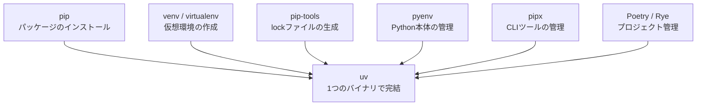
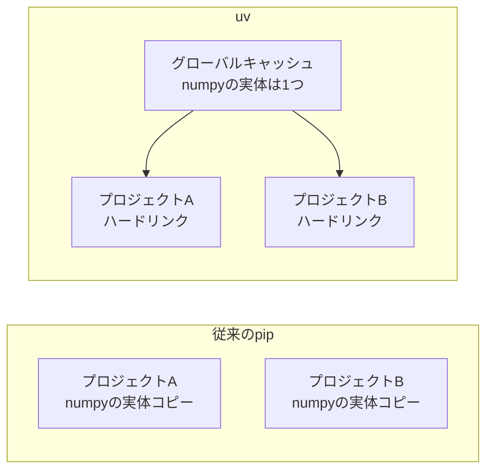

# Zenn問答とは

「Zenn問答」とは、開発していて「なんとなく使ってるけど、ちゃんと理解してるかな？」という技術について、改めて時間をとって深掘りしてみようという企画です🧘🧘🧘

# はじめに

最近、Pythonまわりのリポジトリやセットアップ手順で「uv」という名前をよく見かけるようになりました。「Pythonで使うやつで、pipの上位互換らしい」くらいの知識はあるのですが、正直その程度の理解です。

今回はuvについて改めて深掘りし、そもそもPythonのパッケージ管理にどんな課題があったのか、競合ツールと比べて何が優れているのか、そして実際にどう使うのかを調べていきます。

# そもそもPythonのパッケージ管理はなぜ大変なのか

uvの話に入る前に、まず「Pythonのパッケージ管理はなぜこんなにツールが多いのか」から整理してみます。

## pipとvenvの基本

Pythonに標準で付いてくるパッケージマネージャーがpipです。`pip install requests` のように実行すると、PyPI（Python Package Index）からパッケージを取得してインストールしてくれます。

ただし、pipは何も考えずに使うとシステム全体のPython環境にパッケージをインストールしてしまいます。プロジェクトAとプロジェクトBで必要なライブラリのバージョンが違うと衝突してしまうため、プロジェクトごとに独立した環境を作る仕組みとして仮想環境（venv）を併用するのが基本スタイルです。

```bash
python -m venv .venv          # 仮想環境を作成
source .venv/bin/activate     # 仮想環境を有効化
pip install requests          # この環境だけにインストール
```

この「venvを作って、activateして、pipを叩く」という一連の作法は、Pythonを書いたことがある方なら一度は通った道だと思います。最近だとvenvを強制させられるような気もしますね。

## pipが抱えていた課題

長年の実績があるpipですが、いくつかの課題を抱えていました。

### 依存関係の解決が遅い、そして昔は正しくなかった

実はpipは、2020年のバージョン20.3まで本格的な依存関係解決を行っていませんでした。パッケージを順番にインストールしていくだけで、あるパッケージの要求と別のパッケージの要求が矛盾していても、気づかずに壊れた組み合わせをインストールしてしまうことがあったのです。20.3で正しく解決するリゾルバーが導入されましたが、今度は候補となるバージョンを1つずつ試していくバックトラッキング方式のため、複雑な依存関係では解決に数分かかることもあります。

### lockファイルの標準がない

pipで依存関係を記録する定番は `requirements.txt` ですが、これは単なる「インストールしたいものリスト」であり、他の言語でいうlockファイル（`package-lock.json` や `Cargo.lock`）とは別物です。`pip freeze` で現在の環境を書き出すこともできますが、直接依存と間接依存の区別がつかず、なぜそのパッケージが入っているのか分からなくなりがちです。この課題を補うためにpip-toolsのような追加ツールが使われてきました。

### Pythonそのもののバージョン管理は守備範囲外

pipが管理するのはパッケージだけで、Python本体のバージョン管理は別の話です。プロジェクトごとにPython 3.11と3.13を使い分けたければ、pyenvなどの別ツールが必要でした。

## ツールが乱立していた

これらの課題を補うために、それぞれの領域で専用ツールが生まれてきました。

| やりたいこと | 使われてきたツール |
|---|---|
| パッケージのインストール | pip |
| 仮想環境の作成 | venv / virtualenv |
| lockファイルの生成 | pip-tools（pip-compile） |
| Python本体のバージョン管理 | pyenv |
| CLIツールのグローバルインストール | pipx |
| 上記をまとめて面倒みる統合ツール | Pipenv / Poetry / Rye |

1つの言語の開発環境を整えるのにこれだけのツールの名前が出てくる状況でした。PipenvやPoetryのような統合ツールも登場しましたが、それでもPython本体の管理は範囲外だったりと、「これ1つで全部OK」と言い切れるツールはなかなか現れませんでした。

この状況に対して「1つのツールで完結する体験をPythonにも」という思想で登場したのがuvです。

# uvとは

uvは、Astral社がRustで開発しているPythonのパッケージ・プロジェクトマネージャーです。2024年2月に登場しました。Astralは、Pythonの高速リンター/フォーマッターである **Ruff** の開発元と言えばピンとくる方も多いかもしれません。創業者のCharlie Marsh氏は、uvを「PythonのためのCargo」を目指すものだと説明しています。

uvの特徴は、これまで複数のツールに分散していた役割を1つのバイナリでカバーしている点です。



- **パッケージ管理** - 依存関係の追加・削除・lockファイルの生成を高速に行う
- **仮想環境管理** - venvの作成はもちろん、意識しなくても自動で作成・利用される
- **Python本体の管理** - `uv python install 3.13` のようにPython自体をインストールできる
- **CLIツールの管理** - pipxのように、ツールを独立した環境にインストールして実行できる

ちなみに、先行して同じ思想を掲げていたツールに **Rye** があります。RyeはFlaskの作者Armin Ronacher氏が開発したツールですが、その後Astralに移管され、現在はメンテナンスモードとなってuvへの移行が推奨されています。統合ツールの思想はRyeからuvへ受け継がれた、という流れです。

# なぜそんなに速いのか

uvといえばとにかく「速い」ことで有名で、公式ベンチマークではpipの10〜100倍高速とうたわれています。ただ「Rust製だから速い」だけでは説明として物足りないので、もう少し分解してみます。

## 依存関係解決のアルゴリズムと並列処理

uvは依存関係の解決に **PubGrub** というアルゴリズムを採用しています。もともとDart言語のパッケージマネージャーのために開発されたアルゴリズムで、矛盾が見つかったときに「どの組み合わせがダメだったか」を学習しながら探索するため、pipのバックトラッキングよりも効率的に解を見つけられます。解決できなかった場合のエラーメッセージが分かりやすいのもこのアルゴリズムの利点です。

また、パッケージのメタデータ取得やダウンロードは徹底的に並列化されています。

## メタデータだけを先に取得する

依存関係の解決に必要なのは「このパッケージは何に依存しているか」というメタデータだけで、パッケージ本体はまだ必要ありません。uvはHTTPのRangeリクエストを使って、wheelファイル（Pythonのパッケージ形式で、実体はzipファイルです）の中からメタデータ部分だけを部分ダウンロードします。数十MBあるパッケージでも、解決の段階では数KBの取得で済むわけです。

## グローバルキャッシュとハードリンク

従来のpipでは、同じパッケージでもプロジェクト（venv）ごとに実体がコピーされ、ディスクを圧迫していました。uvは一度ダウンロード・展開したパッケージをマシン全体のグローバルキャッシュに保持し、各プロジェクトの仮想環境へはハードリンク（対応ファイルシステムではreflink）で配置します。



2回目以降のインストールではダウンロードも展開も不要で、リンクを張るだけです。「別のプロジェクトで一度使ったパッケージなら、仮想環境の構築が一瞬で終わる」という体験はこの仕組みによるものです。

# 競合ツールとの比較

uvのメリットを整理したところで、主要な競合ツールと比較してみます。

| ツール | 実装 | メリット | デメリット |
|-------|------|---------|-----------|
| uv | Rust | 圧倒的に速い。パッケージ・仮想環境・Python本体・CLIツールまで1つで完結。pip互換インターフェースもあり移行しやすい | 歴史が浅い。lockファイルが独自形式（後述）。VC出資企業製で持続性を不安視する声もある |
| pip + venv | Python | 公式標準で確実に使える。情報量が最も多い | 遅い。lockファイルやPython本体の管理は別ツールが必要 |
| Poetry | Python | プロジェクト管理・lockファイルの実績が長い。プラグインエコシステムがある | Python本体の管理はできない。依存解決はuvより遅い |
| Pipenv | Python | 一時期は公式のパッケージングガイドでも推奨され、知名度が高い | 開発の勢いが落ちており、新規採用は減っている |
| conda | Python | CやFortranなど非Pythonのネイティブライブラリごと管理できる。データサイエンス分野で強い | 動作が重い。PyPIと別のエコシステムになる |
| Rye | Rust | uvと同じ統合ツールの思想を先取りしていた | メンテナンスモードで、公式にuvへの移行が推奨されている |

こうして見ると、uvは「Poetryのプロジェクト管理」と「pyenvのPython管理」と「pipの互換性」をいいとこ取りしつつ、速度で差をつけているツールだと分かります。

# 主なコマンドと使い方

実際の使い方を見ていきましょう。uvには大きく分けて、プロジェクト管理のためのコマンド群と、pip互換のコマンド群があります。

## プロジェクト管理コマンド

普段の開発ではこちらが主役です。

| コマンド | 説明 |
|---------|------|
| `uv init` | プロジェクトを作成（pyproject.tomlが生成される） |
| `uv add requests` | 依存関係を追加してインストール |
| `uv add --dev pytest` | 開発用の依存関係として追加 |
| `uv remove requests` | 依存関係を削除 |
| `uv sync` | uv.lockの内容に環境を同期 |
| `uv lock` | lockファイルを更新 |
| `uv run main.py` | プロジェクトの環境でコマンドを実行 |
| `uv tree` | 依存関係のツリーを表示 |
| `uv python install 3.13` | Python本体をインストール |
| `uv python pin 3.13` | プロジェクトで使うPythonバージョンを固定 |
| `uv tool install ruff` | CLIツールをインストール（pipx相当） |
| `uvx ruff check` | CLIツールをインストールせず一時実行 |
| `uv build` / `uv publish` | パッケージのビルドとPyPIへの公開 |

## 典型的な使い方の流れ

ゼロからプロジェクトを始める流れはこんな感じになります。

```bash
# uvのインストール（Homebrewの場合）
brew install uv

# プロジェクトの作成
uv init myapp
cd myapp

# 使いたいPythonバージョンを指定（なければ自動でダウンロードされる）
uv python pin 3.13

# 依存関係の追加
uv add requests

# 実行
uv run main.py
```

この流れの中に「venvを作る」「activateする」という手順が一切登場しないです。`uv add` や `uv run` を実行すると、uvが必要に応じて `.venv` を自動で作成し、lockファイルとの同期まで済ませたうえでコマンドを実行してくれます。これはめちゃくちゃ嬉しいですね〜、特にpythonたまーに使ってなんだっけとなる場合多いのでこれを自動でやってくれるのはメリット大きい。

Python本体すら、指定したバージョンが手元になければuvが自動でダウンロードしてくれます。「リポジトリをcloneしたら `uv sync` を1回叩くだけで、Python本体を含めて環境が揃う」という状態を作れます。

## lockファイルによる環境の再現

`uv add` を実行すると、`pyproject.toml` に依存関係が記録されると同時に、`uv.lock` というlockファイルが生成されます。

- `pyproject.toml` - 「requestsの2.32以上が欲しい」という宣言（人間が編集する）
- `uv.lock` - 間接依存も含めた全パッケージの正確なバージョンとハッシュ（uvが管理する）

`uv.lock` は特定のOSに縛られないユニバーサルなlockファイルで、macOSで生成したlockファイルをLinuxのCIでもそのまま使えます。これをgitにコミットしておけば、チーム全員とCIが完全に同じバージョンの組み合わせで動作します。

## pip互換インターフェース

既存のワークフローから移行しやすいように、pipやpip-toolsと同じ操作感のコマンドも用意されています。

```bash
uv venv                          # python -m venv の代わり
uv pip install requests          # pip install の代わり
uv pip compile requirements.in   # pip-compile の代わり
uv pip sync requirements.txt     # pip-sync の代わり
```

「プロジェクト全体をuvに移行するのはまだ早いけど、pipが遅いのはつらい」という場合に、既存の `requirements.txt` ベースの運用のまま、コマンドだけ `uv pip` に置き換えて高速化の恩恵を受けられます。この段階的に移行できる設計が、uvが急速に普及した理由の1つだと思います。

というか自分はこっち方式を主に使っていたような気がする・・・色々勉強になりますね、、

# 導入時の注意点

便利なuvですが、把握しておきたいポイントもいくつかあります。

## lockファイルは独自形式

`uv.lock` はuv独自の形式で、他のツールからは読めません。Pythonにはlockファイルの標準仕様が長らく存在しなかったのですが、2025年に **PEP 751（pylock.toml）** としてようやく標準化されました。uvも `uv export` でpylock.toml形式への出力に対応していますが、uv自身の管理は引き続き `uv.lock` が主体です。エコシステム全体の移行はまだ過渡期にあります。

## 開発元が一企業であること

uvはMIT/Apache-2.0のデュアルライセンスのOSSですが、開発元のAstralはVC出資を受けたスタートアップです。「無料で提供されているツールにエコシステムの中核を依存してよいのか」という議論は定期的に起こっています。
Astralは企業向けのプライベートレジストリなどで収益化し、ツール自体はオープンソースのまま維持する方針を表明していますが、こうした背景は把握しておいてよさそうです。

# まとめ

uvについて改めて深掘りしてみました。

「pipの速いやつ」くらいの理解だったのですが、調べてみると、pipの高速な代替というだけではなく、仮想環境・lockファイル・Python本体・CLIツールまで面倒を見てくれる統合ツールであることが分かりました。

速いだけじゃなく、便利であって、移行も楽という三点セットでここまで急速に拡大したのだろうなと納得できました。

最後まで読んでいただき、ありがとうございました🙏
