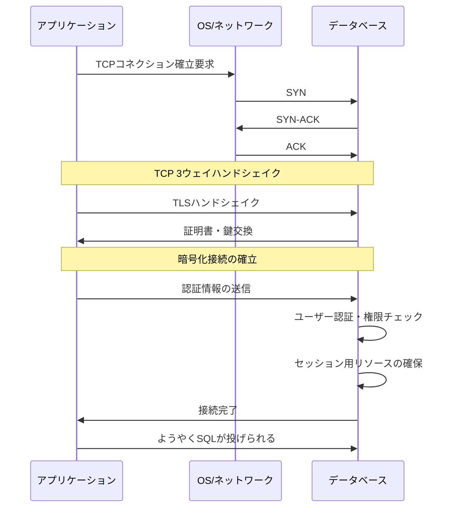
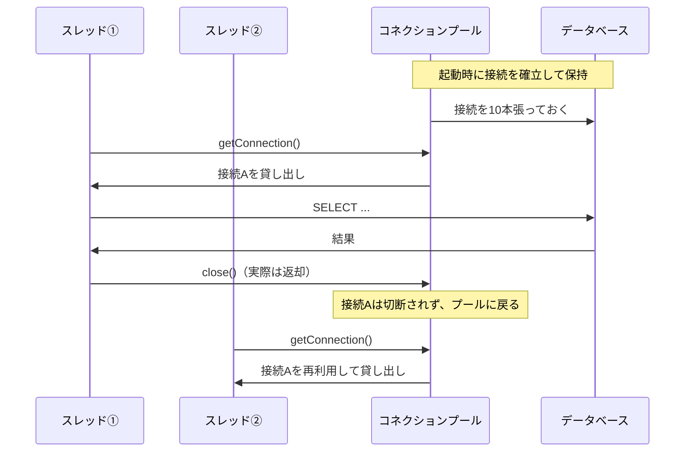

# Zenn問答とは

「Zenn問答」とは、開発していて「なんとなく使ってるけど、ちゃんと理解してるかな？」という技術について、改めて時間をとって深掘りしてみようという企画です🧘🧘🧘

# はじめに

Spring Bootでアプリケーションを起動すると、ログにこんな行が流れていきます。

```
HikariPool-1 - Starting...
HikariPool-1 - Added connection org.postgresql.jdbc.PgConnection@4f8e5cde
HikariPool-1 - Start completed.
```

自分の理解は「HikariCPがコネクションプールをいい感じに管理してくれている」というところで完全に止まっていました。何も設定しなくても勝手に入ってくるし、特に困ったこともないので、そのまま何年も使っています。

今回はHikariCPについて、誕生の背景含めて深掘りしてみます。

# そもそもコネクションプールとは何なのか

HikariCPの話をする前に、そのHikariCPが解決している「コネクションプール」という仕組みそのものを整理しておきます。

## DBへの接続は重い

アプリケーションからDBに接続するとき、裏側では結構な量の仕事が走っています。



TCPの3ウェイハンドシェイク、TLSのハンドシェイク、認証、そしてDB側でのセッション用リソース確保と、SQLを1本投げるまでに何往復もしています。同一VPC内でも数ms、TLSが挟まればさらに数ms、ネットワークが遠ければ数十msかかることもあります。

さらに厄介なのが、DB側のコストです。PostgreSQLは接続ごとにOSプロセスをforkするため、1接続あたり数MBのメモリを消費します。

つまりDBへの接続は「毎回作って毎回捨てる」には高すぎるわけです。1リクエストの処理が10msで終わるのに、接続確立に20msかかっていたらレスポンスタイムに大きく影響します。

## プールがやっていること

そこで登場するのがコネクションプールです。やっていること自体は驚くほど単純で、「あらかじめ何本か接続を作っておいて、使いたい人に貸し出し、終わったら返してもらう」だけです。



ここで面白いのが、アプリケーション側のコードは `connection.close()` を呼んでいるのに、実際にはTCP接続が切れていないという点です。プールが返してくる `Connection` は本物ではなくプロキシで、`close()` は「プールへの返却」にすり替えられています。

このおかげで、アプリケーションのコードは普通のJDBCの作法のまま書けて、裏で勝手に接続が使い回されます。

## 速さ以外のもうひとつの役割

コネクションプールというと「接続を使い回して速くするもの」という説明をされがちですが、実運用でそれと同じくらい重要なのが上限を決める役割です。

DBには `max_connections` という接続数の上限があります。プールがなければ、リクエストが増えた分だけ接続が増え、あるとき上限に達してDBが新規接続を一切受け付けなくなります。しかもこれはDB全体に影響するので、管理者すら繋げなくなって復旧が難しくなります。

プールがあれば「このアプリは最大10本しか使わない」と宣言できます。11本目を要求したスレッドは接続に失敗するのではなく、プールの中で順番待ちをします。負荷がかかったときに、DBを守りつつアプリ側で待たせるという挙動になり、瞬間的なリクエスト高騰などに対して強くなります。

# HikariCPとは

ここからが本題です。

HikariCPはJava向けのJDBCコネクションプール実装です。
https://github.com/brettwooldridge/hikaricp

## 「Hikari」は日本語の「光」

まず気になっていた名前の話からいきます。

READMEの冒頭にはこう書かれています。

> Hi·ka·ri [hi·ka·'lē] (Origin: Japanese): light; ray.

そう、日本語の「光」です。しかもリポジトリ名の横には堂々と「光」の漢字が置かれています。

これは英語圏の読者向けのダブルミーニングになっていて、以下の2つの意味がかけられています。

- 「光の速さ」の光、つまり **速い** ということ。
- 「軽い（light）」、つまり **コードが軽量** であるということ。

英語の light に「光」と「軽い」の両方の意味があることを利用した言葉遊びのようです。

## 日本で開発されたのか

結論から言うと、**書かれている場所は東京です。ただし作者は日本語ネイティブではありません。**

作者のBrett Wooldridgeさんは、jOOQのインタビューでこう語っています。

> I've lived and worked in Tokyo since 2008, though I think my Japanese is far behind where it should be given my time here.

https://blog.jooq.org/jooq-tuesdays-brett-wooldridge-shows-what-it-takes-to-write-the-fastest-java-connection-pool/

GitHubのプロフィールを見ても所在地は `Tokyo, Japan` で、勤務先も日本の会社になっています。日本に住みながら、日本語ネイティブではない開発者が、暮らしている土地の言葉をプロジェクト名に選んだ、ということのようです。

「日本発のOSSです」と言い切るとちょっと語弊がありますが、「東京で書かれたOSS」であることは間違いありません。世界中のJavaアプリケーションの裏側で動いているライブラリが東京発だと思うと、なんとなく嬉しくなりますね。

## 誕生の背景にあった課題感

では、なぜ新しいコネクションプールを作る必要があったのでしょうか。Javaは当時すでに20年近く使われていて、コネクションプールなんて枯れた技術のはずです。

作者へのインタビューによると、きっかけはあるプロトタイプ開発中に遭遇したデッドロックと、コネクションの状態がおかしくなる問題でした。原因を調べようと既存のプールのソースコードを読みにいったところ、そこで見たものにかなりショックを受けたようです。

先ほどの記事のインタビューでも以下のように発言しています。

> Really? This is the state of connection pools in the ecosystem after 20 years of Java?

### 正しさの問題

ひとつはJDBCの契約違反です。既存のプールの多くが、接続を返却するときに状態をきちんと戻していませんでした。

- 開いたままの `Statement` を閉じていない。
- `SQLWarning` をクリアしていない。
- `autoCommit` やトランザクション分離レベルを元に戻していない。

これがなぜ怖いかというと、プールは接続を **使い回す** からです。あるスレッドが `setAutoCommit(false)` にして返却し、その接続を次のスレッドが借りると、そのスレッドは自分では何も設定していないのに `autoCommit=false` の世界で動き始めます。コミットしたつもりのデータが入っていない、という再現性の低いバグが生まれます。
確かに、そんなバグが出たら本当に迷宮入りしそうですね・・・

HikariCPはここをかなり厳格にやっていて、貸し出した接続に対して設定変更が行われたかを **ダーティビット** で追跡しています。
ダーティビットというのは「変更されたかどうか」を1ビットのフラグで覚えておく、コンピューターの世界で広く使われている手法です。

```java
// ProxyConnection の実装より（一部抜粋）
private static final int DIRTY_BIT_READONLY   = 0b000001;
private static final int DIRTY_BIT_AUTOCOMMIT = 0b000010;
private static final int DIRTY_BIT_ISOLATION  = 0b000100;
private static final int DIRTY_BIT_CATALOG    = 0b001000;
private static final int DIRTY_BIT_NETTIMEOUT = 0b010000;
private static final int DIRTY_BIT_SCHEMA     = 0b100000;
```

`setReadOnly()` や `setAutoCommit()` が呼ばれると対応するビットが立ち、返却時にはそのビットが立っているものだけを元の値に戻します。全部を毎回リセットするとその分DBへの往復が発生するので、変更されたものだけを戻すという最適化になっています。

さらに、貸し出し中に開かれた `Statement` は内部のリストで追跡されていて、返却時にまとめてクローズされます。`clearWarnings()` も呼ばれます。「アプリ側が閉じ忘れても、プールが後始末をする」というのが徹底されています。

### 障害時の振る舞いの問題

もうひとつが、DBが落ちたときの振る舞いです。HikariCPのWikiには、4つのプールに5秒のコネクションタイムアウトを設定した状態でDBのネットワークケーブルを引き抜くという、なかなか意地の悪いテスト結果が公開されています。

https://github.com/brettwooldridge/HikariCP/wiki/Bad-Behavior:-Handling-Database-Down

評価は本家が「主観的な採点」として付けているものです。

| プール | 評価 | 結果 |
|---|---|---|
| HikariCP | A | 設定通り、5秒を超えたことを示すタイムアウト例外を投げ続ける |
| Vibur | B+ | 同じく正しくタイムアウトする。ただし `setUseNetworkTimeout(true)` がデフォルトではなく、その重要性が見落とされやすい |
| Dbcp2 / Tomcat | D | 検証クエリがTCPレベルで固まってタイムアウトしない。約55秒後に目を覚ますが、以降も5秒のタイムアウトを守らず即座に失敗し続ける |
| C3P0 | D | 同じく検証クエリで固まる。約2分後に目を覚ますが、以降も5秒のタイムアウトを守らない |

問題の本質は、多くのプールにおける「コネクションタイムアウト」が **プール内での順番待ちの時間** しか見ていなかったことです。ネットワークが応答しない状況では、検証クエリを投げた時点でTCPレベルで固まってしまい、設定した5秒などまったく関係なくOSのタイムアウトまでスレッドが張り付きます。

タイムアウトを設定していたのにスレッドが数分間解放されない、というのは本番環境ではかなり致命的です。全スレッドが枯渇してアプリケーション全体が応答不能になります。

HikariCPはここに対して、`Connection.setNetworkTimeout()` を使って確実に時間で切る作りにしています。「設定した値を守る」という当たり前のことを、当たり前にやるのを重視しているわけです。

**HikariCPは「速いプール」として有名ですが、生まれた動機はむしろ「正しいプール」を作ることだった** というのは、個人的にかなり印象が変わったポイントでした。

## Spring Bootのデフォルトになるまで

HikariCPは2013年に登場しました。その後じわじわと評価を集め、決定的だったのがSpring Boot 2.0（2018年）でデフォルトのコネクションプールに採用されたことです。

それまでSpring Bootのデフォルトは Tomcat JDBC Pool でした。採用理由として挙げられたのは、HikariCPのほうが明確に性能が良いという実測の裏付けと、warをTomcatにデプロイすると `tomcat-jdbc` が常にクラスパスに乗ってしまい扱いづらかったという運用上の事情です。

現在のSpring Bootは以下の優先順位でプールを選びます。

1. クラスパスにHikariCPがあれば、それを使う。
2. なければ Tomcat JDBC Pool を使う。
3. どちらもなければ Commons DBCP2 を使う。

`spring-boot-starter-data-jpa` や `spring-boot-starter-jdbc` を入れると HikariCP が推移的に入ってくるので、実質的にほぼ全員がHikariCPを使うことになります。何も設定していないのにログに `HikariPool-1` が出てくるのは、このためです。

なお現在も開発は続いていて、最新は7系です。Java 8向けのサポートは4.0.3で終わっているので、古いJavaのままバージョンを上げようとすると引っかかる点だけ注意が必要です。

# なぜHikariCPは速いのか

「正しさが動機だった」とはいえ、HikariCPが有名になったのはやはり速さです。

作者はインタビューで、性能向上の **およそ半分はアルゴリズムの改善によるもの** で、残りが低レベルなマイクロ最適化だと述べています。何をやっているのかを順に見ていきます。

## ConcurrentBag

HikariCPの中核にあるのが `ConcurrentBag` という自作のコレクションです。クラスのJavadocには「コネクションプールという用途において `LinkedBlockingQueue` や `LinkedTransferQueue` を上回る性能を実現する、特殊化された並行コレクション」と書かれています。

構造としては3つの入れ物を持っています。

| フィールド | 型 | 役割 |
|---|---|---|
| `sharedList` | `CopyOnWriteArrayList` | 全スレッドから見える共有のコネクション一覧 |
| `threadList` | `ThreadLocal<List>` | スレッドごとのキャッシュ |
| `handoffQueue` | `SynchronousQueue` | 待っているスレッドへの直接受け渡し |

ここの詳細はマニアックなので割愛しますが、ほかにも `FastList` という `ArrayList` の代替が用意されていて、Statementは開いた順と逆順で閉じられることがほとんどだという性質を利用し、走査順を逆にしていたりします。どちらもコネクションプールという用途に特化して最適化されたコレクションです。

## バイトコードレベルの最適化

さらに深いところでは、JVMのバイトコードや、JITが吐くアセンブリまで見て調整が入っています。ここについても具体的に見るとマニアックすぎるので割愛しますが、概要レベルで見てもすごい高度な最適化がなされているなぁという感想を持ちました。

# HikariCPの設定項目

ここからは実務で触る設定の話です。HikariCPは設定項目が意図的に少ないのですが、それぞれの意味を分かっていないと事故につながることがありそうです。

まず一覧です。

| プロパティ | デフォルト | 何を決めるか |
|---|---|---|
| `maximumPoolSize` | 10 | プールの最大接続数 |
| `minimumIdle` | `maximumPoolSize` と同じ | 維持するアイドル接続の最小数 |
| `connectionTimeout` | 30000ms (30s) | プールから接続を借りられるまでの最大待ち時間 |
| `idleTimeout` | 600000ms (10min) | アイドル接続が破棄されるまでの時間 |
| `maxLifetime` | 1800000ms (30min) | 1本の接続の最大生存時間 |
| `keepaliveTime` | 120000ms (2min) | アイドル接続の生存確認間隔 |
| `validationTimeout` | 5000ms (5s) | 生存確認にかけてよい最大時間 |
| `leakDetectionThreshold` | 0（無効） | 接続リークとみなすまでの貸出時間 |
| `initializationFailTimeout` | 1 | 起動時にDBに繋がらなかった場合の挙動 |

Spring Bootなら `spring.datasource.hikari.*` の下に書きます。

```yaml
spring:
  datasource:
    url: jdbc:postgresql://db.example.com:5432/appdb
    username: app
    password: ${DB_PASSWORD}
    hikari:
      maximum-pool-size: 20
      max-lifetime: 600000
      keepalive-time: 120000
      connection-timeout: 3000
      leak-detection-threshold: 20000
      pool-name: app-pool
```

以下、特に重要なものを見ていきます。

## maximumPoolSize

一番よく触るのに、一番誤解されている設定です。

「アクセスが増えたのでプールサイズを増やしましょう」という判断は、多くの場合 **間違い** です。HikariCPのWikiにある「About Pool Sizing」というページは、この誤解を正すためだけに書かれたようなドキュメントで、一読の価値があります。

https://github.com/brettwooldridge/HikariCP/wiki/About-Pool-Sizing

そこで引用されているOracleのReal-World Performanceグループの実測が衝撃的です。

| 項目 | 変更前 | 変更後 |
|---|---|---|
| コネクションプールのサイズ | 2048 | 96 |
| アプリケーションのレスポンスタイム | 約100ms | 約2ms |

他には何も変えず、プールサイズを2048から96に **減らした** だけで、レスポンスタイムが50倍以上改善したという結果です。

なぜこうなるかというと、DBが同時に処理できる仕事の量は結局のところCPUコア数とディスクの本数で決まっているからです。コア数を超えるスレッドを走らせても、コンテキストスイッチが増えるだけで実際の処理は速くなりません。接続を増やすというのは、DBに「同時にこれだけの仕事を抱え込め」と要求することなので、閾値を超えると純粋に足を引っ張ります。

なお、EC2やコンテナが複数台ある構成では、**プールサイズ × インスタンス数** がDBに向かう接続数の総数になります。スケールアウトしたら合計がDBの `max_connections` を超えていた、というのはよくある事故なので、必ず掛け算で見積もってください。

## minimumIdle

「最低これだけアイドル接続を維持する」という設定です。デフォルトは `maximumPoolSize` と同じ値、つまり **固定サイズプール** になります。

そして公式は、この値を設定しないことを推奨しています。

> for maximum performance and responsiveness to spike demands, we recommend not setting this value and instead allowing HikariCP to act as a fixed size connection pool.

## maxLifetime と keepaliveTime

`maxLifetime` は接続1本あたりの寿命で、デフォルト30分です。これを超えた接続は、貸出中でなくなったタイミングで破棄され、新しい接続に置き換わります。公式のドキュメントには強めの表現で書かれています。

> set this value, and it should be several seconds shorter than any database or infrastructure imposed connection time limit.
> （この値は設定すべきであり、DBやインフラが課すあらゆる接続時間制限より数秒短くすべきである）

MySQLの `wait_timeout`、ロードバランサやNATゲートウェイのアイドルタイムアウト、ファイアウォールのセッションタイムアウトなど、経路のどこかに時間制限があると、DB側やネットワーク機器側から一方的に接続が切られます。プールはそれを知らないので、死んだ接続を平然と貸し出してしまいます。

これが「本番で忘れた頃に `Connection reset` が出る」の典型的な原因です。プール側が先に接続を捨てるようにしておけば、この競合は起きません。

迷ったらデフォルトの30分より短めにしておくほうが安全なようです。なお `maxLifetime` は30秒未満を指定すると警告が出てデフォルトの30分に戻されるので、極端に短くすることはできません。

`keepaliveTime` はこれを補完する仕組みで、アイドル状態の接続に定期的に軽い問い合わせを投げて、経路上の機器から「使われていない接続」とみなされるのを防ぎます。
現在のデフォルトは120000ms（2分）ですが、長らく0（無効）がデフォルトだったので、バージョンを上げたときに挙動が変わる点は意識しておくとよさそうです。当然ながら `maxLifetime` より小さい値である必要があります。

## connectionTimeout

プールから接続を借りるまでに待てる最大時間で、デフォルトは30秒です。これを超えると例外が飛びます。

デフォルトの30秒はかなり長いです。Webアプリケーションで30秒待たされるくらいなら、さっさと失敗して呼び出し元にエラーを返し、リトライやフォールバックに回したほうが健全なことが多いです。
上流にタイムアウト付きのAPIゲートウェイがいる構成なら、そちらのタイムアウトより確実に短くしておかないと、意味のない待機でスレッドを消費するだけになります。

数秒程度に短くしておくと、障害時にアプリケーション全体が引きずられにくくなります。

## leakDetectionThreshold

デフォルトは0で無効ですが、これは有効にしておくと非常に便利な設定です。

指定した時間（最小2000ms）を超えて接続が返却されないと、警告ログにその時点のスタックトレースが出ます。

```
Connection leak detection triggered for conn0: url=... on thread http-nio-8080-exec-3,
stack trace follows
java.lang.Exception: Apparent connection leak detected
    at com.example.UserRepository.findAll(UserRepository.java:42)
    ...
```

「どこのコードが接続を握りっぱなしなのか」がスタックトレース付きで分かるので、原因の特定が一気に楽になるようです。

また、これが誤検知だった場合、つまり単に処理が長かっただけで最終的に返却された場合も、ちゃんと後からログが出ます。

```
Previously reported leaked connection conn0: url=... on thread http-nio-8080-exec-3
was returned to the pool (unleaked)
```

これがあると「本当にリークしているのか、単に遅いだけなのか」を切り分けられます。閾値は、そのアプリで想定される最長の処理時間より少し長めに設定するのがおすすめです。

## connectionTestQuery は基本設定しない

古い設定例をコピペすると `connection-test-query: SELECT 1` が付いてくることがありますが、公式は明確に非推奨としています。

> If your driver supports JDBC4 we strongly recommend not setting this property.

JDBC4準拠のドライバなら `Connection.isValid()` が使えて、これはドライバが持つプロトコルレベルの仕組みで生存確認できるため、クエリを1本投げるより速くて確実です。今どきのMySQL・PostgreSQLのドライバはすべて対応しているので、設定する必要はありません。

# よく出会うエラーの読み方

HikariCPを使っていて遭遇するエラーは、実はかなり親切な情報を含んでいます。

## Connection is not available, request timed out

一番よく見るのがこれです。

```
java.sql.SQLTransientConnectionException:
HikariPool-1 - Connection is not available, request timed out after 30000ms
(total=10, active=10, idle=0, waiting=5)
```

括弧の中に、その瞬間のプールの状態が全部出ています。ここを読むと原因の切り分けができます。

| 状態 | 読み取れること | 疑うべきところ |
|---|---|---|
| `active` が `total` と同じで `waiting` が多い | プールが完全に枯渇している | 遅いクエリ、接続リーク、プールサイズ不足 |
| `total` が `maximumPoolSize` より小さい | そもそも接続を作れていない | DBへの疎通、認証情報、`max_connections` 到達 |
| `idle` があるのにタイムアウト | 借りようとした瞬間に枯渇と回復を繰り返している | 瞬間的なスパイク |

`active=10` で埋まっているとき、反射的にプールサイズを増やしたくなりますが、前述の通りそれは大抵間違いで、以下の順序で疑うべきです。

1. 接続を握ったまま返していないコード（リーク）がないか。`leakDetectionThreshold` で確認する。
2. 1本あたりの処理時間が長すぎないか。スロークエリログを見る。
3. トランザクションの中で外部APIを呼ぶなど、DB以外の待ち時間をトランザクションに含めていないか。
4. その上で、本当に同時実行数が足りないのか。

特に3番は結構見るケースがあるかなと思います。
トランザクションもSpringだと`@Transactional`と書くだけで張れてしまうので、起こり得ますね。
これもプログラム書くときに意識することが少なくなった結果、ひと昔前だと考えられなかったバグなのかなとは個人的に思います。

# 監視すべきメトリクス

Spring Boot Actuatorを入れていれば自動で出ます。

| メトリクス | 意味 | 見どころ |
|---|---|---|
| `hikaricp.connections.active` | 貸出中の接続数 | `max` に張り付いていないか |
| `hikaricp.connections.idle` | 待機中の接続数 | 常に0なら余裕がない |
| `hikaricp.connections.pending` | 接続待ちのスレッド数 | **最重要** の指標。0より大きい状態が続くのは危険信号 |
| `hikaricp.connections.timeout` | タイムアウトした回数 | 増えていたら既に失敗が起きている |
| `hikaricp.connections.acquire` | 接続取得にかかった時間 | 伸びていればプールが逼迫している |
| `hikaricp.connections.usage` | 借りてから返すまでの時間 | 長ければ処理かトランザクションが長い |
| `hikaricp.connections.creation` | 接続確立にかかった時間 | ネットワークやDB負荷の兆候 |

この中で最初に見るべきは `pending` です。`active` が最大値に張り付いていても、`pending` が0なら「ちょうど使い切っている」だけで問題ありません。`pending` が立っているということは、実際にスレッドが待たされているということなので、ここが継続的に0より大きい状態はアラートの対象にする価値があります。

# 競合ライブラリはあるのか

「気づいたらHikariCPを使っていた」という状態なので、他に何があるのかも整理しておきます。

| ライブラリ | 開発元・作者 | 現在の位置づけ | 特徴 |
|---|---|---|---|
| HikariCP | Brett Wooldridge | 事実上の標準 | 速度と正しさ。Spring Bootのデフォルト |
| Apache Commons DBCP2 | Apache | 現役 | commons-pool2ベース。歴史が長く枯れている |
| Tomcat JDBC Pool | Apache Tomcat | 現役 | Spring Boot 1.xのデフォルトだった |
| C3P0 | Machinery For Change | 保守のみ | Hibernateと組み合わせてよく使われた |
| BoneCP | Wallace Wadge | 非推奨 | 作者自身がHikariCPを推奨して開発終了 |
| Druid | Alibaba | 現役 | SQL監視・フィルタ機能が非常に豊富 |
| Agroal | Red Hat | 現役 | QuarkusのデフォルトでJTA/XA統合が強い |
| Oracle UCP | Oracle | 現役 | Oracle DB固有機能との統合 |

## Druidは監視のためのプール

Alibabaが開発しているDruidは、中国圏で非常に広く使われています。純粋なプール性能というよりは、SQLの実行統計、遅いクエリの記録、SQLインジェクション対策のフィルタ、Web管理コンソールといった **監視・運用機能の豊富さ** が売りです。

HikariCPが「余計なものを削ぎ落とす」方向なのに対して、Druidは「全部入り」の方向という、思想がきれいに逆です。専用のAPMを入れる前提ならHikariCP、プール自体に可視化を求めるならDruid、という住み分けになります。

## Agroalは分散トランザクションのためのプール

Red Hatが開発しているAgroalは、Quarkusのデフォルトプールです。HikariCPと比べたときの差別化ポイントは、Narayana JTAとの統合による **XA（分散トランザクション）のサポート** と、実行時の設定変更、フレームワークのメトリクスやヘルスチェックとの統合です。

複数のDBをまたいだトランザクションが必要という要件があると、HikariCPだけでは足りません。そういう領域はAgroalやアプリケーションサーバー付属のプールの担当になります。

# まとめ

HikariCPについて改めて深掘りしてみました。

「Spring Bootが勝手に使ってる、コネクションプール」くらいの認識でしたが、生まれた動機が「既存のプールの品質がいまいちだったこと」で、そこに加えて多くの最適化が入り、高品質なものが世に出たというのが理解できました。
また、各設定値についても正直ほぼほぼ理解できていませんでしたが、これを機にみなおしてみたいなと思いました。あと、語源が本当に「光」であることも知れてスッキリしました笑

最後まで読んでいただき、ありがとうございました🙏
