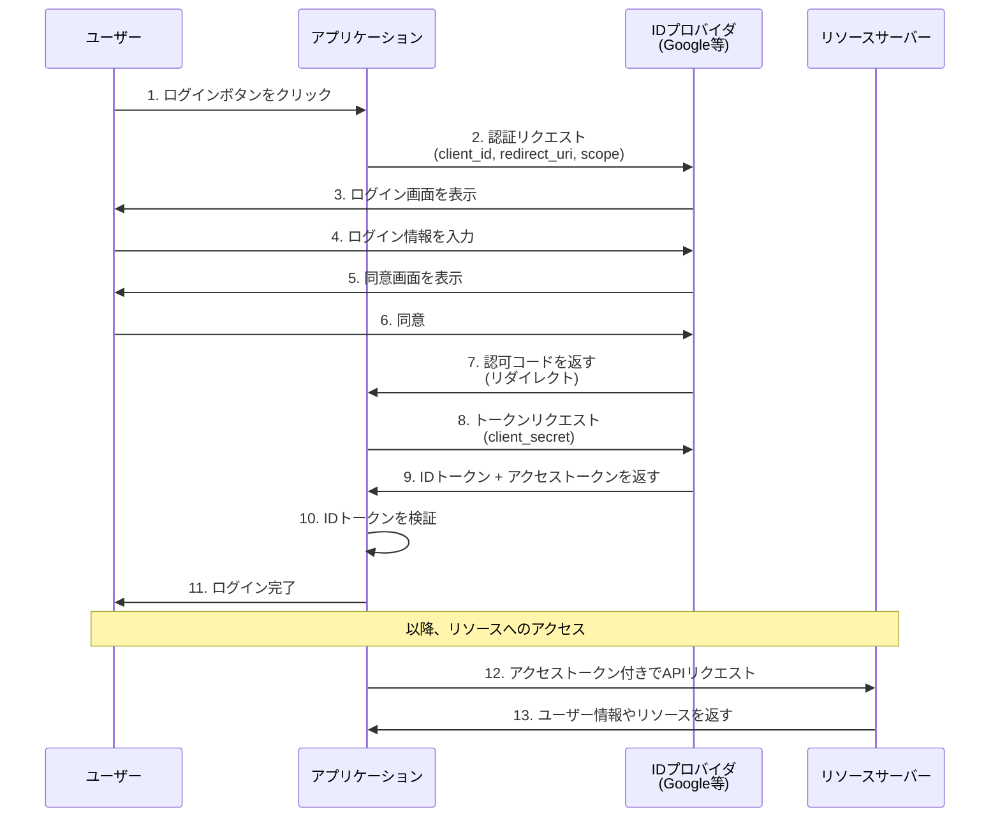
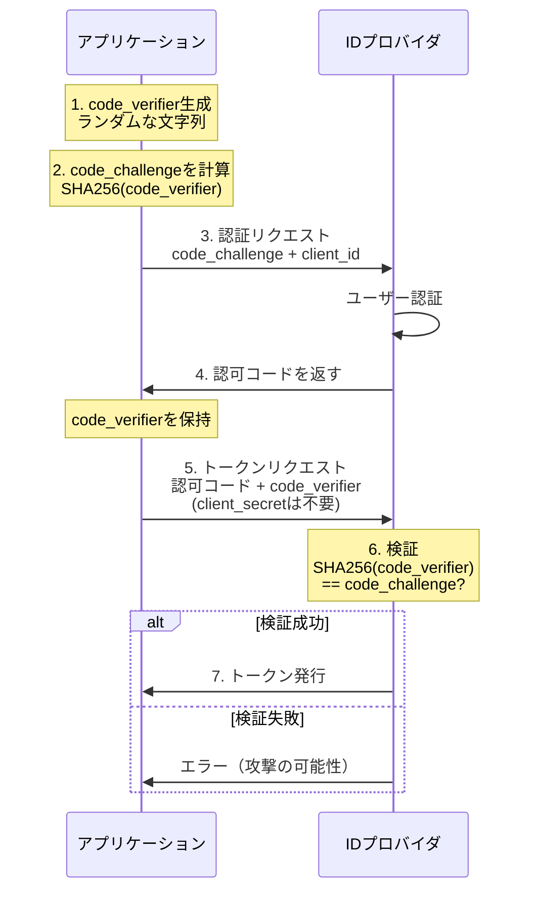

## Zenn問答とは

「Zenn問答」とは、開発していて「なんとなく使ってるけど、ちゃんと理解してるかな？」という技術について、改めて時間をとって深掘りしてみようという企画です🧘🧘🧘

## はじめに

「Google でログイン」「GitHub でログイン」といった機能を実装したことはありますか？その裏側で動いているのが、今回取り上げる OIDC（OpenID Connect）です。

最近のWebアプリケーション開発では、自前で認証機能を実装するよりも、GoogleやGitHubなどの外部サービスを利用した認証が一般的になっています。そんな中で「OAuth」「OIDC」「SAML」「SSO」といった用語が飛び交い、なんかよくわかんねぇなぁと思ったことはないでしょうか。

そこで今回は、OIDCを中心に、認証・認可周りの用語を整理しようと思います。

## SSOとは何か

まず、全体像を理解するために「SSO（シングルサインオン）」から説明します。

**SSO（Single Sign-On）** は、一度のログインで複数のサービスにアクセスできる仕組みです。例えば、Google アカウントでログインすると、Gmail、Google Drive、YouTube など、複数のサービスにそれぞれログインし直すことなく利用できるような仕組みのことを言います。

重要なポイントは、**SSOは「仕組み」や「概念」であって、具体的な技術やプロトコルではない**ということです。SSOを実現するための手段として、OIDC、SAML、Kerberosなど、さまざまなプロトコルが存在します。

### SSOのメリット

- **ユーザー体験の向上** - 何度もログインする手間が省ける
- **セキュリティの向上** - パスワードを複数のサービスで使い回す必要がなくなる
- **管理の効率化** - 認証情報を一元管理できる
- **データの追跡性** - サービス横断で顧客情報が得られる

## OIDCとは何か

### OIDCの位置づけ

**OIDC（OpenID Connect）** は、SSOを実現するためのプロトコルの一つです。正確には、OAuth 2.0 の上に構築された「認証レイヤー」です。

**OAuth 2.0**
- 目的は「**認可（Authorization）**」
- 「ユーザーが誰か」は関心事ではなく、「リソースへのアクセスを許可するか」が関心事
- アクセストークンを発行
- 例：Twitterアプリにあなたのツイートへのアクセスを許可する

**OIDC**
- 目的は「**認証（Authentication）**」と「認可」の両方
- 「ユーザーが誰か」を確認することが主な目的
- IDトークン（JWT形式）とアクセストークンを発行
- 例：Googleアカウントでログインして、ユーザー情報を取得する

つまり、**OIDCはOAuth 2.0を拡張して、「ユーザーが誰か」という認証情報を扱えるようにしたもの**です。OAuth 2.0だけでは「認証済みの証明」を適切に扱えなかったため、OIDCが2014年に標準化されました。

## 他の認証方式との比較

OIDCだけが認証を実現する方法ではありません。他の主要な認証方式と比較してみましょう。

### SAML（Security Assertion Markup Language）

**SAML** もSSOを実現するためのプロトコルです。OIDCとの主な違いを見てみましょう。

| 観点 | OIDC | SAML |
|------|------|------|
| トークン形式 | JWT | XML assertion |
| 標準化時期 | 2014年 | 2000年代初頭 |
| 実装の容易さ | 比較的簡単 | 複雑 |
| VDI環境 | 対応可能だが実績が少ない | 適している（実績豊富） |
| デスクトップアプリ統合 | Web/モバイル中心 | 従来型アプリとの統合が得意 |
| エンタープライズ統合 | 新規システムに向いている | AD/LDAP等既存システムと成熟した統合 |
| セッション管理 | 短命なトークン中心 | 長時間セッションの管理が得意 |

エンタープライス向けの権限を管理できるようなものなどはSAMLが使われていて、新規のwebベースのシステムではOIDCが使われることが多いような印象です。

### Basic認証、Digest認証

**Basic認証** や **Digest認証** は、HTTPプロトコルに組み込まれたシンプルな認証方式です。

- **Basic認証** - ユーザー名とパスワードをBase64エンコードして送信（HTTPSなしでは危険）
- **Digest認証** - パスワードをハッシュ化して送信（Basic認証より安全だが、今では推奨されない）

これらは単一サーバーへの簡易的なアクセス制御には使えますが、**SSOには対応できません**。セキュリティレベルも現代の基準では不十分です。
ただ、簡単なbotなど作成するときは便利なのでここらへんで認証を済ませることが多いかなと思います。

### Kerberos

**Kerberos** は、主に企業のActive Directory環境で使われるチケットベースのネットワーク認証プロトコルです。
チケットとはバイナリファイルで、認証サーバーから発行される「認証済みの証明書」のようなものみたいです。このチケットを使って各サービスにアクセスします。
Windows ドメイン環境での標準となっており、企業内ネットワークでのシングルサインオンを実現します。ただし、インターネット越しの認証には向いていないため、主に社内システムでの利用に留まっています。

## OIDCの仕組み

それでは、OIDCが実際にどのように動作するのか、最も一般的な「認可コードフロー（Authorization Code Flow）」を見ていきましょう。

### 認可コードフローの流れ



### フローの詳細

1. **ユーザーがログインを開始** - アプリケーションの「Googleでログイン」ボタンをクリック

2. **認証リクエスト** - アプリケーションがIDプロバイダ（Google等）に認証をリクエスト
   - `client_id`: アプリケーションの識別子
   - `redirect_uri`: 認証後のリダイレクト先
   - `scope`: 要求する権限（openid, profile, email等）

3-6. **ユーザー認証と同意** - IDプロバイダがユーザーに認証を求め、同意を取得

7. **認可コードの発行** - IDプロバイダがアプリケーションに認可コードを返す（短時間で期限切れ）

8. **トークンリクエスト** - アプリケーションが認可コードを使ってトークンをリクエスト
   - この時、`client_secret`を使って自身を証明
   - これはアプリケーション登録時に発行される共通鍵で、IDプロバイダと同じものを保管します

9. **トークンの発行** - IDプロバイダが以下を返す
   - **IDトークン（JWT）**: ユーザーが誰かを証明
   - **アクセストークン**: リソースサーバーへのアクセス権

10. **IDトークンの検証** - アプリケーションがIDトークンの署名を検証し、ユーザー情報を取得

11-13. **リソースへのアクセス** - アクセストークンを使ってAPIからユーザー情報を取得

### OIDCで発行される重要なトークン

**IDトークン（ID Token）**
- JWT（JSON Web Token）形式
- ユーザーが誰かを証明する
- ペイロードにユーザー情報（sub, name, email等）を含む
- 署名されており、改ざん検知が可能

```json
{
  "iss": "https://accounts.google.com",
  "sub": "110169484474386276334",
  "aud": "your-client-id",
  "exp": 1735689600,
  "iat": 1735686000,
  "name": "山田太郎",
  "email": "yamada@example.com"
}
```

**アクセストークン（Access Token）**
- リソースサーバーへのアクセス権を表す
- 通常、不透明なトークン（Opaque Token）かJWT
- 有効期限がある

**リフレッシュトークン（Refresh Token）**
- アクセストークンの有効期限が切れた時、新しいアクセストークンを取得するために使用
- 長期間有効
- セキュアに保管する必要がある

## OIDCがよく使われるシーン

- ソーシャルログイン
  - GoogleアカウントやGitHubアカウントでログインできる機能。よくありますね。
  - ユーザーに新しいアカウントを作成させたくない
- サービス間の認証統合
  - 各サービスで統一的にユーザー認証を行いたい
- モバイルアプリの認証
  - PKCE（Proof Key for Code Exchange）により、モバイル環境でもセキュア
  - リフレッシュトークンでシームレスな再認証
- SPA（シングルページアプリケーション）の認証
  - JavaScriptから直接OIDCフローを実行できる
  - トークンベースなので、RESTful APIと相性が良い

## セキュリティ考慮事項

OIDCを実装する際には、以下のセキュリティベストプラクティスに従うことが重要です。

### 1. PKCE（Proof Key for Code Exchange）の使用

PKCEは、「認可リクエストの送信元とトークンリクエストの送信元が同一であることを確認する仕組み」です。

**なぜ必要か**

モバイルアプリやSPAでは、`client_secret`を安全に保管できません。JavaScriptのコードは誰でも見られますし、モバイルアプリも逆コンパイル可能です。そのため、以下のような攻撃が可能になってしまいます。

**攻撃シナリオ（PKCEなしの場合）**
1. 攻撃者がアプリから`client_secret`を抜き出す
2. 正規のユーザーが認証を行い、認可コードが発行される
3. 攻撃者が認可コードを傍受（リダイレクトURLを乗っ取るなど）
4. 攻撃者が`client_secret`と傍受した認可コードでトークンを取得 → **攻撃成功！**

**仕組み**
1. アプリが`code_verifier`（ランダムな文字列）を生成
2. `code_verifier`をハッシュ化した`code_challenge`を認証リクエストに含める
3. トークンリクエスト時に元の`code_verifier`を送信
4. IDプロバイダが検証して一致すればトークンを発行



PKCEは、攻撃者が認可コードを傍受しても無意味にします。

1. アプリが`code_verifier`（ランダムな文字列）を生成し、**アプリ内だけに保持**
2. `code_verifier`のハッシュ値（`code_challenge`）だけを送信
3. 認可コードを傍受されても、攻撃者は`code_verifier`を持っていない
4. ハッシュから元の値は逆算できないため、攻撃者はトークンを取得できない

つまり、`client_secret`の代わりに、**毎回異なるランダムな値**を使うことで、その値を知っているアプリだけがトークンを取得できる仕組みです。

### 2. state パラメータによるCSRF対策

`state`パラメータは、CSRF（クロスサイトリクエストフォージェリ）攻撃を防ぐために使用します。

**攻撃シナリオ（stateなしの場合）**

1. 攻撃者が自分のGoogleアカウントで認証フローを開始
2. 認可コード取得直前で止め、コールバックURLをコピー
3. 被害者に罠のリンク（攻撃者の認可コードを含むコールバックURL）を踏ませる
4. 被害者のブラウザで攻撃者のアカウントにログインしてしまう
5. 被害者が重要な情報を入力 → 攻撃者のアカウントに保存される

**仕組み**

ランダムな文字列をstateとしてセッションに保存しておき、コールバックで受け取るstateと比較する処理をいれます。

```javascript
// 認証リクエスト前にランダムなstateを生成してセッションに保存
const state = crypto.randomBytes(16).toString('hex')
session.oauthState = state

// 認証リクエストにstateを含める
const authUrl = `${authorizationEndpoint}?
  client_id=${clientId}&
  redirect_uri=${redirectUri}&
  scope=openid profile email&
  response_type=code&
  state=${state}`

// コールバックで受け取ったstateを検証
if (callbackState !== session.oauthState) {
  throw new Error('Invalid state parameter - CSRF攻撃の可能性')
}
```

`state`は「このOIDCフローを開始したのは本当に自分か」を検証します

1. 認証リクエスト開始時にランダムな`state`を生成し、**セッションに保存**
2. コールバック時に返ってきた`state`とセッションの`state`を比較
3. 攻撃者は被害者のセッションに保存された`state`を知ることができない
4. `state`が一致しなければ、自分が開始していないフローと判断して拒否

### 3. IDトークンの検証

IDトークン（JWT）を受け取ったら、必ず以下を検証します。

- **署名（Signature）** - 改ざんされていないか
- **発行者（iss）** - 期待するIDプロバイダから発行されたか
- **対象者（aud）** - 自分のアプリ宛てか
- **有効期限（exp）** - 期限切れでないか
- **発行時刻（iat）** - 未来の時刻でないか

### 4. トークンの安全な保管

トークンの保管場所は環境によって使い分けます。SPAではアクセストークンとIDトークンをメモリ上に保持し、XSSのリスクがある`localStorage`は避けるべきです。サーバーサイドで保存し、ブラウザにはCookieでセッションIDだけを送ります。
リフレッシュトークンは最も機密性が高いため、必ずサーバーサイドで厳重に管理し、ブラウザには保管しないようにしましょう。

## まとめ

今回は、OIDC認証について深掘りしてみました。

腰を据えて理解しないとなかなか難しいですね。OIDC自体は実装できても、なぜこのフローになっているかを理解するにはこういう場合にこういう攻撃が考えられるなどを知っていないといけずになかなか骨があるなぁという印象です。
個人的にはここらへんの処理はなんとなく分かるかも・・・？という状態だったのでこれを機にスッキリと理解できてコンプレックスがひとつ解消できて嬉しいです。

最後まで読んでいただき、ありがとうございました！！！
