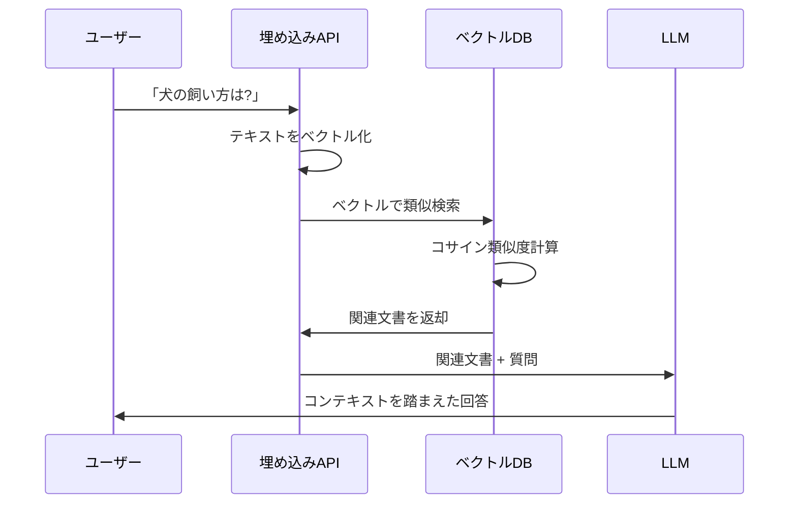
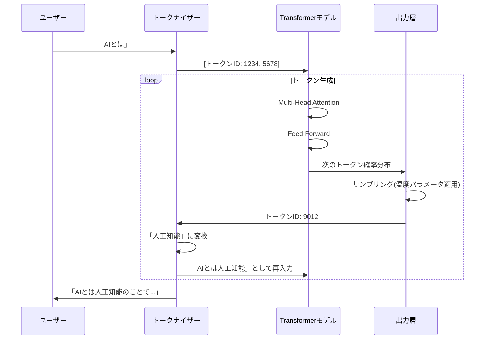

# Zenn問答とは

「Zenn問答」とは、開発していて「なんとなく使ってるけど、ちゃんと理解してるかな?」という技術について、改めて時間をとって深掘りしてみようという企画です🧘🧘🧘

# はじめに

最近、AIの活用がどんどん盛んになってきて、もうなくてはならないものになっています。ChatGPTやGitHub Copilot、Claude、Geminiなど、日常的にLLMを使った製品を利用している方も多いのではないでしょうか。

自分も仕事でもプライベートでもかなりAIに頼る生活を送っていますが、その基礎であるLLMについて、どういう理屈で動いているのか実はよく知りませんでした。「なんかすげぇな」くらいの理解で終わっていたので、今回改めて深掘りしてみたいと思います。

# LLMとは何か

LLMは「Large Language Model(大規模言語モデル)」の略で、膨大な量のテキストデータを学習した自然言語処理のモデルのことです。

「大規模」という名前の通り、従来の言語モデルとは桁違いのパラメータ数(数十億〜数十兆)を持ち、その結果として高度な言語理解と生成が可能になっています。

## 言語モデルの基本

そもそも言語モデルとは何でしょうか。

言語モデルは「次にくる単語を予測する」というシンプルなタスクを学習したモデルです。例えば、「私は朝ごはんに___を食べた」という文章があったとき、空欄に入る確率が高い単語を予測します。

```
「私は朝ごはんに」の次にくる確率
- パン: 30%
- ご飯: 25%
- 卵: 15%
- ラーメン: 5%
...
```

このように、前の文脈から次の単語の確率分布を出力するのが言語モデルの基本的な仕組みです。

実は「次の単語を予測する」という単純なタスクを繰り返すだけで、文章全体を生成できます。LLMが長い文章を書けるのは、この予測を何度も繰り返しているからなのだそうです。

# LLM誕生の経緯

LLMが登場する前の自然言語処理の歴史を簡単に紹介していきます。

### ルールベース時代(1950年代〜1980年代)

初期の自然言語処理は、言語学者が手作業で文法ルールを定義していました。しかし、言語の複雑さや例外の多さから、実用的なシステムを作るのは困難でした。

### 統計的手法の時代(1990年代〜2000年代)

大量のテキストデータから統計的に言語のパターンを学習する手法が主流になりました。N-gram言語モデルなどが代表的です。

```
例: N-gram言語モデル
- 2-gram(bigram): "I am" という2単語の組み合わせの出現頻度
- 3-gram(trigram): "I am happy" という3単語の組み合わせの出現頻度
```

ただし、N-gramモデルは直前のN個の単語しか考慮できないため、長い文脈を理解することができませんでした。

### ニューラルネットワークの時代(2010年代前半)

Word2VecやGloVeなどの手法により、単語をベクトル(数値の列)で表現する「単語埋め込み」が登場しました。これにより、単語の意味的な類似性を数学的に扱えるようになりました。

```
例: Word2Vecによる単語の関係性
King - Man + Woman ≈ Queen
```

しかし、依然として長い文脈を効率的に処理することは困難でした。

### Transformerの登場(2017年)

2017年、GoogleのVaswaniらが発表した論文「Attention is All You Need」でTransformerアーキテクチャが提案されました。これがLLM革命の始まりです。

Transformerは、それまで主流だったRNN(リカレントニューラルネットワーク)やLSTM(長短期記憶)と異なり、「注意機構(Attention)」という仕組みを使うことで

- 長い文脈を効率的に処理できる
- 並列処理が可能で学習が高速
- 文章中の重要な部分に注目できる

という特徴を持っていました。特に印象的なのは、機械翻訳タスクで当時の最高性能を大幅に上回り、しかも学習時間は1/10以下だったという結果です。

論文は以下で読むことができます
https://arxiv.org/abs/1706.03762

Transformerの登場後、様々なLLMが開発されました。特にGPT-4はAIの火付け役になった気がしますね。

**GPT系列(OpenAI)**
- GPT(2018年): 1.17億パラメータ
- GPT-2(2019年): 15億パラメータ
- GPT-3(2020年): 1,750億パラメータ
- GPT-4(2023年): パラメータ数非公開だが推定1兆以上
- Claude(Anthropic): Constitutional AIという安全性重視のアプローチ
- LLaMA(Meta): オープンソースのLLM
- Gemini(Google): マルチモーダル対応

パラメータ数の増加とともに、LLMの能力は飛躍的に向上しました。特に、ある規模を超えると「創発的能力」と呼ばれる、明示的に学習していないタスクもこなせる能力が現れることが分かっています。

# LLMの仕組み

それでは、LLMがどのように動いているのか、技術的な仕組みを見ていきす。

## トークン化

まず、LLMは文章をそのまま処理するのではなく、「トークン」という単位に分割します。

```
例: "I am happy" のトークン化
英語: ["I", " am", " happy"] (3トークン)
日本語: "私は嬉しい"
→ ["私", "は", "嬉", "しい"] (4トークン)
```

日本語は英語より細かく分割されるため、同じ意味でもトークン数が多くなる傾向があります。これがAPI利用料金に影響することもあります。

## 単語の埋め込み(Embedding)

トークン化された各単語は、数値ベクトルに変換されます。

**単語からベクトルへの変換手順**

1. **単語をIDに変換** - 辞書を使って単語を数値IDに変換
2. **埋め込み行列から取り出す** - そのIDに対応するベクトルを取得

```
辞書(例)
├─ 「それ」 → ID: 1234
├─ 「動物」 → ID: 5678
└─ 「森」   → ID: 9012

埋め込み行列(学習で獲得した巨大な表)
├─ ID: 0    → [0.1, 0.3, 0.7, 0.2, ...]
├─ ID: 1    → [0.5, 0.1, 0.4, 0.9, ...]
├─ ID: 1234 → [0.3, 0.5, 0.2, 0.9, ...] ← 「それ」のベクトル
├─ ID: 5678 → [0.7, 0.2, 0.8, 0.4, ...] ← 「動物」のベクトル
└─ ID: 9012 → [0.2, 0.8, 0.1, 0.6, ...] ← 「森」のベクトル
```

この埋め込み行列も、学習によって最適化されます。似た意味の単語は似たベクトルになるように、大量のテキストから自動的に学習されるのです。

例えば「それ」という単語は `[0.3, 0.5, 0.2, 0.9, ...]` のような多次元ベクトルとして表現されます。(数百〜数万次元)

## Transformerアーキテクチャ

現代のLLMの多くは、Transformerアーキテクチャをベースにしています。Transformerの核心は「Self-Attention」です。

Self-Attentionは、文章中の各単語が他のどの単語に注目すべきかを学習する仕組みです。
例えば、「その動物は森で暮らしている。それは大きな耳を持っている」という文があったとき、「それ」という単語が「動物」を指していることを理解する必要があります。人間なら自然に分かることですが、コンピュータにとっては難しい問題です。

### Query、Key、Valueの仕組み

Self-Attentionの核心は、各単語を**Query(クエリ)**、**Key(キー)**、**Value(値)** という3つのベクトルに変換することです。これがどう動くのか、具体例で見ていきましょう。

埋め込みベクトルに、**3つの異なる重み行列**を掛け算することで、Query、Key、Valueの3つのベクトルを作ります。

```
元の埋め込みベクトル「それ」 = [0.3, 0.5, 0.2, 0.9, ...]

これに3つの重み行列を掛ける

├─ 埋め込み × W_Query → Query: [0.2, 0.8, 0.3, ...]
├─ 埋め込み × W_Key   → Key:   [0.1, 0.4, 0.9, ...]
└─ 埋め込み × W_Value → Value: [0.5, 0.2, 0.7, ...]
```

重み行列 `W_Query`、`W_Key`、`W_Value` は、学習によって最適化されます。つまり、大量のテキストデータで訓練することで、「代名詞はどんなQueryを持つべきか」「名詞はどんなKeyを持つべきか」といったパターンを自動的に学習するのです。

同様に「動物」という単語も

```
元の埋め込みベクトル「動物」 = [0.7, 0.2, 0.8, 0.4, ...]

これに同じ3つの重み行列を掛ける

├─ 埋め込み × W_Query → Query: [0.3, 0.1, 0.6, ...]
├─ 埋め込み × W_Key   → Key:   [0.2, 0.7, 0.4, ...]
└─ 埋め込み × W_Value → Value: [0.8, 0.3, 0.1, ...]
```

**ポイント**
- 全ての単語に**同じ重み行列**を使う
- 元の埋め込みベクトルが違うので、結果のQuery、Key、Valueも単語ごとに異なる
- 重み行列は学習で獲得している

**ステップ1: Queryと全てのKeyを比較して「関連度」を計算**

「それ」のQueryと、他の全ての単語のKeyを比較します。これは内積計算で行われます。

```
「それ」のQueryと...
├─ 「その」のKey   → スコア: 0.3
├─ 「動物」のKey   → スコア: 0.9 ← 高い!
├─ 「は」のKey     → スコア: 0.1
├─ 「森で」のKey   → スコア: 0.2
└─ 「暮らしている」のKey → スコア: 0.4
```

スコアが高いほど、関連性が高いことを意味します。「それ」と「動物」の関連度が0.9と最も高いことがわかります。

**ステップ2: スコアを確率に変換(Softmax)**

スコアをSoftmax関数で確率分布に変換します。

```
「それ」が注目すべき単語の確率
├─ 「その」   → 5%
├─ 「動物」   → 65% ← 最も注目!
├─ 「は」     → 3%
├─ 「森で」   → 7%
└─ 「暮らしている」 → 20%
```

**ステップ3: 確率に応じてValueを重み付け合成**

各単語のValueを、計算した確率で重み付けして足し合わせます。

```
「それ」の新しい表現 =
  0.05 × 「その」のValue +
  0.65 × 「動物」のValue + ← 動物の意味が強く反映される!
  0.03 × 「は」のValue +
  0.07 × 「森で」のValue +
  0.20 × 「暮らしている」のValue
```

こうして、「それ」という単語の表現に「動物」の意味情報が強く組み込まれるのです。

**ステップ4: 全ての単語に対して並列実行**

この計算を文章中の全ての単語に対して並列に行うことで、文脈を考慮した豊かな表現が得られます。

### なぜQuery、Key、Valueの3つが必要なのか

**Query** - 「この単語は何を知りたがっているか」を表現
「それ」は代名詞なので、「自分が指すものを探している」という性質を持つ

**Key** - 「この単語はどんな役割を持っているか」を表現
「動物」は名詞で、「指し示される対象になりやすい」という性質を持つ

**Value** - 「この単語の実際の意味内容」を表現
「動物」の意味そのものを保持

別々の重み行列で変換することで、「探す側」と「探される側」、そして「実際の内容」を独立して学習できるのです。

## 学習プロセス

LLMの学習は大きく2段階に分かれます

### 1. 事前学習(Pre-training)

膨大な量のテキストデータ(Webページ、書籍、論文など)を使って、「次の単語を予測する」タスクを学習します。この段階で、言語の基本的な構造、世界知識、推論能力などを獲得します。

**学習データの規模**
- GPT-3: 約45TBのテキストデータ
- 学習にかかるコスト: 数億円〜数十億円

### 2. ファインチューニング(Fine-tuning)

事前学習したモデルを、特定のタスクに適応させます。

**教師あり学習**
特定のタスク(質問応答、要約など)のラベル付きデータで学習

**人間のフィードバックからの強化学習(RLHF)**
人間が好ましいと評価した応答を学習することで、より有用で安全な出力を生成するようになります

1. モデルが複数の応答を生成
2. 人間が応答をランク付け
3. そのフィードバックを使ってモデルを改善

ChatGPTやClaudeなど、対話型AIで広く使われている手法です。

# ベクトル検索とLLMの応用

ベクトル検索では、クエリ(検索キーワード)もベクトルに変換し、データベース内のベクトルとの類似度を計算します。

**コサイン類似度**
2つのベクトルの角度が小さいほど類似度が高いと判断

```
コサイン類似度の計算
similarity = cos(θ) = (A · B) / (|A| × |B|)
値の範囲: -1(正反対) 〜 1(完全一致)
```

**検索の流れ**



## RAG(Retrieval-Augmented Generation)

ベクトル検索の代表的な応用例がRAGです。

LLMは学習データまでの知識しか持たないため、最新情報や企業固有の情報には答えられません。例えば、GPT-3.5の学習データは2021年9月までなので、それ以降の出来事は知りません。

RAGでは、この制限を以下の流れで克服します

1. ユーザーの質問に関連する文書をベクトル検索で取得
2. 取得した文書をLLMのコンテキストに含める
3. LLMが文書を参照しながら回答を生成

LLMの知識を動的に拡張できるため、社内文書検索や最新ニュースへの質問応答など、幅広い用途で活用されています。

```
例: 社内文書検索システム
質問: 「今年の夏季休暇の日程は?」
↓
ベクトル検索: 人事規定から関連箇所を抽出
「2025年夏季休暇: 8月13日〜15日」
↓
LLMが回答生成: 「今年の夏季休暇は8月13日から15日までです」
```

# LLMの仕組み全体図

実際にLLMが文章を生成するときの流れを見てみましょう。



**サンプリング戦略**

LLMは次のトークンの確率分布を出力しますが、必ずしも最も確率が高い単語を選ぶわけではありません

**Greedy Decoding** - 常に最高確率の単語を選ぶ(決定的だが退屈)
**Temperature Sampling** - 確率分布に温度パラメータを適用
  - 温度 = 0: 常に最高確率(決定的)
  - 温度 = 1: 確率分布そのまま
  - 温度 > 1: よりランダム(創造的)
**Top-k Sampling** - 上位k個の候補からサンプリング
**Top-p(Nucleus) Sampling** - 累積確率がpになるまでの候補からサンプリング

これらのパラメータを調整することで、出力の「創造性」と「一貫性」のバランスを制御できます。

ChatGPTなどで「創造的に」「厳密に」といった指示ができるのは、裏側でこれらのパラメータが調整されているからなのです。

# LLMの課題と限界

LLMは強力ですが、いくつかの課題も抱えています

## ハルシネーション

LLMは事実と異なる情報を、もっともらしく生成してしまうことがあります。特に初期のchatGPTなどを使っていた方などは馴染み深いのではないかなと思います。

LLMは「正しい答えを知っている」わけではなく、「それらしい文章を生成している」だけなので、このような間違いが起こります。

これは、LLMが確率的に次の単語を予測しているという本質的な特性から来る問題です。学習データに誤った情報が含まれていたり、文脈から誤った推論をしてしまったりすることがあります。重要な意思決定にLLMを使う際は、必ず人間が事実確認を行うことが大切です。

## コンテキストウィンドウの制限

LLMには、精度に関する課題だけでなく、一度に処理できる情報量にも物理的な制限があります。

先ほど説明したように、LLMは入力されたテキストをトークン化して処理しますが、このとき一度に扱えるトークン数には上限があります。これを「コンテキストウィンドウ」と呼びます。

LLMが一度に処理できるトークン数には上限があります

- GPT-3.5: 4,096トークン
- GPT-4: 8,192〜128,000トークン
- Claude 3.5 Sonnet: 200,000トークン

長い文書を扱う場合、この制限が課題になります。

## 学習データの偏り

学習データに含まれる偏見やステレオタイプを学習してしまう可能性があります。また、学習データの時点までの情報しか持たないため、最新情報には答えられません。

## 計算コストとエネルギー消費

LLMの学習と推論には膨大な計算資源が必要です

- GPT-3の学習: 推定1,287MWh(一般家庭の約120年分の電力)
- 環境への影響が懸念されている

## 説明可能性の欠如

なぜその回答を生成したのか、内部の推論過程を説明することが困難です。医療や法律など、説明責任が求められる分野での利用には課題があります。

# まとめ

今回はLLMについて、その誕生の経緯から技術的な仕組み、ベクトル検索の活用など深掘りしてみました。

調べる前は「なんかすげぇ」くらいのイメージでしたが、実際には「次の単語を予測する」というシンプルな原理の積み重ねだと分かりました。そのシンプルな原理を、Transformerという革新的なアーキテクチャと膨大なパラメータ数で実現することで、驚くべき能力が発揮されるのですね。

正直、仕組みを知ったところで今使われているAIのアウトプットになる、と直感的には繋がりませんが仕組み自体知った上で使うとコンテキストの重要性などより実感をもって理解できました。

最後まで読んでいただき、ありがとうございました🙏
