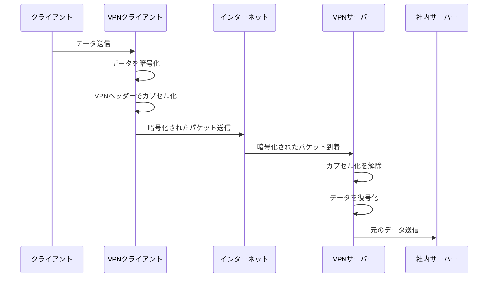
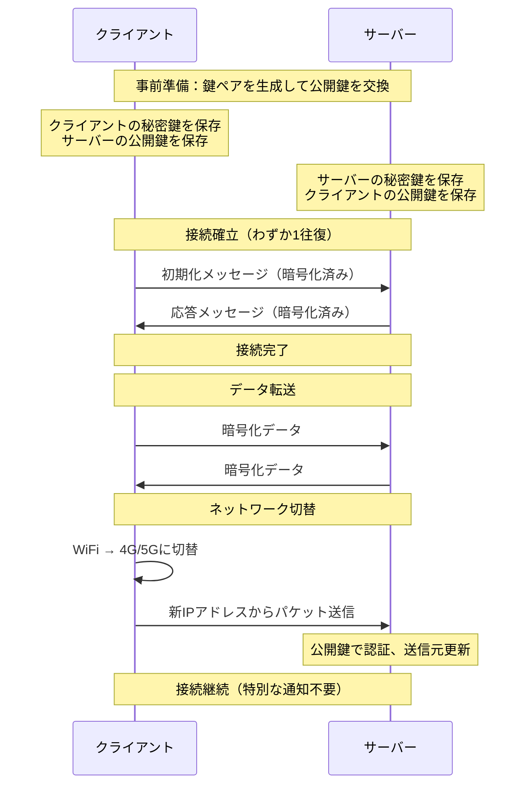
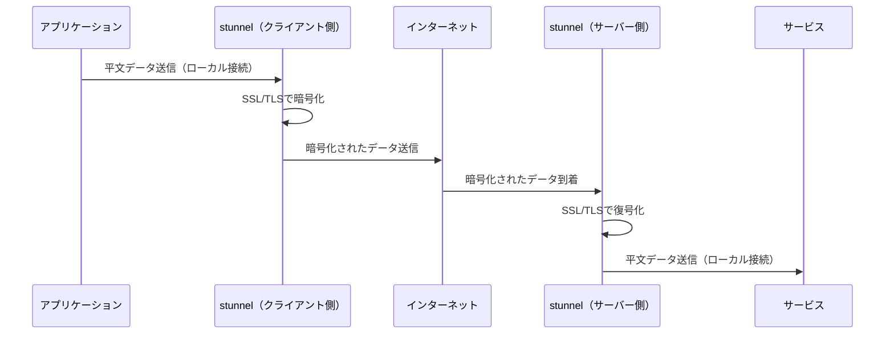
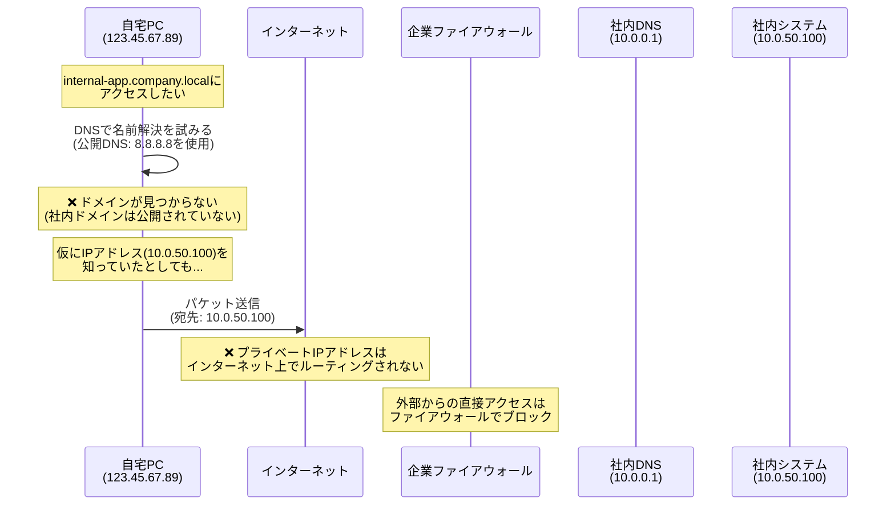
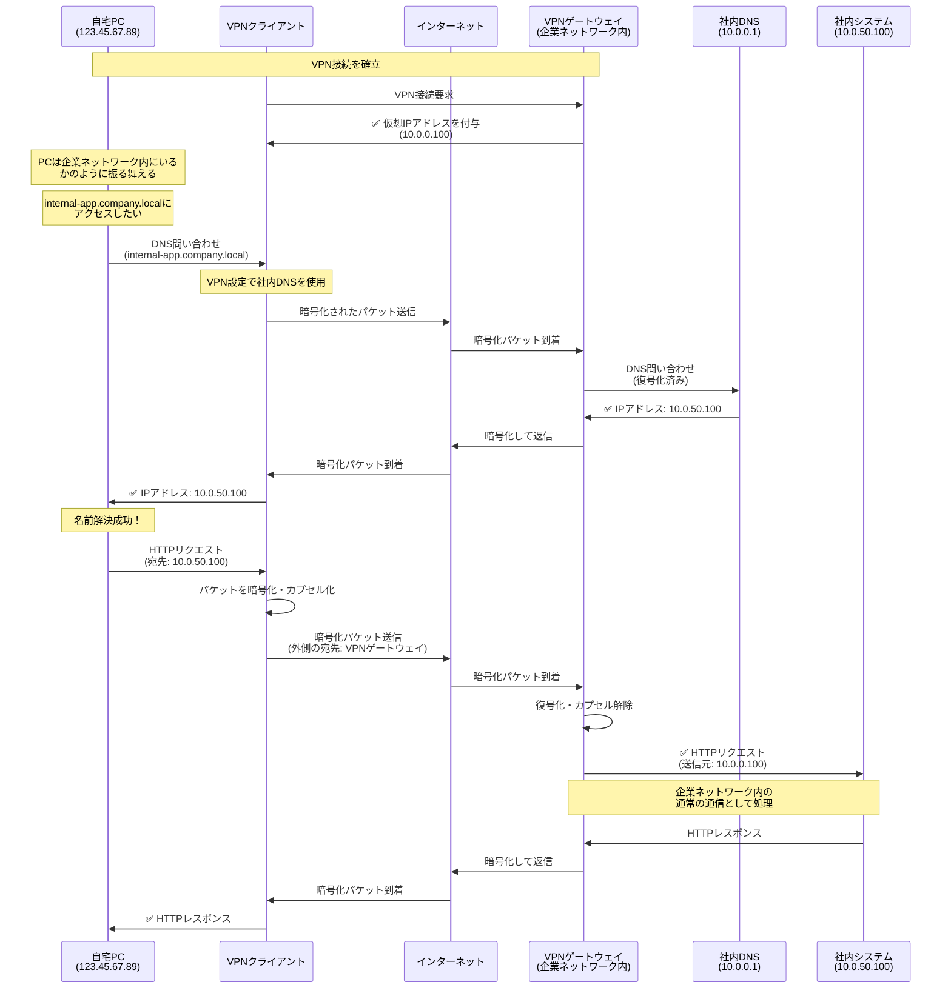

# Zenn問答とは

「Zenn問答」とは、開発していて「なんとなく使ってるけど、ちゃんと理解してるかな？」という技術について、改めて時間をとって深掘りしてみようという企画です🧘🧘🧘

# はじめに

社内ネットワークに接続する際、多くの方がVPNを使っていると思います。リモートワークの普及により、VPN接続はより日常的なものとなりました。

「通信が盗聴されないように暗号化されている」ということは理解していて、いくつかの種類があることは理解していましたが、改めてその詳細な仕組みまで理解しているかと言われると自信がありませんでした。

ということで今回は、VPNについて改めて時間をとって深掘りしてみます。

# VPNの誕生の経緯

VPN（Virtual Private Network）は、1990年代中頃にインターネットの商用利用が本格化する中で誕生しました。

## なぜVPNが必要だったのか

それ以前、企業が複数拠点間でセキュアな通信を行うには、専用線を利用するのが一般的でした。しかし、専用線には大きな問題がありました。

**専用線の課題**
- 月額コストが非常に高額（拠点間の距離に応じて数十万〜数百万円）
- 拠点追加のたびに新たな回線契約が必要
- 導入までに数週間〜数ヶ月の期間が必要
- 物理的な回線のため柔軟性に欠ける

## インターネットVPNという発想

「すでに普及しているインターネット回線上に、暗号化技術を使って仮想的な専用線を作れないか」という発想から、VPNが生まれました。

1996年、MicrosoftがPPTP（Point-to-Point Tunneling Protocol）を開発し、Windows NTに実装しました。これが最初の広く普及したVPNプロトコルとなりました。

その後、セキュリティの強化と標準化のため、IETFがIPSecを策定し、VPNは企業インフラとして定着していきました。

## リモートワークの普及とVPN

2020年代のリモートワーク普及により、VPNの用途は拠点間接続から、個人ユーザーの企業ネットワークへのリモートアクセスへと大きく広がりました。

この変化に伴い、より軽量で高速なプロトコル（WireGuard、IKEv2など）が注目されるようになりました。

# VPNの基本的な仕組み

VPNは主に2つの技術を組み合わせて実現されています。

## 1. トンネリング

トンネリングとは、あるネットワークプロトコルのパケットを別のプロトコルでカプセル化する技術です。

元のパケットが「荷物」、VPNヘッダーが「外箱」のようなイメージです。外からは中身の荷物（元のパケット）が見えません。

## 2. 暗号化

トンネリングだけでは、パケットの中身を覗かれる可能性があります。そこで、カプセル化されたデータを暗号化します。

この2つの技術により、インターネット上でも安全な通信が実現できます。

## VPNの2つの主な利用形態

VPNには大きく分けて2つの利用形態があります。

### サイト間VPN（Site-to-Site VPN）

企業の拠点間を接続するVPNです。各拠点のルーターやファイアウォールにVPN機能を設定し、拠点間をセキュアに接続します。

### リモートアクセスVPN

個人のPCやスマートフォンから企業ネットワークに接続するVPNです。リモートワークで使用するのは主にこちらのタイプです。

# 主要なVPNプロトコルの種類と特徴

VPNにはさまざまなプロトコルが存在します。それぞれの誕生時期と特徴を見ていきましょう。

## プロトコルの歴史

| プロトコル | 登場年 | 開発元 | 主な特徴 |
|------------|--------|--------|----------|
| PPTP | 1996 | Microsoft | 初期の広く普及したVPNプロトコル。現在は非推奨 |
| L2TP/IPSec | 1999 | IETF | PPTPの後継。IPSecと組み合わせて使用 |
| IPSec | 1995年代 | IETF | 業界標準のセキュアな通信プロトコル |
| OpenVPN | 2001 | James Yonan | オープンソース、高い互換性とセキュリティ |
| IKEv2/IPSec | 2005 | Microsoft & Cisco | モバイル環境に最適。ネットワーク切替に強い |
| WireGuard | 2016 | Jason A. Donenfeld | 最新プロトコル。シンプルで高速 |

こう見ると本当に結構最近開発されたプロトコルもあって面白いですね。

# 各プロトコルの詳細

今でもよく使われるプロトコルについて少し詳細に取り上げます。

## IPSec（Internet Protocol Security）

**主な特徴**
- IETF標準でほぼすべてのVPN対応機器に実装されており、異なるベンダー間でも互換性が高い
- ネットワーク層で動作するため、拠点全体のトラフィックを透過的に暗号化
- IPパケット全体を暗号化（トンネルモード）し、強力なセキュリティを実現

**利用シーン**
- 企業拠点間を接続するサイト間VPN
- 異なるベンダーの機器を組み合わせる環境
- 長期的に安定した接続が必要な拠点間通信

**接続の仕組み**

2段階で接続を確立します（合計4〜6往復）。

1. **フェーズ1** - 鍵交換用の安全な通信路を作る（2〜3往復）
2. **フェーズ2** - データ転送用の暗号化設定を決める（2〜3往復）
3. **データ転送** - 確立した設定で通信開始

## OpenVPN

**主な特徴**
- HTTPSと同じSSL/TLSを使用するため、信頼性が高く広く普及
- ポート443を使えるため、ファイアウォールを通過しやすい
- オープンソースでクロスプラットフォーム対応

**利用シーン**
- 企業のリモートアクセスVPN
- ファイアウォールが厳しい環境でのリモートワーク
- プライバシー重視のVPNサービス

**接続の仕組み**

HTTPSと同じ流れで接続します（合計2〜3往復）。

1. **TLSハンドシェイク** - 証明書でサーバーを検証（1〜2往復）
2. **ユーザー認証** - ユーザー名とパスワードで認証（1往復）
3. **データ転送** - 暗号化通信を開始

## IKEv2/IPSec

**主な特徴**
- Wi-Fiから4G/5Gへの切替時もVPN接続が切断されない（MOBIKE機能）
- わずか2往復で接続確立でき、従来のIPSecより高速
- Windows、macOS、iOS、Androidで標準サポート

**利用シーン**
- スマートフォンやタブレットからのVPN接続
- 移動中やネットワークが頻繁に切り替わる環境
- Azure VPN Gatewayなどのクラウドサービス

**接続の仕組み**

IPSecを改良し、高速に接続します。

1. **初期化** - 暗号化方式の合意と鍵交換を同時実行（1往復）
2. **認証** - 認証とデータ転送設定を同時実行（1往復）
3. **データ転送** - 暗号化通信を開始
4. **MOBIKE** - ネットワーク切替時も接続を自動維持

## WireGuard

**主な特徴**
- わずか約4,000行のコード（OpenVPNの約1/37）でシンプル
- OpenVPNの約3倍以上の速度とデータ効率、バッテリー効率に優れる
- 最新の暗号化技術を使用し、設定がシンプル

**利用シーン**
- 高速な通信が必要な環境
- モバイルデバイスからのリモートアクセス
- IoTなどリソースが限られたデバイス

**接続の仕組み**

SSH鍵認証と似た考え方で、非常にシンプルです。

公開鍵の交換はモバイルアプリのQRコードなどの手段で行うのが一般的みたいです。

# 他の暗号化通信手段との違い

VPN以外にも、通信を暗号化する手段はいくつか存在します。それぞれの違いを見ていきましょう。

## SSH Tunnel

SSH（Secure Shell）のポートフォワーディング機能を使って、暗号化されたトンネルを作る手法です。

**仕組み**

**VPNとの違い**

| 項目 | VPN | SSH Tunnel |
|------|-----|------------|
| **動作レベル** | OS全体（ネットワーク層） | アプリケーションごと |
| **設定の範囲** | 全通信を自動でルーティング | アプリごとにプロキシ設定が必要 |
| **セットアップ** | VPNサーバーの構築が必要 | SSHサーバーがあればOK |
| **用途** | 企業ネットワークへの接続 | 特定アプリの通信を暗号化 |
| **透過性** | 完全に透過的 | アプリがプロキシ対応している必要あり |

SSH Tunnelは「貧者のVPN（Poor man's VPN）」と呼ばれることがあります。VPNほど包括的ではありませんが、手軽に特定の通信を暗号化できます。

## stunnel

stunnelは、SSL/TLSトンネルを提供するユーティリティです。

**仕組み**

**特徴**
- SSL/TLS暗号化に対応していないサービスを暗号化できる
- 両端（クライアントとサーバー）にstunnelの設定が必要
- 特定のポート・サービスに特化

## 比較まとめ

| 技術 | 動作レベル | 透過性 | 設定の複雑さ | 主な用途 |
|------|-----------|--------|------------|---------|
| **VPN** | OS全体 | 完全に透過的 | 中〜高 | 企業ネットワーク接続、全通信の保護 |
| **SSH Tunnel** | アプリケーション単位 | アプリがプロキシ対応している必要あり | 低 | 特定アプリの通信保護、開発環境 |
| **stunnel** | アプリケーション単位 | サービスレベルで透過的 | 中 | レガシーサービスのSSL化 |
| **HTTPS** | アプリケーション層 | Webブラウザで透過的 | 低（サーバー側のみ） | Webトラフィックの保護 |

# おまけ：なぜVPNを繋ぐと社内システムにアクセスできるのか

「VPNを繋いでいないと社内システムにアクセスできない」という当たり前のことですが、その仕組みを改めて図解してみます。

## VPN接続なしの場合

**なぜアクセスできないのか**

1. **DNS解決の問題**: 社内ドメイン（例: `internal-app.company.local`）は社内DNSサーバーにしか登録されていないため、外部の公開DNSでは名前解決できない
2. **プライベートIPアドレス**: 社内システムはプライベートIPアドレス（10.0.0.0/8など）を使用しており、インターネット上ではルーティングできない
3. **ファイアウォール**: 仮にIPアドレスを知っていても、企業のファイアウォールが外部からの直接アクセスをブロックしている

## VPN接続ありの場合

**なぜVPNを繋ぐとアクセスできるのか**

1. **仮想的に企業ネットワーク内に参加**: VPNゲートウェイがクライアントに企業ネットワーク内の仮想IPアドレスを付与し、あたかも社内にいるかのように扱われる
2. **社内DNSが使える**: VPN接続時にDNS設定が自動的に社内DNSサーバーに切り替わり、社内ドメインの名前解決ができる
3. **ファイアウォールの内側からのアクセス**: VPNゲートウェイが企業ネットワーク内に設置されているため、そこから社内システムへのアクセスは「内部からのアクセス」として扱われ、ファイアウォールを通過できる
4. **暗号化トンネル**: インターネット上では暗号化されたパケットとして送信されるため、盗聴されても中身は読めない

# まとめ

今回はVPNについて改めて深掘りしてみました。

単に「通信を暗号化して経路を確立するもの」という理解から、様々なプロトコルがあるものの、結局暗号化してヘッダーつけて通信をしていることを理解しました。

トンネリングとかいう言葉は前々から知っていたのですが、あんまり何をしているがイメージがついていませんでした。調べてみて、VPNサーバーって結構重要な役割をしているなと感じました。VPNサーバーが攻撃対象になったら大変だ・・・

最後まで読んでいただき、ありがとうございました🙏
