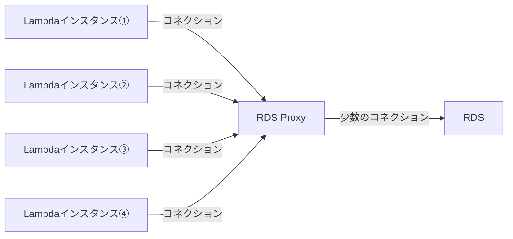
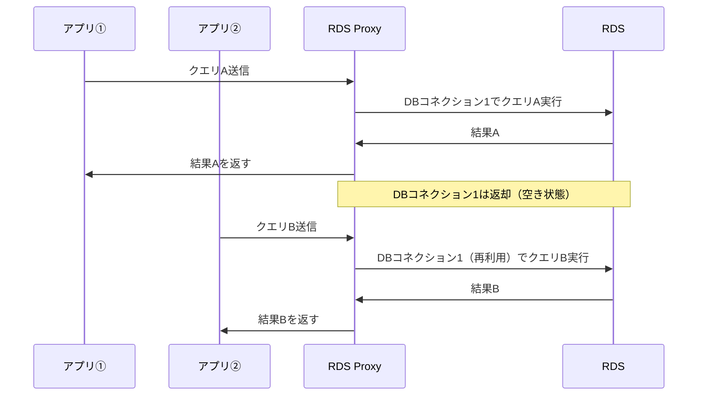
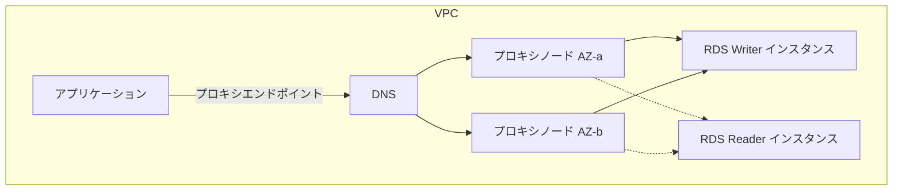
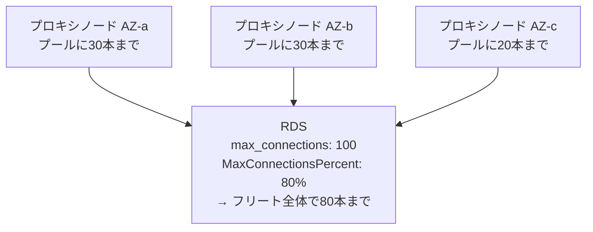
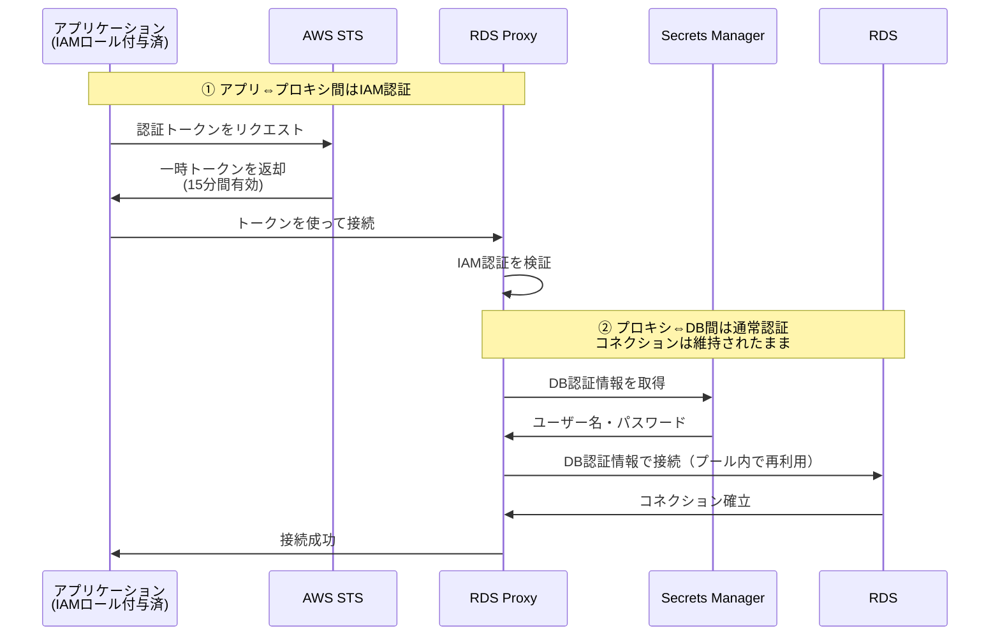
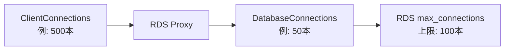

# Zenn問答とは

「Zenn問答」とは、開発していて「なんとなく使ってるけど、ちゃんと理解してるかな？」という技術について、改めて時間をとって深掘りしてみようという企画です🧘🧘🧘

# はじめに

RDS Proxy、問題になることも少なく、概要だけ把握して終わってしまっています。
「Lambdaみたいなサーバーレスアーキテクチャと相性が良い」「コネクションを効率的に管理してくれる」というのはなんとなく知っているのですが、具体的にどういう仕組みなのか、モニタリングするときはどういう観点でメトリクスを見ればいいのか、あまり自信を持って答えられません。

今回はRDS Proxyについて改めて深掘りし、「なんとなく」を「ちゃんとわかっている」に変えていきたいと思います。

# RDS Proxyとは

RDS ProxyはAWSが提供する、フルマネージドのデータベースプロキシです。アプリケーションとRDS（またはAurora）の間に位置し、コネクションを一元管理します。

RDS Proxyを使わない場合、アプリケーションの各インスタンスがRDSに対して直接コネクションを張ります。Lambda関数のようにリクエストのたびに起動・終了を繰り返す環境では、このコネクションの張り直しが頻繁に発生します。コネクション確立にはTCPのハンドシェイクや認証が必要なため、無視できないオーバーヘッドとなります。

RDS Proxyがあれば、アプリケーションはプロキシに対してコネクションを張るだけです。プロキシがRDSとのコネクションを保持・再利用するため、アプリ側はコネクションのライフサイクルを意識する必要がなくなります。

RDS ProxyはMySQL・PostgreSQL互換のRDS、およびAuroraで利用できます。

# 仕組み

RDS Proxyの核心は **コネクションプーリング** と **多重化** です。この2つを理解すれば、RDS Proxyがなぜ有効なのかがわかります。

## コネクションプーリング

コネクションプーリングとは、事前に一定数のDBコネクションを確立しておき、アプリからのリクエストが来たときにプールから貸し出し、終わったら返却する仕組みです。

RDS Proxyではこれをマネージドサービスとして提供します。アプリ側はプロキシのエンドポイントに接続するだけで、プロキシが裏でプールを管理してくれます。アプリ側のコードにコネクションプールのライブラリを組み込む必要がなく、Lambdaのようにステートを持ちにくいサーバーレス環境でも恩恵を受けられます。

## 多重化（マルチプレキシング）

RDS Proxyの多重化とは、複数のクライアントコネクションを、より少数のデータベースコネクションに集約する仕組みです。

アプリ①がクエリを送信してレスポンスを受け取ったあと、そのDBコネクションは再びプールに戻ります。次にアプリ②がクエリを送信すると、プールにある同じDBコネクションを使い回せます。このように、トランザクションの境界ごとにDBコネクションを自動的に貸し借りすることで、少ないDBコネクション数でも多数のクライアントのリクエストをさばけます。

## セッションピンニング

多重化が常に有効に機能するわけではありません。特定の操作はDBコネクションに固有の状態を作り出すため、プロキシはその後のリクエストを同じDBコネクションに固定（ピン留め）する必要があります。これを **セッションピンニング** と呼びます。

ピンニングが発生する代表的な操作は以下の通りです。

**MySQLの場合**
- ユーザー変数（`SET @var = value`）
- 一時テーブルの作成（`CREATE TEMPORARY TABLE`）
- サーバー側プリペアドステートメント（`PREPARE`）
- `LOCK TABLES`

**PostgreSQLの場合**
- `SET`文（`SET search_path = myschema`など）
- 一時テーブルの作成
- アドバイザリロック

## プリペアドステートメントとピンニングの関係

プリペアドステートメントについては少し注意が必要な場合があるみたいです。「アプリ側で `prepare → execute → 解放` まできちんと行えばピンニングは起こらないのでは？」と思いたくなるところですが、実はそうではないみたい。

ここで問題になるのは **サーバー側プリペアドステートメント** です。これは、SQLを事前にDB側で準備しておき、後からパラメータだけを渡して実行する仕組みです。RDS Proxyは `PREPARE` 文を検知した瞬間に「このDBコネクションはピン留め」と判断します。`DEALLOCATE` で明示的にステートメントを解放しても、ピン自体は外れません。クライアントがコネクションを切るまでピン留めが続きます。

つまり「コネクション貼りっぱなし」が直接的な原因ではなく、「サーバー側プリペアドステートメントを使う」こと自体がピンニングを引き起こします。JDBCやpsycopg2など多くのドライバはデフォルトでサーバー側プリペアドを使うため、知らないうちにピンニングしているケースが多いです。

避けたい場合は、ドライバの設定でクライアント側プリペアドステートメント（アプリ側でプレースホルダを展開してから送信する方式）に切り替える方法があります。MySQL Connector/Jの `useServerPrepStmts=false`、psycopg2の `prepare_threshold=None` などが該当します。

ので、気をつけないと実はRDS Proxyがただの中継地点としての役割しか果たしていない可能性があります。

## アドバイザリロックについて

PostgreSQLのアドバイザリロックは、データそのものではなく **アプリが任意に決めた数値の識別子に対してロックを取る** 仕組みです。例えば「ジョブIDが123のバッチ処理は同時に1つだけ実行する」といった用途で使われ、`pg_advisory_lock(123)` で取得し、`pg_advisory_unlock(123)` で解放します。

このロックには2種類あります。

| 種類 | スコープ | 解放タイミング |
|------|---------|---------------|
| `pg_advisory_lock` | セッション | 明示的にunlockするかセッション終了まで |
| `pg_advisory_xact_lock` | トランザクション | トランザクション終了時に自動 |

セッションスコープのロックがピンニングを引き起こすのは、ロックがDBコネクションに紐づいた状態として残るためです。プロキシが別のクライアントに同じDBコネクションを貸し出すと、意図せずロックの所有権を引き継いでしまう恐れがあります。これを避けるため、RDS Proxyはアドバイザリロックを検知した時点でピン留めします。

トランザクションスコープ（`pg_advisory_xact_lock`）を使えば、トランザクション終了時に確実に解放されるためピンニングを回避しやすくなります。

ピンニングが発生すると、そのクライアントコネクションは専用のDBコネクションを独占します。この間は多重化が効かなくなるため、コネクションプールを圧迫する原因になります。

# 内部アーキテクチャ

RDS Proxyの内部がどうなっているかを見ていきましょう。

## プロキシフリートと高可用性

RDS Proxyは、複数のプロキシノードが「フリート」と呼ばれる集団として動作しています。フリートとは、同じ役割を持つサーバー群がまとまって動作する単位のことで、AWSのマネージドサービスの裏側でよく使われる表現です。利用者はその中のどのノードに接続されているかを意識する必要はなく、エンドポイント経由で透過的に利用できます。

これらのノードは複数のAZに分散配置されており、あるノードで障害が起きた場合は、DNSが自動的に別のノードに切り替わります。アプリ側は同じプロキシエンドポイントに接続し続けるだけで、可用性が担保されます。

## コネクションプールの保持場所と全体の上限

各プロキシノードはそれぞれがコネクションプールを保持しています。アプリからのクエリは、接続したノードのプールにあるDBコネクションを介してRDSに送られます。

ここで気になるのが「ノードごとに独立してプールを持っているなら、合計するとRDSの上限を超えないか？」という点です。RDS Proxyにはこれを防ぐために **MaxConnectionsPercent** という設定があり、フリート全体としてRDSに張れる最大コネクション数をRDSの `max_connections` のパーセンテージで指定します。

例えばRDSの `max_connections` が100で `MaxConnectionsPercent` を80%にした場合、フリート全体で最大80本のDBコネクションまで使えます。ノードごとのプールは独立していますが、フリート内部で全体の使用数を調整しているため、合計が上限を超えることはありません。

残りの20%は、メンテナンス用途や管理ツールからの直接接続用に空けておく、というのが一般的な設計です。

# RDS Proxyを使うメリット

ここまでで仕組みと内部アーキテクチャを見てきました。これらを踏まえると、RDS Proxyを使うことで得られるメリットがいくつか整理できます。

## コネクション管理の負担をアプリから切り離せる

最も大きなメリットは、コネクション管理をプロキシに委ねられる点です。Lambdaのようにステートを持たないサーバーレス環境では、アプリ側でコネクションプールを保持し続けることが難しいですが、プロキシがその役割を肩代わりしてくれます。アプリは「必要なときに繋いで、終わったら切る」というシンプルな実装で済みます。

## Secrets Managerとの統合で認証情報を一元管理できる

RDS ProxyはAWS Secrets ManagerにDBの認証情報（ユーザー名・パスワード）を保管し、そこから取得してRDSに認証します。これにより、アプリケーションのコード内やEnvironment VariablesにDB接続情報を直書きしなくて済みます。

さらに、Secrets ManagerでDBパスワードを自動ローテーションするよう設定しておけば、アプリ側はプロキシのエンドポイントに接続し続けるだけで、パスワード変更の影響を受けなくなります。アプリのデプロイなしでパスワードを更新できるのは、運用上の大きなメリットです。

## IAM認証をスケールさせやすくできる

IAM認証自体は、RDS Proxyを挟まなくても普通のRDSやAuroraで使えます。アプリがSTSから一時トークンを取得し、そのトークンをパスワード代わりに使って直接DBに接続する、などで実現できます。

ではRDS Proxyを挟むと何が違うかというと、**IAM認証をスケール環境でも実用的に使えるようにする** 点です。

直接接続でIAM認証する場合、新規接続のたびにアプリがSTSへトークンをリクエストし、そのトークンでDB認証を行います。これはLambdaの大量同時起動などスケールアウトする環境で問題になります。

- DB側には新規接続レートの上限がある（Aurora MySQLで毎秒200接続など）
- スケール時に大量の同時接続が発生するとレート制限に引っかかる
- 接続のたびにSTSコールのオーバーヘッドが乗ってくる

RDS Proxyを挟むと、IAM認証は「アプリ⇔プロキシ」の区間だけに限定されます。「プロキシ⇔DB」の区間はSecrets Managerから取り出したパスワードで認証され、コネクションが持続的に維持されるため、DBへの新規接続レートを抑えられます。

この構成のメリットは以下の通りです。

- DBへの新規接続レート制限に引っかかりにくくなる
- アプリ側のSTSコール頻度を抑えられる
- DBパスワードは完全にプロキシ側に閉じ込められ、アプリはIAMロールの権限だけで完結する

「IAM認証ができる」というよりも、「サーバーレスなど大量接続が発生する環境でもIAM認証を現実的に使えるようにする」のがRDS Proxyの価値です。

## フェイルオーバー時間の短縮

RDSのフェイルオーバー（WriterがReaderに切り替わる）が発生した場合、通常はDNSの切り替えが完了するまでの数十秒間、アプリがDBに接続できなくなります。RDS Proxyを使うと、プロキシ自身が新しいWriterへコネクションを確立し直すためフェイルオーバー時間が短縮されます。アプリはプロキシのエンドポイントに接続したままでよく、フェイルオーバーによる影響が小さくなります。

# 不向きなケース

RDS Proxyは万能ではなく、逆に不向きなケースも存在します。

## 長時間トランザクションやバッチ処理

RDS Proxyが真価を発揮するのは、コネクションが短期間で張られ解放されるパターンです。長時間のトランザクションやバッチ処理では、1本のDBコネクションが長時間占有されるため、多重化の効果がほとんど得られません。むしろプロキシを経由する分だけレイテンシが若干増えるため、逆効果になる場合があります。

## ピンニングを多用するアプリケーション

前述の通り、MySQLのユーザー変数やPostgreSQLのSET文を多用するアプリケーションではピンニングが頻発します。ピンニングが多いほど多重化の恩恵が薄れ、コネクション数の節約になりません。

## 超低レイテンシが求められるユースケース

RDS Proxyを経由する場合、プロキシを1つ介在させる分のネットワークレイテンシ（数ms程度）が加わります。1ms単位の応答速度が求められる高頻度トレードシステムなど、ごく一部の超低レイテンシ要件には不向きです。

## 常時少数の長期コネクションで足りるケース

常駐するAPIサーバーが数台しかなく、コネクション数が少ない構成では、コネクションプーリングの恩恵はほとんどありません。RDS Proxyにも追加の料金（使用したvCPU時間）が発生するため、コスト対効果を慎重に検討する必要があります。

## アプリ側で十分なコネクションプール管理ができているケース

「普通のコンテナアプリ（ECSやEKSで動くもの）だとRDS Proxy要らないのでは？」という疑問もよく出てきます。これに対する答えは、**ケースバイケース** です。

コンテナアプリの場合、HikariCPやSQLAlchemyなどのコネクションプールライブラリをアプリ側に組み込み、コネクションを使い回す実装が一般的です。コンテナ数が固定で、各コンテナのプールサイズも適切に設定されている状況では、RDS Proxyを挟む積極的な理由は薄くなります。プロキシ経由のレイテンシ追加分や料金分が、得られるメリットを上回ってしまうこともあります。

ただし、以下のようなケースではコンテナアプリでもRDS Proxyを検討する価値があります。

- **オートスケーリングでコンテナ数が動的に増減する** - スケールアウト時にプール分のコネクションが一気に増えると、RDSの上限を超えるリスクがある
- **複数のサービスが同じRDSに接続する** - サービスごとにプールを持つと合計が爆発しやすい
- **フェイルオーバー時間を短くしたい** - これはコネクション管理とは別軸のメリット
- **Secrets ManagerやIAM認証で認証情報をプロキシに寄せたい** - セキュリティ要件としての採用

なので「不向き」と断言するよりは、「コンテナアプリのデフォルト構成ではメリットが薄いことが多い。スケール戦略やセキュリティ要件によって判断する」というのが実情に近いと思います。

# 監視した方がよさそうなメトリクス

RDS Proxyが正常に機能しているかどうかを確認するために、CloudWatchで見るべきメトリクスを整理します。

## ClientConnections（アプリ→プロキシのコネクション数）

アプリケーションからRDS Proxyに張られているコネクションの総数です。急増や異常な増加がないかを監視します。アプリのデプロイ後にコネクションが増えたままリークしていないかのチェックにも使えます。

## DatabaseConnections（プロキシ→RDSのコネクション数）

プロキシからRDSへのコネクション数です。RDSには `max_connections` という接続数の上限があり、これに近づくと新規のクエリが待機または失敗します。**RDS Proxyを使う最大の目的のひとつは、このDatabaseConnectionsをRDSの上限以内に収めること** です。

ClientConnectionsに比べてDatabaseConnectionsが少ないほど多重化が効いている証拠です。逆にほぼ同数であれば、多重化がほとんど機能していない可能性があります。

## ConnectionBorrowLatency（コネクション取得待ち時間）

アプリがプロキシにコネクションを要求してから、実際にDBコネクションが割り当てられるまでの待ち時間です。プールが枯渇しているとこの値が増加します。

このメトリクスが高い場合は以下を確認します。

- DatabaseConnectionsが上限に達していないか
- ピンニングが多発していてプールの空きが少なくなっていないか
- RDSのmax_connectionsの設定値が小さすぎないか

## Pinning（ピンニング発生率）

セッションピンニングが発生した割合です。この値が高いほど多重化が効いていないことを意味します。

Pinningが高い場合はCloudWatchのログでどのようなSQLがピンニングを引き起こしているかを確認し、アプリケーション側で対処できないか検討します。例えば、MySQLのユーザー変数を使わない書き方に変えるといった対処が考えられます。

## メトリクスのまとめ

| メトリクス | 何を見るか | アラートの目安 |
|-----------|-----------|-------------|
| DatabaseConnections | Proxy→RDS間のコネクション数 | RDSのmax_connectionsの80%超 |
| ClientConnections | アプリ→Proxy間のコネクション数 | 急増・リークの検出 |
| ConnectionBorrowLatency | コネクション取得待ち時間 | 通常より明らかに増加した場合 |
| Pinning | ピンニング発生率 | 高い場合はSQL見直しを検討 |

これらを組み合わせることで、「コネクションが増えているのはアプリが増えたせいか」「プロキシがボトルネックになっているのか」「多重化が効いているのか」を判断できます。

# まとめ

RDS Proxyについて改めて整理してみました。

「なんとなく Lambdaと相性がいい」という理解で止まっていましたが、どういう場合にメリットがあるか、どういう場合にデメリットがあるかがより解像度上がってわかりました。今後導入、除却するときの気にしなければいけない点も観点が増えた気がします。

最後まで読んでいただき、ありがとうございました🙏
