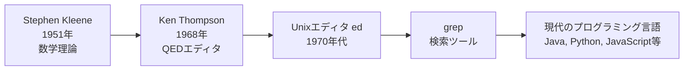
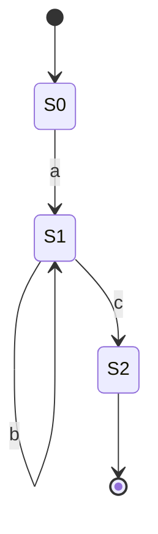
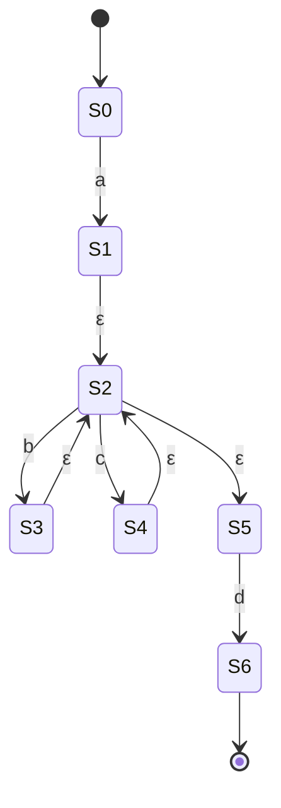
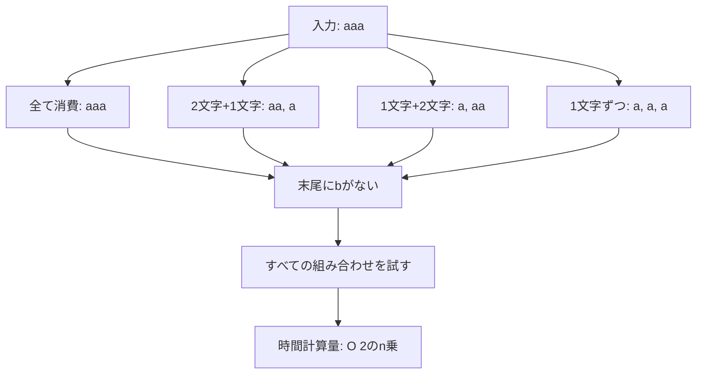

# Zenn問答とは

「Zenn問答」とは、開発していて「なんとなく使ってるけど、ちゃんと理解してるかな？」という技術について、改めて時間をとって深掘りしてみようという企画です🧘🧘🧘

# はじめに

正規表現は、メールアドレスのバリデーションやログファイルの解析など、日常的なプログラミングで頻繁に使う強力なツールです。`^\w+@\w+\.\w+$`のようなパターンを書けば、複雑な文字列マッチングが簡潔に表現できます。

しかし、いろんなパターンをマッチできてすごいなと思う一方で、「どのように実装されているのか」が気になっていました。

今回は、正規表現の歴史から実装方式、そしてセキュリティリスク（ReDoS攻撃）まで深掘りしてみます。

# 正規表現の誕生と歴史

## 数学的起源 (1950年代)

正規表現の起源は意外にも数学の世界にあるようです。

1950年代、数学者の**スティーヴン・クリーネ (Stephen Kleene)** が、正規集合 (regular set)、正規言語 (regular language)、正規表現 (regular expression) などの概念を発明しました。彼は1951年に、ニューラルネットワークを記述するための正規表現を考案しています。

クリーネは、帰納的関数論という数理論理学の分野を創始した一人でもあり、正規表現は当初、神経回路のモデル化という生物学的な問題を解決するために生まれた理論でした。

「0回以上の繰り返し」を意味するアスタリスク `*` を「クリーネ閉包 (Kleene closure)」や「クリーネスター (Kleene star)」と呼ぶのは、彼の名前に由来しています。

## コンピュータへの応用 (1968年)

数学理論として生まれた正規表現が、実際のコンピュータプログラムに応用されたのは1968年です。

**Ken Thompson** が、Communications of the ACMに「Regular Expression Search Algorithm」という論文を発表しました。この論文では、正規表現を効率的にマッチングする方法と、その実装が紹介されています。

Thompsonは、IBM 7094向けに正規表現をJIT (Just-In-Time) コンパイルする方法を考案し、QEDテキストエディタに実装しました。この技術は後にUnixエディタ `ed` に取り入れられ、さらに有名な検索ツール `grep` の誕生につながります。

:::message
`grep` という名前の由来は、`ed` エディタのコマンド `g/re/p` (Global search for Regular Expression and Print matching lines) から来ています。
:::



現在、ほとんどすべてのプログラミング言語がサポートしている正規表現は、Thompsonの記法をベースにしています。

# 正規表現の実装方式

正規表現エンジンには、大きく分けて2つの実装方式があります。DFAとNFAです。

## DFA (決定性有限オートマトン) 方式

DFA (Deterministic Finite Automaton) 方式は、各状態から次の状態への遷移が一意に決まる方式です。

「決定性」という名前の通り、ある状態で特定の文字を読んだときに、次にどの状態に遷移するかが常に1つに決まります。これにより、一度通った道を戻ることなく、文字列を先頭から末尾まで一方向に読み進めるだけでマッチングが完了します。

### DFAの特徴

**メリット**

- **線形時間保証**: 入力文字列の長さに対して常に線形時間 O(n) で処理が完了します
- **ReDoS攻撃に強い**: 計算量が保証されているため、悪意ある入力でも性能が劣化しません
- **予測可能な性能**: 最悪ケースでも性能が安定しています

**デメリット**

- **メモリ消費が大きい**: 正規表現によっては状態数が指数関数的に増加します
- **機能が制限される**: 後方参照 (backreference) やlookahead/lookbehindなどの高度な機能が実装できません

### DFAを使用しているツール

- `awk`
- `egrep` (一部の実装)
- `lex`
- Google RE2 (Go言語の正規表現エンジン)

### DFAのアルゴリズム例

簡単な正規表現 `ab*c` を例に、DFAの動作を見てみましょう。この正規表現は「`a` の後に0個以上の `b` が続き、最後に `c` で終わる」という意味です。



#### 各状態の意味

DFAでは、各状態から次の状態への遷移が一意に決まります。

- **状態S0（初期状態）**: マッチング開始時の状態
  - この状態では、最初に `a` が来ることを期待しています
  - `a` を読むと状態S1へ遷移
  - `a` 以外の文字が来たら、マッチ失敗（エラー状態へ）

- **状態S1（中間状態）**: `a` を読み終わった後の状態
  - `b` を何度読んでも、この状態S1に留まります（自己ループ）
  - `c` を読むと、最終状態S2へ遷移
  - つまり、「0個以上の `b`」の部分を処理しています

- **状態S2（受理状態）**: マッチング成功
  - この状態に到達すれば、パターンにマッチしたことになります
  - これ以上文字がなければ、マッチ成功

#### マッチング過程の詳細

入力文字列 `abbc` をマッチングする過程を詳しく見てみましょう。

```
入力文字列: a  b  b  c
状態遷移:   S0 → S1 → S1 → S1 → S2

詳細:
1. 初期状態S0から開始
2. 文字 'a' を読む → S0からS1へ遷移
3. 文字 'b' を読む → S1からS1へ遷移（自己ループ1回目）
4. 文字 'b' を読む → S1からS1へ遷移（自己ループ2回目）
5. 文字 'c' を読む → S1からS2へ遷移
6. 状態S2（受理状態）に到達 → マッチング成功！
```

各文字を読むごとに状態が**必ず1つに決まる**ため、文字列を1回走査するだけでマッチングが完了します。これが「決定性」の意味です。

## NFA (非決定性有限オートマトン) 方式

NFA (Nondeterministic Finite Automaton) 方式は、各状態から複数の選択肢がある方式です。

「非決定性」という名前の通り、ある状態で特定の文字を読んだときに、次にどの状態に遷移するかが複数ある可能性があります。エンジンは選択肢を1つずつ試し、マッチしなければ前の分岐点に戻って別の選択肢を試します（バックトラック）。

### NFAの特徴

**メリット**

- **豊富な機能**: 後方参照、先読み (lookahead)、戻り読み (lookbehind) などの高度な機能が実装できます
- **メモリ効率が良い**: DFAと比べて状態数が少なく、メモリ消費が抑えられます
- **柔軟な表現**: より複雑なパターンマッチングが可能です

**デメリット**

- **バックトラックが発生**: マッチに失敗すると前の状態に戻って別の選択肢を試します
- **最悪ケースで指数時間**: 特定のパターンと入力の組み合わせで、計算量が O(2^n) になることがあります
- **ReDoS攻撃の脆弱性**: 悪意ある入力により、極端に処理時間が長くなる可能性があります

### NFAを使用している言語

- Java (`java.util.regex.Pattern`)
- Python
- Ruby
- JavaScript

### NFAのアルゴリズム例

正規表現 `a(b|c)*d` を例に、NFAの動作を見てみましょう。この正規表現は「`a` の後に、`b` または `c` が0回以上繰り返され、最後に `d` で終わる」という意味です。



#### 各状態の意味

NFAでは、ε遷移（文字を消費せずに状態遷移）や、複数の選択肢が存在します。

- **状態S0（初期状態）**: マッチング開始時の状態
  - `a` を読むと状態S1へ遷移

- **状態S1**: `a` を読み終わった後の状態
  - ε遷移で自動的に状態S2へ移動できます

- **状態S2（分岐点）**: `(b|c)*` の処理を管理する中心状態
  - ε遷移で3つの選択肢があります
    1. 状態S3へ（`b` を読む準備）
    2. 状態S4へ（`c` を読む準備）
    3. 状態S5へ（繰り返しを終了して `d` へ進む）
  - この**非決定性**がNFAの特徴です

- **状態S3**: `b` を読んだ後の状態
  - ε遷移で状態S2へ戻り、次の `b` または `c` を待ちます

- **状態S4**: `c` を読んだ後の状態
  - ε遷移で状態S2へ戻り、次の `b` または `c` を待ちます

- **状態S5**: 繰り返しを終了した状態
  - `d` を読むと最終状態S6へ

- **状態S6（受理状態）**: マッチング成功

#### マッチング過程の詳細

入力文字列 `abcd` をマッチングする過程を詳しく見てみましょう。

```
【初期状態】
現在の状態集合: {S0}

【文字 'a' を読む】
1. S0 --a--> S1
2. S1 --ε--> S2 (自動的に遷移)
3. S2 --ε--> S5 (選択肢の1つ)
現在の状態集合: {S1, S2, S5}
※ ε遷移により、同時に複数の状態に存在できます

【文字 'b' を読む】
1. S2 --b経由--> S3 が可能
2. S3 --ε--> S2 (自動的に戻る)
3. S2 --ε--> S5 (再び選択肢)
現在の状態集合: {S2, S3, S5}
※ S1とS5は 'b' を読めないので消える

【文字 'c' を読む】
1. S2 --c経由--> S4 が可能
2. S4 --ε--> S2 (自動的に戻る)
3. S2 --ε--> S5 (再び選択肢)
現在の状態集合: {S2, S4, S5}

【文字 'd' を読む】
1. S5 --d--> S6 が可能
現在の状態集合: {S6}
※ S6は受理状態なので、マッチング成功！
```

つまり、とりうる状態の組をもっておくというイメージがわかりやすそうです。

NFAでは、同時に複数の状態を追跡する必要があります。これをバックトラッキングで実装するか、複数状態を同時に保持するかによって、実装が異なります。

### NFAでしかできないこと

NFAの最大の利点は、**DFAでは実装不可能な高度な機能**をサポートできることです。

#### 1. 後方参照 (Backreference)

```javascript
// 同じ単語の繰り返しをマッチ
const pattern = /(\w+)\s+\1/;

pattern.test("hello hello");  // true
pattern.test("hello world");  // false
```

後方参照では、以前キャプチャした内容と同じ文字列をマッチさせます。これはDFAでは実装できません。

#### 2. 先読み・後読み (Lookahead/Lookbehind)

```javascript
// 先読み: 後ろに数字が続く文字列をマッチ（数字自体は含めない）
const lookahead = /\w+(?=\d+)/;
lookahead.exec("abc123");  // ["abc"]

// 後読み: 前に@がある文字列をマッチ（@自体は含めない）
const lookbehind = /(?<=@)\w+/;
lookbehind.exec("@username");  // ["username"]
```

先読み・後読みは、文字列を消費せずに条件を確認する機能です。これもDFAでは実装が困難です。

#### 3. キャプチャグループと複雑なグルーピング

```java
Pattern pattern = Pattern.compile("(\\d{4})-(\\d{2})-(\\d{2})");
Matcher matcher = pattern.matcher("2024-03-15");

if (matcher.matches()) {
    String year = matcher.group(1);   // "2024"
    String month = matcher.group(2);  // "03"
    String day = matcher.group(3);    // "15"
}
```

NFAでは、マッチした部分文字列を複数のグループに分けて取得できます。

### DFA vs NFA 詳細比較

| 特徴 | DFA | NFA |
|------|-----|-----|
| **時間計算量** | O(n) - 線形時間保証 | O(2^n) - 最悪ケースで指数時間 |
| **メモリ使用量** | 状態数が多い（最悪で2^m） | 状態数が少ない（最大でm+1） |
| **後方参照** | ❌ 不可能 | ✅ 可能 |
| **先読み/後読み** | ❌ 実装困難 | ✅ 可能 |
| **キャプチャグループ** | △ 限定的 | ✅ 完全サポート |
| **ReDoS攻撃** | ✅ 耐性あり | ❌ 脆弱 |
| **実装の複雑さ** | 高い | 低い |
| **用途** | 大量テキスト処理、安全性重視 | 高度な機能が必要な場合 |

# ReDoS (Regular expression Denial of Service) 攻撃

ReDoS (Regular expression Denial of Service) とは、**脆弱な正規表現を利用してサービスを停止させる攻撃**です。

NFA方式のエンジンは、複数の状態遷移の可能性がある場合、一つずつチェックしてマッチしなかったらバックトラックします。正規表現に曖昧さがあると、状態遷移の方法が膨大になり、バックトラックが増加して計算量が巨大になります。

例えば、ユーザーが入力した文字列を正規表現で検証するWebアプリケーションで、攻撃者が特別に細工した文字列を送信すると、サーバーのCPUリソースを長時間占有し、他のユーザーへのサービス提供ができなくなる可能性があります。

## 脆弱な正規表現のパターン

最も典型的な脆弱パターンは、**繰り返しの中に繰り返しがネストしている**パターンです。

```
/(a+)+b/;
```

このパターンで `aaaaaa...` (末尾に `b` がない) という入力を与えると、エンジンは以下のような組み合わせをすべて試します。

```
入力: "aaa"
試行される組み合わせ:
(aaa)+
(aa)(a)+
(a)(aa)+
(a)(a)(a)+
```

`a` が n 個の場合、試行回数は約 2^n に増加します。



その他、以下のようなパターンも典型的のようです。

- 繰り返しの選択肢
  - `/(a|a)*/`
- 空白の繰り返し
  - `/\s+$/`

## 実際の脆弱性の例

実際に、有名なライブラリでもReDoS脆弱性が発見されています。

**Lodash の事例 (CVE-2019-1010266)**

JavaScriptの人気ユーティリティライブラリであるLodashに、ReDoS脆弱性が発見されました。50,000文字の入力で約2秒のマッチング時間がかかると報告されています。

このように、実際の有名ライブラリでもReDoS脆弱性が見つかっております。文字数をある程度制限するのは大事だなぁと感じますね。

## ReDoS攻撃のデモコード

以下は、教育目的のReDoSデモです。実際の攻撃を試みないでください。

:::message 
現代のJavaの正規表現エンジン（特にJava 9以降）は、多くの典型的な脆弱パターンに対して最適化を行うようになっています。そのため、教科書的な `(a+)+` や `(a|a)*` のようなパターンでは、多くの環境で指数時間動作が観測できないことがあります。

これはJavaのエンジンが進化している証拠であり、良いことです。ただし、**すべてのパターンが最適化されているわけではない**ため、実際のアプリケーションでは依然として注意が必要です。
:::

### JavaScriptでの実行例

JavaScriptは最適化が少ないため、ReDoSの動作を観測しやすい言語です。

```javascript
// 脆弱な正規表現
const vulnerablePattern = /^(a+)+b$/;

console.log("入力長と処理時間の関係:");
console.log("----------------------------------------");

const lengths = [10, 15, 20, 25, 30];

for (const length of lengths) {
  const input = "a".repeat(length) + "X";  // 最後はXでマッチ失敗させる

  const startTime = performance.now();
  try {
    vulnerablePattern.test(input);
  } catch (e) {
    console.log(`Length ${length}: エラー発生`);
    continue;
  }
  const endTime = performance.now();

  const elapsedSeconds = (endTime - startTime) / 1000;
  console.log(`Length ${length}: ${elapsedSeconds.toFixed(4)} 秒`);
}
```

実行結果の例（Node）

```
Length 10: 0.0001 秒
Length 15: 0.0007 秒
Length 20: 0.0163 秒
Length 25: 0.2079 秒
Length 30: 5.8527 秒
```

入力が30文字でも6秒近くかかってしまっています。

### 実際のCVE事例

JavaでのReDoS脆弱性の実例:

- **CVE-2019-2945** (JDK): `Pattern.compile()` での特定のパターンでReDoS
- **CVE-2020-5404** (Spring Framework): HTTPメソッドバリデーションでのReDoS

これらは最適化をすり抜けた複雑なパターンで発生しました。

## ReDoS対策

- **検証済みライブラリを使用**
  - メールアドレスや電話番号などの一般的な検証には、独自の正規表現を書かず、検証済みのライブラリ（例: validator.js）を使いましょう。

- **正規表現の複雑さを避ける**
  - 特に `+` や `*` のネストを避けることが重要です。同じ文字列を複数の方法でマッチできるパターンは、バックトラックを引き起こします。

- **DFA方式のエンジンを使用**
  - Go (RE2)、Rust (regex クレート) など、線形時間が保証されるDFA方式のエンジンを使用することで、ReDoSのリスクを根本的に回避できます。

- **タイムアウトの設定**
  - 正規表現のマッチングにタイムアウトを設定することで、長時間の処理による影響を最小限に抑えられます。

- **静的解析ツールの利用**
  - safe-regex (Node.js)、redos-detector (Python) などのツールを使い、開発段階で脆弱な正規表現を検出しましょう。

# まとめ

正規表現について、その誕生から実装方式、セキュリティリスクまで深掘りしてみました。
正規表現の起源が結構以外なところにあって、個人的にはびっくりしました。言われてみれば納得できますが、今まではなんか変わった記法だなぁくらいの感覚しかなかったので、そこは勉強になりました。

また、脆弱性についてもO(2^n)になる可能性があるのは結構怖いなと思いました。50文字程度でも十分攻撃できてしまうので、なかなか怖いなというイメージです。
正規表現もなんだか使う機会が少しずつ少なくなっている気がしますが、長年の疑問がすっきりしてよかったです。最後まで読んでいただき、ありがとうございました🙏
