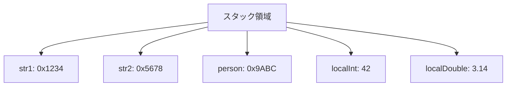
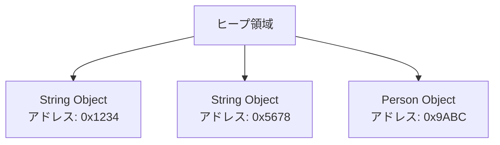
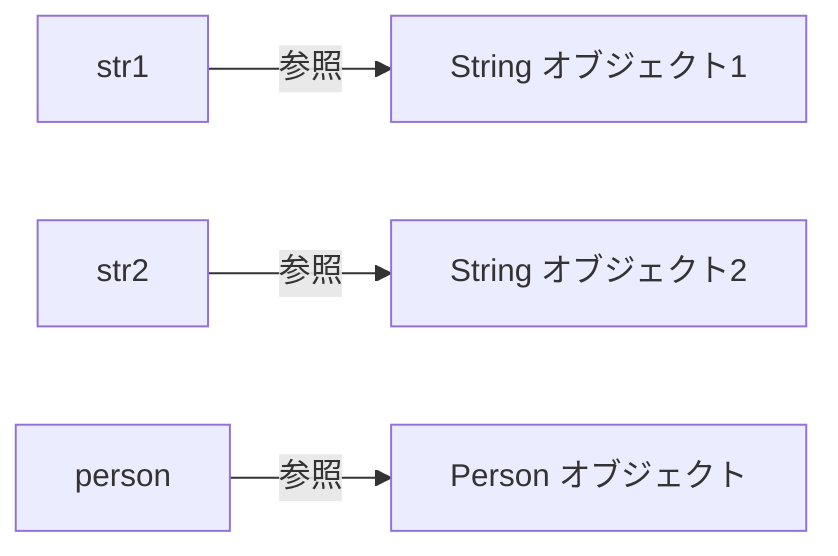
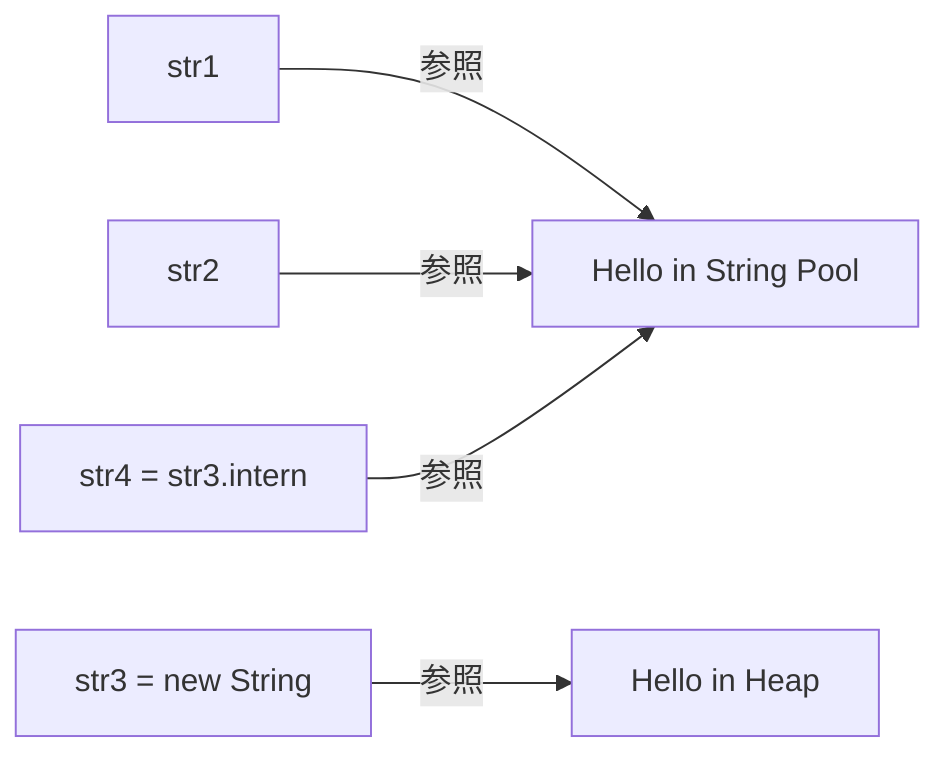

# Zenn問答とは

「Zenn問答」とは、開発していて「なんとなく使ってるけど、ちゃんと理解してるかな？」という技術について、改めて時間をとって深掘りしてみようという企画です🧘🧘🧘

# はじめに

プリミティブ型と参照型の違いについてあんまりきちんと理解してなかったので深掘りしていきたいと思います。

もちろん、プリミティブ型はnullをとらないとか値がコピーされて返却されるとかは知っています。
ただ、どの領域でメモリ管理が行われているとかいう部分は理解が曖昧だったため、今回深ぼってみたいと思います。

# Javaにおけるプリミティブ型

まずはプリミティブ型を一覧で確認してみましょう。

| データ型 | サイズ（ビット） | サイズ（バイト） | 範囲 |
|---------|-----------------|----------------|------|
| byte    | 8               | 1              | -128 ～ 127 |
| short   | 16              | 2              | -32,768 ～ 32,767 |
| int     | 32              | 4              | -2,147,483,648 ～ 2,147,483,647 |
| long    | 64              | 8              | -9,223,372,036,854,775,808 ～ 9,223,372,036,854,775,807 |
| float   | 32              | 4              | 約 -3.4E38 ～ 3.4E38（7桁精度） |
| double  | 64              | 8              | 約 -1.7E308 ～ 1.7E308（15桁精度） |
| char    | 16              | 2              | '\u0000' ～ '\uffff'（0 ～ 65,535） |
| boolean | 1               | 実装依存        | true または false |

:::message
boolean型のサイズについては、JVMの実装によって異なります。論理的には1ビットですが、実際のメモリ配置では1バイトまたは4バイトで格納されることが多いです。
:::

## プリミティブ型はどこに保存されるのか？

プリミティブ型の保存場所は、**変数が宣言された場所によって決まります**。

### スタック領域での保存

ローカル変数として宣言されたプリミティブ型は、**スタック領域**に保存されます。

```java
public void method() {
    int x = 10;  // スタック領域に保存
    double y = 3.14;  // スタック領域に保存
}
```

スタック領域の特徴：
- メソッドが呼ばれる度に新しいスタックフレームが作成
- メソッドが終了すると自動的にメモリが解放

なので、例えば再起的に無限ループなどを実行するとスタック領域のメモリを食い尽くしてStackOverFlowになるんですね(OutOfMemoryではなく)

### 配列の場合

プリミティブ型の配列は特殊なケースです：

```java
int[] numbers = new int[1000]; // 配列オブジェクト自体はヒープ領域
// 配列の要素（int値）もヒープ領域に連続して配置される
numbers[0] = 42; // ヒープ領域の値を変更
```

配列の場合、配列オブジェクト全体がGCの対象になります。

### ヒープ領域での保存

オブジェクトのインスタンス変数として宣言されたプリミティブ型は、そのオブジェクトと一緒に**ヒープ領域**に保存されます。

```java
public class Person {
    private int age;       // オブジェクトと一緒にヒープ領域に保存
    private double height; // オブジェクトと一緒にヒープ領域に保存
    
    public void setAge(int newAge) {
        this.age = newAge; // このnewAge自体はスタック領域
    }
}

Person person = new Person(); // personオブジェクトはヒープ領域
person.setAge(30);
```

なるほど、プリミティブ型についてはちょっと分かった気になってきました。

# Javaにおける参照型

参照型変数は、実際のオブジェクトへの**参照（ポインター）** を保持します。

```java
String str1 = "Hello";  // str1はStringオブジェクトへの参照を保持
String str2 = new String("Hello");  // str2は別のStringオブジェクトへの参照を保持

Person person = new Person();  // personはPersonオブジェクトへの参照を保持
```

## メモリ配置の詳細

### スタック領域の構造



### ヒープ領域の構造



### 参照の関係



ということで、Object型のフィールドとして宣言されるプリミティブ型はヒープ領域に格納されるため、メモリの確保される場所という観点ではローカルのプリミティブ型以外は差異はなさそうです。

## 参照のコピー

参照型の代入では、**参照（ポインター）がコピー**されます。なので、気をつけないと2つのオブジェクトで同じ参照を保持してしまい、オブジェクト同士で作用を生んでしまうこともできます。

```java
public class Hoge {
    String str;

    Hoge(String str) {
        this.str = str;
    }
}

public class Fuga {
    Hoge hoge;

    Fuga(Hoge hoge) {
        this.hoge = hoge;
    }
}

public class Main {
    public static void main(String[] args) {
        Hoge hoge = new Hoge("hogehoge");
        Fuga fuga1 = new Fuga(hoge);
        Fuga fuga2 = new Fuga(hoge);
        fuga1.hoge.str = "fugafuga";
        // fugafuga
        System.out.println(fuga1.hoge.str);
        // こちらもfugafugaが出力される
        System.out.println(fuga2.hoge.str);
    }
}
```

## String型のintern化とオブジェクトプール

String型には**intern化**という特殊な仕組みがあります。これは文字列の再利用を目的とした最適化です。

```java
String str1 = "Hello";
String str2 = "Hello";
String str3 = new String("Hello");
String str4 = str3.intern();  // str3をintern化

System.out.println(str1 == str2);  // true！！
System.out.println(str1 == str3);  // false
System.out.println(str1 == str4);  // true（intern化により同じ参照）
```

これは一度使ったStringはもう一回使うだろうという親切心での最適化で、結構面白い仕組みだなと思っています。気が利いているというかいい仕様ですよね。



このString Poolも実はヒープ領域にあるのですが、new Stringで宣言すると別の領域にメモリが確保されます。そこで、`intern()`の実装が気になるところですが、以下のようになっているので、C++の実装を見にいく必要がありそうです。

```java
public native String intern();
```

### intern化の実装

```cpp
oop StringTable::intern(const StringWrapper& name, TRAPS) {
  assert(!Atomic::load_acquire(&_disable_interning_during_cds_dump),
         "All threads that may intern strings should have been stopped before CDS starts copying the interned string table");

  // shared table always uses java_lang_String::hash_code
  unsigned int hash = hash_wrapped_string(name);
  oop found_string = lookup_shared(name, hash);
  if (found_string != nullptr) {
    return found_string;
  }

  if (_alt_hash) {
    ResourceMark rm(THREAD);
    // Convert to unicode for alt hashing
    int unicode_length;
    const jchar* chars = to_unicode(name, unicode_length, CHECK_NULL);
    hash = hash_string(chars, unicode_length, true);
  }

  found_string = do_lookup(name, hash);
  if (found_string != nullptr) {
    return found_string;
  }
  return do_intern(name, hash, THREAD);
}
```

ざっくり捉えると

- 1. 共有テーブルを探索
- 2. alt_hashならハッシュ値を計算
- 3. ローカルテーブルを探索
- 4. なければ登録

という流れです。色々難しい言葉がでてきたので、もう少し調べてみます。

#### 共有テーブルとローカルテーブル

基本的にはローカルテーブルのみを使用すると捉えて大丈夫かと思います。なので、共有テーブルについてのみ少し補足します。

共有テーブルとは、CDSダンプ時点でローカルテーブルに存在していた文字列が読み取り専用で格納されるテーブルです。CDS(Class Data Sharing)は、OpenJDKの機能で、事前に処理したクラスメタデータやその他データを複数のJVMプロセス間で共有できるようにする代物です。

このCDSダンプ実行時にローカルテーブルに保持していた文字列は共有テーブルに読み取り専用で格納されるというものらしいです。デフォルトの挙動ではJDKインストール時なんかはCDSダンプというのが作成され、実行時に使われるみたいですが、StringPoolの共有テーブルに文字列を格納したいときは明示的にCDSダンプを取得する必要があるみたいです。

#### alt_hashとは

通常、ハッシュ値はStringの`hashCode()`で求められるハッシュ値を使用します。
ただ、意図的にハッシュ衝突をさせることでハッシュテーブルの性能が劣化します。そのため、リハッシュのトリガーが発動すると、この代替ハッシュを使って再度ハッシュ計算が行われ、Stringの`hashCode()`はStringPoolでは使われなくなります。

もう少し具体的には複数のエントロピー群から予測困難なシード値を生成し、保持しておき、そのシード値をもとにHalfSipHashというアルゴリズムでハッシュ値を計算します。

### StringPoolのデータ構造

ConcurrentHashTableの実態は配列で、2の冪乗の長さをもっています。ハッシュ値の下位ビットを取得して、そこにノードを配置していきます。仮に衝突した場合はnextのポインターをシンプルなチェーンとして保持します。
なので、最悪計算量はO(N)になります。HashMapの実装のように二分木にしてもよいかもとも思いましたが単純さを優先したのでしょうか？他でも使うデータ構造だしそこまで衝突を気にして複雑にしても・・・という意図なんですかね？

意図的にハッシュ衝突させた場合に計算量がO(N)になってしまうので、alt_hashという仕組みもあるんですね。ちなみに、チェーン長が100をこえるとリハッシュの処理が走るみたいです。閾値は結構安全に構えている印象です。
ついでに補足すると、デフォルトのStringPoolのサイズは今は65536みたいですが、JVMの起動オプションによって指定できるみたいです。

## 他の類似する最適化

### プリミティブ型のキャッシュ

プリミティブ型にも類似の最適化があります：

```java
Integer int1 = 100;  // キャッシュから取得
Integer int2 = 100;  // 同じオブジェクトを参照
Integer int3 = 200;  // キャッシュ範囲外（新しいオブジェクト）
Integer int4 = 200;  // キャッシュ範囲外（新しいオブジェクト）

System.out.println(int1 == int2);  // true（-128～127はキャッシュされる）
System.out.println(int3 == int4);  // false（キャッシュ範囲外）
```

### キャッシュされる基本型のWrapper

- `Integer`: -128 ～ 127
- `Long`: -128 ～ 127  
- `Short`: -128 ～ 127
- `Byte`: すべての値（-128 ～ 127）
- `Character`: 0 ～ 127
- `Boolean`: `true` と `false`

# Object型の基本メソッド

すべてのJavaクラスは`java.lang.Object`クラスを継承しており、Object型が提供する基本メソッドを利用できます。

## メソッド一覧

| メソッド | 戻り値型 | 説明 | 用途 |
|---------|---------|------|------|
| `toString()` | String | オブジェクトの文字列表現を返す | デバッグ、ログ出力 |
| `equals(Object obj)` | boolean | オブジェクトの等価性を判定 | オブジェクトの論理的比較 |
| `hashCode()` | int | オブジェクトのハッシュ値を返す | HashMap、HashSetなどで使用 |
| `clone()` | Object | オブジェクトのコピーを作成 | オブジェクトの複製（protected） |
| `wait()` | void | スレッドを待機状態にする | スレッド間協調処理 |
| `wait(long timeout)` | void | 指定時間待機状態にする | タイムアウト付き待機 |
| `wait(long timeout, int nanos)` | void | より精密な時間指定で待機 | ナノ秒精度の待機 |
| `notify()` | void | 1つの待機スレッドを起床 | スレッド間通信 |
| `notifyAll()` | void | すべての待機スレッドを起床 | スレッド間通信 |
| `getClass()` | Class<?> | オブジェクトの実際のクラス情報を取得 | リフレクション、型チェック |
| `finalize()` | void | GC時に呼ばれる終了処理 | **非推奨**（Java 9以降） |

改めて見るとこんなもんかってラインナップですね。ここでは`equals`と`hashCode`と`clone`について簡単に触れたいと思います。

### equals()メソッド

オブジェクトの等価性を判定するメソッドです：
デフォルトの`equals()`実装：
```java
// Objectクラスのデフォルト実装（参照の比較のみ）
public boolean equals(Object obj) {
    return (this == obj);
}
```

#### equals()を正しく実装しないとどんな問題が起きる？

equals()をオーバーライドしないと、以下の問題が発生します：

```java
public class Person {
    private String name;
    private int age;
    
    public Person(String name, int age) {
        this.name = name;
        this.age = age;
    }
    
    // equals()をオーバーライドしていない！
}

public class Main {
    public static void main(String[] args) {
        Person person1 = new Person("田中", 30);
        Person person2 = new Person("田中", 30);

        // ListやSetでも意図しない動作
        List<Person> people = List.of(person1);
        System.out.println(people.contains(person2)); // false（期待値：true）

        // 重複チェックができない
        Set<Person> personSet = new HashSet<>();
        personSet.add(person1);
        personSet.add(person2); // 実際は同じ人だが重複として扱われない
        System.out.println(personSet.size()); // 2（期待値：1）
    }
}
```

### hashCode()メソッド

オブジェクトのハッシュ値を返すメソッドです：

**重要なルール**：
- `equals()`が`true`を返す2つのオブジェクトは、同じ`hashCode()`を返す必要がある
- `HashMap`、`HashSet`などのハッシュベースのコレクションで正しく動作するために必要

#### hashCode()を正しく実装しないとどんな問題が起きる？

equals()をオーバーライドしたのに、hashCode()をオーバーライドしないと深刻な問題が発生します：

```java
public class Person {
    private String name;
    private int age;
    
    @Override
    public boolean equals(Object obj) {
        // 正しくequals()を実装
        if (this == obj) return true;
        if (obj == null || getClass() != obj.getClass()) return false;
        Person person = (Person) obj;
        return age == person.age && Objects.equals(name, person.name);
    }
    
    // hashCode()をオーバーライドしていない！
    // → デフォルトでは各インスタンスで異なる値を返す
}

public class Main {
    public static void main(String[] args) {
        Person person1 = new Person("田中", 30);
        Person person2 = new Person("田中", 30);

        Set<Person> personSet = new HashSet<>();
        personSet.add(person1);
        System.out.println(personSet.contains(person2)); // false ← 存在するのに見つからない
        personSet.add(person2); // equals()=trueなのに重複として扱われない
        System.out.println(personSet.size()); // 2 ← 本来は1であるべき
    }
}
```

HashSetやHashMapの実装を読んだことがあれば当たり前っちゃ当たり前なのですが、計算量を削減する前提に、ハッシュ値が正しく宣言されていることは重要ですね。

### clone()メソッド
オブジェクトのコピーを作成（`Cloneable`インターフェースの実装が必要）：

```java
public class Person implements Cloneable {
    private String name;
    private int age;
    private List<String> hobbies;
    
    public Person(String name, int age) {
        this.name = name;
        this.age = age;
        this.hobbies = new ArrayList<>();
    }
    
    @Override
    protected Object clone() throws CloneNotSupportedException {
        return super.clone();  // シャローコピー
    }

    @Override
    public String toString() {
        return "Person{name='" + name + "', age=" + age + ", hobbies=" + hobbies + "}";
    }
}

public class Main {
    public static void main(String[] args) throws CloneNotSupportedException {
        Person tanaka = new Person("田中", 41);
        tanaka.hobbies.add("ポーカー");
        Person higashi = (Person) tanaka.clone();
        higashi.name = "東";
        higashi.age = 37;
        higashi.hobbies.add("狩猟");
        // hobbiesが共有されてしまう！
        System.out.println(higashi); // Person{name='東', age=37, hobbies=[ポーカー, 狩猟]}
        System.out.println(tanaka); // Person{name='田中', age=41, hobbies=[ポーカー, 狩猟]}
    }
}
```

ということで、Cloneableを実装するときは、注意深くOverrideを行って必要に応じてディープコピーをするように自前で実装してあげる必要があります。

# int型 vs Integer型：オブジェクト生成コストの差異

よく議論される「int型とInteger型のパフォーマンス差」について詳しく見てみましょう。

## メモリ使用量の違い

- **int型**: 4バイト（値のみ）
- **Integer型**: 16-24バイト（オブジェクトヘッダー12-16バイト + int値4バイト + パディング）

### Integer型のメモリレイアウト詳細

**1. オブジェクトヘッダー（12-16バイト）**

Javaの全オブジェクトには以下のヘッダー情報が付加されます：

```
[マークワード: 8バイト] + [クラスポインタ: 4-8バイト]
```

- **マークワード（8バイト）**：
  - ハッシュコード（25bit）
  - GC年齢（4bit）
  - バイアスロック情報（2bit）
  - ロック状態（2bit）
  - その他フラグ

- **クラスポインタ（4-8バイト）**：
  - 32bit JVM: 4バイト
  - 64bit JVM: 8バイト（Compressed OOPsの場合は4バイト）

**2. フィールドデータ（4バイト）**

```java
public final class Integer {
    private final int value;  // 4バイト
}
```

**3. パディング（0～4バイト）**

JVMはオブジェクトサイズを8バイト境界にアライメントします

### 実際のメモリ確認方法

JOL（Java Object Layout）ツールを使用して実際のレイアウトを確認できます：

```java
import org.openjdk.jol.info.ClassLayout;

public class MemoryLayoutExample {
    public static void main(String[] args) {
        Integer integer = 42;
        
        // Integerオブジェクトのメモリレイアウトを出力
        System.out.println(ClassLayout.parseInstance(integer).toPrintable());
        // OFF  SZ   TYPE DESCRIPTION               VALUE
        //  0   8        (object header: mark)     0x0000000000000001 (non-biasable; age: 0)
        //  8   4        (object header: class)    0x00180bb8
        // 12   4    int Integer.value             42
        // Instance size: 16 bytes
    }
}
```

たかが20バイト程度の差ですが、4倍程度もメモリが異なるので特にループなどで予期せぬボクシングが大量に発生してしまうケースなどは気をつけた方がよさそうです。
インスタンスの1要素であれば、そこまで気にしなくてもよさそうではありますが、パフォーマンス面より`null`をコンパイラレベルで防げる点が嬉しいような気がしますね。

# まとめ

今回はJavaのプリミティブ型と参照型について深掘りしました。ローカル変数の場合には確保されるメモリ領域が違うということが大きな差異ですが、正直なところそこまで気にしなくてよいのかなという印象でした。

StringPoolの処理については知らないことも多かったので勉強になりました。プリミティブ型と参照型というタイトルのくせにStringについて多く深掘りしてしまいました。

Object型についても再度基本を復習できて有意義でした。ちょっとニッチな内容もありましたが、最後まで読んでいただきありがとうございました！

