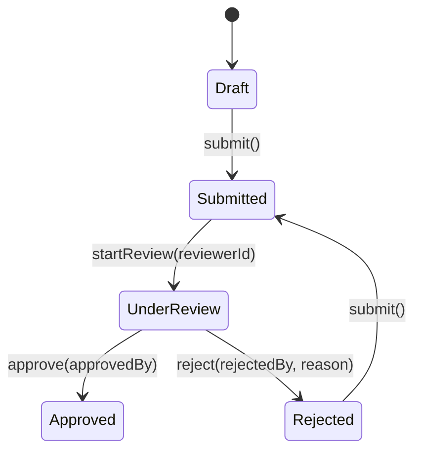

# Zenn問答とは

「Zenn問答」とは、開発していて「なんとなく使ってるけど、ちゃんと理解してるかな？」という技術について、改めて時間をとって深掘りしてみようという企画です🧘🧘🧘

# はじめに

Kotlinで開発していて、「状態管理にはsealed classがいいぞ」というのを聞いて、実際に説明を聞いて理解したような気になっていますが、自分で実装してと言われるとぱっと言えない程度の理解度です。

なので、このタイミングでsealed classを使うことでどういう制約をどう実現できるのかを深掘りしたいと思い、選定しました。

## Sealed Classとは何なのか？

Sealed Classは、**制限された継承階層**を作成できるKotlinの機能です。すべての直接サブクラスがコンパイル時に既知である必要があり、これによって`when`式での**網羅的パターンマッチング**が可能になります。

```kotlin
sealed class NetworkState {
    object Idle : NetworkState()
    object Loading : NetworkState()
    data class Success(val data: String) : NetworkState()
    data class Error(val exception: Throwable) : NetworkState()
}

// when式で全てのケースを強制的にカバー
fun handleNetworkState(state: NetworkState) = when (state) {
    NetworkState.Idle -> showInitialScreen()
    NetworkState.Loading -> showProgressBar()
    is NetworkState.Success -> displayData(state.data)
    is NetworkState.Error -> showErrorMessage(state.exception.message)
    // else句が不要！コンパイラが全ケースをチェック
}
```

何か業務的なステータスを表すときにIntとかよりもEnumが好まれる理由のひとつに、コンパイラレベルでのパターン網羅できる点があると思っています。同じような話でコンパイラレベルでここを担保してくれるのは仕組みとして確かに強力です。

## 状態遷移を強制する仕組み

Sealed Classを使うことで、**不正な状態遷移を防ぐ**ことができます。従来のenum classと比較してみましょう。

### Enum Classの限界

```kotlin
enum class ReviewState {
    DRAFT, SUBMITTED, UNDER_REVIEW, APPROVED, REJECTED
}

class ReviewStateMachine {
    var currentState = ReviewState.DRAFT
    
    fun submit() {
        // 不正な状態からの遷移を防げない
        currentState = ReviewState.SUBMITTED
        // APPROVED状態からSUBMITTEDに遷移できてしまう問題
    }
    
    fun approve() {
        // DRAFT状態から直接APPROVEDにできてしまう
        currentState = ReviewState.APPROVED
    }
}
```

### Sealed Classによる解決

```kotlin
sealed class ReviewState {
    object Draft : ReviewState()
    data class Submitted(val submittedAt: Long) : ReviewState()
    data class UnderReview(val reviewerId: String) : ReviewState()
    data class Approved(val approvedBy: String, val approvedAt: Long) : ReviewState()
    data class Rejected(val rejectedBy: String, val reason: String) : ReviewState()
}

class Paper(
    val id: String,
    val title: String,
    val author: String,
) {
    private var _reviewState: ReviewState = ReviewState.Draft

    fun submit() {
        _reviewState = when (_reviewState) {
            ReviewState.Draft -> {
                ReviewState.Submitted(System.currentTimeMillis())
            }

            is ReviewState.Rejected -> {
                ReviewState.Submitted(System.currentTimeMillis())
            }
            // 既に提出済み、審査中、承認済みの場合は例外
            is ReviewState.Submitted,
            is ReviewState.UnderReview -> throw Exception("Already submitted or under review")

            is ReviewState.Approved -> throw Exception("Cannot resubmit - already approved")
        }
    }

    fun startReview(reviewerId: String) {
        when (_reviewState) {
            is ReviewState.Submitted -> {
                _reviewState = ReviewState.UnderReview(reviewerId)
            }
            // Submitted以外からは例外
            else -> throw Exception("Cannot start review - not submitted yet")
        }
    }

    fun approve(approvedBy: String) {
        when (_reviewState) {
            is ReviewState.UnderReview -> {
                _reviewState = ReviewState.Approved(approvedBy, System.currentTimeMillis())
            }
            else -> throw Exception("Cannot approve - not under review")
        }
    }

    fun reject(rejectedBy: String, reason: String) {
        when (_reviewState) {
            is ReviewState.UnderReview -> {
                _reviewState = ReviewState.Rejected(rejectedBy, reason)
            }
            else -> throw Exception("Cannot reject - not under review")
        }
    }
}
```

### 状態遷移図

このPaperクラスの状態遷移をMermaidで視覚化してみましょう。



実際にtoString()も適当にOverrideしてから以下のコードを実行するとこのようになります。

```kotlin
fun main() {
    val paper = Paper("id","title","author")
    println(paper)
    paper.submit()
    println(paper)
    paper.approve("hoge")
}
```

実行結果
```
Paper(id='id', title='title', author='author', state=Draft)
Paper(id='id', title='title', author='author', state=Submitted at 2025-07-21 15:40)
Exception in thread "main" java.lang.Exception: Cannot approve - not under review
	at org.example.Paper.approve(Main.kt:60)
	at org.example.MainKt.main(Main.kt:8)
	at org.example.MainKt.main(Main.kt)
```

不正な状態変化をしようとしたところでExceptionが想定通りに出力されています。

## まとめ

Sealed Classが、Kotlinにおける状態管理で**強力な武器**になるというころを確認できました。特にコンパイラーレベルで網羅性を担保できる部分が強力だなと思いました。

あわせて、型の遷移の制限をかけることでさらに強力に遷移が表現できるので、積極的に使っていくとよさそうだと改めて思いました。なんか、実際に自分で実装する前はちょっととっつきにくさを感じていましたが、実際に実装してみると案外直感的でした。一度手を動かしてみると理解も進みそうです。

最後まで読んでいただき、ありがとうございました🙏
