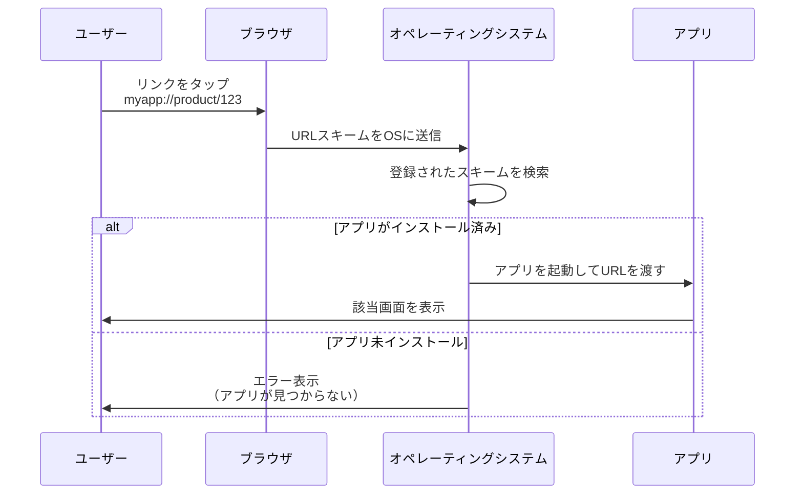
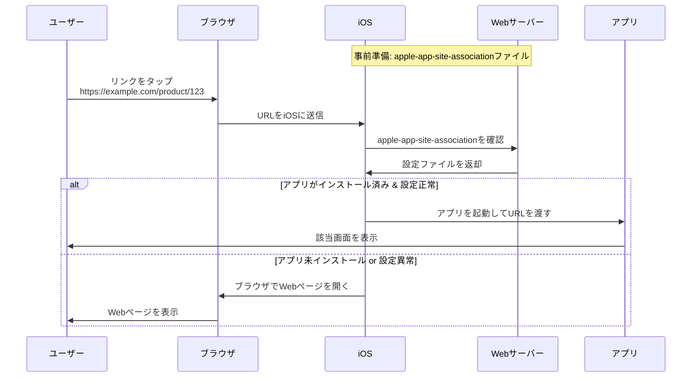
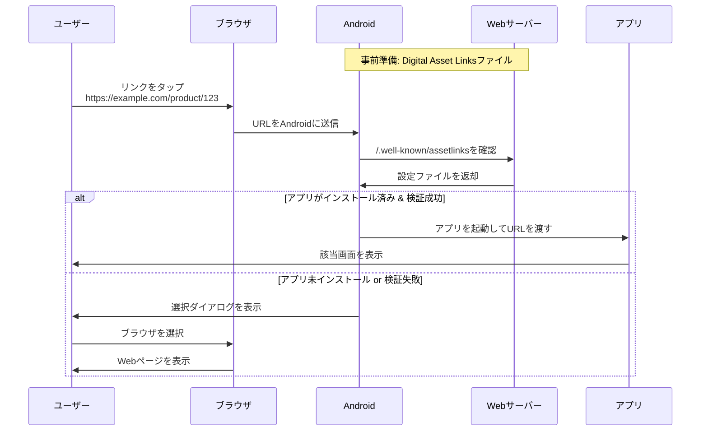
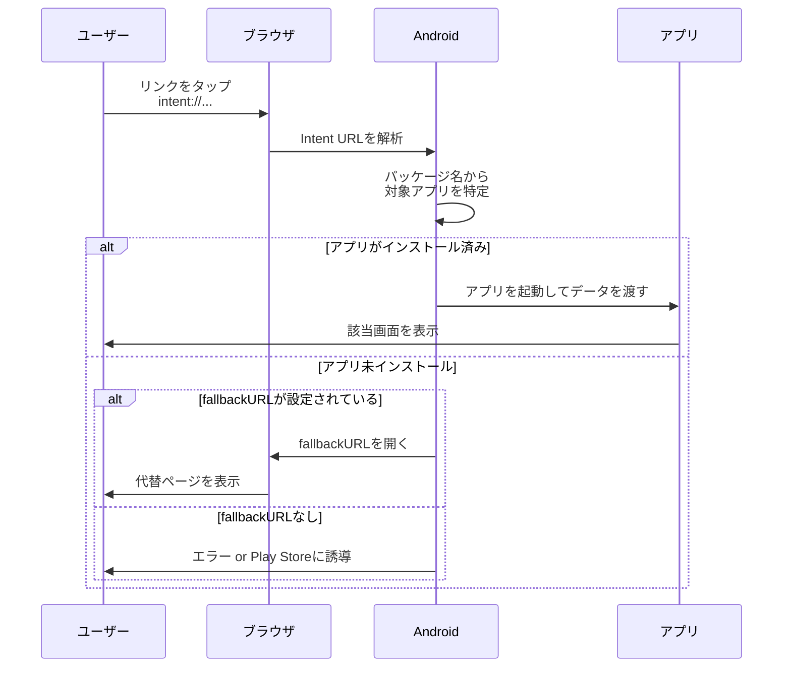
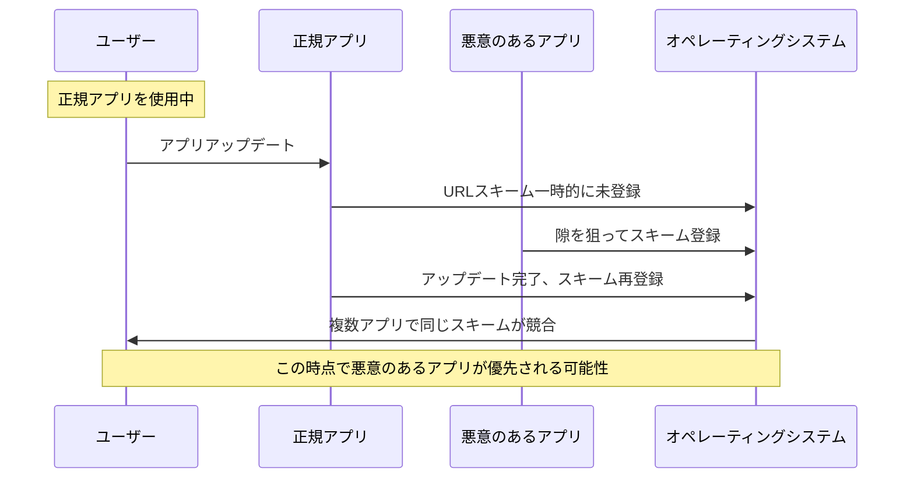
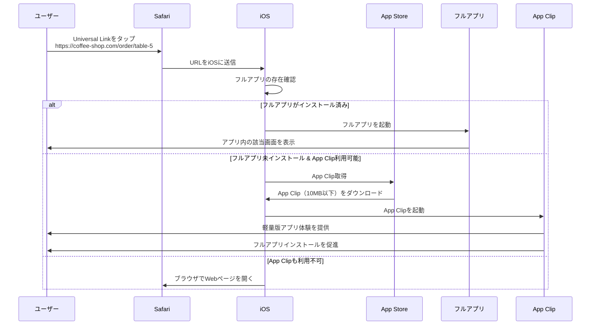
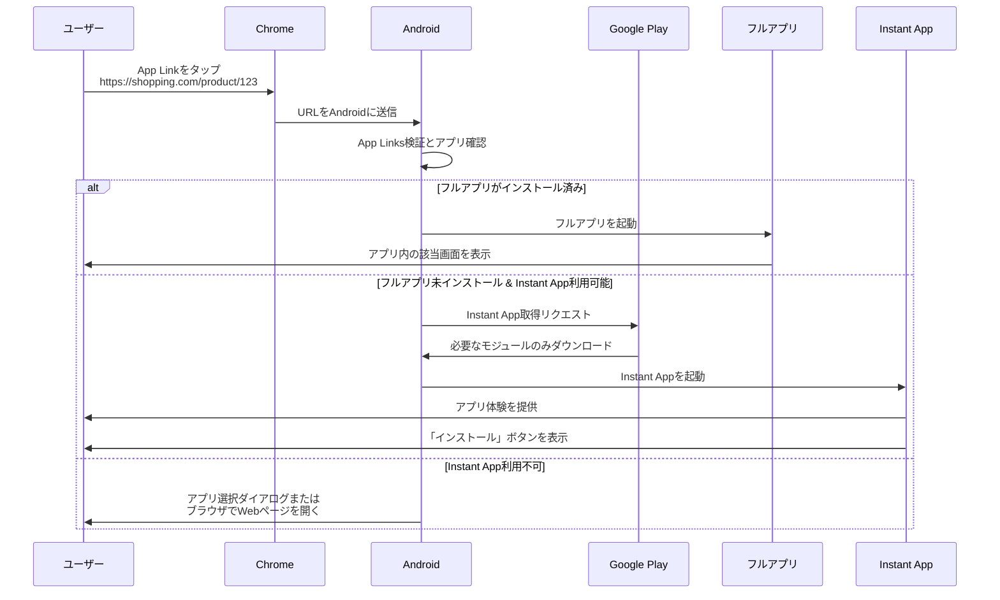

## Zenn問答とは

「Zenn問答」とは、開発していて「なんとなく使ってるけど、ちゃんと理解してるかな？」という技術について、改めて時間をとって深掘りしてみようという企画です🧘🧘🧘

## はじめに

最近スマホでリンクを踏むと勝手にアプリが立ち上がったりすることはないでしょうか。このようなときに使われるのがディープリンクという技術です。

普段何気なく使っているディープリンクですが、実際にはいくつかの種類があり、それぞれ異なる仕組みで動いています。また、アプリがインストールされている場合とされていない場合での動作も違います。

## ディープリンクの種類

ディープリンクには主に以下の4つの種類があります。

### 1. URL Scheme

最も基本的なディープリンクの仕組みです。アプリ固有のURLスキームを定義し、そのスキームを使ってアプリを起動します。カスタムURLスキームとも呼ばれます。

```
myapp://product/123
instagram://camera
```

「カスタムURLスキーム」は「既存の標準的なスキーム（http、httpsなど）ではなく、アプリが独自に定義したスキーム」という意味で使われます。ディープリンクの文脈では、この2つの用語は区別せずに使われることが多いみたいです。

### 2. Universal Links（iOS）

iOS 9以降で導入された仕組みで、通常のHTTPSのURLでアプリを起動できます。

```
https://example.com/product/123
```

### 3. App Links（Android）

Android 6.0（API level 23）以降で導入された仕組みで、Universal Linksと同様にHTTPSのURLでアプリを起動できます。

```
https://example.com/product/123
```

### 4. Intent URLs（Android）

Androidで使える特殊なURL形式で、より詳細な情報を含めてアプリを起動できます。

```
intent://example.com/product/123#Intent;scheme=https;package=com.example.app;end
```

## 各ディープリンクの仕組み

それぞれのディープリンクがどのような仕組みで動作するのか、シーケンス図で詳しく見ていきましょう。

### URL Scheme の仕組み



#### OSのURLスキーム検索の仕組み

OSがURLスキームを検索する仕組みは、アプリのインストール時に自動的に構築されるレジストリによって実現されています。

**iOSの場合**
- アプリインストール時に`Info.plist`ファイルの`CFBundleURLSchemes`を読み取り
- システム内部のURLスキームデータベースに自動登録
- LaunchServicesフレームワークが管理し、URLスキーム要求時にリアルタイム検索
- 対象アプリが見つからない場合、iOS標準のエラーダイアログが表示される（「"○○"を開けません」）

**Androidの場合**
- アプリインストール時に`AndroidManifest.xml`の`<intent-filter>`を解析
- PackageManagerServiceが全アプリのIntent情報を管理
- URLスキーム要求時にIntent Resolution Process で適切なアプリを検索
- 対象アプリが見つからない場合、「このリンクを開けません」などのAndroid標準エラーが表示

つまり、OSは**インストールされているすべてのアプリの情報を常に把握**しており、URLスキーム要求があった際に高速で検索できるようになっています。

### Universal Links（iOS）の仕組み



#### WebサーバーURL検出の仕組み

**Universal Links（iOS）の場合**
1. **URL自体がWebサーバーを示している**: `https://example.com/product/123`のリンクでは、WebサーバーのURLは`https://example.com`
2. **設定ファイルの配置場所**: `apple-app-site-association`ファイルは**そのドメインのWebサーバー**に配置する（Appleのサーバーではない）
3. **検証プロセス**: iOSが`https://example.com/.well-known/apple-app-site-association`にアクセスして設定を確認

つまり、Universal Linksでは**リンクのドメイン自体**がWebサーバーのURLとなり、そこに設定ファイルが配置されます。

### App Links（Android）の仕組み



**App Links（Android）の場合**
1. **URL自体がWebサーバーを示している**: Universal Linksと同様、`https://example.com/product/123`のリンクのドメイン部分
2. **設定ファイルの配置場所**: `assetlinks.json`ファイルを`https://example.com/.well-known/assetlinks.json`に配置
3. **フォールバック動作**: 設定ファイルが見つからない場合やアプリ未インストールの場合は、**元のURLをそのままブラウザで開く**

アプリが起動できない場合、最終的にはそのURLをブラウザで開くため、Webページが存在しなければ404エラーが表示されます。これは開発者がWebサイト側でも対応ページを用意しておく必要があることを意味します。

### Intent URLs（Android）の仕組み



#### Intent URLでのエラーとPlay Store誘導の判断基準

Intent URLでアプリが見つからない場合の動作は、以下の優先順位で決定されます。

**判断フロー**
1. **パッケージ名の確認**: Intent URLに含まれる`package`パラメータでアプリを特定
2. **fallbackURLの存在確認**: Intent URLに`S.browser_fallback_url`パラメータが設定されているかチェック
3. **Play Storeでの存在確認**: パッケージ名がGoogle Playに存在するかを確認

## アプリのインストール状態による動作の違い

各ディープリンクの種類について、アプリがインストールされている場合とされていない場合の動作をまとめてみます。

| ディープリンクの種類 | アプリインストール済み | アプリ未インストール |
|---|---|---|
| **URL Scheme** | アプリが起動して該当画面に遷移 | エラー表示（「アプリが見つからない」など） |
| **Universal Links** | アプリが起動して該当画面に遷移 | ブラウザでWebページを開く |
| **App Links** | アプリが起動して該当画面に遷移 | 選択ダイアログまたはブラウザでWebページを開く |
| **Intent URLs** | アプリが起動して該当画面に遷移 | fallbackURLがあれば代替ページ、なければエラーまたはPlay Store誘導 |

## セキュリティ上の考慮事項

ディープリンクを実装する際には、以下のセキュリティリスクに注意する必要があります。

### 1. URLスキームハイジャック

URL Schemeは先着順で登録されるため、同じスキームを複数のアプリが登録した場合、意図しないアプリが起動される可能性があります。

#### なぜ先着順でも脅威になるのか

一見すると「先着順なら正規アプリが先にインストールされていれば安全」に思えますが、実際には以下の理由で脅威となります。

**1. アプリのアップデートや再インストール時の隙**


**2. OSの動作の不確実性**

iOSやAndroidでは、同じURLスキームを持つ複数のアプリがある場合の動作が保証されていません

**3. ソーシャルエンジニアリング攻撃との組み合わせ**

攻撃者は正規アプリに似た悪意のあるアプリを作成し、App StoreやGoogle Playで配布します。
ユーザーが間違えてその悪意のあるアプリをダウンロードしてしまうと、正規アプリと同じURLスキームが登録されます。

その後、ユーザーがディープリンクをタップした際に悪意のあるアプリが起動し、認証情報や個人情報が盗取される危険性があります。

このため、現在は**Universal LinksやApp Linksのような、より安全な仕組みが推奨**されています。

### 2. パラメータインジェクション

ディープリンクで受け取ったパラメータを適切に検証せずに使用すると、インジェクション攻撃を受ける可能性があります。

```javascript
// ❌ 危険な例
const deepLinkUrl = "myapp://user/profile?userId=123&redirect=http://malicious.com"
const params = parseUrl(deepLinkUrl)
window.location.href = params.redirect // 悪意のあるサイトにリダイレクト

// ✅ 安全な例
const deepLinkUrl = "myapp://user/profile?userId=123&redirect=http://malicious.com"
const params = parseUrl(deepLinkUrl)
const allowedDomains = ['example.com', 'app.example.com']
if (allowedDomains.includes(params.redirectDomain)) {
    window.location.href = params.redirect
}
```

### 3. 情報漏洩

ディープリンクのURLには機密情報を含めないようにする必要があります。URLはログに記録されたり、第三者に見られる可能性があります。

```javascript
// ❌ 危険な例
const deepLink = "myapp://payment?creditCard=1234567890123456&cvv=123"

// ✅ 安全な例
const deepLink = "myapp://payment?sessionId=abc123xyz"
// 実際の決済情報はサーバー側でsessionIdを使って安全に管理
```

## App Clips（iOS）とInstant Apps（Android）

最近では、アプリをインストールしなくても一部機能を利用できる仕組みも登場しています。

### App Clips（iOS 14以降）の詳細な仕組み

App Clipsは、Universal Linksと密接に連携して動作します。



**App Clipsの特徴**
- 10MB以下の軽量なアプリ体験
- Universal Linkと同じURLを使用
- QRコード、NFCタグ、Safari上のバナー、Messages、Mapsから起動可能
- 一時的にダウンロードされ、使用後は自動的に削除される
- フルアプリのインストールを促進する「App Store」ボタンを表示

### Instant Apps（Android）の詳細な仕組み

Instant Appsは、App Linksと組み合わせて動作し、より複雑な仕組みを持っています。



**Instant Appsの特徴**
- 最大15MBまでの制限（複数モジュールの合計）
- App Linksと同じHTTPS URLを使用
- モジュール単位でオンデマンドダウンロード
- Google Play Servicesを通じて配信
- 一時的にキャッシュされ、定期的にクリーンアップされる

### ディープリンクとの関係

両方の技術とも、従来のディープリンクの仕組みを拡張したものです。

**優先順位**
1. **フルアプリ**がインストール済み → フルアプリを起動
2. **フルアプリ未インストール**かつ**軽量版利用可能** → App Clip/Instant Appをダウンロード・起動
3. **軽量版も利用不可** → ブラウザでWebページを開く

この仕組みにより、ユーザーは常に最適な体験を得ることができ、開発者はアプリインストールを促進できます。

## ディープリンク管理サービスの詳細

ディープリンクを管理するようなサービスもいくつかあるみたいです。

- Branch
- AppsFlyer OneLink
- Adjust

リンクの管理が簡単になっていたり、どの経路でアプリインストールがされたかなどの付加価値があるようです。
マーケティング戦略を練ったり、エンジニア以外でも管理したいというときにニーズがありそうだなと思いました。

## まとめ

今回はディープリンクについて、その種類から仕組み、実装方法、セキュリティ上の注意点まで幅広く調べてみました。

普段何気なく使っているディープリンクですが、実際には複数の仕組みがあり、それぞれに特徴と適切な使い分けがあることがわかりました。
あと、やはりモバイルはiOSとAndroidの2つを常に意識しないといけない部分で大変なのだなと改めて感じました。

最後まで読んでいただき、ありがとうございました
