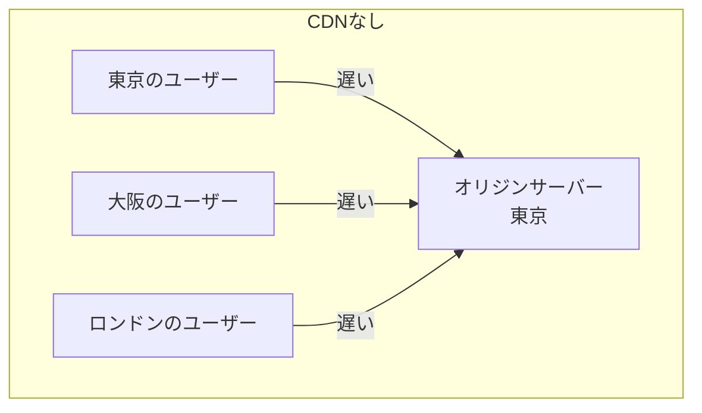
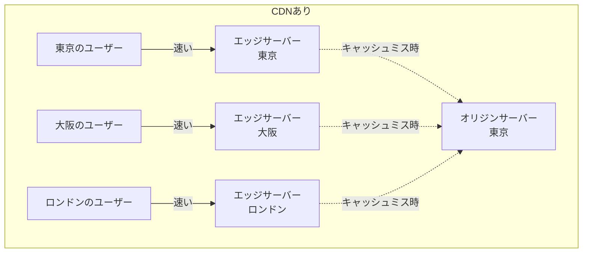
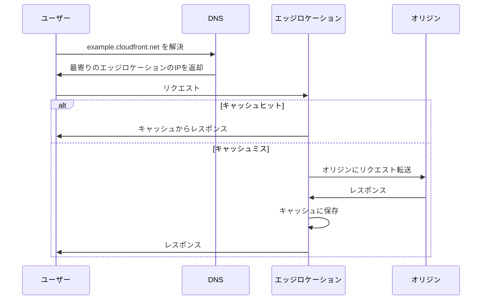
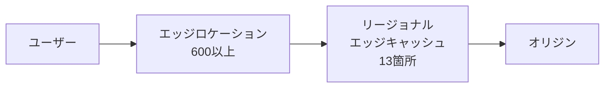
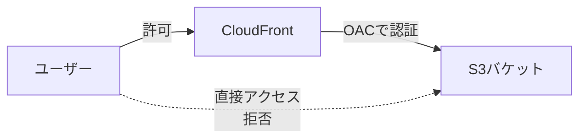
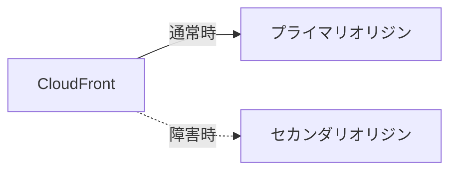
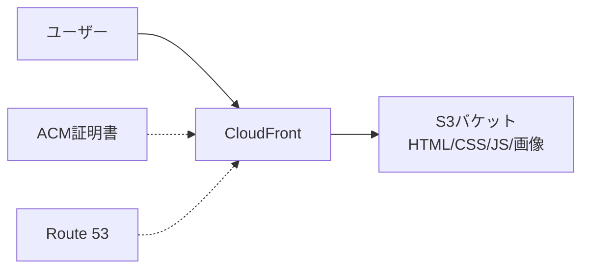
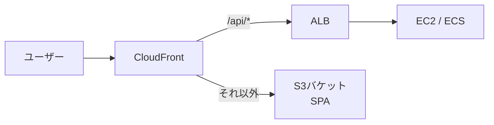

# Zenn問答とは

「Zenn問答」とは、開発していて「なんとなく使ってるけど、ちゃんと理解してるかな？」という技術について、改めて時間をとって深掘りしてみようという企画です🧘🧘🧘

# はじめに

AWSを使った開発をしていると、CloudFrontの名前はよく目にします。CDN（Content Delivery Network）であることはなんとなく理解していますが、具体的にどのような機能があるのか、どういう仕組みで動いているのか、正直把握できていません。

「キャッシュしてくれるやつでしょ？」「S3の前に置くやつでしょ？」くらいの認識で止まっているので、今回はCloudFrontについて改めて深掘りしてみます。

# そもそもCDNとは

CloudFrontの話に入る前に、CDN（Content Delivery Network）そのものについて整理しておきましょう。

CDNは、世界中に分散配置されたサーバー群を使って、ユーザーに近い場所からコンテンツを配信する仕組みです。CDNがない場合、すべてのユーザーがオリジンサーバー（元のサーバー）にアクセスすることになります。





CDNの主なメリットは以下の通りです。

- **レイテンシの低減** - ユーザーに物理的に近いサーバーから配信するため、応答が速くなります。
- **オリジンサーバーの負荷軽減** - キャッシュによりオリジンへのリクエスト数が減ります。
- **可用性の向上** - 複数のサーバーに分散されるため、一部が障害を起こしても影響が限定的です。
- **大量トラフィックへの対応** - 分散配置されたサーバー群でトラフィックを吸収できます。

CDNを提供するサービスとしては、CloudFront以外にもCloudflare、Akamai、Fastlyなどがあります。CloudFrontはAWSのサービスの一つなので、S3やALBなど他のAWSサービスとの統合が強みです。

# CloudFrontの基本的な仕組み

CloudFrontは、AWSが提供するCDNサービスです。全世界に600以上のエッジロケーション（PoP: Point of Presence）を持ち、そこからコンテンツを配信します。

基本的なリクエストの流れは以下のようになります。



ユーザーがCloudFrontのURLにアクセスすると、DNSによって自動的に最寄りのエッジロケーションにルーティングされます。エッジロケーションにキャッシュがあればそこから応答し、なければオリジンに取りに行くというシンプルな仕組みです。

## エッジロケーションとリージョナルエッジキャッシュ

CloudFrontには2層のキャッシュ構造があります。



- **エッジロケーション** - ユーザーに最も近い場所にあるキャッシュサーバーです。世界中に600以上あり、日本には東京と大阪にあります。
- **リージョナルエッジキャッシュ** - エッジロケーションとオリジンの間に位置する中間キャッシュです。世界に13箇所あり、エッジロケーションよりも大容量のキャッシュを持ちます。

エッジロケーションでキャッシュミスした場合、いきなりオリジンに問い合わせるのではなく、まずリージョナルエッジキャッシュを確認します。これにより、オリジンへのリクエストをさらに減らすことができます。

# CloudFrontの用語

CloudFrontを使ううえで登場する主要な用語を整理しておきましょう。

## Distribution（ディストリビューション）

CloudFrontの設定単位です。「このオリジンから取得したコンテンツを、こういう設定で配信してね」という一連の設定をまとめたものがDistributionです。Distributionを作成すると、`d111111abcdef8.cloudfront.net`のようなドメイン名が割り当てられます。

## Origin（オリジン）

CloudFrontがコンテンツを取得する元のサーバーです。CloudFrontは以下のものをオリジンとして設定できます。

| オリジン | ユースケース |
|---------|-------------|
| **S3バケット** | ReactやVue.jsなどのSPAのビルド成果物、画像・CSS・JSなどの静的アセットの配信。最も一般的なパターン |
| **ALB / ELB** | 背後にECSやEC2を配置したAPIサーバーやWebアプリケーション。複数のサーバーにロードバランスしたい場合に使う |
| **EC2インスタンス** | ALBを挟まず直接EC2を指定するパターン。Next.jsやNuxtのSSRサーバー、独自のHTTPサーバーなど。ただし冗長性がないため、本番環境ではALB経由が一般的 |
| **AWS Elemental MediaStore / MediaPackage** | ライブ配信やVOD（ビデオオンデマンド）などの動画ストリーミング |
| **カスタムオリジン** | AWS外のサーバーも指定可能。例えば、オンプレミスのサーバーや他社クラウドのサーバーの前段にCloudFrontを置いてキャッシュやDDoS対策の恩恵を受けるケース |

実務では直接EC2を指定するよりも、ALBの背後にEC2やECSを配置し、ALBをオリジンとして設定するパターンの方が多いです。ALBを挟むことで複数台への分散やヘルスチェックが効くためです。

## Behavior（ビヘイビア）

URLのパスパターンに応じて、どのオリジンにリクエストを転送するか、どのようにキャッシュするかを定義するルールです。

例えば以下のような設定ができます。

| パスパターン | オリジン | 用途 |
|-------------|---------|------|
| `/api/*` | ALB | APIリクエストをALBに転送 |
| `/images/*` | S3バケット | 画像をS3から配信 |
| `*`（デフォルト） | S3バケット | その他のコンテンツをS3から配信 |

Behaviorは優先度順に評価され、最初にマッチしたものが適用されます。デフォルトのBehavior（`*`）は必ず1つ設定する必要があります。

# CloudFrontのキャッシュ

CDNといえばキャッシュです。その根幹であるキャッシュの仕組みについて、もう少し詳しく見ていきましょう。

## キャッシュキー

CloudFrontは「キャッシュキー」を使って、キャッシュされたオブジェクトを一意に識別します。デフォルトのキャッシュキーは以下の2つの要素で構成されています。

- **ディストリビューションのドメイン名** - 例: `d111111abcdef8.cloudfront.net`
- **リクエストのURLパス** - 例: `/images/logo.png`

つまり、デフォルトでは同じURLへのリクエストは同じキャッシュが使われます。ただし、キャッシュキーにクエリ文字列、HTTPヘッダー、Cookieなどを含めることもできます。

例えば、`?lang=ja`と`?lang=en`で異なるコンテンツを返す場合、クエリ文字列をキャッシュキーに含めることで、言語ごとに別のキャッシュを保持できます。

## TTL（Time To Live）

キャッシュの有効期限を制御する設定です。

| 設定 | 説明 | デフォルト値 |
|------|------|-------------|
| **Minimum TTL** | キャッシュの最小有効期間 | 0秒 |
| **Maximum TTL** | キャッシュの最大有効期間 | 31536000秒（365日） |
| **Default TTL** | オリジンがCache-Controlヘッダーを返さない場合の有効期間 | 86400秒（24時間） |

オリジンが`Cache-Control: max-age=3600`のようなヘッダーを返した場合、CloudFrontはその値を尊重しますが、Minimum TTLとMaximum TTLの範囲内に制限されます。

## キャッシュの無効化（Invalidation）

キャッシュされたコンテンツを強制的に削除したい場合、**Invalidation**（無効化）を使います。例えば、Webサイトのデプロイ後に古いキャッシュを消したいケースです。

```
aws cloudfront create-invalidation \
  --distribution-id E1234567890 \
  --paths "/*"
```

ただし、Invalidationにはいくつかの注意点があります。

- 1か月あたり最初の1,000パスまでは無料ですが、それ以降は課金されます。
- 全エッジロケーションに反映されるまでに数分かかります。
- `/*`で全ファイルを無効化できますが、ファイル数が多い場合は時間がかかります。

頻繁にコンテンツが更新される場合は、Invalidationよりも**ファイル名にバージョンを含める**方法（例: `style.v2.css`や`script.abc123.js`）が推奨されます。これならキャッシュの無効化を待たずに、即座に新しいファイルが配信されます。

## キャッシュポリシーとオリジンリクエストポリシー

CloudFrontでは、**キャッシュポリシー**と**オリジンリクエストポリシー**という2つのポリシーでキャッシュの動作を細かく制御できます。

**キャッシュポリシー**は、何をキャッシュキーに含めるか、TTLをどうするかを定義します。AWSが用意しているマネージドポリシーもあります。

| マネージドポリシー名 | 用途 |
|---------------------|------|
| CachingOptimized | 一般的な静的コンテンツ向け。クエリ文字列やCookieをキャッシュキーに含めない |
| CachingDisabled | キャッシュを完全に無効化。動的コンテンツやAPI向け |
| CachingOptimizedForUncompressedObjects | 圧縮されていないオブジェクト向け |

**オリジンリクエストポリシー**は、キャッシュミス時にオリジンに転送するヘッダー、クエリ文字列、Cookieを定義します。キャッシュキーには含めたくないが、オリジンには渡したい情報がある場合に使います。

例えば、`Accept-Language`ヘッダーをオリジンに渡したいが、言語ごとにキャッシュを分けたくないという場合、オリジンリクエストポリシーに`Accept-Language`を含めて、キャッシュポリシーには含めないという設定ができます。

# CloudFrontの主な機能

## SSL/TLS対応（HTTPS）

CloudFrontはデフォルトで`*.cloudfront.net`のドメインに対してHTTPSを提供します。独自ドメインでHTTPSを使いたい場合は、AWS Certificate Manager（ACM）でSSL/TLS証明書を取得して設定します。

HTTPS関連の設定としては以下のようなものがあります。

| 設定 | 説明 |
|------|------|
| **Viewer Protocol Policy** | ユーザーとCloudFront間のプロトコル制御（HTTP and HTTPS、Redirect HTTP to HTTPS、HTTPS Onlyから選択） |
| **Origin Protocol Policy** | CloudFrontとオリジン間のプロトコル制御（HTTP Only、HTTPS Only、Match Viewerから選択） |

一般的には、ユーザー側はHTTPをHTTPSにリダイレクトし、オリジン側はHTTP Onlyにするパターンが多いです。これはオリジン（ALBやEC2）でのSSL終端が不要になり、構成がシンプルになるためです。

## オリジンアクセスコントロール（OAC）

S3をオリジンとする場合、S3バケットに直接アクセスされてしまうと、CloudFrontのキャッシュや設定が無意味になってしまいます。これを防ぐために、**オリジンアクセスコントロール（OAC）** を使います。



OACを設定すると、CloudFrontが署名付きのリクエストをS3に送信し、S3側のバケットポリシーでCloudFrontからのリクエストのみを許可できます。これにより、ユーザーは必ずCloudFront経由でしかコンテンツにアクセスできなくなります。

## Lambda@Edge と CloudFront Functions

CloudFrontでは、エッジロケーションでカスタムロジックを実行できる仕組みがあります。**CloudFront Functions**（軽量・高速な処理向け）と **Lambda@Edge**（外部APIの呼び出しなど複雑な処理向け）の2種類があります。

例えば、S3 + CloudFrontでSPAを配信している構成を考えてみましょう。S3は単なるファイルストレージなので、存在しないパスにアクセスされても404を返すだけです。
SPAのルーティングを動かすには`/index.html`を返す必要がありますが、CloudFront Functionsを使い、リクエストのURLを`/index.html`にリライトすることで解決できます。

同様に、セキュリティヘッダー（`X-Frame-Options`や`Content-Security-Policy`など）の付与も、S3から返すレスポンスに直接付けることはできません。CloudFront Functionsでレスポンスにヘッダーを追加するのが定番の方法です。

## 地理的制限（Geo Restriction）

CloudFrontには、特定の国や地域からのアクセスを制限する機能が組み込まれています。ホワイトリスト（許可する国を指定）またはブラックリスト（拒否する国を指定）のいずれかで設定できます。

例えば、日本国内向けのサービスであれば、日本からのアクセスのみを許可するといった設定が可能です。地理的制限に該当するリクエストには、CloudFrontが`403 Forbidden`を返します。

なお、後述するWAFでも地理的制限は可能ですが、CloudFront組み込みの地理的制限は追加料金なしで利用できる点がメリットです。

## 署名付きURLと署名付きCookie

有料コンテンツやプライベートなコンテンツを配信する場合、特定のユーザーだけにアクセスを許可したいケースがあります。CloudFrontでは**署名付きURL**と**署名付きCookie**でこれを実現します。

| 方式 | 用途 | 特徴 |
|------|------|------|
| **署名付きURL** | 個別のファイルへのアクセス制御 | URL自体に認証情報が含まれるため、共有が容易 |
| **署名付きCookie** | 複数のファイルへのアクセス制御 | URLを変更せずにアクセス制御でき、既存URLの構造を維持 |

署名には有効期限を設定でき、期限切れの署名ではアクセスが拒否されます。動画配信サービスやダウンロード販売などでよく使われる仕組みです。

## WAF（Web Application Firewall）との統合

CloudFrontはAWS WAFと連携して、悪意のあるリクエストからアプリケーションを保護できます。

AWS WAFでは以下のようなルールを設定できます。

- **IPアドレス制限** - 特定のIPアドレスからのアクセスを許可・拒否
- **レートリミット** - 同一IPからの過剰なリクエストをブロック
- **SQLインジェクション対策** - SQLインジェクションパターンの検出とブロック
- **XSS対策** - クロスサイトスクリプティングパターンの検出とブロック
- **地理的制限** - 特定の国や地域からのアクセスを制限

WAFルールはCloudFrontのDistributionに直接アタッチできるため、オリジンに到達する前の段階で不正なリクエストを遮断できます。

ちなみに、CloudFrontはAWS Shieldとも統合されており、DDoS攻撃からの保護も提供されます。AWS Shield Standardは無料で自動的に有効化されており、L3/L4レイヤーの一般的なDDoS攻撃を軽減してくれます。

## オリジンフェイルオーバー

オリジンが障害を起こした場合に備えて、**オリジングループ**を設定することで自動的にフェイルオーバーできます。



オリジングループには、プライマリオリジンとセカンダリオリジンを設定します。プライマリオリジンが特定のHTTPステータスコード（500、502、503、504など）を返した場合、CloudFrontは自動的にセカンダリオリジンにリクエストを転送します。

## アクセスログ

CloudFrontは、すべてのリクエストのアクセスログをS3バケットに保存できます。ログには以下のような情報が含まれます。

- リクエストの日時
- クライアントのIPアドレス
- リクエストされたURL
- HTTPステータスコード
- キャッシュヒット/ミスの結果
- レスポンスのバイト数
- ユーザーエージェント

ログの分析にはAmazon Athenaを使うことが多く、S3上のログファイルに対してSQLクエリを実行できます。

## HTTP/2・HTTP/3対応と圧縮

CloudFrontはHTTP/2にデフォルトで対応しており、HTTP/3（QUIC）もDistributionの設定で有効化できます。HTTP/3はUDPベースのプロトコルで、特にモバイルネットワークなど不安定な接続環境でのパフォーマンス向上が期待できます。

また、CloudFrontにはコンテンツの自動圧縮機能があります。Behaviorの設定で「Compress Objects Automatically」を有効にすると、GzipやBrotliで圧縮してから配信してくれます。テキストベースのファイル（HTML、CSS、JavaScriptなど）で特に効果的で、転送量の削減＝コスト削減にもつながります。

# CloudFrontの料金体系

CloudFrontの料金は、主に以下の要素で構成されています。

| 課金要素 | 説明 |
|---------|------|
| **データ転送量（アウト）** | CloudFrontからユーザーに転送されたデータ量。リージョンによって単価が異なる |
| **HTTPリクエスト数** | リクエストの数。HTTPSはHTTPより若干高い |
| **Invalidationリクエスト** | 1か月あたり1,000パスまで無料。以降は1パスあたり課金 |
| **Lambda@Edge / CloudFront Functions** | 実行回数と実行時間に応じて課金 |
| **オリジンへのデータ転送** | CloudFrontからオリジンへのデータ転送は無料 |

注目すべきは、**AWS→CloudFrontのデータ転送が無料** という点です。通常、AWSのサービスからインターネットへデータを転送する場合はデータ転送料金がかかりますが、S3やALBからCloudFrontへの転送は無料になります。つまり、CloudFrontを挟むことで逆にコストが下がるケースもあるということです。

また、CloudFrontには無料利用枠があり、毎月1TBのデータ転送と1,000万件のHTTPリクエストが無料で利用できます。個人開発レベルであれば十分な量です。

# 実際の構成パターン

ここまでの知識をもとに、CloudFrontを使った代表的な構成パターンをいくつか紹介します。

## 静的Webサイトホスティング

最もシンプルなパターンです。S3に静的ファイルを配置し、CloudFrontで配信します。



- Route 53で独自ドメインをCloudFrontに向ける
- ACMでSSL/TLS証明書を設定
- OACでS3への直接アクセスを防止
- S3の静的Webサイトホスティングを有効化

## SPA + APIバックエンド

React、Vue.jsなどのSPAとAPIサーバーを1つのDistributionで配信するパターンです。



Behaviorを使って、`/api/*`へのリクエストはALBに、それ以外はS3に振り分けます。これにより、フロントエンドとバックエンドを同一ドメインで提供でき、CORS（Cross-Origin Resource Sharing）の問題を回避できます。

# まとめ

CloudFrontについて改めて深掘りしてみました。「CDNでキャッシュしてくれるやつ」程度の認識で、なんとなく苦手意識を持っていましたが、正直目新しい機能や複雑で理解が難しいことは少なかった印象です。

食わず嫌いならぬ調べず嫌いみたいな状態になっていそうでした笑
結構AWS系のサービスは動けばいいや程度の理解で止まっているものも多いので、改めて調べて理解を深めるいい機会になりました。覚えることは多いですがひとつひとつ見るとすごく難しいことはないので、地道に頑張っていきたいと思います。

最後まで読んでいただき、ありがとうございました🙏
