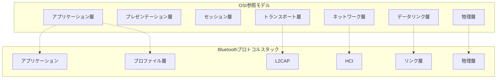
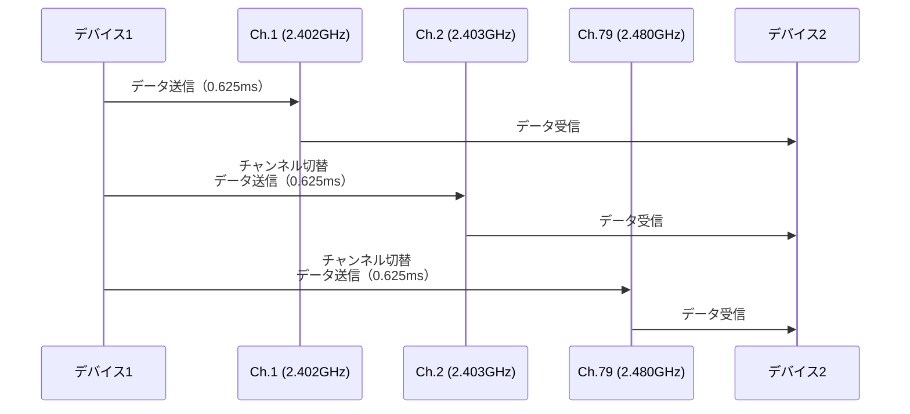
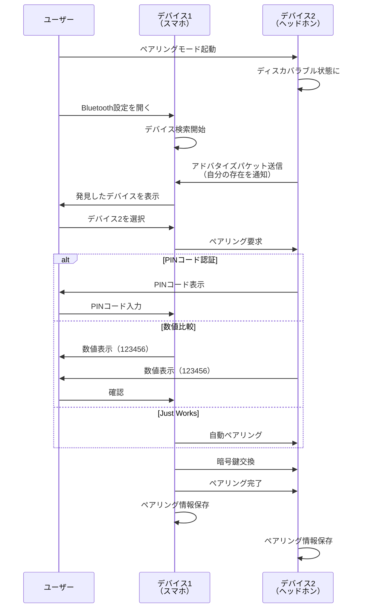
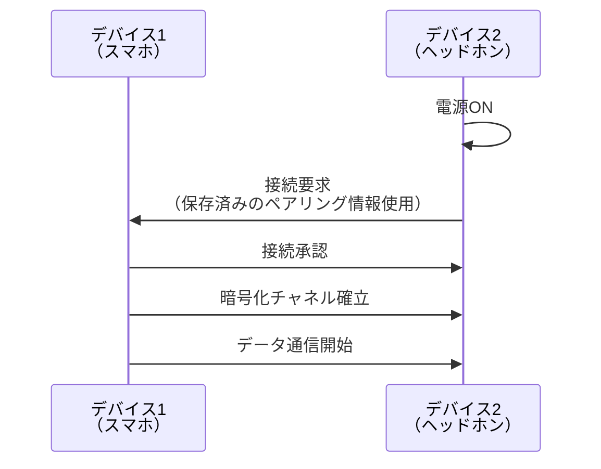
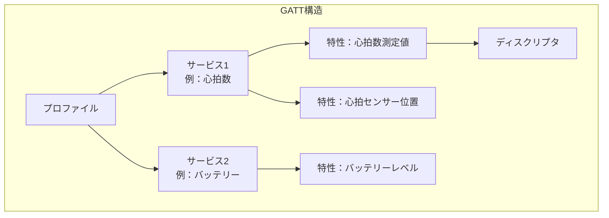

# Zenn問答とは

「Zenn問答」とは、開発していて「なんとなく使ってるけど、ちゃんと理解してるかな？」という技術について、改めて時間をとって深掘りしてみようという企画です🧘🧘🧘

# はじめに

ワイヤレスヘッドホン、ワイヤレスキーボード、スマートウォッチ、スマートスピーカー。今や私たちの生活において、Bluetoothを使わない日はないと言っても過言ではないでしょう。

しかし、日常的に使っているBluetoothですが、改めて「どういう技術なのか」と聞かれると、具体的に説明できる自信がありませんでした。OSI参照モデルのどのレイヤーで動作するのか、どのような仕組みで通信しているのか、などなど。

ということで今回は、Bluetoothについて改めて時間をとって深掘りしてみます。

# Bluetoothの誕生の経緯

Bluetoothという技術は、1994年にスウェーデンのエリクソン社で誕生しました。
日本だとソニーエリクソンで昔ガラケーとかが売っていましたね。最近の子は知らなそうですが・・・笑

## なぜBluetoothが必要だったのか

1990年代、携帯電話や周辺機器の接続には、さまざまなケーブルが使われていました。しかし、ケーブル接続には大きな課題がありました。

**ケーブル接続の課題**
- デバイスごとに異なる規格のケーブルが必要
- 物理的な接続が煩わしい
- ケーブルの断線や接触不良の問題
- 持ち運びや管理の手間
- 複数デバイスの同時接続が困難

## 短距離無線通信という発想

「近距離のデバイス同士を、低コストで簡単に無線接続できる標準規格を作れないか」という発想から、Bluetoothが生まれました。

エリクソン社のJaap Haartsenが中心となって開発を進め、1998年には、エリクソン、IBM、インテル、ノキア、東芝の5社でBluetooth Special Interest Group（SIG）が設立されました。

## 名前の由来

Bluetoothという名前は、10世紀のデンマーク王「ハーラル・ブロタン」（Harald Bluetooth）に由来します。彼は分裂していたデンマークとノルウェーを統一した王として知られています。

この「異なるものを統一する」という歴史が、「異なるデバイスを統一的に接続する」というBluetooth技術のビジョンと重なり、この名前が採用されました。

ちなみに、Bluetoothのロゴマークは、ハーラル王のイニシャル「H」と「B」を古代北欧のルーン文字で表現したものを組み合わせたデザインになっているようです、面白いですね。

## Bluetoothの進化

Bluetooth技術は、登場から四半世紀にわたって進化を続けてきました。

| バージョン | 登場年 | 主な特徴 |
|------------|--------|----------|
| Bluetooth 1.0 | 1999 | 最大1Mbps。互換性の問題が多い初期バージョン |
| Bluetooth 2.0 + EDR | 2004 | 最大3Mbps。EDR（Enhanced Data Rate）で高速化 |
| Bluetooth 3.0 + HS | 2009 | 最大24Mbps。Wi-Fiと連携した高速通信 |
| Bluetooth 4.0 | 2010 | BLE（Bluetooth Low Energy）導入。IoT機器に最適 |
| Bluetooth 5.0 | 2016 | 通信範囲4倍、速度2倍。IoT時代に対応 |
| Bluetooth 5.4 | 2023 | セキュリティ強化、接続品質向上 |

特にBluetooth 4.0で導入されたBLE（Bluetooth Low Energy）は、IoT機器の普及を大きく後押ししました。

現在では、Bluetooth 5.0以降が主流となり、通信範囲の拡大や速度向上により、さらに多様な用途で利用されています。

# Bluetoothの基本的な仕組み

## OSI参照モデルにおけるBluetooth

まず、BluetoothがOSI参照モデルのどこに位置するのか見ていきましょう。

Bluetoothは、OSI参照モデルの**物理層**と**データリンク層**を中心に動作しますが、独自のプロトコルスタックを持っています。

Wi-Fiやイーサネットなどの一般的なネットワーク技術がOSI参照モデルに沿って設計されているのに対し、Bluetoothは近距離無線通信に特化した独自の階層構造を持っています。これにより、低消費電力で効率的なデバイス間通信を実現しています。

## Bluetoothの周波数帯

Bluetoothは、**2.4GHz帯のISM（Industrial, Scientific and Medical）バンド**を使用します。これは世界的に免許不要で使える周波数帯です。

**周波数の詳細**
- 使用周波数：2.402GHz〜2.480GHz
- チャンネル数：79チャンネル（各1MHz幅）
- Wi-Fi（2.4GHz帯）と同じ周波数帯を使用

同じ周波数帯を使うため、Wi-Fiとの干渉が問題になることがあります。これを回避するため、Bluetoothは「周波数ホッピング」という技術を使います。

## なぜBluetoothヘッドホンの音が途切れるのか

実際、自宅やオフィスで「Bluetoothヘッドホンの音が途切れる」という経験をされた方もいるかもしれません。主な原因は以下の通りです。

**音が途切れる主な原因**

1. **Wi-Fiとの電波干渉**
   - Bluetoothと2.4GHz帯のWi-Fiは同じ周波数帯を使用
   - Wi-Fiルーターが強い電波を発している場合、Bluetoothの信号が埋もれてしまう
   - 特にWi-Fiのチャンネル1、6、11付近でBluetoothと重なりやすい

2. **物理的な障害物**
   - 人体（特に水分を含む組織）は2.4GHz帯の電波を吸収しやすい
   - スマホをポケットに入れていると、体が電波を遮ってしまう
   - 壁や金属製の家具も電波を遮る原因に

3. **複数のBluetooth機器の同時使用**
   - 周波数ホッピングで衝突を避けているが、機器が多いと衝突の確率が上がる
   - 同じ空間で多数のBluetooth機器が動作していると帯域が混雑
   - 衝突が起きると、そのタイミングでのデータ送信が失敗し、再送が必要になる
   - 再送により遅延が発生し、音声データが間に合わず音飛びとして認識される

4. **電子レンジの影響**
   - 電子レンジも2.4GHz帯の電磁波を使用
   - 動作中は強力な電波を発するため、Bluetooth通信が大きく影響を受ける

周波数ホッピングはこれらの問題を軽減しますが、完全には防げません。特に電波が混雑している環境では、ホッピング先のチャンネルも干渉を受けている可能性が高くなります。

## 周波数ホッピング

Bluetoothは、毎秒1600回の速度で通信チャンネルを切り替える「周波数ホッピングスペクトラム拡散（FHSS: Frequency Hopping Spread Spectrum）」という技術を使います。

これにより、以下のメリットがあります。

**周波数ホッピングのメリット**
- 他のWi-Fi機器などとの干渉を最小化
- 特定の周波数での妨害に強い
- セキュリティの向上（通信の傍受が困難）
- 複数のBluetooth機器の同時使用が可能

### 送信側と受信側の同期の仕組み

周波数ホッピングでは、送信側と受信側が全く同じタイミングで同じ周波数に切り替える必要があります。これはどのように実現されているのでしょうか。

**ホッピングパターンの決定**

1. **マスタークロックの使用**
   - ペアリング時に、**マスター（通常はスマホ側）のBluetoothクロック**を基準とする
   - このクロックは28ビットのカウンターで、3.2μsごとに1カウント増加
   - **重要：各Bluetoothデバイスは電源ONの瞬間からクロックをカウント開始**
   - マスターとスレーブ（ヘッドホンなど）の両方が**マスターのクロック**を共有

2. **デバイスアドレスによるシード値**
   - **マスターデバイスのBluetoothアドレス（48ビット）** を使用
   - このアドレスと**マスターの現在のクロック値**を組み合わせてホッピングパターンを生成

3. **疑似乱数による決定論的なパターン**
   - **マスターのクロック値（28ビット）** と **マスターのアドレス（48ビット）** を組み合わせて計算
   - クロックは3.2μsごとに変化するため、実質的には時間によって異なるパターンになる
   - 両デバイスが同じアルゴリズムを使用するため、結果は必ず一致
   - 「次は37番チャンネル、その次は62番」といった順序が完全に一致

つまり、異なるマスターを持つBluetoothペアは、ほぼ確実に異なるホッピングパターンになります。これにより、複数のBluetoothペアが同じ空間にあっても、多くの場合は異なるチャンネルを使用し、干渉が最小化されます。

ただし、79チャンネルという限られた空間にマッピングするため、確率的に衝突することはあります。

### 1台のマスターに複数のスレーブを接続する場合

実は、同じマスターに2つのヘッドホンを接続すると、両方が同じホッピングパターンを使うため、そのままでは同時通信できません。これを解決するため、Bluetooth Classicでは「ピコネット」という仕組みを使います。マスターは各スレーブと時分割で通信を切り替え（例：0.625msごとに交互）、同じホッピングパターン内で順番に各デバイスと通信します。最大7台のスレーブと同時接続できますが、帯域は分割されます。

ただし、時分割で切り替えると、各デバイスは断続的にしかデータを受信できません。音楽のような連続データの場合、受信側のバッファにデータを貯めて連続再生することで途切れを防ぎます。しかし、複数デバイスで帯域を分け合うと各デバイスへのデータ供給が遅くなり、バッファが枯渇すると「プツッ」と音が途切れたり、遅延が大きくなったりします。そのため、実際には1つのマスターで複数のヘッドホンに同時に高品質な音楽を流すのは難しいです。

### 同期がずれた場合

通信エラーなどでクロックがずれた場合、再同期処理が自動的に実行されます。マスターは定期的に同期パケットを送信し、スレーブがクロックを補正することで、長時間の通信でも同期を維持できる仕組みになっています。

### 衝突が起きた時の動作

それでも衝突（コリジョン）が発生することがあります。結果として先述した「プツッ」という音飛びや途切れとして認識されてしまいます。

Bluetooth Classicのオーディオ通信では、一定のバッファを持つことでこの問題を軽減していますが、衝突が頻繁に起きる環境では、バッファが追いつかず音が途切れてしまいます。

# Bluetoothの接続の仕組み

Bluetoothデバイスが通信を開始するまでの流れを見ていきましょう。

## デバイスの発見（ディスカバリー）

Bluetoothデバイスは、以下のいずれかの状態にあります。

**デバイスの状態**
- **ディスカバラブル（discoverable）** 他のデバイスから発見可能な状態
- **コネクタブル（connectable）** 接続可能だが発見はされない状態
- **ノン・ディスカバラブル** 発見も接続もされない状態

セキュリティの観点から、使用していない時はディスカバラブルモードをオフにしておくことが推奨されます。

## ペアリング（Pairing）

初めて接続する2つのデバイスは、「ペアリング」という手順を踏みます。

ペアリングの際には、以下のような認証方法が使われます。

**認証方法の種類**
- **PINコード** 固定または可変のPINコードを入力（古い方式）
- **数値比較** 両デバイスに表示される6桁の数値を確認（推奨）
- **Just Works** 自動的にペアリング（IoT機器など。セキュリティは低い）
- **Passkey Entry** 一方のデバイスに表示された数値を他方に入力

このうち「数値比較」が最もセキュアな方式とされていますが、Just Worksが多い気がしますね。やはり便利なのが市場ウケするんですね。

## 接続（Connection）

ペアリングが完了すると、次回からは自動的に接続できるようになります。

# Bluetooth Classic と Bluetooth Low Energy（BLE）

Bluetooth 4.0以降、従来のBluetooth（Classic）とは別に、BLE（Bluetooth Low Energy）という規格が追加されました。

この2つは技術的に大きく異なり、互換性がありません。そのため、多くのデバイスは両方の規格に対応する「デュアルモード」として実装されています。

## 両者の違い

| 項目 | Bluetooth Classic | Bluetooth Low Energy（BLE） |
|------|-------------------|------------------------------|
| 主な用途 | オーディオ、大容量データ転送 | センサー、IoT機器、ウェアラブル |
| 消費電力 | 比較的高い | 非常に低い |
| データレート | 1-3Mbps | 125Kbps-2Mbps |
| 接続時間 | 数秒 | 数ミリ秒 |
| 通信モード | 連続接続 | 間欠的な接続（センサーなど）または連続接続（LE Audio） |
| プロファイル | A2DP, HFP, SPPなど | GATT（Generic Attribute Profile） |

BLEは主に心拍計やスマートウォッチなどのセンサーデバイスを想定した規格で、間欠的な接続（数ミリ秒だけ接続してすぐ切断）により低消費電力を実現しています。ただし、Bluetooth 5.2以降で導入された**LE Audio**により、BLEでも高品質なオーディオ伝送が可能になりました。LE AudioはLC3という新しいコーデックを使用し、従来のBluetooth Classic（A2DP）よりも低消費電力で高音質を実現します。

## BLEの通信の仕組み

BLEは、GATTというプロトコルを使ってデータをやり取りします。

**GATTの階層構造**
- **プロファイル** デバイスの機能全体を定義
- **サービス** 機能のグループ（心拍数サービス、バッテリーサービスなど）
- **特性（Characteristic）** 実際のデータ（心拍数の値、バッテリー残量など）
- **ディスクリプタ** 特性の追加情報（単位、範囲など）

この構造により、BLEデバイスは必要な時だけ短時間接続して情報をやり取りできるため、非常に低消費電力を実現しています。

例えば、BLE対応のスマートウォッチは、心拍数や歩数などのデータを定期的にスマートフォンに送信しますが、常に接続しているわけではありません。必要な時だけ数ミリ秒接続してデータを送信し、すぐに切断することで、コイン電池で数ヶ月〜数年動作することが可能になっています。

## LE Audioとブロードキャスト機能（Auracast）

Bluetooth 5.2以降で導入されたLE Audioは、BLEでオーディオを伝送するための新しい規格です。従来のBluetooth Classicのピコネットには、複数のヘッドホンへの同時配信に課題がありました（時分割によるバッファ枯渇や遅延）。

LE Audioでは、この問題を**Auracast（オーラキャスト）** というブロードキャスト機能で解決しています。

**Auracastの仕組み**
- 送信側が1つのオーディオストリームを「放送」する形式
- 複数の受信側デバイスが同じストリームを「聞く」
- 時分割で切り替える必要がないため、バッファ枯渇や遅延の問題が発生しない
- 空港や駅などの公共施設での情報放送、複数人での映画鑑賞などに応用可能

**LE Audioの特徴**
- LC3コーデックにより、従来のSBC（Bluetooth Classic）より高音質かつ低ビットレート
- 複数デバイスへの同時配信が効率的
- 補聴器などの医療機器にも対応

これにより、最新のBluetoothヘッドホンではLE Audioを採用するものが増えています。

# Bluetoothのプロファイル

Bluetoothでは、用途に応じた「プロファイル」が定義されています。プロファイルとは、特定の用途のための通信手順や機能の標準仕様です。

## 主要なBluetoothプロファイル

| プロファイル | 名称 | 用途 |
|--------------|------|------|
| A2DP | Advanced Audio Distribution Profile | 高音質オーディオのストリーミング（ヘッドホン） |
| AVRCP | Audio/Video Remote Control Profile | オーディオ/ビデオ機器のリモート操作 |
| HFP | Hands-Free Profile | ハンズフリー通話（車載機器） |
| HSP | Headset Profile | ヘッドセットでの通話 |
| HID | Human Interface Device Profile | キーボード、マウス |
| SPP | Serial Port Profile | シリアル通信のエミュレート |
| PAN | Personal Area Network Profile | ネットワーク接続の共有 |

## プロファイルの互換性

デバイス同士が通信するには、両方が同じプロファイルに対応している必要があります。

例えば、ワイヤレスヘッドホンで音楽を聴くには、スマートフォンとヘッドホンの両方がA2DPに対応している必要があります。

このプロファイルの仕組みにより、異なるメーカーのデバイス同士でも、同じプロファイルに対応していれば互換性を持って通信できます。これがBluetoothの大きな利点の一つです。

# Bluetoothのセキュリティ

Bluetoothは無線通信のため、セキュリティが重要です。ここでは、Bluetoothのセキュリティ機能と、過去に発見された脆弱性について見ていきます。

## Bluetoothのセキュリティ機能

Bluetoothには、以下のようなセキュリティ機能が実装されています。

**主要なセキュリティ機能**
- **ペアリング認証** 初回接続時の相手確認
- **暗号化** AESなどを使ったデータの暗号化
- **認証** 接続相手が正当なデバイスか確認
- **プライバシー保護** MACアドレスのランダム化（BLE）

## セキュリティモード

Bluetoothには4つのセキュリティモードがあります。

| モード | 名称 | 特徴 |
|--------|------|------|
| Mode 1 | Non-secure | セキュリティなし（非推奨） |
| Mode 2 | Service-level security | サービスレベルでのセキュリティ |
| Mode 3 | Link-level security | リンクレベルでのセキュリティ |
| Mode 4 | Secure Connections | SSP（Secure Simple Pairing）使用 |

現代のBluetoothデバイスは、Mode 4の使用が推奨されています。Mode 4では、楕円曲線暗号（ECC）を用いたSecure Simple Pairing（SSP）により、強固な暗号化が実現されています。

# まとめ

Bluetoothについて改めて深掘りしてみました。

毎日使っているBluetoothですが、その背景には周波数ホッピングによる干渉回避、様々なプロファイルによる機能の標準化、BLEによる低消費電力化など、多くの技術的工夫があることが理解できました。

また、短い距離に絞った設計になっていてOSI参照モデルとは違った独自規格で作っているのも面白かったです。最後まで読んでいただき、ありがとうございました🙏
