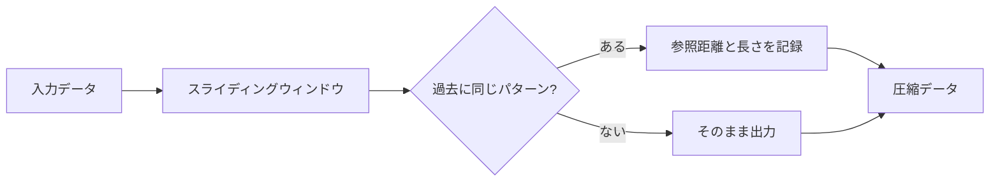
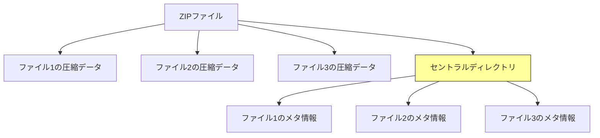
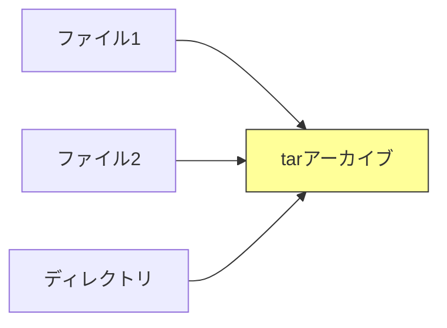

# Zenn問答とは

「Zenn問答」とは、開発していて「なんとなく使ってるけど、ちゃんと理解してるかな？」という技術について、改めて時間をとって深掘りしてみようという企画です🧘🧘🧘

# はじめに

何かをダウンロードするとき、zipファイルで落としてくる機会って結構多いと思っています。

複数ファイルをダウンロードする時、ソフトウェアのインストーラーをダウンロードする時、などなど日常的にzipファイルを使っています。

あまりにも当たり前に使っているため、「ファイルが小さくなるもの」程度の理解で済ませていましたが、実際にどういう仕組みで圧縮しているのか気になっていたので、改めて時間をとって深掘りしてみました。

## そもそもなぜデータ圧縮が必要なのか

データ圧縮の目的は主に以下の2つです

**1. ストレージの節約**

ディスク容量を節約できます。特にクラウドストレージでは、ストレージ料金が使用量に応じて課金されるため、圧縮によるコスト削減効果は大きいです。

**2. 転送時間の短縮**

ネットワーク経由でのファイル送信が速くなります。例えば、100MBのファイルが20MBに圧縮できれば、ダウンロード時間も約1/5になります。

現代でも、クラウドストレージの料金、通信量の制限、ダウンロード時間の短縮など、データ圧縮のメリットは大きいです。特にバックアップやログファイルなど、大量のデータを長期保存する場合には圧縮が欠かせません。

# ZIP形式の誕生の経緯

1980年代、コンピューターのストレージは非常に高価でした。フロッピーディスクの容量はわずか数百KB程度で、ファイルを効率的に保存・転送する手段が強く求められていました。

当時のコンピューター環境を考えると、データ圧縮は今以上に切実な問題でした。

## Phil Katzによる誕生

ZIP形式は、1989年にPhil Katzによって開発されました。当時、PKWAREという会社がリリースしていた「PKZIP」というソフトウェアが起源です。

Phil Katzは、当時主流だったARC形式の圧縮ソフトとの法的問題を抱えていました。彼は、ARC形式と互換性のあるPKAZIPというソフトウェアを開発していましたが、SEA社（ARC形式の開発元）から訴訟を起こされました。

その結果、独自の圧縮形式としてZIPを開発し、さらにその仕様を公開するという戦略をとりました。この「オープンな仕様」という決断が、ZIP形式を業界標準へと押し上げる大きな要因となりました。今ではオープンな仕様はあたりまえに感じますが、以前はソフトウェアも各社クローズドで開発を行いその使用料をもらうというモデルが多い印象なので思い切った決断だったのかなと思います。

仕様がオープンだったことで、誰でも自由にZIPファイルを読み書きするソフトウェアを作成できたため、Windows、Mac、Linuxなど、あらゆるOSで標準的にサポートされるようになりました。

# ZIP圧縮の仕組み

ZIP形式は主に2つの圧縮アルゴリズムを組み合わせて使用します。
DEFLATEは、ZIP形式のデフォルト圧縮アルゴリズムで、以下の2つの手法を組み合わせています。

## LZ77（辞書式圧縮）

LZ77は、過去に出現したデータパターンを参照することで圧縮します。「辞書式」という名前の通り、既に登場したパターンを辞書のように参照する仕組みです。

**仕組み**

```
元のデータ: "abcdefghijklabcdefghijkl"
              ^^^^^^^^      ^^^^^^^^
              過去のパターン  同じパターン
```

後半の「abcdefghijkl」は既に登場しているパターンなので、「12文字前に戻って12文字分コピー」という指示に置き換えます。

元のデータが24文字に対して、圧縮後は「abcdefghijkl<-12,12>」のように表現でき、実質的に半分以下のサイズになります。



**具体例**

```
元データ: "The quick brown fox jumps over the lazy dog. The quick brown fox..."

圧縮後: "The quick brown fox jumps over the lazy dog. <44文字前,15文字>..."
```

## ハフマン符号化

ハフマン符号化は、出現頻度の高い文字に短いビット列を、低い文字に長いビット列を割り当てることで圧縮します。これは、よく使う言葉ほど短く表現するという人間の言語の特徴に似ています。

**仕組み**

```
元のデータ: "aaabbc"
出現頻度: a=3回, b=2回, c=1回

通常の符号化（1文字=8ビット）: 6文字 × 8ビット = 48ビット

ハフマン符号化:
a = 0    (1ビット) ← 最も頻度が高いので最短
b = 10   (2ビット)
c = 11   (2ビット) ← 最も頻度が低いので長め

"aaabbc" = 0 0 0 10 10 11 = 10ビット
```

圧縮率は **約79%** の削減になります（48ビット → 10ビット）。

出現頻度に応じた可変長の符号を使うことで、データ全体のサイズを削減できる効果が期待できます。

## 組み合わせの効果

DEFLATEは、まずLZ77で繰り返しパターンを圧縮し、その結果をハフマン符号化でさらに圧縮します。この2段階の組み合わせが非常に効果的です。


**なぜ2つを組み合わせるのか**

1つだけでは不十分な理由があります

- **LZ77だけ** - 繰り返しパターンは見つけられるが、参照情報自体が大きくなることがある
- **ハフマン符号化だけ** - 文字の頻度は圧縮できるが、繰り返しパターンは検出できない

この2つを組み合わせることで、お互いの弱点を補い、より高い圧縮率を実現しています。

## 圧縮率の実例

実際の圧縮率はデータの種類によって大きく異なります。

| データの種類 | 圧縮率（目安） | 理由 |
|------------|--------------|------|
| テキストファイル | 60-80% | 繰り返しパターンが多い |
| JSONファイル | 70-90% | 構造的な繰り返しが多い（`{`, `}`, `"` など） |
| プログラムコード | 60-80% | キーワード（if, for, function など）の繰り返し |
| HTMLファイル | 70-85% | タグの繰り返しパターン |
| JPEG画像 | 0-10% | すでに圧縮済み |
| PNG画像 | 5-20% | すでに圧縮済み |
| MP3音声 | 0-5% | すでに圧縮済み |
| 動画ファイル | 0-5% | すでに圧縮済み |
| ランダムデータ | 0%（増加することも） | パターンがない |
| **42.zip（ZIP爆弾）** | **99.9999999%** | 同じデータの繰り返しと再帰的圧縮 |

JPEG、PNG、MP3などは、それぞれ専用の圧縮アルゴリズムで最適化されています。これらのファイルは既にランダム性が高く、繰り返しパターンがほとんど存在しないため、ZIP圧縮してもほとんど小さくなりません。

むしろ、ZIPファイル形式のメタデータ（ファイル名、タイムスタンプなど）が追加される分、わずかにサイズが増えることもあります。

逆に、ZIP圧縮が**極端に効率的に働く**ように意図的に設計されたファイルも存在します。最も有名な例が「42.zip」です。

- **圧縮後のサイズ**: 42 KB
- **展開後のサイズ**: 4.5 PB（ペタバイト、約450万GB）
- **圧縮率**: 約99.9999999%

このようなファイルは、サーバーやアンチウイルスソフトを攻撃する目的で使われることがあるため、現代のシステムは異常な圧縮率を検出して展開を拒否する機能を持っています。

## ZIP形式のファイル構造

ZIP形式は単なる圧縮アルゴリズムだけでなく、複数のファイルをまとめて管理する「アーカイブ形式」でもあります。



**セントラルディレクトリ**

ZIPファイルの末尾には「セントラルディレクトリ」という目次情報が格納されています。これは本の巻末にある索引のようなもので、ZIPファイル全体を読み込まなくても、含まれるファイルの一覧を素早く取得できます。

```
[ファイル1のデータ]
[ファイル2のデータ]
[ファイル3のデータ]
[セントラルディレクトリ]  ← ZIPファイルの末尾に配置
  - ファイル1: 位置=0, サイズ=1000, 圧縮後=500, CRC32=xxx
  - ファイル2: 位置=1000, サイズ=2000, 圧縮後=800, CRC32=yyy
  - ファイル3: 位置=3000, サイズ=500, 圧縮後=300, CRC32=zzz
```

この構造により、以下のような便利な機能が実現されています

**メリット**

1. **高速なファイル一覧の取得**

   末尾のセントラルディレクトリだけを読めば、全ファイルの情報が分かります

2. **部分展開が可能**

   大きなZIPファイルから特定のファイルだけを展開できます
   ```bash
   # 10GBのZIPから1つのファイルだけ展開
   unzip large.zip specific-file.txt
   ```

3. **ファイルの整合性チェック**

   各ファイルのCRC32（チェックサム）が記録されており、破損を検出できます

4. **ZIPファイルに追加が可能**

   既存のZIPに新しいファイルを追加する際、セントラルディレクトリを更新するだけで済みます

## ZIP形式の制限と拡張

ZIP形式には、当初いくつかの制限がありました。

**従来のZIP形式の制限（ZIP32）**
- 最大ファイルサイズ：4GB
- ZIPファイル全体のサイズ：4GB
- 収録可能なファイル数：65,535個

これらは32ビット整数の限界から来る制限でした。

**ZIP64拡張（2001年）**

大容量ファイルへの対応として、ZIP64という拡張仕様が追加されました

- 最大ファイルサイズ：16EB（エクサバイト、約180億GB）
- ZIPファイル全体のサイズ：16EB
- 収録可能なファイル数：事実上無制限

現代のZIPツールは、ほとんどがZIP64に対応しており、大容量ファイルでも問題なく扱えるようになっています

# 主要な圧縮形式の比較

ZIP以外にも多くの圧縮形式が存在します。それぞれの特徴を見ていきましょう。

| 形式 | 拡張子 | 登場年 | 圧縮アルゴリズム | 特徴 |
|------|--------|--------|-----------------|------|
| **ZIP** | .zip | 1989 | DEFLATE | 互換性が高く、広く普及。複数ファイルをまとめて圧縮 |
| **gzip** | .gz | 1992 | DEFLATE | 単一ファイルの圧縮に特化。ZIPと同じ圧縮アルゴリズム |
| **bzip2** | .bz2 | 1996 | Burrows-Wheeler変換 | ZIPより高圧縮率だが処理は遅い |
| **RAR** | .rar | 1993 | 独自アルゴリズム | 高圧縮率、商用ライセンス。分割アーカイブに強い |
| **7-Zip** | .7z | 1999 | LZMA | 高圧縮率、オープンソース。独自のアーカイブ形式 |
| **XZ** | .xz | 2009 | LZMA2 | 非常に高い圧縮率。Linuxカーネルの配布で使用 |
| **tar** | .tar | 1979 | なし（アーカイブのみ） | Unix系で標準。圧縮はせず、ファイルをまとめるだけ |

各形式には、それぞれの時代背景と目的がありました。ZIPは互換性、gzipはUnix系OSでの標準化、bzip2は圧縮率向上、7-ZipとXZはオープンソースで高圧縮率、という具合に進化してきました。

## tarとgzipの組み合わせ

Unix/Linux系のシステムでは、`.tar.gz`（または`.tgz`）という形式をよく見かけます。なぜこの2つを組み合わせて使うのでしょうか。

### tarの役割

`tar`（Tape Archive）は、**圧縮機能を持たない**アーカイブ形式です。複数のファイルやディレクトリを1つのファイルにまとめるだけです。



### gzipの役割

`gzip`は、**単一ファイルの圧縮**に特化したツールです。複数ファイルを扱う機能はありません。


### 組み合わせの理由

Unix/Linuxの世界でtar.gzが好まれる理由はいくつかあります。

1. **Unix哲学「1つのツールは1つのことをうまくやる」**
   - tar: ファイルをまとめる
   - gzip: ファイルを圧縮する
   - 役割を分離することで、それぞれの機能を最大限に活用できる

2. **パイプ処理との相性が良い**

   ストリーム処理が可能なため、ディスクに一時ファイルを作らずに処理できます
   ```bash
   # tarとgzipをパイプで繋げる
   tar cf - mydir | gzip > mydir.tar.gz

   # SSH経由でリモートにバックアップ（ディスクを使わない）
   tar cf - mydir | gzip | ssh user@server "cat > backup.tar.gz"
   ```

3. **Unixのファイル属性を正確に保持**

   ZIPでは失われがちな情報を確実に保存できます
   - 所有者、グループ
   - パーミッション（rwxrwxrwx）
   - タイムスタンプ（アクセス時刻、変更時刻）
   - シンボリックリンク

4. **柔軟な圧縮形式の選択**

   tarでアーカイブを作った後、用途に応じて圧縮形式を選べます
   ```bash
   tar cf archive.tar mydir

   # 速度重視
   gzip archive.tar   → archive.tar.gz

   # 圧縮率重視
   bzip2 archive.tar  → archive.tar.bz2
   xz archive.tar     → archive.tar.xz
   ```

5. **歴史的経緯**

   Unixの世界では1970年代から使われている伝統的な組み合わせで、多くのスクリプトやツールがこの形式を前提としています

## 圧縮形式の使い分け

用途に応じて適切な圧縮形式を選ぶことが大切です。

| 用途 | 推奨形式 | 理由 |
|------|---------|------|
| **不特定多数への配布** | ZIP | すべてのOSで標準サポート、追加ソフト不要 |
| **高圧縮率が必要** | XZ / 7z | ストレージコスト削減、帯域制限環境に最適 |
| **Unix/Linux環境** | tar.gz / tar.xz | パーミッション保持、ストリーム処理が可能 |
| **ログファイル** | gzip | 単一ファイル圧縮、標準的な運用方法 |

# まとめ

今回はZIP圧縮について深掘りしてみました。

単に「ファイルを小さくするもの」という理解から、仕組みも含めて理解できました。アイデア自体は結構シンプルなものがいまだに使われ続けているのは、なかなか面白いですね。

また、tar.gzがなぜ2つのツールを組み合わせているのかという疑問も、Unix哲学（1つのツールは1つのことをうまくやる）と実用的な理由（パイプ処理、パーミッション保持）から納得できました。

普段何気なく使っているZIPファイルですが、その背景と技術について知ることができて、より一歩深い理解をようやく得ることができたと感じました。最後まで読んでいただき、ありがとうございました🙏
